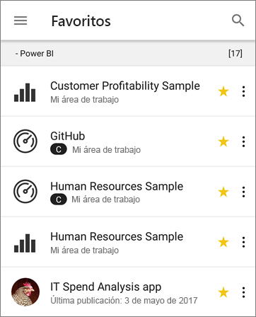
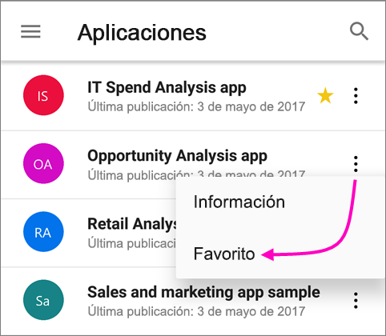
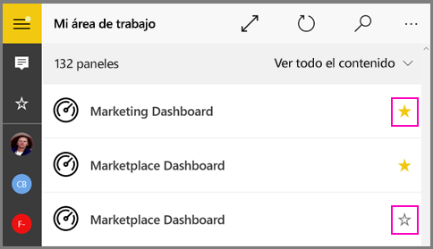
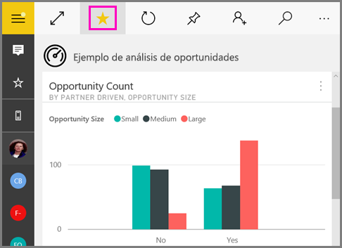
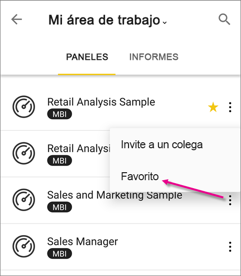

# Creación y visualización de elementos favoritos en las aplicaciones móviles de Power BI
Se aplica a:

|  |  |  |  |  |
|:--- |:--- |:--- |:--- |:--- |
| iPhone |iPad |Teléfonos Android |Tabletas Android |Dispositivos de Windows 10 |

Lea información sobre cómo definir y ver sus paneles, informes y aplicaciones de Power BI favoritos, junto con los informes y KPI favoritos locales de Power BI Report Server y de Reporting Services, en las aplicaciones móviles.

Cuando define un favorito en las aplicaciones móviles de Power BI, puede verlo en la página Favoritos del [servicio Power BI](https://powerbi.com) y en todos los dispositivos móviles.

Para ver la página Favoritos, pulse el icono Favoritos en la barra de navegación:

También puede [definir paneles y aplicaciones de Power BI como favoritos en el servicio Power BI](../end-user-favorite.md). Después, los verá en la página Favoritos de la aplicación móvil.

Puede marcar KPI e informes como favoritos en el portal web del servidor de informes de Power BI o Reporting Services y verlos después en práctica carpeta en su dispositivo móvil, junto con sus paneles favoritos de Power BI.

## Agregar a Favoritos una aplicación
1. Pulse el icono Aplicaciones de la barra de navegación inferior para mostrar la página de aplicaciones.

2. En un dispositivo iOS, pulse el botón Información situado a la derecha del nombre de la aplicación que quiera convertir en favorita. En dispositivos Android, aparece Más opciones (...) en lugar del botón Información. 

3. En la sección Información de la aplicación que se abre, pulse la estrella.
   
    
   
    Ahora la aplicación se mostrará en la página Favoritos, junto con los demás paneles, informes y aplicaciones favoritos.
   
## Adición de un panel o informe como favorito en las aplicaciones móviles para iOS y Windows 10
Puede definir un panel o informe de Power BI como favorito desde la lista de paneles o informes o desde el propio panel o informe.

* En la lista de paneles o informes de la aplicación móvil, pulse la estrella vacía junto al nombre . La estrella se vuelve amarilla .
  
    
* Si está en un panel, pulse el icono de estrella vacío  de la cinta. Si está en un informe, la estrella aparece bajo **Más opciones** (...).  La estrella se vuelve de color negro .
  
    

## Adición de un panel o informe como favorito en las aplicaciones móviles para Android
Puede definir un panel o informe como favorito desde la lista de paneles o informes o desde el propio panel o informe.

* En la lista de paneles o informes de la aplicación móvil, pulse el botón **Más opciones** (…) vertical situado junto al nombre y, luego, pulse la estrella Favoritos en la pestaña de información que aparece.
  
    

* Cuando esté en un panel, pulse la estrella vacía de la cinta. . La estrella se vuelve gris oscuro .
  
    

* Si está en un informe, deslice el dedo hacia abajo para mostrar la cinta, pulse **Más opciones** (...) y, después, desplácese hacia abajo para buscar el icono de estrella vacío  y púlselo. La estrella se vuelve de color gris oscuro .
  
    

## Agregar a Favoritos informes y KPI del servidor de informes de Power BI y Reporting Services
En las aplicaciones móviles de Power BI puede ver los informes y KPI del servidor de informes de Power BI y Reporting Services, pero no puede agregarlos a Favoritos. Se [etiquetan como favoritos en el portal web](../../report-server/tutorial-explore-report-server-web-portal.md#tag-your-favorites). 

## Pasos siguientes
* [Paneles favoritos en el servicio Power BI](../end-user-favorite.md) 
* ¿Tiene alguna pregunta? [Pruebe a preguntar a la comunidad de Power BI](https://community.powerbi.com/)

