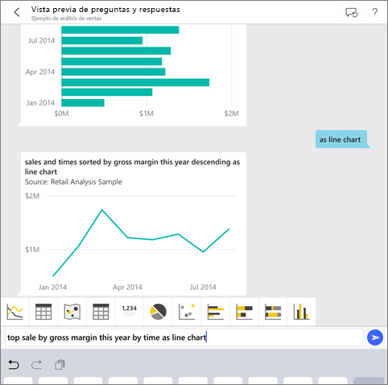
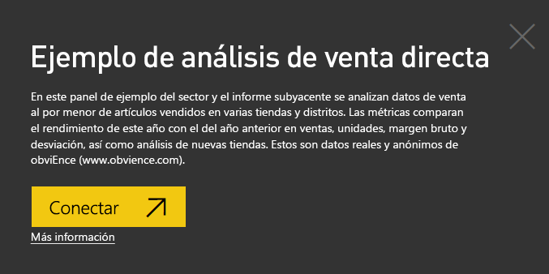
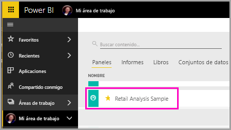
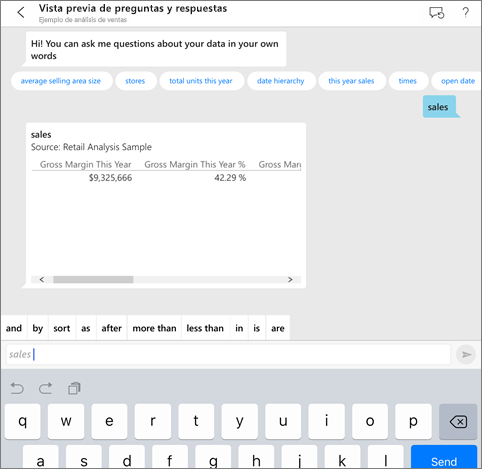
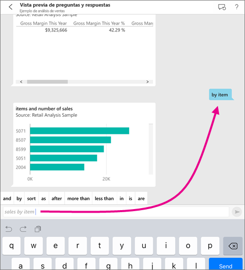
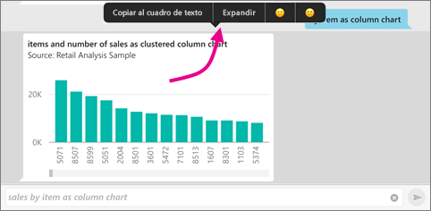
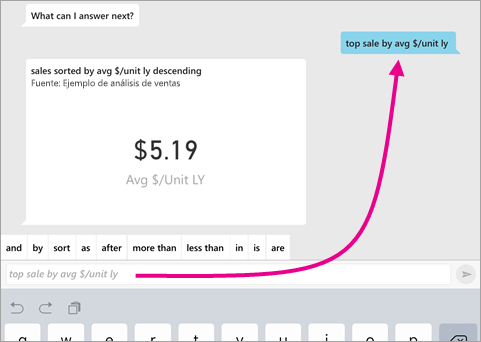
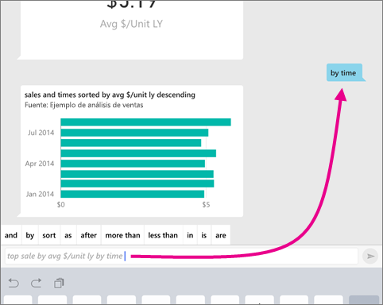
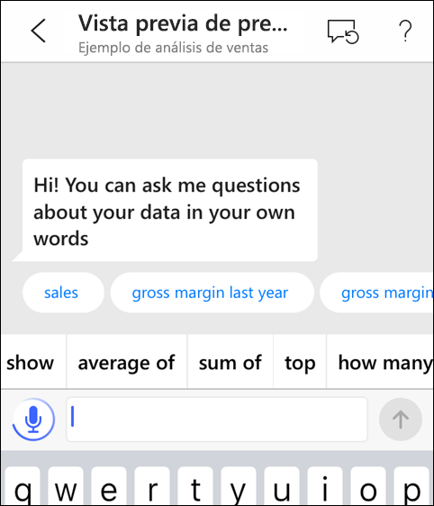
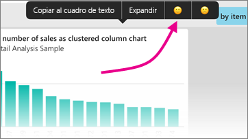

# Analista virtual de Preguntas y respuestas en las aplicaciones iOS: Power BI

La manera más fácil de obtener información acerca de los datos es realizar preguntas con sus propias palabras. En este artículo, puede plantear preguntas y ver información destacada sobre los datos de ejemplo con el analista virtual de Preguntas y respuestas en la aplicación móvil de Microsoft Power BI en su iPad, iPhone y iPod Touch. 

Se aplica a:

|  |  |
|:--- |:--- |
| iPhone |iPad |

El analista virtual de Preguntas y respuestas es una experiencia de inteligencia empresarial de conversación que accede a los datos subyacentes de Preguntas y respuestas del servicio Power BI [(https://powerbi.com)](https://powerbi.com). Sugiere información sobre los datos, y puede escribir o expresar sus propias preguntas.

Si no está registrado en Power BI, [regístrese para obtener una evaluación gratuita](https://app.powerbi.com/signupredirect?pbi_source=web) antes de empezar.

## Requisitos previos

### Instalación de la aplicación de Power BI para iOS
[Descargar la aplicación de iOS](https://go.microsoft.com/fwlink/?LinkId=522062 "Descarga de la aplicación de iPhone") desde App Store de Apple para su iPad, iPhone o iPod Touch.

Estas versiones admiten la aplicación de Power BI para iOS:
- iPad con iOS 10 o posterior.
- iPhone 5 y versiones posteriores, con iOS 10 o posterior. 
- iPod Touch con iOS 10 o posterior.

### Descargar ejemplos
El primer paso consiste en descargar los ejemplos de análisis de minoristas y análisis de oportunidades en el servicio Power BI.

**Obtener el ejemplo de análisis de minoristas**

1. Abra el servicio Power BI (app.powerbi.com) e inicie sesión.

2. En el panel de navegación, seleccione **Áreas de trabajo**, **Mi área de trabajo**.

3. En la esquina inferior izquierda, seleccione **Obtener datos**.
   
    

3. En la página Obtener datos, seleccione el icono **Ejemplos**.
   
   

4. Seleccione el **Ejemplo de análisis minoristas**.
 
    
 
8. Seleccione **Conectar**.  
  
   
   
5. Power BI importa el paquete de contenido y agrega un nuevo panel, informe y conjunto de datos en el área de trabajo actual.
   
   

**Obtener el ejemplo de análisis de oportunidades**

- Siga los mismos pasos que en el caso del ejemplo de análisis minoristas, pero en el paso 4, seleccione **Ejemplo de análisis de oportunidades**.

    
  
Pues bien, ya está listo para ver los ejemplos en el dispositivo iOS.

## Pruebe a realizar preguntas en su iPhone o iPad
1. En su iPhone o iPad, pulse el botón de navegación global  > **Áreas de trabajo** > **Mi área de trabajo** y abra el panel del ejemplo de análisis minoristas.

2. Pulse en el icono del analista virtual de Preguntas y respuestas  en el menú de acciones, en la parte inferior de la página (en la parte superior de la página en el caso de un iPad).
     El analista virtual de Preguntas y respuestas ofrece algunas sugerencias para empezar a trabajar.
3. Escriba **sales**, pulse **sales** en la lista de sugerencias > **Enviar** .

    
4. Pulse **by** (por) en las palabras clave y pulse **item** (elemento) en la lista de sugerencias > **Enviar**  .

    
5. Pulse **as** (como) en las palabras clave, pulse el icono de gráfico de columnas  y pulse **Enviar**  .
6. Mantenga pulsado el gráfico resultante y, después, pulse **Expandir**.

    

    El gráfico se abre en modo de enfoque en la aplicación.

    
7. Pulse la flecha de la esquina superior izquierda para volver a la ventana de chat del analista virtual de Preguntas y respuestas.
8. Pulse la X situada a la derecha del cuadro de texto para eliminar el texto y volver a empezar.
9. Pruebe con una nueva pregunta: pulse **top** (principales) en las palabras clave, pulse **sale by avg $/unit ly** (venta por $ prom/unidad año pasado) > **Enviar** .

    
10. Elija **by** (por) en las palabras clave, pulse **time** (tiempo) en la lista de sugerencias en la parte superior > **Enviar** .

     
11. Escriba **as** (como), elija el icono de gráfico de líneas  en la lista de sugerencias > **Enviar** .

    

## Formule sus preguntas
Ahora puede hacer preguntas sobre sus datos en la aplicación móvil de Power BI con la voz en lugar de escribir.

1. Pulse en el icono del analista virtual de Preguntas y respuestas  en el menú de acciones, en la parte inferior de la página (en la parte superior de la página en un iPad).
2. Pulse el icono de micrófono .

    

1. Empiece a hablar cuando dicho icono esté activo. Por ejemplo, diga "precio unitario medio según la hora" y, a continuación, pulse **Enviar** .

    

### ¿Tiene alguna duda sobre su privacidad al usar la conversión de voz en texto?
Consulte la sección Reconocimiento de voz de [Novedades de iOS](https://go.microsoft.com/fwlink/?linkid=845624) en las Guías para desarrolladores de iOS de Apple.

## Ayuda y comentarios
* ¿Necesita ayuda? Diga “Hi” (Hola) o “Help” (Ayuda) para obtener asistencia para comenzar una nueva pregunta.
* ¿Le importaría proporcionarnos sus comentarios sobre los resultados? Mantenga pulsado un gráfico u otro resultado y, a continuación, pulse la cara sonriente o la cara con el ceño fruncido.

    

    Sus comentarios son anónimos y nos ayudan a mejorar nuestras respuestas a las preguntas.

## Mejorar los resultados del analista virtual de Preguntas y respuestas
Para mejorar los resultados que se obtienen cuando se usa el analista virtual de Preguntas y respuestas con un conjunto de datos, puede elegir preguntas más específicas o mejorar el conjunto de datos.

### Cómo realizar preguntas
* Siga estas [sugerencias para hacer preguntas en Preguntas y respuestas](../end-user-q-and-a-tips.md) del servicio Power BI o en el analista virtual de Preguntas y respuestas en la aplicación móvil de iOS.

### Cómo mejorar el conjunto de datos
* Mejore el conjunto de datos en Power BI Desktop o en el servicio Power BI para que [los datos funcionen bien con Preguntas y respuestas y con el analista virtual de Preguntas y respuestas](../../service-prepare-data-for-q-and-a.md).

## Pasos siguientes
* [Preguntas y respuestas en el servicio Power BI](../end-user-q-and-a.md)
* ¿Tiene alguna pregunta? Consulte la [sección sobre aplicaciones móviles de la comunidad de Power BI](https://go.microsoft.com/fwlink/?linkid=839277)
