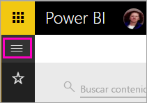
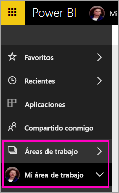
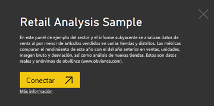
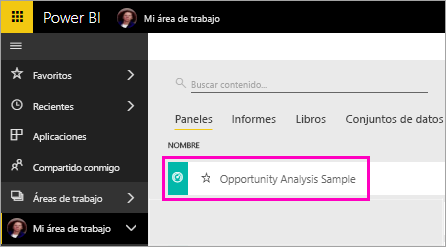
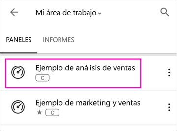
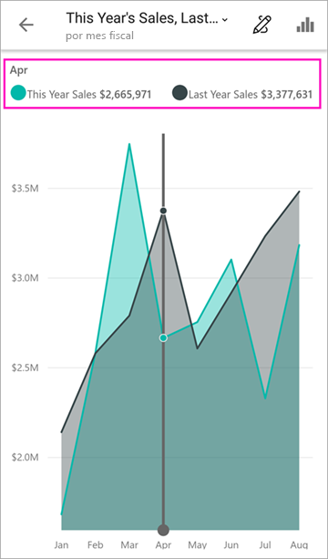
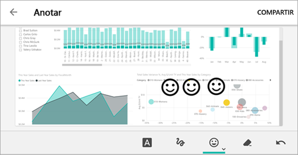
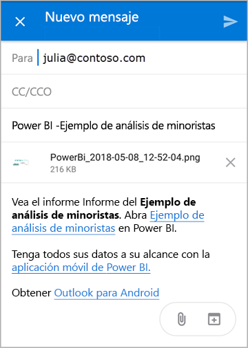
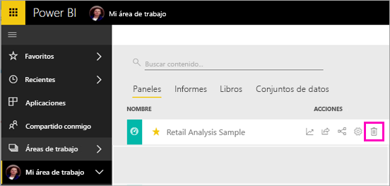

# Inicio rápido: exploración de paneles e informes en la aplicación móvil de Power BI
En este inicio rápido, va a explorar un ejemplo de panel e informe en las aplicaciones móviles de Power BI en un teléfono Android. También puede aplicarlo en otras aplicaciones móviles. 

Se aplica a:

|  |  |  |  |
|:--- |:--- |:--- |:--- |
| iPhone | iPad | Android | Windows 10 |

Los paneles sirven como portal para ver los procesos y el ciclo de vida de su empresa. Un panel es un recurso de información general, un lugar único para supervisar el estado actual de los datos. Los informes son una vista interactiva de los datos, con objetos visuales que describen distintas conclusiones e información a partir de esos datos. 

## Requisitos previos

### Suscribirse en Power BI
Si no está registrado en Power BI, [regístrese para obtener una evaluación gratuita](https://app.powerbi.com/signupredirect?pbi_source=web) antes de empezar.

### Instalación de la aplicación Power BI para Android
[Descargue la aplicación Power BI para Android](http://go.microsoft.com/fwlink/?LinkID=544867) de Google Play.

Power BI funciona en dispositivos Android que ejecutan el sistema operativo Android 5.0 o posterior. Para comprobar un dispositivo, vaya a **Ajustes** > **Acerca del dispositivo** > **Versión de Android**.

### Descargar el ejemplo de análisis de minoristas
El primer paso de este inicio rápido consiste en descargar el ejemplo de análisis de minoristas en el servicio Power BI.

1. Abra el servicio Power BI en el explorador (app.powerbi.com) e inicie sesión.

1. Seleccione el icono de navegación global para abrir el panel izquierdo.

    

2. En el panel de navegación izquierdo, seleccione **Áreas de trabajo** > **Mi área de trabajo**.

    

3. En la esquina inferior izquierda, seleccione **Obtener datos**.
   
    

3. En la página Obtener datos, seleccione el icono **Ejemplos**.
   
   

4. Seleccione el **Ejemplo de análisis minoristas**.
 
    
 
8. Seleccione **Conectar**.  
  
   
   
5. Power BI importa el ejemplo y agrega un nuevo panel, informe y conjunto de datos en la sección Mi área de trabajo.
   
   

Pues bien, ya está listo para ver el ejemplo en el dispositivo Android.

## Visualización de un panel en el dispositivo Android
1. En el dispositivo Android, abra la aplicación de Power BI e inicie sesión con las credenciales de la cuenta de Power BI, las mismas que usó en el servicio Power BI en el explorador.

1.  Pulse el botón de navegación global .

2.  Pulse **Áreas de trabajo** > **Mi área de trabajo**.

    

3. Pulse el panel de ejemplo de análisis minoristas para abrirlo.
 
    
   
    La notación debajo del nombre de panel (en este ejemplo, la letra "C") muestra cómo se clasifican los datos de cada panel. Obtenga más información sobre la [clasificación de datos en Power BI](../../service-data-classification.md).

    Los paneles de Power BI tienen un aspecto un poco distinto en el teléfono Android. Todos los iconos aparecen de la misma anchura y están ordenados uno tras otro de arriba hacia abajo.

4. Pulse el icono de estrella  en la barra de título para poder convertirlo en un panel favorito.

    Cuando se marca un favorito en la aplicación móvil, también será favorito en el servicio Power BI, y viceversa.

4. Desplácese hacia abajo y pulse el gráfico de líneas rellenas "This Year's Sales, Last Year's Sales".

    

    Se abre en modo de enfoque.

7. En el modo de enfoque, pulse Apr en el gráfico. Verá los valores de abril mostrados en la parte superior del gráfico.

    

8. Pulse el icono de informe  en la esquina superior derecha. El informe relacionado con este icono se abre en modo horizontal.

    

9. Pulse la burbuja amarilla "040 - Juniors" en el gráfico de burbujas. ¿Ve cómo resalta los valores relacionados en los otros gráficos? 

    

10. Desplácese hasta la barra de herramientas en la parte inferior y pulse el icono del lápiz.

    

11. Pulse el icono de la cara sonriente en la barra de herramientas de anotación y agregue algunas caras sonrientes a la página del informe.
 
    

12. Pulse **Compartir** en la esquina superior derecha.

1. Rellene las direcciones de correo electrónico y agregue un mensaje, si así lo desea.  

    

    Puede compartir esta instantánea con cualquier usuario, dentro o fuera de su organización. Si se encuentran en su organización y tienen su propia cuenta de Power BI, también podrán abrir el informe de ejemplo de análisis minoristas.

## Limpieza de recursos

Una vez que finalice este inicio rápido, si quiere podrá eliminar el panel de muestra de ejemplos de análisis de minoristas, el informe y el conjunto de datos.

1. Abra el servicio Power BI (app.powerbi.com) e inicie sesión.

2. En el panel de navegación izquierdo, seleccione **Áreas de trabajo** > **Mi área de trabajo**.

    ¿Ha visto la estrella amarilla con la que se indica un favorito?

3. En la pestaña **Paneles**, seleccione el icono **Eliminar** de papelera situado junto al panel de análisis de minoristas.

    

4. Seleccione la pestaña **Informes** y haga lo mismo con el informe de análisis de minoristas.

5. Seleccione la pestaña **Conjuntos de datos** y haga lo mismo con el conjunto de datos de análisis de minoristas.

## Pasos siguientes

En este inicio rápido, va a explorar un ejemplo de panel e informe en su dispositivo Android. Obtenga más información sobre cómo trabajar en el servicio Power BI. 

> [!div class="nextstepaction"]
> [Inicio rápido: Moverse por el servicio Power BI](../end-user-experience.md)

