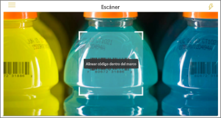
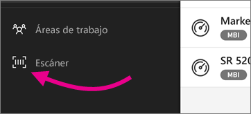

# Escanear un código de barras con su dispositivo desde la aplicación móvil de Power BI
Escanee códigos de barras en el mundo real para ir directamente a información filtrada de BI en la aplicación móvil Power BI.

Se aplica a:

|  |  | 
|:--- |:--- |
| iPhone | Android (teléfono o tableta) | 

Suponga que un compañero ha [etiquetado un campo de código de barras en un informe de Power BI Desktop](../../desktop-mobile-barcodes.md) y ha compartido el informe con usted. 

Al escanear el código de barras de un producto con el escáner en la aplicación Power BI en su dispositivo, verá el informe (o una lista de informes) con ese código de barras. Puede abrir ese informe filtrado por ese código de barras.

## Escanear un código de barras con el escáner de Power BI
1. En la aplicación móvil de Power BI, abra el menú de navegación principal  en la parte superior izquierda. 
2. Desplácese hacia abajo hasta **Escáner** y selecciónelo. 
   
    
3. Si la cámara no está habilitada, debe permitir que la aplicación Power BI use la cámara. Se trata de una aprobación única. 
4. Apunte el escáner a un código de barras de un producto. 
   
    Verá una lista de los informes asociados a ese código de barras.
5. Pulse el nombre del informe para abrirlo en el dispositivo, filtrado automáticamente por ese código de barras.

## Filtrar por otros códigos de barras en un informe
Mientras mira un informe filtrado por un código de barras en el dispositivo, puede querer filtrar el mismo informe por otro código de barras.

* Si el icono de código de barras tiene un filtro , el filtro está activo y el informe ya está filtrado por un código de barras. 
* Si el icono no contiene un filtro , el filtro no está activo y el informe no está filtrado por un código de barras. 

En cualquier caso, pulse el icono para abrir un pequeño menú con un escáner flotante.

* Centre el escáner sobre el nuevo elemento para cambiar el filtro del informe por un valor de código de barras diferente. 
* Seleccione **Borrar filtro de código de barras** para volver al informe sin filtrar.
* Seleccione **Filtrar por códigos de barras reciente** para cambiar el filtro de informe a uno de los códigos de barras que ha escaneado en la sesión actual.

## Problemas con el escaneo de código de barras
Estos son algunos mensajes que puede ver al escanear un código de barras de un producto.

### "No se puede filtrar el informe...".
El informe que elige para filtrar se basa en un modelo de datos que no incluye este valor de código de barras. Por ejemplo, el producto "agua mineral" no se incluye en el informe.  

### Todos o algunos de los elementos visuales en el informe no contienen ningún valor
El valor de código de barras que ha escaneado existe en el modelo pero todos o algunos de los elementos visuales en el informe no contienen este valor y, por tanto, el filtrado devolverá un estado vacío. Pruebe a buscar en otras páginas del informe o editar los informes en Power BI Desktop para que contengan este valor 

### "Parece que no tiene ningún informe que se pueda filtrar por código de barras".
Esto significa que no tiene ningún informe compatible con códigos de barras. El escáner de código de barras solo puede filtrar los informes que tienen una columna marcada como **Código de barras**.  

Asegúrese de que usted o el propietario del informe han etiquetado una columna como **Código de barras** en Power BI Desktop. Obtenga más información sobre el [etiquetado de un campo de código de barras en Power BI Desktop](../../desktop-mobile-barcodes.md)

### "No se pudo filtrar el informe: parece que este código de barras no existe en los datos del informe".
El informe que ha elegido para filtrar se basa en un modelo de datos que no incluye este valor de código de barras. Por ejemplo, el producto "agua mineral" no se incluye en el informe. Puede escanear un producto diferente, elegir otro informe (si hay más de uno disponible) o ver el informe sin filtrar. 

## Pasos siguientes
* [Tag a barcode field in Power BI Desktop (Etiquetar un campo de código de barras en Power BI Desktop)](../../desktop-mobile-barcodes.md)
* [Iconos de paneles en Power BI](../end-user-tiles.md)
* [Paneles en Power BI](../end-user-dashboards.md)

