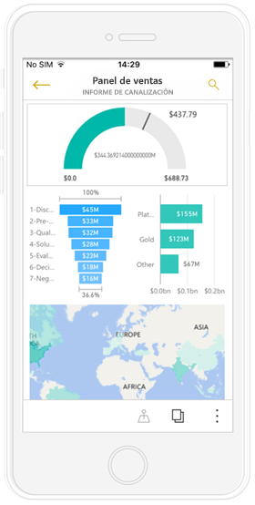
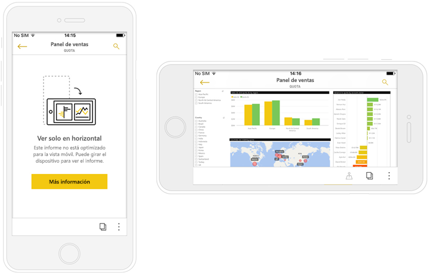
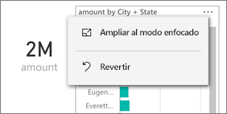
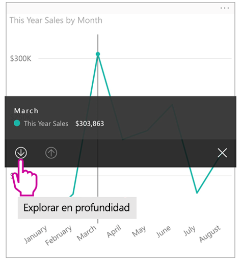
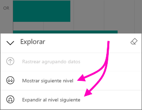
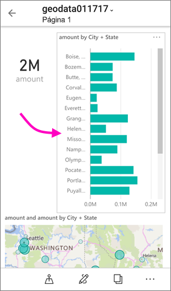
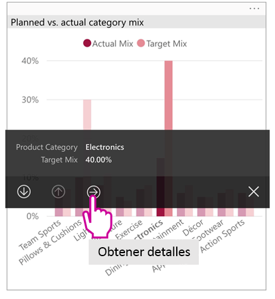
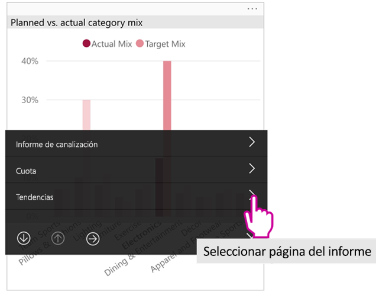

# Ver informes de Power BI optimizados para el teléfono

Se aplica a:

|  |  |
|:--- |:--- |
| iPhone |Teléfonos Android |

Al ver un informe de Power BI en su teléfono, Power BI comprueba si el informe se ha optimizado para teléfonos. Si es así, Power BI abre automáticamente el informe optimizado en la vista vertical.

Si no existe un informe optimizado para teléfono, el informe se abrirá en la vista horizontal no optimizada. Incluso en un informe optimizado, si gira el teléfono hacia un lado, el informe se abre en una vista no optimizada con el diseño del informe original. Si solo se optimizan algunas páginas, verá un mensaje en vista vertical, que indica que el informe está disponible en horizontal.

Las restantes características de los informes de Power BI funcionan en los informes optimizados para teléfono. Lea más acerca de lo que puede hacer en:

* [Informes sobre iPhone](mobile-reports-in-the-mobile-apps.md). 
* [Informes de teléfonos Android](mobile-reports-in-the-mobile-apps.md).

## Filtrado de la página del informe en un teléfono
Si un informe optimizado para el teléfono tiene filtros definidos, cuando vea el informe en un teléfono, podrá usar esos filtros. El informe se abre en el teléfono, filtrado según los valores que se está filtrados en el informe en la web. Verá un mensaje que indica que hay filtros activos en la página. Puede cambiar los filtros en el teléfono.Puede cambiar los filtros en el teléfono.

1. Pulse el icono de filtro  en la parte inferior de la página. 
2. Use el filtrado básico o avanzado para ver los resultados que le interesan.
   
    

## Objetos visuales de resaltado cruzado
Los objetos visuales en vertical de resaltado cruzado vista funciona del modo que en el servicio Power BI y en los teléfonos en la vista horizontal: al seleccionar los datos de un objeto visual, se resaltan los datos relacionados en los demás objetos visuales de la página.

Lea más sobre el [filtrado y resaltado en Power BI](../../power-bi-reports-filters-and-highlighting.md).

## Seleccionar objetos visuales
En los informes de teléfono cuando se selecciona un objeto visual, el informe de teléfono resalta ese objeto visual y se centra en él, lo que neutraliza los gestos del lienzo.

Con el objeto visual seleccionado, puede hacer tareas como desplazarse dentro del objeto visual. Para anular la selección de un objeto visual, solo tiene que tocar en cualquier lugar fuera del área visual.

## Abrir objetos visuales en modo de enfoque
Informes de teléfono ofrecen también un modo de enfoque: Obtener una vista más grande de una sola visual y explorarlo más fácilmente.

* En un informe para móviles, pulse los puntos suspensivos ( **...** ) en la esquina superior derecha de un objeto visual > **Ampliar al modo enfocado**.
  
    

¿Qué en modo de enfoque incluye al lienzo del informe y viceversa. Por ejemplo, si resalta un valor en un objeto visual y luego volver a todo el informe, el informe se filtra para el valor resaltado en el objeto visual.

Algunas acciones solo son posibles en el modo de enfoque debido a restricciones de tamaño de pantalla:

* **Explorar en profundidad** la información que se muestra en un objeto visual. A continuación encontrará más información acerca de la [exploración en profundidad y el rastreo agrupando datos](mobile-apps-view-phone-report.md#drill-down-in-a-visual).
* **Ordene** los valores del objeto visual.
* **Revertir**: borre los pasos de exploración tomados en un objeto visual y revierta a la definición establecida cuando se creó el informe.
  
    Para borrar todas las exploraciones de un objeto visual, pulse los puntos suspensivos ( **...** ) > **Revert** (Revertir).
  
    
  
    Revertir está disponible en el nivel de informe, desactive la exploración de todos los objetos visuales, o en el nivel visual, borrar la exploración del objeto visual seleccionado.   

## Exploración en profundidad en un objeto visual
Si los niveles de jerarquía se definen en un objeto visual, es posible profundizar en la información detallada que se muestran en dicho objeto y, después, realizar una copia de seguridad. Se puede [agregar una exploración en profundidad a un objeto visual](../end-user-drill.md) tanto en el servicio Power BI como en Power BI Desktop.

Hay algunos tipos de exploración en profundidad:

### Exploración en profundidad de un valor
1. Pulse largo (tap y hold) en un punto de datos en un objeto visual.
2. Se mostrará información sobre herramientas y, si se define la jerarquía, el pie de página de información sobre herramientas mostrará exploración en profundidad y la flecha arriba.
3. Puntee en la flecha hacia abajo para explorar en profundidad

    
    
4. Puntee en la flecha arriba para rastrear agrupando datos.

### Obtener detalles del siguiente nivel
1. En un informe de un móvil, pulse los puntos suspensivos ( **...** ) en la esquina superior derecha > **Ampliar al modo enfocado**.
   
    
   
    En este ejemplo, las barras muestran los valores de los estados.
2. Pulse el icono de exploración  en la parte inferior izquierda.
   
    
3. Pulse **Mostrar siguiente nivel** o **Expandir al nivel siguiente**.
   
    
   
    Ahora las barras muestran los valores de las ciudades.
   
    
4. Si pulsa la flecha de la esquina superior izquierda, devuelve el informe para móviles con los valores expandidos en el nivel inferior.
   
    
5. Para volver al nivel original, puntee vuelve a pulsar los puntos suspensivos ( **...** ) > **Revert** (Revertir).
   
    

## Obtención de detalles de un valor
Obtención de detalles conecta a los valores en una página del informe, con otras páginas del informe. Al explorar a través de un punto de datos a otra página del informe, los valores de punto de datos se usan para filtrar el drilled a través de la página, o va a estar en el contexto de los datos seleccionados.
Los autores de informes pueden [definir la obtención de detalles](https://docs.microsoft.com/power-bi/desktop-drillthrough) cuando crea el informe.

1. Pulse largo (tap y hold) en un punto de datos en un objeto visual.
2. Se mostrará información sobre herramientas y, si se ha definido la obtención de detalles, el pie de página de información sobre herramientas mostrará flecha de obtención de detalles.
3. Puntee en la flecha de obtención de detalles

    

4. Elija qué página del informe para obtener detalles

    

5. Use el botón Atrás, en el encabezado de la aplicación para volver a la página que comenzó.

## Pasos siguientes
* [Crear informes optimizados para las aplicaciones de teléfono de Power BI](../../desktop-create-phone-report.md)
* [Create a phone view of a dashboard in Power BI (Crear una vista de teléfono de un panel en Power BI)](../../service-create-dashboard-mobile-phone-view.md)
* [Crear objetos visuales con capacidad de respuesta optimizados para cualquier tamaño](../../visuals/desktop-create-responsive-visuals.md)
* ¿Tiene más preguntas? [Pruebe a preguntar a la comunidad de Power BI](http://community.powerbi.com/)

