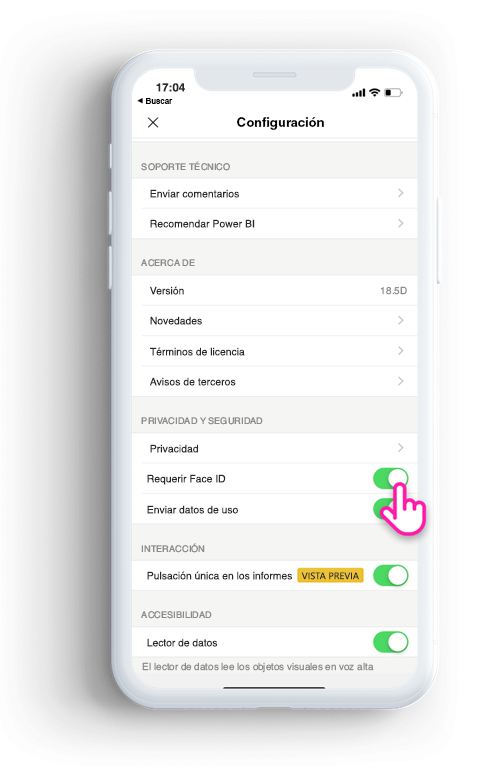
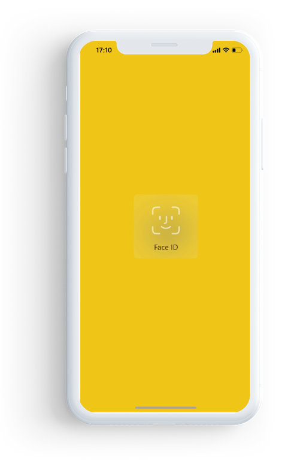

# Protección de la aplicación de Power BI con Face ID, Touch ID o código de acceso 

En muchos casos, los datos administrados en Power BI son confidenciales y deben protegerse para que solo los usuarios autorizados puedan tener acceso. 

La aplicación para iOS de Power BI le permite proteger los datos mediante la configuración de la identificación adicional. Deberá proporcionar su Face ID, Touch ID o un código de acceso cada vez que inicie la aplicación o cuando la aplicación pasa de segundo a primer plano.

|  |  |
|:--- |:--- |
| iPhone |iPad |

## Activación de Face ID, Touch ID o un código de acceso en la configuración de la aplicación

Para usar la identificación adicional en Power BI, vaya a la configuración de la aplicación en **Privacidad y seguridad**. Verá la opción para activar Face ID, Touch ID o un código de acceso, según las funcionalidades del dispositivo.

Una vez que esta opción está activada, cada vez que inicie Power BI o lo ponga en primer plano, se le pedirá que proporcione su identificación antes de que pueda tener acceso a la aplicación. 

La decisión de solicitar Face ID, Touch ID o un código de acceso la realiza iOS, según la funcionalidad del dispositivo. Si el dispositivo admite Face ID, deberá usarlo. Si el dispositivo admite Touch ID, deberá usarlo. Si no admite ninguno de los dos, deberá proporcionar un código de acceso.

## Uso de MDM para requerir Face ID, Touch ID o un código de acceso

Algunas organizaciones tienen directivas de seguridad y cumplimiento normativo que requieren la identificación adicional antes de tener acceso a los datos confidenciales del negocio. 

La aplicación móvil para iOS de Power BI permite a los administradores controlar esa configuración mediante la inserción de los valores de configuración de aplicación de Microsoft Intune y otras soluciones de administración de dispositivos móviles (MDM). Los administradores pueden usar la directiva de protección de aplicaciones para activar esta configuración para todos los usuarios o para un grupo de usuarios.

|Clave  |Tipo  |Descripción  |
|---------|---------|---------|
| com.microsoft.powerbi.mobile.ForceDeviceAuthentication | Booleano | El valor predeterminado es False.  Cuando se establece en True, la aplicación obligará a que los usuarios se identifiquen con Face ID, Touch ID o un código de acceso antes de que puedan ver los datos de Power BI en la aplicación. Los usuarios que no tienen Face ID, Touch ID o un código de acceso configurado en su dispositivo, deberán configurarlo antes de poder acceder a Power BI.  |

## Pasos siguientes

[Uso de MDM para configurar la aplicación para iOS de Power BI de forma remota](mobile-app-configuration.md)
