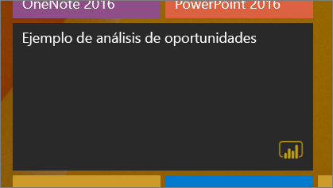
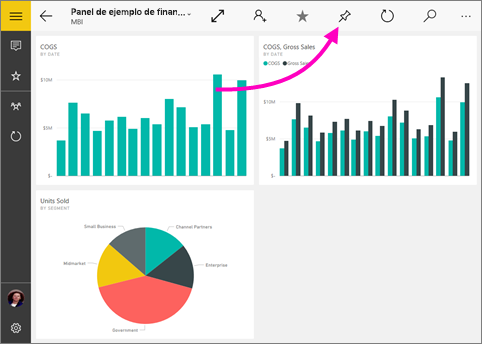
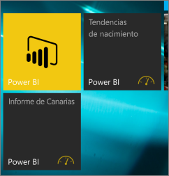

# Anclaje de un panel a la pantalla Inicio de Windows 10 desde la aplicación móvil de Power BI
Puede anclar iconos y paneles de Power BI a la pantalla Inicio de Windows desde la aplicación móvil de Power BI para Windows 10. Se convierten en *iconos dinámicos*. Al pulsar el icono en la pantalla Inicio, el panel se abre en la aplicación móvil de Power BI para Windows 10.

## Anclaje de un panel a la pantalla Inicio en forma de icono dinámico
1. Abra un panel.
2. Pulse **Anclar a Inicio** .
   
   
   
   Vaya a la pantalla Inicio del dispositivo para ver el icono dinámico.
   
   

## Pasos siguientes
* [Descarga de la aplicación móvil de Power BI para Windows 10](http://go.microsoft.com/fwlink/?LinkID=526478) de la Tienda Windows  
* [Introducción a la aplicación móvil de Power BI para Windows 10](mobile-windows-10-phone-app-get-started.md)  
* [¿Qué es Power BI?](../../power-bi-overview.md)
* ¿Tiene alguna pregunta? [Pruebe a preguntar a la comunidad de Power BI](http://community.powerbi.com/)

