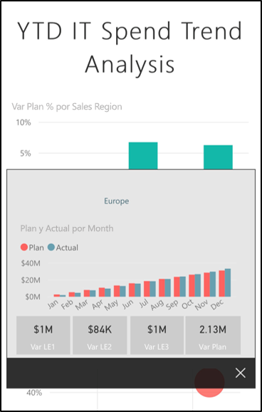

# Exploración de informes en las aplicaciones móviles de Power BI
Se aplica a:

|  |  |  |  |  |
|:--- |:--- |:--- |:--- |:--- |
| iPhone |iPad |Teléfonos Android |Tabletas Android |Dispositivos de Windows 10 |

Un informe de Power BI es una vista interactiva de los datos, con objetos visuales que describen distintas conclusiones e información a partir de esos datos. Ver informes en las aplicaciones móviles de Power BI es el tercer paso de un proceso de tres pasos.

1. [Crear informes en Power BI Desktop](../../desktop-report-view.md). Puede incluso [optimizar un informe para teléfonos](mobile-apps-view-phone-report.md) en Power BI Desktop. 
2. Publique esos informes en el servicio Power BI [(https://powerbi.com)](https://powerbi.com) o [Power BI Report Server](../../report-server/get-started.md).  
3. Interactuar luego con estos informes en las aplicaciones móviles de Power BI.

## Apertura de un informe de Power BI en la aplicación móvil
Los informes de Power BI se almacenan en distintos lugares de la aplicación móvil, en función de su procedencia. Pueden estar en Aplicaciones, Compartido conmigo, Áreas de trabajo (incluidos Mi área de trabajo) o en un servidor de informes. A veces, se desplaza por un panel relacionado para llegar a un informe y a veces aparecen en una lista.

En listas y menús, encontrará un icono junto al nombre de un informe, lo que ayuda a entender que este elemento es un informe. 

 

En las aplicaciones móviles de Power BI Mobile hay dos iconos para los informes:

*  Indica un informe que se presenta en orientación horizontal en la aplicación y que tiene el mismo aspecto que en el explorador.

*  Indica un informe que tiene al menos una página de informe optimizada para teléfono, que se presenta en orientación vertical. 

> [!NOTE]
> Si mantiene el teléfono en horizontal, siempre obtendrá el diseño horizontal, incluso si la página del informe tiene diseño de teléfono. 

Para obtener un informe desde un panel, pulse el botón de puntos suspensivos (...) en la esquina superior derecha de un icono > **Abrir informe**.
  
  
  
  No todos los iconos se pueden abrir en un informe. Por ejemplo, los iconos que ha creado cuando hace una pregunta en el cuadro de preguntas y respuestas no abren informes al pulsar en ellos. 
  
## Interacción con los informes
Una vez que haya abierto un informe en la aplicación, puede empezar a trabajar con él. Hay muchas cosas que puede hacer con el informe y sus datos. En el pie de página del informe, encontrará acciones para realizar en el informe. Puede segmentar los datos mediante pulsaciones y pulsaciones largas en los datos mostrados en el informe.

### Uso de pulsaciones y pulsaciones largas
La pulsación equivale a un clic del mouse. Por tanto, si quiere resaltar el informe en función de un punto de datos, pulse en ese punto de datos.
Al pulsar en un valor de segmentación, se selecciona ese valor y el resto del informe se segmenta por ese valor. Al pulsar en un vínculo, botón o marcador se activará en función de la acción definida por el autor.

Probablemente haya observado que al pulsar en un objeto visual aparece un borde. En la esquina superior derecha del borde, verá un botón de puntos suspensivos (...). Al pulsarlo se abre un menú con las acciones que puede realizar en ese objeto visual.

### Acciones Información sobre herramientas y Obtener detalles

Al realizar una pulsación larga (pulsar y mantener presionado) en un punto de datos, se mostrará una información sobre herramientas con los valores que representa este punto de datos. 

Si el autor del informe ha configurado la información sobre herramientas de la página del informe, la información sobre herramientas predeterminada se reemplazará por la de la página del informe.

> [!NOTE]
> La información sobre herramientas de informes se admite para dispositivos con un tamaño superior a 640 píxeles y 320 de ventanilla. Si el dispositivo es más pequeño, la aplicación usa la información sobre herramientas predeterminada.

Los autores de informes pueden definir jerarquías en los datos y las relaciones entre las páginas del informe. La jerarquía permite explorar en profundidad, rastrear agrupando datos y obtener detalles de otra página de informe desde un objeto visual y un valor. Por tanto, al realizar una pulsación larga en un valor, además de la información sobre herramientas, en el pie de página aparecen las opciones de exploración pertinentes. 

Con la *obtención de detalles*, al pulsar una parte específica de un objeto visual, Power BI le mostrará otra página del informe y la filtrará según el valor que haya pulsado. El autor de un informe puede definir una o más opciones de exploración de varias páginas, de modo que cada opción dirija a una página diferente. Puede elegir en qué página quiere obtener detalles. El botón Atrás lo dirigirá de vuelta a la página de informe anterior.

Obtenga información sobre cómo [agregar la obtención de detalles a Power BI Desktop](../../desktop-drillthrough.md).
   
   > [!IMPORTANT]
   > En la aplicación Power BI Mobile, la obtención de detalles en objetos visuales de matriz y tabla solo se habilita a través de un valor de celda, no por los encabezados de columna y de fila.
   
   
   
### Uso de las acciones en el pie de página del informe
El pie de página del informe tiene acciones que puede realizar en la página del informe actual o en todo el informe. El pie de página tiene acceso rápido a las acciones más útiles y se puede acceder a todas las acciones desde los puntos suspensivos (...).

Las acciones que puede realizar desde el pie de página son las siguientes:
1) Restablecer el filtro de informe y las selecciones de resaltado cruzado a su estado original.
2) Abrir el panel de conversación para ver o agregar comentarios en este informe.
3) Abrir el panel de filtro para ver y modificar el filtro aplicado actualmente en el informe.
4) Enumerar todas las páginas de este informe. Al pulsar en el nombre de la página se cargará y presentará esa página.
Puede desplazarse entre las páginas del informe si desliza el dedo desde el borde de la pantalla hasta el centro.
5) Ver todas las acciones del informe.

#### Todas las acciones del informe
Al pulsar en la opción ... del pie de página del informe se muestran todas las acciones que se pueden realizar en un informe. 

Es posible que algunas de las acciones estén deshabilitadas, ya que dependen de las funciones específicas del informe.
Por ejemplo:
1) **Filtrar por la ubicación actual** está habilitado si el autor ha clasificado los datos del informe con datos geográficos. [Obtenga información sobre cómo identificar datos geográficos en el informe](https://docs.microsoft.com/power-bi/desktop-mobile-geofiltering).
2) **Examinar para filtrar el informe por código de barras** solo está habilitado si el conjunto de datos del informe se ha etiquetado como código de barras. [Etiquetado de códigos de barras en Power BI Desktop para las aplicaciones móviles](https://docs.microsoft.com/power-bi/desktop-mobile-barcodes). 
3) **Invitar** solo está habilitado si tiene permiso para compartir este informe con otros usuarios. Solo tendrá permiso si es el propietario del informe o si el propietario le ha proporcionado permiso para volver a compartirlo.
4) Es posible que **Anotar y compartir** esté deshabilitado si hay una [directiva de protección de Intune](https://docs.microsoft.com/intune/app-protection-policies) en la organización que prohíbe el uso compartido desde la aplicación Power BI Mobile. 

## Pasos siguientes
* [Ver e interactuar con informes de Power BI optimizados para el teléfono](mobile-apps-view-phone-report.md)
* [Creación de versiones de informes optimizadas para teléfonos](../../desktop-create-phone-report.md)
* ¿Tiene alguna pregunta? [Pruebe a preguntar a la comunidad de Power BI](http://community.powerbi.com/)

