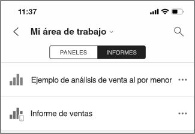
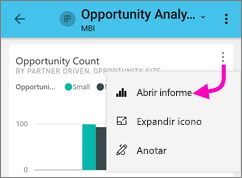
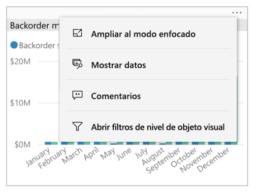
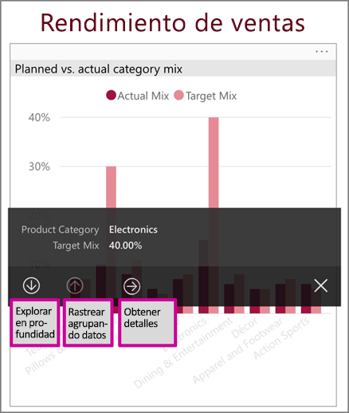
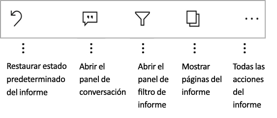
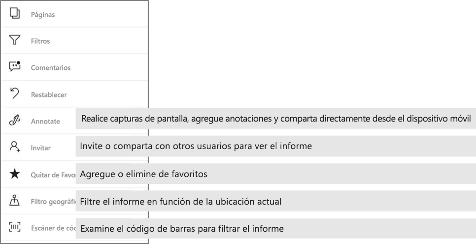

# Exploración de informes en las aplicaciones móviles de Power BI
Se aplica a:

|  |  |  |  |  |
|:--- |:--- |:--- |:--- |:--- |
| iPhone |iPad |Teléfonos Android |Tabletas Android |Dispositivos de Windows 10 |

Un informe de Power BI es una vista interactiva de los datos, con objetos visuales que describen distintas conclusiones e información a partir de esos datos. Ver informes en las aplicaciones móviles de Power BI es el tercer paso de un proceso de tres pasos.

1. [Crear informes en Power BI Desktop](../../desktop-report-view.md). Puede incluso [optimizar un informe para teléfonos](mobile-apps-view-phone-report.md) en Power BI Desktop. 
2. Publique esos informes en el servicio Power BI [(https://powerbi.com)](https://powerbi.com) o [Power BI Report Server](../../report-server/get-started.md).  
3. Interactuar luego con estos informes en las aplicaciones móviles de Power BI.

## Apertura de un informe de Power BI en la aplicación móvil
Los informes de Power BI se almacenan en distintos lugares de la aplicación móvil, en función de su procedencia. Pueden estar en Aplicaciones, Compartido conmigo, Áreas de trabajo (incluidos Mi área de trabajo) o en un servidor de informes. A veces se desplaza por un panel relacionado para llegar a un informe y a veces aparecen en una lista.

En las listas y menús, encontrará un icono junto al nombre de informe, le ayuda a comprender que este elemento es un informe. 

 

Hay dos iconos de informes en aplicaciones móviles de Power BI:

*  indica un informe que se presentará en orientación horizontal en la aplicación y será el mismo aspecto en el explorador.

*  indica un informe que tenga al menos una página de informe optimizado de teléfono que se presentan en vertical. 

Nota: Mantiene el teléfono en horizontal, siempre obtendrá el diseño horizontal, incluso si la página del informe tiene el diseño de teléfono. 

Para llegar a un informe desde un panel, pulse el botón de puntos suspensivos (...) en la esquina superior derecha de un icono > **abrir informe**.
  
  
  
  No todos los iconos tienen la opción de abrirse en un informe. Por ejemplo, los iconos que ha creado cuando hace una pregunta en el cuadro de preguntas y respuestas no abren informes al pulsar en ellos. 
  
## Interactuar con los informes
Una vez que un informe abierto en la aplicación, puede empezar a trabajar con él. Hay muchas cosas que puede hacer con el informe y sus datos. En el pie de página encontrará acciones que puede realizar en el informe y pulsar y pulsar long en los datos mostrados en el informe también puede segmentar y desglosar los datos.

### Uso de pulse y cuánto tiempo
Haga clic en TAP igual a un mouse. Por lo que si desea cross, resalte el informe basado en un punto de datos, pulse en ese punto de datos.
Pulsar en un valor de la segmentación de datos, hace que ese valor seleccionado y el resto del informe de la segmentación por ese valor. Pulsar en un vínculo, botón o un marcador se activará según la acción definida por el autor.

Probablemente ha observado que, al pulsar en un objeto visual, aparece un borde. En la esquina superior derecha del borde, no hay puntos suspensivos (...). Puntear en ella, aparecerá un menú con las acciones que puede hacer en ese objeto visual.

### Acciones de obtención de detalles e información sobre herramientas

Al tiempo tocar (tap y hold) un punto de datos, una información sobre herramientas aparecerá presentar los valores que representa este punto de datos. 

Los autores de informes pueden definir las jerarquías en los datos y las relaciones entre las páginas del informe. Permite explorar en profundidad; exploración de jerarquía y obtención de detalles de otra página del informe desde un objeto visual y un valor. Por lo tanto, cuando pulse larga en un valor, además de la información sobre herramientas, las opciones de obtención de detalles pertinentes se mostrarán en el pie de página. 

Con la *obtención de detalles*, al pulsar una parte específica de un objeto visual, Power BI le mostrará otra página del informe y la filtrará según el valor que haya pulsado.  El autor de un informe puede definir una o más opciones de exploración de varias páginas, de modo que cada opción dirija a una página diferente. En ese caso, podrá elegir en qué página quiere obtener detalles. El botón Atrás le lleva a la página anterior del informe.

Obtenga información sobre cómo [agregar la obtención de detalles a Power BI Desktop](../../desktop-drillthrough.md).
   
   > [!IMPORTANT]
   > En la aplicación móvil de Power BI, exploración en profundidad en los objetos visuales matriz y tabla está habilitada a través solo un valor de celda y no por los encabezados de fila y columna.
   
   
   
### Uso de las acciones en el pie del informe
El pie del informe tiene acciones que puede realizar en la página del informe actual o en todo el informe. El pie de página tiene un acceso rápido a las acciones más útiles y todas las acciones que pueden ser el acceso desde los puntos suspensivos (...).

Las acciones que puede realizar en el pie de página son:
1) Restablecer el filtro de informe y entre las selecciones resaltado a su estado original.
2) Abra el panel de conversación para ver o agregar comentarios en este informe.
3) Abra el panel de filtro para ver y modificar el filtro aplicado actualmente en el informe.
4) Enumera todas las páginas de este informe. Pulsar en el nombre de la página cargará y presentar esa página.
Moverse entre las páginas de informe puede hacerse pasar el dedo desde el borde de la pantalla hasta el centro.
5) Ver todas las acciones de informe.

#### Todas las acciones de informe
Pulsar en el... opción en el pie del informe, mostrará todas las acciones que puede realizar en un informe. 

Algunas de las acciones podrían estar deshabilitada, ya que son dependientes de las capacidades de informe específico.
Por ejemplo:
1) **Filtrar por ubicación actual** está habilitada si los datos en el informe se ha clasificado por el autor con datos geográficos. [Aprenda a identificar datos geográficos en el informe](https://docs.microsoft.com/power-bi/desktop-mobile-geofiltering).
2) **Detección para filtrar el informe por código de barras** está habilitada sólo si el conjunto de datos en el informe se ha etiquetado como código de barras. [Cómo etiquetar códigos de barras en Power BI Desktop](https://docs.microsoft.com/power-bi/desktop-mobile-barcodes). 
3) **Invitar a** está habilitada sólo si tiene permiso para compartir este informe con otros usuarios. Tendrá permiso solo si es el propietario del informe o si se le asignó el permiso de volver a compartir el propietario.
4) **Anotar y compartir** puede deshabilitar si hay un [directiva de protección Intune](https://docs.microsoft.com/intune/app-protection-policies) en su organización, que prohíbe el uso compartido de aplicación móvil de Power BI. 

## Pasos siguientes
* [Ver e interactuar con informes de Power BI optimizados para el teléfono](mobile-apps-view-phone-report.md)
* [Creación de versiones de informes optimizadas para teléfonos](../../desktop-create-phone-report.md)
* ¿Tiene alguna pregunta? [Pruebe a preguntar a la comunidad de Power BI](http://community.powerbi.com/)

