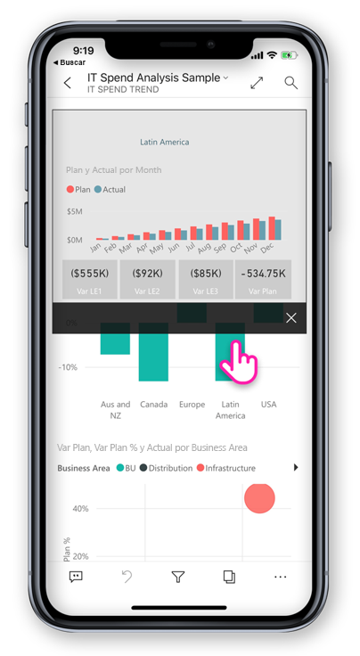
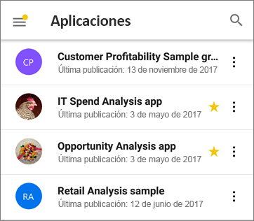

# Novedades en las aplicaciones móviles para Power BI
Para obtener información sobre novedades, vea:

* [Blog del equipo de Power BI para aplicaciones móviles](https://powerbi.microsoft.com/blog/tag/mobile/)
* [Novedades de Power BI Desktop](../../desktop-latest-update.md)  
* [Novedades en el servicio Power BI](../../service-whats-new.md)  

## Enero de 2020

### Uso compartido de las anotaciones creadas en el modo de presentación (Windows)

Las anotaciones que cree durante las presentaciones se convierten en parte integral de la presentación y en un componente clave del debate. Ahora, al realizar anotaciones en los informes en el modo de presentación, puede compartir una instantánea de la página del informe con sus compañeros. [Más información](./mobile-windows-10-app-presentation-mode.md#use-presentation-mode)

## Diciembre de 2019

### Pie de página de informe acoplado y un botón Actualizar: nuevas experiencias para interactuar con informes (Android)

Nuestros usuarios de Android nos han hecho saber que su experiencia al usar los informes no es óptima, ya que les resulta difícil usar el pie de página del informe y que deslizar para actualizar es demasiado sensible en algunos dispositivos. Por tanto, en esta versión, estos comportamientos se han cambiado:
* **Pie de página de informe acoplado**: ahora, al abrir un informe en el teléfono, encontrará el pie de página del informe acoplado en la parte inferior de la página del informe, donde siempre estará visible y disponible, con independencia de las acciones que realice en la página. Esto facilita el uso de todas las opciones que proporciona.
* **Botón Actualizar en el encabezado del informe**: también encontrará un botón Actualizar en el encabezado del informe, lo que facilitará la actualización del informe exactamente cuando quiera.

Los usuarios que prefieran el comportamiento anterior pueden restaurarlo con la nueva [configuración de la interacción](./mobile-app-interaction-settings.md) de la aplicación móvil.

Además, los administradores de TI pueden [invalidar de forma remota la nueva configuración predeterminada](./mobile-app-configuration.md#interaction-settings-android) en nombre de los usuarios mediante la herramienta de MDM que prefieran con un archivo de configuración de la aplicación. De esta forma, se puede configurar el mismo comportamiento para todos los usuarios de una organización.

> [!NOTE]
> La configuración de la interacción para el botón de actualización y para acoplar el pie de página del informe actualmente no afecta a los informes de Report Server. Esto cambiará con la versión de enero de Report Server.

### Establecimiento de marcadores predeterminados desde la aplicación móvil
Ahora puede establecer marcadores predeterminados para los informes directamente desde la aplicación móvil de Power BI. Después, cada vez que abra un informe, su marcador predeterminado se aplicará de forma automática. [Obtenga más información al respecto](./mobile-reports-in-the-mobile-apps.md#bookmarks).

### Filtrado por ubicación en tabletas Android
El filtrado geográfico le permite filtrar los informes en función de la ubicación actual. Ahora esta característica también está disponible en la aplicación de Power BI para tabletas Android. [Obtenga más información al respecto](./mobile-apps-geographic-filtering.md).

## Noviembre de 2019

### El nuevo aspecto de la aplicación Power BI ya está activado de forma predeterminada
 
Ahora, al abrir la aplicación, se activan automáticamente la nueva apariencia y las barras de navegación, lo que simplifica la manera de buscar y abrir el contenido. Use la [página de inicio](mobile-apps-home-page.md) de la aplicación como punto de partida: obtendrá acceso rápido al contenido más importante, así como a una [fuente de actividades](mobile-apps-home-page.md#activity-feed) que le mantiene al día con todas las alertas y notificaciones más recientes, y mucho más.

### Visualización de toda la actividad más reciente de Power BI
 
La fuente de actividades ayuda a realizar el seguimiento de lo que ocurre con el contenido de Power BI, en tiempo real. Simplemente vaya a la página de inicio de la aplicación y abra la pestaña Actividad para ver todas las notificaciones más recientes, alertas, comentarios, @mentions y mucho más. [Más información](mobile-apps-home-page.md#activity-feed).

### Uso de marcadores en los informes

La aplicación móvil de Power BI ahora admite marcadores creados en Power BI. Al abrir la aplicación, puede aprovechar las ventajas de los marcadores creados por el autor del informe y los marcadores personales que haya creado personalmente. [Más información](mobile-reports-in-the-mobile-apps.md#bookmarks).

## Octubre de 2019

### Compatibilidad con Android para la configuración remota del acceso a Report Server

Hemos agregado compatibilidad con Android para la configuración remota del acceso a la solución Report Server de la aplicación móvil de Power BI. Ahora, los administradores de TI pueden usar la herramienta MDM de su organización para configurar de forma remota esas opciones tanto en dispositivos iOS como en dispositivos Android. Vea [Configuración del acceso de la aplicación móvil de Power BI a Report Server de manera remota](https://docs.microsoft.com/power-bi/report-server/configure-powerbi-mobile-apps-remote) para conocer los detalles.

### Obtención de detalles de varios informes

Este mes hemos agregado compatibilidad con la obtención de detalles entre informes. Ahora puede pulsar en un punto de datos para acceder a otros informes y páginas del informe. Al obtener detalles de una página de destino, el contenido de esa página se filtra en función de la configuración de obtención de detalles.

> [!NOTE]
> La obtención de detalles entre informes solo está disponible si se ha habilitado durante la creación del informe. [Más información sobre la obtención de detalles entre informes](https://docs.microsoft.com/power-bi/desktop-cross-report-drill-through).

### Etiquetas de confidencialidad de datos

Ahora puede ver las etiquetas de confidencialidad que los propietarios del contenido han establecido en los informes, paneles, conjuntos de datos y flujos de datos para clasificar la confidencialidad de sus datos. Las etiquetas de confidencialidad determinan cómo se puede compartir el contenido con otros usuarios. [Más información sobre las etiquetas de confidencialidad de datos en Power BI](https://docs.microsoft.com/power-bi/admin/service-security-data-protection-overview).

### Compatibilidad con la navegación en una aplicación personalizada (Windows)

Ahora se ha agregado compatibilidad con la navegación en una aplicación personalizada para dispositivos Windows, además de iOS y Android (consulte las [Novedades de septiembre](#september-2019)).

## Septiembre de 2019

### Compatibilidad con la navegación en una aplicación personalizada (iOS y Android)

Se ha agregado compatibilidad con la navegación en una aplicación personalizada. Ahora, cuando abra una aplicación en Power BI Mobile, estará disponible la experiencia de navegación personalizada compilada por el creador de la aplicación. La navegación de la aplicación se puede organizar por contenido y puede incluir nuevos elementos como vínculos y secciones contraíbles.
Obtenga más información sobre la [navegación personalizada](https://powerbi.microsoft.com/blog/designing-custom-navigation-for-power-bi-apps-is-now-available/).

## Agosto de 2019

### Introducción a la nueva apariencia de Power BI Mobile (versión preliminar) (iOS y Android)

La aplicación se ha actualizado y se han incorporado nuevas experiencias. Así, se ha agregado una página principal que proporciona acceso rápido al contenido de uso más común y nuevos paneles de navegación que le brindan una manera sencilla de navegar por la aplicación. Con las experiencias nuevas y actualizadas, ahora es más rápido y fácil encontrar lo que necesita, cuando lo necesita.
Dado que la nueva apariencia está en versión preliminar, deberá activarla para disfrutar de ella.
Lea más sobre la [nueva apariencia de Power BI Mobile](https://powerbi.microsoft.com/blog/introducing-power-bi-mobile-apps-new-look-preview/).

### Acceso seguro con el proxy de aplicación de Azure Active Directory (AD) (iOS y Android)

Hemos colaborado con el equipo de Azure Active Directory para integrar aplicaciones móviles de Power BI con Azure Active Directory (AAD) Application Proxy. Con esta configuración, puede conectarse a Report Server hospedado dentro de los límites de la empresa desde la aplicación Power BI Mobile sin la necesidad de establecer una configuración local compleja. Obtenga más información sobre la [integración de Power BI Mobile y Azure Active Directory Application Proxy](https://powerbi.microsoft.com/blog/access-on-prem-report-server-from-your-power-bi-mobile-app-with-azure-active-directory-application-proxy/). Aprenda a [configurar Azure Active Directory (AAD) Application Proxy y Power BI](https://docs.microsoft.com/azure/active-directory/manage-apps/application-proxy-integrate-with-power-bi).

## Julio de 2019

### Información en pantalla de la página de informes

Ahora se admite la información en pantalla para informes al visualizar los informes en la aplicación móvil. Simplemente mantenga presionado un objeto visual que tenga una información sobre herramientas de informe vinculada para que se muestre.  

 
> [!NOTE]
> La información sobre herramientas de informes se admite para dispositivos con un tamaño superior a 640 píxeles y 320 de ventanilla. Los dispositivos más pequeños usan la información sobre herramientas predeterminada.

## Junio de 2019

### Ya se pueden escanear códigos de barras en Android
Ahora puede usar la aplicación Power BI en Android (teléfonos y tabletas) para escanear códigos de barras impresos en productos o en las estanterías de su tienda para mostrar informes de Power BI relacionados filtrados por el valor escaneado. Más información sobre [filtrado de los datos con códigos de barras](mobile-apps-scan-barcode-iphone.md).

### Compatibilidad con los informes PBIX hospedados en PBI-RS mediante la configuración de ADFS (iOS y Android)

Ahora también es posible acceder a los informes de Power BI (PBIX) hospedados en PBI-RS mediante la configuración de ADFS desde las aplicaciones móviles de Power BI.

## Mayo de 2019

### Compatibilidad con los accesos directos de Siri (iOS)
Los usuarios pueden crear accesos directos de Siri a sus paneles e informes de Power BI y abrirlos directamente desde la interfaz de voz de Siri. [Aprenda a usar accesos directos de Siri en una aplicación iOS de Power BI](https://powerbi.microsoft.com/blog/introducing-siri-integration-with-power-bi-mobile-ios-app-preview/).

### Búsqueda de dispositivos (iOS)
Integración de Power BI con la búsqueda en dispositivos iOS (Spotlight). La búsqueda de contenido en iPhone o iPad ahora incluye también los elementos de Power BI. Cuando los usuarios usen la búsqueda nativa del dispositivo, se mostrarán también en los resultados los informes, los paneles, las áreas de trabajo y los usuarios de Power BI que cumplen los criterios de búsqueda. [Visite esta entrada de blog para más información](https://powerbi.microsoft.com/blog/introducing-siri-integration-with-power-bi-mobile-ios-app-preview/).

### Interacción con informes con una única pulsación: disponibilidad general

La pulsación única está ahora en versión de disponibilidad general y se convertirá en la interacción táctil predeterminada para los nuevos usuarios. Los usuarios podrán desactivarla y tener la doble pulsación en la configuración de la aplicación.

### Protección de acceso condicional mejorada (iOS y Android)

Integración con la [nueva funcionalidad de acceso condicional basado en la protección de aplicaciones](https://docs.microsoft.com/azure/active-directory/conditional-access/app-protection-based-conditional-access) de AAD para aumentar la seguridad al limitar el acceso a Power BI antes de aplicar la directiva de aplicación.

### Protección de dispositivos (iOS)

Los usuarios pueden usar la protección de dispositivos integrada para proteger Power BI mediante la solicitud de la identificación Face ID, Touch ID o un código de acceso para acceder a Power BI. El usuario puede controlar este aspecto mediante la configuración de la aplicación y también los administradores mediante Intune y cualquier otra herramienta MDM. [Más información](https://docs.microsoft.com/power-bi/consumer/mobile/mobile-ios-native-secure-access).

### Presentación de informes de una página (Windows)

Se admite la actualización automática también para los informes de una página en una presentación. Por lo tanto, si se actualiza el origen de datos subyacente al informe, se recogerá para actualizar los datos de la página.

## Abril de 2019

### Objeto visual de influenciadores clave 

El objeto visual de influenciadores clave ahora está disponible en la aplicación móvil. Este objeto visual le permite realizar un análisis de los impulsores clave de los datos con tan solo unas pulsaciones.

### Adición de comentarios al contenido del informe (Android e iOS)

Ahora puede usar comentarios para colaborar y compartir sus propios comentarios en las páginas del informe y los objetos visuales. Más información sobre la inclusión de comentarios en informes en el servicio Power BI y para dispositivos móviles[en este blog](https://powerbi.microsoft.com/blog/announcing-report-commenting-for-power-bi-service-and-mobile/). 

### Maximización de la vista con el modo de pantalla completa (iOS y Android)

Se ha agregado un botón nuevo que permite controlar cuándo se debe centrar en los datos mediante la eliminación de los encabezados y pies de página del informe, lo que proporciona el máximo espacio para ver los informes.

## Marzo de 2019

### Compatibilidad con usuarios externos invitados en aplicaciones de Power BI (iOS y Android)

Puede acceder a contenido de Power BI compartido con usted de otra organización directamente desde la aplicación (también llamado B2B). Obtenga [aquí](https://powerbi.microsoft.com/blog/power-bi-mobile-apps-now-support-azure-ad-b2b-guest-users/) más información sobre B2B para aplicaciones móviles de Power BI.

### Mejora del modo de presentación de Windows con presentaciones (Windows)

Con la [presentación](https://powerbi.microsoft.com/blog/enhancing-presentation-mode-with-slideshow-in-windows-power-bi-app/) puede utilizar pantallas públicas ubicadas en su oficina para ejecutar informes de Power BI en pantalla completa que roten automáticamente entre las páginas del informe.  

### Compatibilidad con informes de PBI-RS mediante la configuración de ADFS y WAP (solo iOS)

Ahora es posible acceder a los informes de Power BI (PBIX) hospedados en PBI-RS mediante la configuración de ADFS desde la aplicación iOS de Power BI.

### Habilitación de la interacción de una sola pulsación con los objetos visuales del informe

Hemos cambiado la interacción del informe para que solo requiera una pulsación en un objeto visual, botón o segmentación para interactuar con sus datos de inmediato. Los usuarios ya no tendrán que pulsar en un objeto visual para seleccionarlo y volver a pulsar para interactuar con él, una sola pulsación realizará ambas acciones.

> [!NOTE]
> Los usuarios existentes deberán activar este comportamiento en la configuración de la aplicación. Para más información, consulte el artículo [Cómo configurar la interacción de una sola pulsación con el informe](https://docs.microsoft.com/power-bi/consumer/mobile/mobile-app-single-tap).

## Enero-febrero 2019
 
### Objetos visuales de Visio

Habilitación de inicio de sesión único (SSO) en objetos visuales de Visio, de modo que no sea necesario ningún paso de inicio de sesión adicional al ver informes con objetos visuales de Visio en la aplicación. 

### Comentarios de paneles llega a la aplicación de Windows Power BI Mobile

Puede agregar comentarios directamente a paneles e iconos específicos para debatir los datos, y cualquier usuario que vea el panel verá los comentarios. 

## Diciembre de 2018

### Ya hay un filtro disponible para los informes horizontales. 

Ya hay disponible el panel de filtros de informe para los informes horizontales (además de los informes para teléfonos).

## Noviembre de 2018

### Encabezado de objeto visual moderno 

En el caso de los informes que utilicen el nuevo "encabezado de objeto visual moderno", ya no se asignará espacio para los encabezados, de modo que habrá menos espacio vacío y más sitio para sus visualizaciones.

### Mejora del modo de presentación (Windows)

Modo de presentación mejorada para los dispositivos Surface Hub y Windows 10.  Disfrute de una mejor experiencia de sala de Surface Hub, con mejores herramientas de presentación y colaboración, y una vista optimizada en gran pantalla y sin cromo para que pueda centrarse en sus datos. El modo de presentación también proporciona herramientas como la entrada manuscrita para ayudarle a presentar de forma eficaz y mantener debates acerca de los datos. Obtenga más información sobre el modo de presentación [aquí](https://powerbi.microsoft.com/blog/presentation-mode-in-power-bi-windows-app/).

### Diseño del informe vertical en tabletas (iOS y Android)

Ahora, y siempre que esté disponible, utilizamos un diseño de informe de teléfono para mostrar los informes en la tableta en modo vertical. Obtenga más información sobre [cómo crear el diseño de teléfono en el servicio Power BI o Desktop](https://docs.microsoft.com/power-bi/desktop-create-phone-report/).

### Compatibilidad con la cadena de consulta de informe 

El vínculo de informe de apertura que incluye la cadena de consulta ahora se abrirá en la aplicación móvil y se filtrará previamente en función de las condiciones definidas en la cadena de consulta. Obtenga más información sobre [cómo crear la dirección URL del informe con la cadena de consulta](https://docs.microsoft.com/power-bi/service-url-filters/).  

### Credenciales compartidas (ahora en Android)

Iniciar sesión en Power BI desde su aplicación móvil nunca había sido tan fácil. Con las credenciales compartidas, hemos simplificado el proceso de inicio de sesión mediante el uso de otras credenciales de aplicación de Office 365 en el dispositivo para autenticarse en el servicio Power BI.

### Direcciones URL de la aplicación (ahora en Android) 

Los vínculos de los informes que remiten a otros artefactos de Power BI ahora se abren directamente dentro de la aplicación. Esto permite crear flujos de navegación personalizados; por ejemplo, vincular de un informe en un panel.

### Mostrar datos y copiar valores

El menú de acción visual de informe (...) ahora tiene la opción de mostrar los datos subyacentes en formato de tabla. Una vez en la tabla, puede mantener pulsado para seleccionar y copiar los valores de tabla (suponiendo que no haya ninguna directiva de Intune que restrinja la copia).

## Octubre de 2018

### Vista previa del informe paginado (todos los dispositivos)

Los informes paginados ahora están disponibles en el servicio Power BI. Los usuarios con acceso a los informes paginados en el servicio Power BI también pueden acceder a estos informes desde su aplicación móvil. 

Lea la entrada de blog [ de Power BI sobre los informes paginados en aplicaciones móviles](https://powerbi.microsoft.com/blog/power-bi-paginated-reports-also-available-in-power-bi-mobile-apps-preview/).

### Credenciales compartidas (iOS)

Iniciar sesión en Power BI desde su aplicación móvil nunca había sido tan fácil. Con las credenciales compartidas, hemos simplificado el proceso de inicio de sesión mediante el uso de otras credenciales de aplicación de Office 365 en el dispositivo para autenticarse en el servicio Power BI.

### URL de la aplicación (iOS) 

Los vínculos de los informes que remiten a otros artefactos de Power BI ahora se abren directamente dentro de la aplicación. Esto permite crear flujos de navegación personalizados; por ejemplo, vincular de un informe en un panel.

### Compatibilidad con iOS12 y watchOS 5 

Hemos actualizado la aplicación de Power BI para iOS para que funcione sin problemas con el nuevo sistema operativo en los dispositivos móviles y los relojes.

## Septiembre de 2018

### Edición de informes para móviles en el explorador (todos los dispositivos)

Ahora puede crear un diseño de informe para móviles para un informe que ya está publicado en el servicio Power BI y no solo en Power BI Desktop. Puede crearlo en el modo Edición del explorador.

### Comentarios de paneles (iOS y Android) 

Puede agregar comentarios directamente a paneles e iconos específicos para debatir los datos, y cualquier usuario que vea el panel verá los comentarios. También puede agregar a otros usuarios de la organización a la conversación si los @mentioning. Los usuarios que haya @mentioned reciben en su teléfono móvil una notificación push con el mensaje.

Actualmente disponible para dispositivos iOS y Android. Compatibilidad con Windows (próximamente)

Lea la [entrada de blog sobre los comentarios de paneles](https://powerbi.microsoft.com/blog/announcing-dashboard-comments-in-power-bi/) de Power BI.

### Inicio de sesión único (Windows)

El Inicio de sesión único (SSO) es una de las características más solicitadas para Power BI Mobile para Windows. Ahora puede usar la cuenta de la organización principal no solo para iniciar sesión en los dispositivos móviles Windows unidos a un dominio, sino también para iniciar sesión en el servicio Power BI sin problemas. Obtenga más información sobre [SSO y las aplicaciones móviles Windows](mobile-windows-10-app-single-sign-on-sso.md).

## Meses anteriores

### Julio de 2018

#### Solo iOS y Android

**Filtros compartidos**

Ya puede recibir informes con segmentaciones y filtros compartidos.

**Compatibilidad con imagen de fondo**

Al ver un informe en modo horizontal en el dispositivo móvil, puede ver las mismas imágenes de fondo que en Power BI en la Web.

### Junio de 2018

#### Informes de lienzo completo

Las barras de acción superior e inferior ahora desaparecen poco después de cargar el informe, con lo cual podrá ver más detalles.

#### Mayor tamaño del lienzo de informe en el teléfono

Se ha aumentado el tamaño del lienzo de informe en el teléfono para disponer de más espacio para objetos visuales que antes.

### May. 2018

#### Obtención de detalles en móviles: todas las aplicaciones móviles

Puede obtener detalles desde un punto de datos seleccionado a otra página del informe en las aplicaciones móviles, si el autor del informe ha definido esa acción. 

#### Botón Atrás: todas las aplicaciones móviles

Ahora al navegar a través de un informe deslizando el dedo, seleccionando una página del informe en la barra de acciones, o bien mediante la obtención de detalles, el botón Atrás le lleva a la página anterior que estuviera viendo. 

#### Temas de panel: todas las aplicaciones móviles

Cuando los autores de informes personalizan los temas de panel en el servicio Power BI, la apariencia del panel también cambiará en la aplicación móvil. Pero no podrá ver las imágenes de fondo.

#### iOS: Configurar el acceso de la aplicación móvil de iOS de Power BI a un servidor de informes de forma remota

El administrador de TI puede usar una herramienta MDM para configurar el acceso de la aplicación móvil de iOS de Power BI a un servidor de informes. Vea [Configurar el acceso de la aplicación móvil de iOS de Power BI a un servidor de informes de forma remota](../../report-server/configure-powerbi-mobile-apps-remote.md) para más información.

#### Aplicación Power BI for Mixed Reality (versión preliminar)

La aplicación Power BI para Mixed Reality ya está en Microsoft Store. Esta aplicación permite consultar paneles e informes mientras el usuario está inmerso en la realidad virtual, o colocarlos y consultarlos en ubicaciones específicas en el contexto de su entorno. Vea el vídeo nuevo [Introducing Power BI on Hololens](https://www.youtube.com/watch?v=J_X_nOFUBss) (Introducción a Power BI en Hololens) para obtener contexto o lea el artículo sobre el nuevo [Power BI para Mixed Reality](mobile-mixed-reality-app.md).

### Abril de 2018

#### Exploración en profundidad y rastreo agrupando en dispositivos móviles

Ahora puede explorar en profundidad y rastrear agrupando hasta profundizar en objetos visuales en su dispositivo móvil. Para acceder a esta nueva característica, pulse y mantenga presionado para abrir el menú de información sobre herramientas en un objeto visual de informe y luego pulse los botones de exploración para examinar los datos en profundidad. Más información sobre cómo [obtener detalles de las aplicaciones móviles y explorarlas en profundidad](https://powerbi.microsoft.com/blog/drill-down-up-in-power-bi-mobile-apps/).

#### Filtros persistentes

Recientemente hemos actualizados segmentaciones y filtros de informe, por lo que se guardan automáticamente desde Power BI en la Web en la aplicación móvil de Power BI. Ahora, los filtros y las segmentaciones de datos que se establecen en la aplicación móvil se guardan automáticamente en Power BI en la web.

### Marzo de 2018

#### Aplicación Power BI for Mixed Reality (versión preliminar)

Nuestros esfuerzos más recientes por llevar los datos allá donde se encuentren los usuarios se han materializado con la creación de la aplicación Power BI for Mixed Reality. Esta aplicación permite consultar paneles e informes mientras el usuario está inmerso en la realidad virtual, o colocarlos y consultarlos en ubicaciones específicas en el contexto de su entorno. Si quiere saber más, vea [Aplicación Power BI for Mixed Reality (versión preliminar)](mobile-mixed-reality-app.md).

#### Uso compartido externo de informes y paneles

Comparta paneles e informes con usuarios externos a la organización, directamente desde la aplicación. El uso compartido externo está habilitado tanto para cuentas sociales o de la organización. 

#### Filtros persistentes

Cuando establece filtros y segmentaciones en Power BI en la Web, las opciones de filtro se guardan también en la aplicación móvil, para que pueda continuar el trabajo donde lo dejó.

#### Actualización de informes en dispositivos iPad

Los informes de Power BI ahora tienen un botón de actualización en la aplicación para iPad.

### Febrero de 2018

#### Compartir informes

Ahora puede compartir un informe directamente desde las aplicaciones móviles. Obtenga más información sobre cómo [compartir paneles e informes desde aplicaciones móviles](mobile-share-dashboard-from-the-mobile-apps.md)

#### Mejoras en información sobre herramientas

Cuando mantiene pulsado un objeto visual de informe visual para acceder a información sobre herramientas, ahora puede arrastrar el dedo en el objeto visual para explorar los detalles sobre cada punto de datos sobre la marcha.

### Enero de 2018

#### Marca de informes como favoritos

Etiquete los informes como favoritos para que aparezcan en la página**Favoritos**. Obtenga más información sobre los [favoritos en las aplicaciones móviles Power BI](mobile-apps-favorites.md).

#### Vista de informes compartidos

Cuando un usuario comparta ahora un informe con usted, este se muestra en la página **Compartido conmigo** junto con los paneles.

#### Compatibilidad con hipervínculos mejorada

Ahora puede pulsar los vínculos de los objetos visuales personalizados para abrirlos en el explorador móvil.

#### Integración de Intune (Android)

Compatibilidad con acceso condicional mediante la administración de dispositivos móviles de Intune.

### Diciembre de 2017

#### Administración de la seguridad mejorada 

Con el objetivo de proteger mejor los datos de su organización, hemos agregado compatibilidad con el acceso condicional (AC) y la administración de dispositivos móviles (MDM) de Microsoft Intune en dispositivos Android. Ya está disponible en iOS.

#### Administración de permisos mejorada

Hemos hecho una serie de cambios que permiten administrar con más precisión los permisos de usuario de los conjuntos de datos, paneles e informes.

#### Instalación automática de aplicaciones

No es necesario instalar algunas de las aplicaciones en Power BI. Los creadores de aplicaciones de Power BI de su organización pueden crear *aplicaciones* que contienen una colección de paneles e informes. A continuación, pueden publicar la aplicación y establecer que se instale automáticamente en el servicio Power BI y en las aplicaciones móviles de Power BI. Cuando una aplicación está configurada para instalarse automáticamente, aparece directamente en el menú **Aplicaciones**:

### Noviembre de 2017
#### Optimización para iPhone X

Hemos optimizado el diseño de las aplicaciones para iPhone X, por lo que puede explorar los datos en el estilo de cada dispositivo.

### Octubre de 2017
#### Filtros para los informes de teléfono en Android

Si crea un informe con páginas optimizadas para teléfonos en Power BI Desktop y el informe tiene filtros, ahora puede aplicarlos en el informe de teléfono de su dispositivo Android. Más información sobre los filtros para informes de Power BI en Android.

#### Visualización de datos en informes

Ahora puede cambiar los objetos visuales de los informes a una vista de tabla para ver los números detrás de los datos. Para acceder a esta característica, pulse en el menú ... del objeto visual en el informe o en el nuevo icono en el menú de acción del objeto visual expandido.

### Septiembre de 2017
#### Filtros para informes de teléfono en dispositivos iPhone
Si crea un informe con páginas optimizadas para teléfonos en Power BI Desktop y el informe tiene filtros, ahora puede aplicarlos en el informe de teléfono de su iPhone. Obtenga más información sobre [filtros para informes de Power BI en iPhone](https://powerbi.microsoft.com/blog/filters-coming-for-phone-reports-on-ios/).

### Agosto de 2017
#### Compatibilidad con la configuración de proxy de iOS
Ahora puede establecer la configuración del proxy en la aplicación móvil de Power BI para iOS. Esto significa que Power BI funciona ya con conexiones VPN en el dispositivo móvil, lo que permite que más usuarios y organizaciones aprovechen la potencia de Power BI de forma segura estén donde estén.

### Julio de 2017
Lea el [resumen de características de aplicaciones móviles de julio de 2017](https://powerbi.microsoft.com/blog/power-bi-service-and-mobile-july-feature-summary/#ios-preview)

#### Dispositivos iOS
**Nueva experiencia de Preguntas y respuestas en iOS (versión preliminar)** . En vez de recibir simplemente una respuesta a su pregunta, ahora puede usar el lenguaje natural para obtener información con ámbito. Incluso si no está seguro de lo que está buscando, Preguntas y respuestas expone proactivamente información pertinente para los datos. La nueva experiencia de Preguntas y respuestas en dispositivos móviles, desarrollada en colaboración con el equipo de Microsoft Research, presenta tecnologías eficaces de nuestro producto. Pruebe con nuestro tutorial, [Realización de preguntas acerca de sus datos en las aplicaciones móviles iOS](mobile-apps-ios-qna.md).

### Objetos visuales con capacidad de respuesta
**Objetos visuales con capacidad de respuesta para informes y paneles en teléfonos** Puede establecer los objetos visuales en el panel o informe para que tengan *capacidad de respuesta* y para que cambien de forma dinámica para mostrar la máxima cantidad de datos, independientemente del tamaño de la pantalla. Lea el [blog sobre objetos visuales con capacidad de respuesta](https://powerbi.microsoft.com/blog/power-bi-desktop-july-feature-summary-2/#responsiveVisuals).

### Junio de 2107
#### Todos los dispositivos
**Agregar aplicaciones a favoritos** Ya sabe cómo agregar un panel a Favoritos. Recientemente, [Power BI agregó aplicaciones](../../service-create-distribute-apps.md) y ya puede también agregar aplicaciones a Favoritos. 

### Mayo de 2017
#### Todos los dispositivos
**Nuevo menú: Compartido conmigo** Vaya a Compartido conmigo en el menú de la aplicación móvil para ver todo el contenido que se ha compartido con usted.

**Nuevo menú: Aplicaciones** Una aplicación es una colección de paneles e informes creada específicamente por su organización con el fin de presentar métricas clave para una toma de decisiones orientada a datos más rápida y fácil.

Lea más sobre [cómo está organizado el contenido de Power BI](mobile-apps-quickstart-view-dashboard-report.md).

#### Dispositivos iOS y Android
**Versión preliminar del servidor de informes de Power BI** Cree y publique informes de Power BI de forma local. A continuación, [véalos e interactúe con ellos en su dispositivo móvil iOS o Android](mobile-app-ssrs-kpis-mobile-on-premises-reports.md). 

### Abril de 2017
Lea el [resumen de características de aplicaciones móviles de abril de 2017](https://powerbi.microsoft.com/blog/power-bi-mobile-apps-feature-summary-march-april-2017/).

#### Todos los dispositivos
**Color de fondo de informes de teléfono** Al definir un color de fondo para un informe en Power BI Desktop, el informe de teléfono tendrá el mismo color de fondo. Más información sobre cómo [optimizar páginas de informes para teléfonos](../../desktop-create-phone-report.md).

**Desarrollo de objetos visuales personalizados de preparados para dispositivos móviles** Lea [Developer guide](https://github.com/Microsoft/PowerBI-visuals/blob/master/Tutorial/MobileGuideline.md) (Guía del desarrollador) para ver sugerencias acerca de cómo crear objetos visuales personalizados que se vean bien y funcionen correctamente en dispositivos móviles.

#### Dispositivos iOS
**Hablar con los datos: formulación de preguntas con la voz** Ya puede [formular preguntas sobre los datos mediante Preguntas y respuestas](mobile-apps-ios-qna.md) hablando en lugar de escribiendo. 

### Marzo de 2017
Lea el [resumen de características de aplicaciones móviles de marzo de 2017](https://powerbi.microsoft.com/blog/power-bi-mobile-apps-feature-summary-march-2017/).

#### Todos los dispositivos
**Interacciones de segmentación de datos**

Hemos mejorado la interacción táctil de segmentaciones con la segmentación de tiempo.

#### Dispositivos iOS
**Formulación de preguntas sobre los datos mediante Preguntas y respuestas, y envío de comentarios** Pruebe a formular preguntas sobre los datos mediante Preguntas y respuestas y, luego, envíenos una cara sonriente o triste para que sepamos cómo hemos hecho nuestro trabajo.

**Uso de 3D Touch para acciones comunes** Mantenga presionado el icono de la aplicación de Power BI en la pantalla principal de su iPhone 6s o posterior para acceder a las notificaciones, la búsqueda y los paneles usados recientemente.

**Compatibilidad con idiomas que se escriben de derecha a izquierda** Las aplicaciones móviles de Power BI ya admiten idiomas que se escriben de derecha a izquierda. En este contexto, "idiomas que se escriben de derecha a izquierda" hace referencia a los sistemas de escritura de hebreo y árabe, que se escriben de derecha a izquierda y requieren modelado contextual. Consulte la lista de [idiomas compatibles con las aplicaciones móviles de Power BI](mobile-apps-supported-languages.md).

#### Dispositivos Android
**Conexión a más de un servidor SSRS** 

Ahora pueden tener conexiones con un máximo de cinco servidores de SQL Server Reporting Services (SSRS) al mismo tiempo.

**Solicitar acceso a paneles** 

Ahora, si detecta un código QR de un panel al que no tiene acceso, puede enviar una solicitud de acceso directamente desde la aplicación móvil.

### Febrero de 2017
#### Todos los dispositivos
**Desplazamiento simplificado** 

Ahora es posible desplazarse en los gráficos de barras y columnas de un informe tocando el propio gráfico, en lugar de la barra de desplazamiento lateral.

#### Dispositivos iOS
**Formulación de preguntas de sus datos con una versión preliminar de Preguntas y respuestas** 

Con Preguntas y respuestas puede formular preguntas sobre sus datos con sus propias palabras y Power BI le proporcionará las respuestas pertinentes. Ya hay disponible una sección de Preguntas y respuestas en el servicio de Power BI en https://powerbi.com. Ahora también está [disponible en la aplicación móvil de su iPhone o iPad](mobile-apps-ios-qna.md).

**Conexión a más de un servidor SSRS** 

Ahora pueden tener conexiones con un máximo de cinco servidores de SQL Server Reporting Services (SSRS) al mismo tiempo.

#### Tabletas Android
La **aplicación móvil de Power BI** para tabletas Android ya está disponible globalmente. Introducción a [Power BI en tabletas con Android](mobile-android-app-get-started.md).

#### Dispositivos iOS y Android
**Nuevo menú de iconos del panel** Navegue hasta el informe subyacente, expanda el icono o administre una alerta, todo ello directamente desde un menú del icono de un panel. 

Este menú es nuevo en los teléfonos iOS y Android en modo horizontal y en las tabletas Android. Ya estaba en teléfonos Windows y Android en el modo vertical.

### Enero de 2017
Lea en el [blog el resumen de las características de aplicaciones móviles de enero de 2017](https://powerbi.microsoft.com/blog/power-bi-mobile-apps-feature-summary-january-2017).

#### Todos los dispositivos
**Cargar más de 100 filas en tablas y matrices** Ahora, si tiene una tabla grande o una matriz en su panel o informe, mostramos la mayor cantidad de datos posible en el icono. En el modo de enfoque, puede desplazarse hacia abajo para cargar más filas.

**Disponibilidad general de los informes en el teléfono** Los informes en el teléfono de Power BI ahora están disponibles de forma generalizada. En Power BI Desktop, puede personalizar una vista vertical de un informe existente para los usuarios móviles. Obtenga más información sobre la [creación de informes en el teléfono en Power BI Desktop](../../desktop-create-phone-report.md) y la [experiencia con informes en el teléfono](mobile-apps-view-phone-report.md).

#### iOS
**Autenticación de SSRS con Servicios de federación de Active Directory (ADFS) Preview** Ahora, puede iniciar sesión en servidores locales de SQL Server Reporting Services desde su dispositivo móvil con su cuenta profesional. Obtenga más información sobre cómo [usar OAuth para conectarse a servidores SSRS](mobile-oauth-ssrs.md).

#### Android
**Autenticación de SSRS con Servicios de federación de Active Directory (ADFS) Preview** Ahora, puede iniciar sesión en servidores locales de SQL Server Reporting Services desde su dispositivo móvil con su cuenta profesional. Obtenga más información sobre cómo [usar OAuth para conectarse a servidores SSRS](mobile-oauth-ssrs.md).

**Nuevas y mejoradas: Anotar y compartir información rápidamente** Las operaciones de compartir y anotar ahora son totalmente funcionales en dispositivos Android. Con el menú mejorado resulta más fácil y rápido anotar y compartir información detallada, y también puede compartir un informe anotado directamente desde la aplicación de Power BI.

### Diciembre de 2016
Lea en el [blog el resumen de características de aplicaciones móviles de diciembre de 2016](https://powerbi.microsoft.com/blog/power-bi-mobile-apps-feature-summary-december-2016).

#### Todos los dispositivos
**Actualización en segundo plano sin conexión**

A fin de garantizar que pueda tener acceso a los datos más recientes sin conexión, llevamos a cabo una actualización de la aplicación en segundo plano para mantener al día la información empresarial, incluso si no la ha consultado durante cierto tiempo. Para asegurarse de que determinados paneles estén siempre actualizados, márquelos como favoritos. Obtenga más información sobre las [funciones sin conexión en las aplicaciones móviles de Power BI](mobile-apps-offline-data.md).

#### Dispositivos iOS
**Anotar y compartir**

Ahora puede anotar y compartir un icono, informe o visualización desde la aplicación móvil Power BI para iOS. 

* [En iPhone](mobile-annotate-and-share-a-tile-from-the-mobile-apps.md)
* [En iPad](mobile-annotate-and-share-a-tile-from-the-mobile-apps.md)

**Solicitar acceso a paneles**

Ahora, si detecta un código QR de un panel al que no tiene acceso, puede enviar una solicitud de acceso directamente desde la aplicación móvil.

**Dirección URL personalizada en el icono de imagen**

Si un icono de imagen tiene una dirección URL personalizada definida por el propietario del panel, al pulsarlo, se va directamente a esa dirección URL sin tener que abrir el icono en el modo de enfoque. 

#### iPhone
**Mejoras de Apple Watch**

Ahora puede actualizar los datos de Apple Watch directamente desde la aplicación Watch. Mantenga presionada la página de índice del panel para actualizar los datos. (La aplicación móvil Power BI debe estar ejecutándose en segundo plano en el iPhone para que esto funcione).

#### Android
**Dirección URL personalizada en el icono de imagen**

Si un icono de imagen tiene una dirección URL personalizada definida por el propietario del panel, al pulsarlo, se va directamente a esa dirección URL sin tener que abrir el icono en el modo de enfoque. Además, los iconos de panel que contienen direcciones URL personalizadas predefinidas ahora pueden redirigir a los lectores a informes dentro de la aplicación.

### Noviembre de 2016
Lea el [resumen de características de aplicaciones móviles de Power BI de noviembre de 2016](https://powerbi.microsoft.com/blog/power-bi-mobile-apps-feature-summary-november-2016/).

#### Tabletas Android
**Aplicación móvil Power BI para tabletas Android** Sí, la vista previa ya está aquí.

* Experiencia de [Power BI en tabletas Android](mobile-android-app-get-started.md)
* Exploración de [informes móviles y KPI de Reporting Services en tabletas Android](mobile-app-ssrs-kpis-mobile-on-premises-reports.md)

#### Dispositivos Android
**Versión preliminar: Administración de aplicaciones móviles de Intune** La compatibilidad de Power BI con la administración de aplicaciones móviles (MAM) de Microsoft Intune está ahora en versión preliminar para usuarios de Power BI Pro en dispositivos Android. 

**Favoritos** Etiquete sus paneles favoritos en el dispositivo Android y vea todos los [paneles de Power BI e informes móviles y KPI de Reporting Services favoritos](mobile-android-app-get-started.md#view-your-favorite-dashboards-and-reports) recopilados en una ubicación conveniente. 

#### Dispositivos iOS
**Vínculos** Las direcciones URL de los iconos y las visualizaciones ahora se pueden seleccionar y abrir en un explorador.

#### Dispositivos Windows
**Centrar un mapa** para poner el foco en los datos próximos a su ubicación

### Septiembre/octubre de 2016
Lea el [resumen de características de aplicaciones móviles de Power BI de octubre de 2016](https://powerbi.microsoft.com/blog/power-bi-mobile-apps-feature-summary-october-2016/).

#### Todos los dispositivos
**Favoritos como página de aterrizaje** Si ha marcado alguno de los paneles como favorito, su página de aterrizaje será la entrada Favoritos. 

**Navegación mejorada** La navegación principal tiene un aspecto nuevo y la navegación de grupos se ha movido al catálogo de grupos. 

**Mejoras de rendimiento de informes y paneles** Se ha mejorado la experiencia de carga de informes y paneles en las aplicaciones móviles de Power BI.

**Notificaciones de alerta mejoradas** Ahora, las notificaciones de alertas controladas por datos contienen más información sobre lo que desencadenó la alerta y por qué.

#### iOS en iPhone
**Mejoras de actualización de Apple Watch** La aplicación móvil Apple Watch se ha mejorado para Watch OS3.

#### Teléfonos Android
**Adición de la actualización de iconos manual** Ahora puede actualizar manualmente los iconos del panel. En el caso de los iconos basados en DirectQuery, se recuperan los datos más recientes del conjunto de datos.

#### Teléfonos con Windows 10
**Filtrado geográfico** Ahora, en teléfonos con Windows 10, puede filtrar el informe en función de su ubicación actual y ver únicamente los datos que necesita.

**Visualización de SandDance** Esta visualización personalizada ya está disponible en el hub de Surface.

### Agosto de 2016
#### Todos los teléfonos
**Favoritos** Vea sus paneles favoritos desde todas las aplicaciones móviles Power BI y administre la lista de favoritos desde las aplicaciones móviles Power BI para dispositivos iOS y Windows 10. Obtenga más información sobre los [favoritos en las aplicaciones móviles Power BI](mobile-apps-favorites.md).

**Clasificación de datos del panel** Vea las clasificaciones de datos que los propietarios del panel han asignado a sus escritorios. Obtenga más información sobre cómo [clasificar paneles](../../service-data-classification.md).

**Alertas controladas por datos** Reciba una alerta de notificación cuando cambien sus datos de manera predefinida para los KPI, el medidor y las ventanas de tarjetas. Más información sobre:

* [Establecimiento de alertas de datos en la aplicación Power BI para teléfonos con Android](mobile-set-data-alerts-in-the-mobile-apps.md). 
* [Establecer alertas de datos en la aplicación de iPhone (Power BI para iOS)](mobile-set-data-alerts-in-the-mobile-apps.md). 
* [Establecer alertas de datos en la aplicación móvil Power BI para Windows 10](mobile-set-data-alerts-in-the-mobile-apps.md).

#### iOS en iPhone e iPad
**Icono de pantalla completa en modo de enfoque en iPad** Cuando pulse un icono en el iPad, ahora se abrirá en modo de enfoque en pantalla completa para aprovechar toda la pantalla del iPad.

**Actualizar manualmente los iconos** Para actualizar manualmente los iconos, abra el panel en la aplicación móvil Power BI para iOS y deslícelo hacia abajo desde la parte superior de la pantalla. 

**Compatibilidad con MAM de Intune** Se ha agregado compatibilidad con las funciones de administración de aplicaciones móviles (MAM) de Microsoft Intune.

Obtenga más información acerca de [Microsoft Intune en aplicaciones móviles de Power BI](../../service-admin-mobile-intune.md).

#### Dispositivos de Windows 10
**Modos de pantalla completa y presentación** Muestre informes en modo de presentación en Surface Hub y muestre paneles, informes e iconos en modo de pantalla completa en dispositivos con Windows 10.

### Julio de 2016
#### Todos los teléfonos
En el servicio Power BI ahora puede [crear una vista de un panel específicamente para teléfonos](../../service-create-dashboard-mobile-phone-view.md) en modo vertical. 

#### Teléfonos Android
**Pestaña Favoritos** Acceda a todos sus paneles favoritos desde una única ubicación.

**Administración de seguridad mejorada** Seleccione una clasificación de riesgo para los datos empresariales que se presentan en un panel específico.

**Advertencias y banners mejorados** Se han mejorado las advertencias y los banners de la aplicación móvil.

**Códigos QR para páginas de informes** Un código QR creado en el servicio se vinculará a una página específica en lugar de a todo el informe.

**Alertas mejoradas** Ahora, las alertas controladas por datos tienen un formato que depende de la configuración regional de su dispositivo.

#### iOS en iPhone e iPad
**Administración de seguridad mejorada** Seleccione una clasificación de riesgo para los datos empresariales que se presentan en un panel específico.

**Información móvil** Ver resumen de datos (máx., mín. y total) en los iconos de gráficos de columna agrupados.

**Actualización manual mejorada** Ahora puede actualizar manualmente los iconos del panel. En el caso de los iconos basados en Direct Query, esta opción recupera los datos más recientes del modelo de datos.

**Advertencias y banners mejorados** Se han mejorado las advertencias y los banners de la aplicación móvil.

**Códigos QR para páginas de informes** Un código QR creado en el servicio se vinculará a una página específica en lugar de a todo el informe.

**Mejoras generales** Se han mejorado los mensajes de error de iconos en la aplicación móvil.

#### Dispositivos de Windows 10
**Administración de seguridad mejorada** Seleccione una clasificación de riesgo para los datos empresariales que se presentan en un panel específico.

**Advertencias y banners mejorados** Se han mejorado las advertencias y los banners de la aplicación móvil.

### Junio de 2016
Consulte la [entrada de blog de junio sobre las aplicaciones móviles de Power BI](https://powerbi.microsoft.com/blog/power-bi-mobile-apps-update-june-2016/) para obtener más información.

#### Los códigos QR se muestran ahora en realidad aumentada (iOS)
Ahora al escanear un código QR generado por el servicio Power BI, el icono se representa en realidad aumentada. 

Más información sobre [conectarse a datos en el mundo real](mobile-apps-data-in-real-world-context.md).

#### Filtrar datos con códigos de barras (iPhone)
Ahora puede escanear códigos de barras impresos en productos o en las estanterías de su tienda para mostrar informes de Power BI relacionados filtrados por el valor escaneado. 

Más información sobre [filtrado de los datos con códigos de barras](mobile-apps-scan-barcode-iphone.md).

#### Informes móviles de SQL Server 2016 Reporting Services
Ahora puede obtener detalles de un KPI de Reporting Services o un informe móvil a otro informe móvil o a cualquier dirección URL personalizada.

#### Centro de notificaciones
El centro de notificaciones en su aplicación móvil Power BI muestra los nuevos datos o paneles que se comparten con usted, o los cambios en los grupos a los que pertenece.

### Mayo de 2016
#### Dispositivos iOS y teléfonos Android
* Ahora también hay **Códigos QR** disponibles **para informes**. Escanee el código con su aplicación Power BI para ir directamente a un informe relacionado, sin necesidad de navegación ni búsquedas.
* **Administración de datos mejorada** para SQL Server 2016 Reporting Services: menores tiempos de carga y consumo de datos en su dispositivo.
* **Informes móviles temáticos de SQL Server 2016**: consulte los temas para informes móviles en su dispositivo.
* **Geofiltrado**: filtre informes por su ubicación actual.

### Abril de 2016
Consulte el [blog de abril de Power BI Mobile Apps](https://powerbi.microsoft.com/blog/power-bi-mobile-apps-update-april-2016/) para más información.

#### Todas las aplicaciones
* Seleccione más de una opción en una segmentación de datos de informe.

#### Aplicación móvil Android
* **Informes móviles de SQL Server 2016 [Reporting Services](mobile-app-ssrs-kpis-mobile-on-premises-reports.md)** ahora en dispositivos Android.
* **Galería de informes** Abra los informes directamente en la galería de informes.
* Compatibilidad con **autenticación NTLM** para informes móviles en SQL Server 2016 Reporting Services.

#### Aplicación de Power BI para dispositivos con Windows 10
* **Modo de presentación** Visualice paneles e informes de Power BI en modo de presentación desde la aplicación Power BI.
* **Informes móviles de SQL Server 2016 [Reporting Services](mobile-app-windows-10-ssrs-kpis-mobile-reports.md)** ahora en dispositivos Windows 10.
* Cuando mantenga el mouse sobre un icono de panel verá **información sobre herramientas de datos**.

### Marzo de 2016
Lea el [blog de Power BI Mobile Apps de marzo de 2016](https://powerbi.microsoft.com/blog/power-bi-mobile-apps-update-march-2016/).

#### Aplicación móvil de iPhone
**Apple Watch** Vea los iconos y KPI de Power BI en [Apple Watch](mobile-apple-watch.md).

**iOS 9.0, y versiones posteriores** Para proporcionar la mejor experiencia posible y acomodar las características nuevas de Power BI, en la actualidad solo se admiten aquellos dispositivos con iOS 9.0 y versiones posteriores.

**Búsqueda global** Se ha agregado una nueva lista de "vistos recientemente" y la búsqueda global, con el fin de poder encontrar los datos necesarios rápidamente.

**Galería de informes** Abra los informes directamente en la galería de informes.

**Datos actualizados sin conexión** Una nueva actualización en segundo plano actualiza automáticamente los datos almacenados en la memoria caché cuando el usuario esté conectado, por lo que tiene los datos más recientes [incluso cuando esté sin conexión](mobile-apps-offline-data.md). 

**Iconos de Bing y R** Abra los iconos de Bing y R en el modo de enfoque.

#### Aplicación móvil Android
**Informes móviles y KPI de SQL Server 2016** [Vea los informes móviles y KPI de SQL Server 2016](mobile-app-ssrs-kpis-mobile-on-premises-reports.md) y navegue entre las carpetas de SSRS.

**Ver informes** Abra informes desde los iconos de los paneles.

**Datos actualizados sin conexión** Una nueva actualización en segundo plano actualiza automáticamente los datos almacenados en la memoria caché cuando el usuario esté conectado, por lo que tiene los datos más recientes [incluso cuando esté sin conexión](mobile-apps-offline-data.md). 

#### Aplicación de Power BI para dispositivos con Windows 10
**Acceso rápido** Acceda a los paneles, informes y grupos rápidamente con una nueva lista de "vistos recientemente" y la búsqueda global, con el fin de que pueda encontrar los datos que necesita.

**Iconos de Bing y R** Abra los iconos de Bing y R en el modo de enfoque.

**Más iconos dinámicos en la pantalla de inicio** [Ancle KPI y tarjetas de fila en la pantalla de inicio](mobile-pin-dashboard-start-screen-windows-10-phone-app.md) como iconos dinámicos, para poder ver todas las métricas críticas de un vistazo.

**Acercar los dedos para acercar o alejar** Utilizar esta posibilidad en su tableta para examinar los paneles de forma detallada.

**Notificaciones** Reciba notificaciones cuando los conjuntos de datos, informes y paneles se actualicen con nuevos datos.

**Galería de informes** Abra los informes directamente en la galería de informes.

### Febrero de 2016
#### Android
Vea los paneles en [modo horizontal en teléfonos con Android](mobile-apps-view-dashboard.md#view-dashboards-on-your-android-phone). 

#### Aplicación de Power BI para dispositivos con Windows 10
Vea los [informes en teléfonos con Windows 10](mobile-reports-in-the-mobile-apps.md).

[Conclusiones más rápidas en los paneles de aplicaciones de Windows 10 Mobile](mobile-tiles-in-the-mobile-apps.md): comparta una instantánea de icono o abra un informe directamente desde el panel.

### Enero de 2016
Todas las mejoras de enero están ya en la nueva [aplicación móvil de Power BI para teléfonos con Windows 10](mobile-windows-10-phone-app-get-started.md), que se lanzó en diciembre de 2015. Ya se están implementando en las otras aplicaciones de Power BI para dispositivos móviles. Lea la entrada de blog sobre estas mejoras.

**Compatibilidad con datos en tiempo real** Los paneles se actualizan en tiempo real, por lo que no es necesario actualizarlos manualmente.

**Indicadores de sin conexión** Cuando no hay señal, se muestra un indicador de sin conexión en la parte superior del panel.

**Acceso a los datos almacenados en caché** Los datos almacenados en caché ya no expiran, para que pueda acceder a ellos indefinidamente mientras está sin conexión.

**Iconos R y widgets web** Vea estos nuevos tipos de iconos en los paneles en el dispositivo móvil en mosaico.

**Paneles de Bing** En el servicio Power BI, ahora se pueden crear [paneles con los resultados de búsquedas en Bing](../../service-connect-to-services.md) y verlos en el dispositivo móvil.

**Páginas de informe ancladas como iconos en los paneles** Ahora que puede anclar una página de informe completa a un panel en el servicio Power BI, puede ver páginas de informe en la aplicación Power BI en un iPhone o en un teléfono Android.

### Diciembre de 2015
El equipo de Power BI cerró el 2015 con fuerza, con varias adiciones y actualizaciones importantes.

#### Informes móviles de SQL Server 2016 Reporting Services en iOS
Ahora puede ver los informes móviles de SQL Server de la aplicación de Power BI en el dispositivo iOS, ya sea iPad o iPhone. Más información en:

* Entrada de blog [SQL 16 SSRS on Power BI app for iOS](https://blogs.msdn.com/b/powerbi/archive/2015/12/30/sql-16-ssrs-on-power-bi-app-for-ios.aspx) (SQL 16 SSRS en la aplicación Power BI para iOS)
* Consulte la documentación sobre [informes móviles y KPI de SQL Server en las aplicaciones de iPhone y iPad](mobile-app-ssrs-kpis-mobile-on-premises-reports.md)

#### Aplicación de Power BI para teléfonos con Windows 10
La nueva aplicación de Power BI para teléfonos con Windows 10 está optimizada para tecnología táctil y la productividad móvil. Explore paneles e informes, invite a colegas a ver datos y comparta información por correo electrónico para captar la atención de su equipo. Además, puede [anclar paneles de Power BI a la pantalla Inicio de los teléfonos con Windows](mobile-pin-dashboard-start-screen-windows-10-phone-app.md).

* Lea la [entrada de blog sobre la aplicación Power BI para teléfonos con Windows 10](https://blogs.msdn.com/b/powerbi/archive/2015/12/30/announcing-the-power-bi-app-for-windows-10-mobile.aspx).
* [Introducción a la aplicación Power BI para teléfonos con Windows 10](mobile-windows-10-phone-app-get-started.md).

#### Otras adiciones
Para más información, lea la [entrada de blog de diciembre sobre aplicaciones móviles de Power BI](https://blogs.msdn.com/b/powerbi/archive/2015/12/30/power-bi-mobile-apps-update-_2d00_-december-2015.aspx).

* Reciba notificaciones cuando algún compañero comparta un panel con usted. (iOS)
* Consulte todas las páginas de informe ancladas en los paneles. (iOS y Android)
* [Escanee un código QR](https://blogs.msdn.com/b/powerbi/archive/2015/12/08/bridge-the-gap-between-your-physical-world-and-your-bi-using-qr-codes.aspx) y vaya directamente al icono pertinente en el teléfono Android.

### Noviembre de 2015
Lea la [entrada del blog sobre aplicaciones móviles de Power BI de noviembre de 2015](https://blogs.msdn.com/b/powerbi/archive/2015/11/24/power-bi-mobile-apps-update-_2d00_-november-2015.aspx).

#### Todas las aplicaciones móviles de Power BI
* Una nueva experiencia de bienvenida.
* Capacidad de datos de gráficos mejorada.

#### Aplicaciones móviles para iOS y Android
* Ahora las empresas pueden [configurar aplicaciones móviles de Power BI para iOS y Android con Microsoft Intune](../../service-admin-mobile-intune.md) para administrar dispositivos y aplicaciones.

#### Aplicación móvil de iPhone
* [Agregue un icono de imagen a un panel](mobile-iphone-app-get-started.md) directamente desde el iPhone.
* [Cree códigos QR en el servicio Power B](../../service-create-qr-code-for-tile.md)I y, después, escanéelos desde el iPhone para abrir la aplicación Power BI en un icono concreto.

#### Aplicación de Power BI para dispositivos Windows
* [Cree un vínculo directamente desde un icono a una dirección URL concreta](../../service-dashboard-edit-tile.md#hyperlink).

### Octubre de 2015
Lea la [entrada del blog sobre aplicaciones móviles de Power BI de mediados de octubre](https://blogs.msdn.com/b/powerbi/archive/2015/10/21/power-bi-mobile-mid-october-updates-are-here.aspx).

#### Todas las aplicaciones móviles de Power BI
* Ahora, los gráficos de líneas con un eje Y de porcentaje calculan el intervalo visual con datos reales. El gráfico comienza ahora en el punto de datos más bajo del gráfico, en lugar de empezar con un valor predeterminado.
* Ahora, los gráficos de líneas, columnas y barras pueden tener etiquetas de datos. 
  
    

#### iPhone
* Manténgase al día con los paneles más recientes de los grupos: reciba notificaciones en su iPhone cada vez que un miembro del equipo agregue un panel a uno de los grupos.
  
    
* Ahora solo tiene que girar el teléfono para poder ver los paneles horizontalmente. Más información acerca del [modo horizontal en la aplicación de iPhone](https://blogs.msdn.com/b/powerbi/archive/2015/11/02/enjoy-the-landscape-with-the-power-bi-iphone-app.aspx).
  
    

### Septiembre de 2015
Mejoras en las aplicaciones móviles de Power BI: Android, iOS (iPhone y iPad) y Windows. Lea la [entrada del blog sobre aplicaciones móviles de Power BI de mediados de septiembre](https://blogs.msdn.com/b/powerbi/archive/2015/09/23/power-bi-mobile-mid-september-updates-are-here.aspx).

#### Android
* Compatibilidad con áreas de trabajo de grupos: colabore con compañeros en áreas de trabajo de grupo. 
* Soporte técnico para usuarios no autenticados:  para algunos escenarios en los que los usuarios no pueden iniciar sesión en la aplicación, hemos agregado una forma rápida y cómoda de ponerse en contacto con el soporte técnico y enviar comentarios.
* Mejora de la experiencia del usuario al tener acceso a paneles mediante seguridad basada en roles.          
* Mejora del formato de datos de gráficos y alineación de todos los iconos del panel. 

#### iOS (iPhone y iPad)
* Navegación nueva y mejorada: el nuevo cajón de navegación maximiza el espacio de la pantalla y mejora la navegación a través de la aplicación. 
* Áreas de trabajo de grupos: colabore con compañeros en áreas de trabajo de grupo. 
* Las mejoras en cuanto a la funcionalidad, rendimiento y calidad de la actualización del proceso de autenticación optimizan el proceso de autenticación de aplicación, incluida la compatibilidad para SSO (Inicio de sesión único). 
* Mejora de la representación de datos de iconos del gráfico de líneas para comprimir mejor el eje x.
* Mejora de la experiencia del usuario al usarse con seguridad basada en roles.
* Mejoras táctiles optimizadas par iconos de gráficos de matriz: ahora puede desplazarse fácilmente por los datos de matriz y ver todos sus datos de manera sencilla e intuitiva.
* Mejora del formato de datos de gráficos y alineaciones de iconos del panel. 
* Eliminación de la compatibilidad con iOS 7: para mantener los estándares de seguridad más altos de Power BI, se dejarán de admitir dispositivos con iOS 7. Será necesario tener iOS 8 y versiones posteriores. 
* Se han agregado el envío de comentarios y la valoración a la aplicación: se ha agregado la funcionalidad para enviar comentarios y proporcionar valoraciones para que podamos aumentar la influencia de la comunidad en nuestro plan de desarrollo y promover ciertas cuestiones fácil y directamente desde la aplicación.

#### Windows
* Mejora de la representación del icono del mapa en modo enfocado para maximizar el espacio de la pantalla.
* Mejora de la experiencia del usuario al tener acceso a paneles mediante seguridad basada en roles. 
* Una nueva capacidad le permite examinar iconos del panel desde todas las perspectivas, explorándolos directamente en modo enfocado sin necesidad de volver al panel para seleccionar el icono siguiente.
* Mejoras adicionales de estabilidad y rendimiento. 

