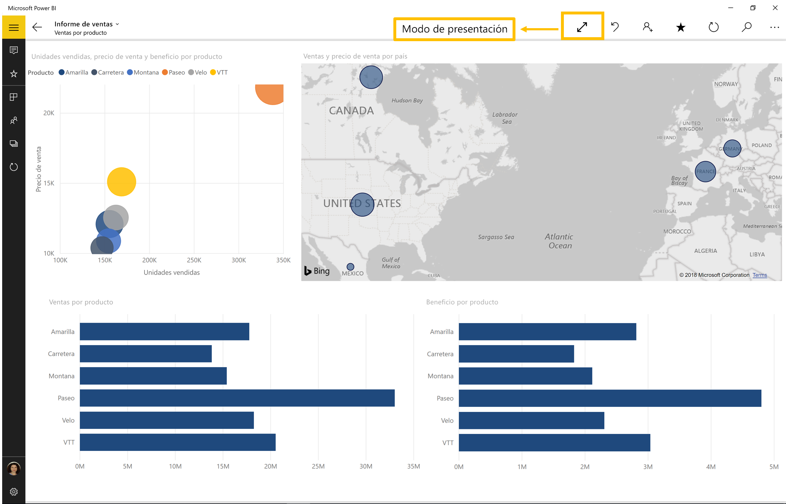

# Visualización de informes y paneles en modo de presentación en Surface Hub y dispositivos Windows 10
Use el modo de presentación para mostrar los informes y paneles en pantalla completa en dispositivos Windows 10 y Surface Hub. 

El modo de presentación es útil para mostrar Power BI en una reunión o una conferencia, para visualizarlo en un proyector dedicado en una oficina o incluso para aprovechar al máximo el espacio de una pantalla pequeña. 

En el modo de presentación de la aplicación móvil de Power BI para Windows 10, se quita todo el "cromo", como las barras de navegación y de menú, para permitir que usted y los miembros de su equipo se centren en los datos del informe. Habrá disponible una barra de herramientas con acciones con la que podrá interactuar y colaborar con sus datos en el modo de presentación.

También puede [mostrar paneles e informes en el modo de pantalla completa desde el servicio Power BI](../end-user-focus.md) en la Web.

> [!NOTE]
> El modo de presentación es diferente del [modo Enfoque para los iconos](mobile-tiles-in-the-mobile-apps.md).
> 
> 

## Usar el modo de presentación
En la aplicación de Power BI para móviles, pulse el icono **Pantalla completa** para pasar a ese modo.
 El cromo de la aplicación desaparecerá y aparecerá una barra de herramientas en la parte inferior o a ambos lados de la pantalla (según el tamaño de la pantalla).

En la barra de herramientas puede realizar las siguientes acciones:

1. Pulse el icono atrás  para volver a la página anterior. Si pulsa de forma prolongada el icono, aparecerán las ventanas de ruta de navegación, lo que le permitirá ir a la carpeta que contiene su informe o panel.
2. El icono de lápiz  le permitirá elegir un color cuando utilice el lápiz de Surface para dibujar y realizar anotaciones en la página del informe. 
3. Utilice el icono de páginas  para reemplazar la página del informe que está presentando actualmente.
4. El icono de reproducción   se ocultar la barra de acciones y empezar la presentación con diapositivas, donde la aplicación se automáticamente rotar entre las páginas del informe. 
5. Pulse el icono de búsqueda  para buscar otros artefactos en Power BI.
6. Para salir del modo de presentación, pulse el icono de dos flechas enfrentadas  en la barra de herramientas.

Puede desacoplar la barra de herramientas y arrastrarla para ubicarla en cualquier lugar de la pantalla. Esto es útil en el caso de pantallas grandes en las que quiera centrarse en un área específica del informe y desee tener cerca las herramientas. Basta con colocar el dedo sobre la barra de herramientas y deslizarlo hacia el lienzo del informe.

## Pasos siguientes
* [Mostrar paneles e informes en el modo de pantalla completa desde el servicio Power BI](../end-user-focus.md)
* ¿Tiene alguna pregunta? [Pruebe a preguntar a la comunidad de Power BI](http://community.powerbi.com/)

