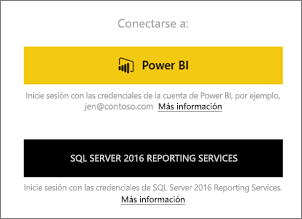
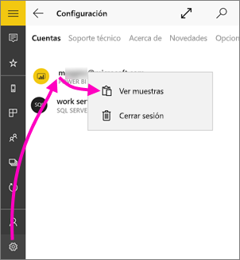
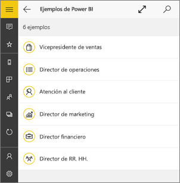
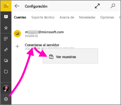
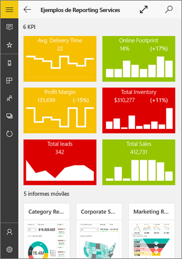
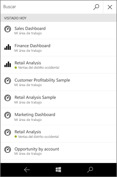
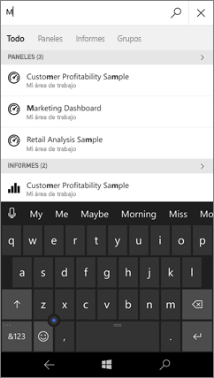
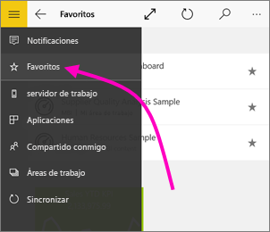
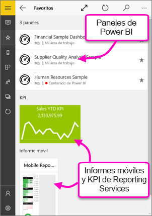

# Introducción a la aplicación móvil de Power BI para Windows 10
La aplicación móvil de Power BI para Windows 10 lleva Power BI a la tableta o el teléfono. Dispone de acceso móvil táctil y actualizado a la información de la empresa. Vea los paneles de la empresa e interactúe con ellos desde cualquier lugar, directamente en la [pantalla Inicio de Windows](mobile-pin-dashboard-start-screen-windows-10-phone-app.md).

Puede [crear paneles e informes en el servicio Power BI](../../service-get-started.md) con sus propios datos. 

Después podrá interactuar con los paneles e informes, explorar los datos y compartirlos desde la aplicación para móviles Power BI para Windows 10.

## Lo primero es lo primero
* [**Obtenga la aplicación móvil de Power BI para Windows 10**](https://go.microsoft.com/fwlink/?LinkID=526478) de la Tienda Windows.
  
  El dispositivo debe ejecutar Windows 10. La aplicación se puede ejecutar en dispositivos con al menos 3 GB de RAM y 8 GB de almacenamiento interno.
   
* Descubra las [novedades de las aplicaciones móviles de Power BI](mobile-whats-new-in-the-mobile-apps.md).

## Suscribirse al servicio Power BI en la Web
Si todavía no se ha registrado, vaya al [servicio Power BI](https://powerbi.com/). Regístrese para obtener una cuenta propia para crear y almacenar paneles e informes, y reunir los datos. Después, inicie sesión en Power BI desde el dispositivo con Windows 10 para ver los paneles desde cualquier lugar.

1. En el servicio de Power BI, pulse [Registrarse](https://go.microsoft.com/fwlink/?LinkID=513879) para crear una cuenta de Power BI.
2. Empiece a [crear sus propios informes y paneles](../../service-get-started.md).

## Introducción a la aplicación de Power BI
1. En la pantalla Inicio del dispositivo con Windows 10, abra la aplicación de Power BI.
   
   
2. Para ver los informes y paneles de Power BI, puntee **Power BI**. Inicie sesión con las mismas credenciales de su cuenta de Power BI en la Web. 
   
   Para ver los informes móviles y KPI de Reporting Services, pulse **SQL Server 2016 Reporting Services**. Inicie sesión con sus credenciales de SQL Server Reporting Services.
   
   
3. Pulse **Iniciar exploración**  para ver sus propios escritorios.

## Pruebe los ejemplos de Power BI y Reporting Services
Incluso sin registrarse, puede practicar con los ejemplos de Power BI y Reporting Services. Después de descargar la aplicación, puede ver los ejemplos o comenzar. Practique con los ejemplos siempre que lo desee desde la página principal de los paneles.

### Ejemplos de Power BI
Puede ver e interactuar con los ejemplos de paneles de Power BI. Pero hay algunas cosas que no se pueden hacer con ellos. No puede abrir los informes de los paneles, compartir los ejemplos con otros usuarios ni añadirlos a los favoritos.

1. Pulse el botón de navegación global  en la esquina superior izquierda.
2. Pulse el icono **Configuración**, luego en el nombre y en **Ver muestras**.
   
   
3. Elija un rol y explore el panel del ejemplo para ese rol.  
   
   

### Ejemplos de informes móviles de Reporting Services
1. Pulse el botón de navegación global  en la esquina superior izquierda.
2. Pulse el icono **Configuración**, haga clic con el botón derecho o pulse y mantenga pulsado **Conectarse al servidor** y luego **Ver ejemplos**.
   
   
3. Abra la carpeta Informes de venta directa o Informes de ventas para explorar los KPI e informes móviles.
   
   

## Buscar paneles, informes y aplicaciones
Para encontrar sus paneles, informes y aplicaciones rápidamente, escriba en el cuadro de búsqueda, siempre en la parte superior de la aplicación.

1. Pulse en el icono de búsqueda en la esquina superior derecha.
   
   
   
   Power BI muestra los paneles, informes y aplicaciones más recientes.
   
   
2. En cuanto comience a escribir, Power BI muestra todos los resultados pertinentes.
   
   

## Buscar contenido en las aplicaciones móviles de Power BI
Sus paneles e informes se almacenan en distintos lugares en las aplicaciones móviles de Power BI, dependiendo de su procedencia. Obtenga información sobre cómo [buscar contenido en las aplicaciones móviles](mobile-apps-quickstart-view-dashboard-report.md). Además, siempre puede buscar algo que tenga en las aplicaciones móviles de Power BI. 

## Ver los informes, KPI y paneles favoritos
Vea todos sus paneles favoritos de Power BI, junto con los informes móviles y KPI de Reporting Services, en la página Favoritos de las aplicaciones móviles. Cuando define un panel como *favorito* en la aplicación móvil de Power BI, puede tener acceso a este desde todos sus dispositivos, incluido el servicio Power BI en el explorador. 

* Pulse **Favoritos**.
  
   
  
   Todos los favoritos de Power BI y del portal web de Reporting Services se encuentran en esta página.
  
   

Obtenga más información sobre los [favoritos en las aplicaciones móviles Power BI](mobile-apps-favorites.md).

## Pasos siguientes
Estas son otras cosas que puede hacer en la aplicación de Power BI para dispositivos Windows 10 con los paneles e informes de Power BI, y con los informes móviles y KPI de Reporting Services en el portal web de Reporting Services.

### Paneles e informes de Power BI
* Ver [sus aplicaciones](../../service-create-distribute-apps.md).
* Ver sus [paneles](mobile-apps-view-dashboard.md).
* [Anclar iconos y paneles de Power BI](mobile-pin-dashboard-start-screen-windows-10-phone-app.md) a la pantalla Inicio de su dispositivo como iconos dinámicos.
* [Compartir iconos](mobile-windows-10-phone-app-get-started.md).
* Compartir [paneles](mobile-share-dashboard-from-the-mobile-apps.md).

### Informes móviles y KPI de Reporting Services
* [Ver informes móviles y KPI de Reporting Services](mobile-app-windows-10-ssrs-kpis-mobile-reports.md) en la aplicación de Power BI para dispositivos Windows 10.
* Crear [KPI en el portal web de Reporting Services](https://msdn.microsoft.com/library/mt683632.aspx).
* [Crear sus propios informes móviles con el Publicador de informes móviles de SQL Server](https://msdn.microsoft.com/library/mt652547.aspx) y publicarlos en el portal web de Reporting Services.

## Pasos siguientes
* [Descargue la aplicación Power BI](https://go.microsoft.com/fwlink/?LinkID=526478) de la Tienda Windows.  
* [¿Qué es Power BI?](../../fundamentals/power-bi-overview.md)
* ¿Tiene alguna pregunta? [Pruebe a preguntar a la comunidad de Power BI](https://community.powerbi.com/)

