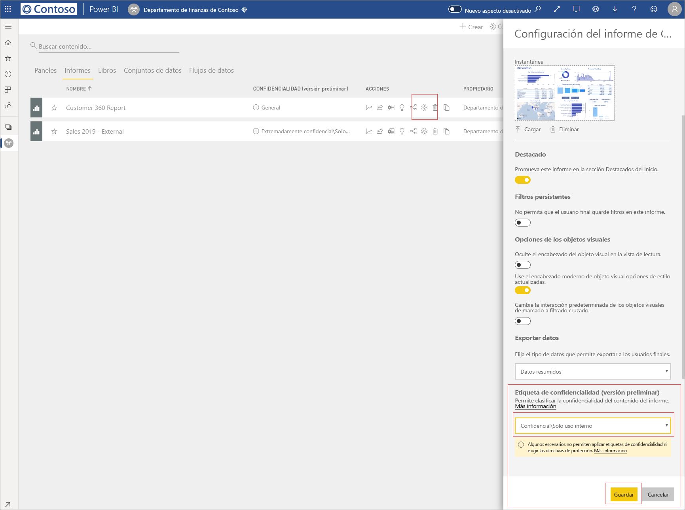
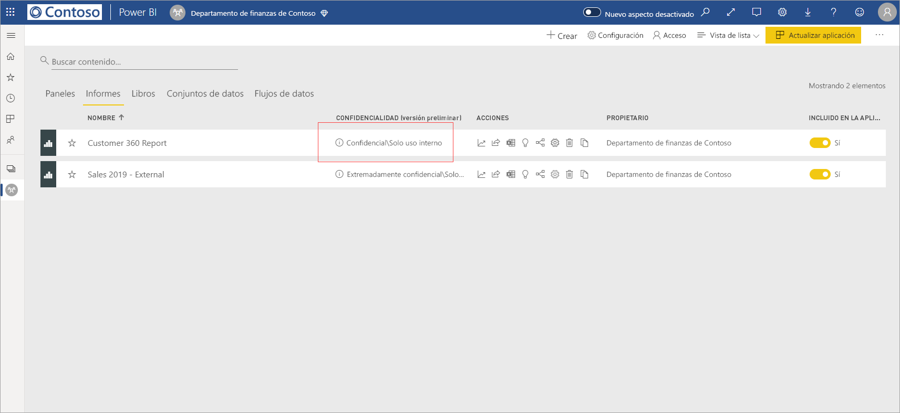
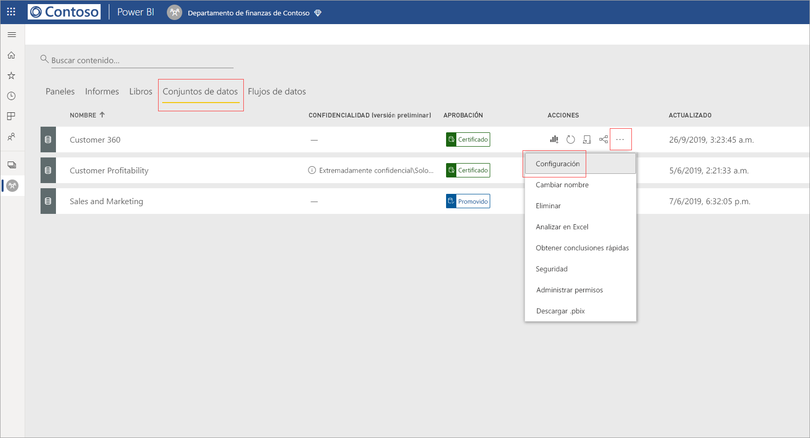
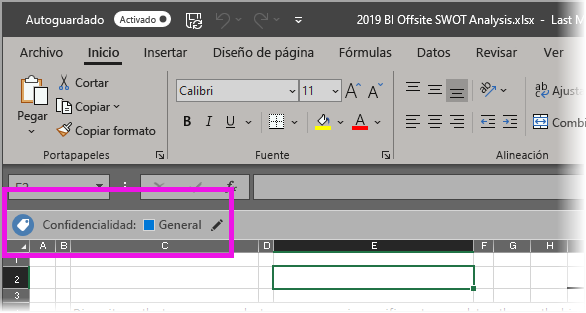

# Aplicación de etiquetas de confidencialidad de datos en Power BI (versión preliminar)

Cuando las etiquetas de confidencialidad están habilitadas en el servicio Power BI, puede proteger los paneles, informes, conjuntos de datos y flujos de datos contra el acceso no autorizado y las fugas mediante la aplicación de etiquetas de confidencialidad de datos. El etiquetado correcto de los datos con etiquetas de confidencialidad de datos garantiza que solo las personas autorizadas puedan acceder a los datos.

Cuando está habilitada la protección de datos, las etiquetas de confidencialidad aparecen en la columna Confidencialidad de la vista de lista de paneles, informes, conjuntos de datos y flujos de datos.

> [!NOTE]
> La aplicación de etiquetas de confidencialidad a paneles, informes, conjuntos de datos y flujos de datos de Power BI requiere ciertas licencias y permisos. Consulte [Aplicación de etiquetas de confidencialidad](#applying-sensitivity-labels) para más información.

## Aplicación de etiquetas de confidencialidad

Para aplicar etiquetas de confidencialidad en Power BI, usted y su organización deben cumplir los siguientes requisitos:

* La organización debe haber definido las etiquetas de confidencialidad en el [Centro de seguridad de Microsoft 365](https://security.microsoft.com/) o el [Centro de cumplimiento de Microsoft 365](https://compliance.microsoft.com/).
* Debe pertenecer a un grupo de seguridad que tenga permisos para aplicar etiquetas de confidencialidad de datos, como se describe en el artículo titulado [Habilitación de las etiquetas de confidencialidad de datos en Power BI (versión preliminar)](../admin/service-security-enable-data-sensitivity-labels.md#enable-data-sensitivity-labels).
* Debe tener una licencia de Power BI Pro y permisos de edición en los recursos que desea etiquetar. 
* Debe tener una licencia de Azure Information Protection Premium P1 o Premium P2. Microsoft Azure Information Protection se puede adquirir de forma independiente o mediante uno de los conjuntos de licencias de Microsoft. Consulte [Precios de Azure Information Protection](https://azure.microsoft.com/pricing/details/information-protection/) para más detalles.

Para aplicar o cambiar una etiqueta de confidencialidad en un informe, haga clic en el icono Configuración del informe en el elemento de lista del área de trabajo y, a continuación, vaya a la sección Confidencialidad de datos en el panel Configuración. Elija la etiqueta de confidencialidad adecuada y guarde la configuración.

La etiqueta de confidencialidad actualizada aparece en la columna Confidencialidad. 

Al aplicar o cambiar una etiqueta de confidencialidad en un panel, se sigue el mismo proceso que el descrito para los informes. 

También puede establecer etiquetas de confidencialidad en conjuntos de datos y flujos de datos. En la imagen siguiente se muestra cómo establecer una etiqueta de confidencialidad en un conjunto de datos; los pasos para los flujos de datos son similares.

Para establecer una etiqueta de confidencialidad en un conjunto de datos, seleccione la pestaña Conjuntos de datos, haga clic en los tres puntos del conjunto de datos al que desea aplicar una etiqueta y elija **Configuración**.

En la página Configuración del conjunto de datos, abra la sección Etiqueta de confidencialidad, elija la etiqueta de confidencialidad que desee y haga clic en **Aplicar**.

Al aplicar o cambiar una etiqueta de confidencialidad en un flujo de datos, se sigue el mismo proceso que el descrito para los conjuntos de datos.

## Protección de datos en archivos exportados

Al [exportar datos de un informe](https://docs.microsoft.com/power-bi/consumer/end-user-export) que tiene una etiqueta de confidencialidad, el archivo generado (Excel, PowerPoint y PDF; CSV no se admite) hereda la etiqueta de confidencialidad. La etiqueta de confidencialidad estará visible en el archivo y el acceso al archivo estará restringido a aquellos que tengan permisos suficientes.

## Consideraciones y limitaciones

La aplicación de etiquetas de confidencialidad de datos tiene las siguientes consideraciones:

* Para ver o aplicar las etiquetas de confidencialidad de Microsoft Information Protection en Power BI, es necesaria una licencia de Azure Information Protection Premium P1 o Premium P2. Microsoft Azure Information Protection se puede adquirir de forma independiente o mediante uno de los conjuntos de licencias de Microsoft. Consulte [Precios de Azure Information Protection](https://azure.microsoft.com/pricing/details/information-protection/) para más detalles.
* Las etiquetas de confidencialidad solo se pueden aplicar en paneles, informes, conjuntos de datos y flujos de datos.
* El cumplimiento de los controles de protección y las etiquetas en los archivos exportados solo se admite para los archivos de Excel, PowerPoint y PDF. La etiqueta y la protección no se aplican cuando los datos se exportan a archivos .CSV, suscripción a un correo electrónico, inserción de objetos visuales o impresión.
* Un usuario que exporta un archivo de Power BI tiene permisos para acceder al archivo y editarlo según la configuración de la etiqueta de confidencialidad. El usuario que exporta los datos no obtiene permisos de propietario en el archivo. 
* Actualmente, las etiquetas de confidencialidad no están disponibles para los [informes paginados]( https://docs.microsoft.com/power-bi/paginated-reports-report-builder-power-bi) y los libros. 
* En este momento no se puede eliminar una etiqueta de un recurso de Power BI una vez que se haya aplicado.
* Las etiquetas de confidencialidad de los recursos de Power BI solo son visibles en la lista de áreas de trabajo y en las vistas de linaje; las etiquetas no están visibles actualmente en las vistas favoritos, compartido conmigo, reciente o aplicación. Tenga en cuenta, sin embargo, que una etiqueta aplicada a un recurso de Power BI, incluso si no está visible, siempre se conservará en los datos exportados a archivos de Excel, PowerPoint y PDF.
* La *configuración de cifrado de archivos* de la etiqueta de confidencialidad, configurada en el [Centro de seguridad de Microsoft 365](https://security.microsoft.com/) o el [Centro de cumplimiento de Microsoft 365](https://compliance.microsoft.com/), se aplica solo a los archivos que son *exportados desde* Power BI; no se aplica *dentro de* Power BI.
* La [Protección HYOK](https://docs.microsoft.com/azure/information-protection/configure-adrms-restrictions) no se admite para las etiquetas aplicadas en Power BI.
* La visualización y la aplicación de etiquetas en las aplicaciones de Office tienen [requisitos de licencias](https://docs.microsoft.com/microsoft-365/compliance/sensitivity-labels-office-apps#subscription-and-licensing-requirements-for-sensitivity-labels).
* Las etiquetas de confidencialidad solo se admiten para los inquilinos en la nube global (pública). No se admiten las etiquetas de confidencialidad para los inquilinos de otras nubes.

## Pasos siguientes

En este artículo se describe cómo aplicar las etiquetas de confidencialidad de datos en Power BI. En los artículos siguientes se proporcionan más detalles acerca de la protección de datos en Power BI. 

* [Introducción a la protección de datos en Power BI](../admin/service-security-data-protection-overview.md)
* [Habilitación de etiquetas de confidencialidad de datos en Power BI](../admin/service-security-enable-data-sensitivity-labels.md)
* [Uso de controles de Microsoft Cloud App Security en Power BI](../admin/service-security-using-microsoft-cloud-app-security-controls.md)