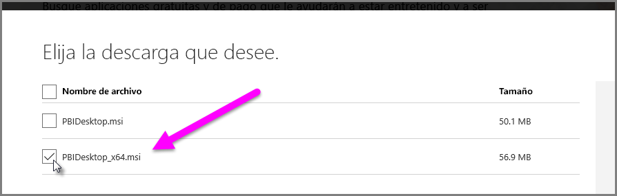

# Resolver problemas al importar archivos Access y XLS en Power BI Desktop

En Power BI Desktop, tanto las bases de datos de Access como las versiones anteriores de los libros de Excel (los archivos .XLS de Excel 97-2003) usan el *motor de base de datos de Access*. Existen tres situaciones comunes que pueden impedir que el motor de base de datos de Access funcione correctamente.

## Situación 1: no hay ningún motor de base de datos de Access instalado

Si el mensaje de error de Power BI Desktop indica que el motor de base de datos de Access no está instalado, debe instalar la versión del motor de base de datos de Access, ya sea de 32 o 64 bits, que coincida con la versión de Power BI Desktop. Puede instalar el motor de base de datos de Access desde la [página de descargas](https://www.microsoft.com/download/details.aspx?id=13255).

>[!NOTE]
>Si la versión de bits instalada del motor de base de datos de Access es diferente de la versión de bits de la instalación de Microsoft Office, las aplicaciones de Office no podrán usar el motor de base de datos de Access.

## Situación 2: la versión de bits (32 o 64 bits) del motor de base de datos de Access es diferente de la versión de bits de Power BI Desktop

A menudo esta situación se produce cuando la versión instalada de Microsoft Office es de 32 bits y la versión de Power BI Desktop instalada es de 64 bits. También puede suceder lo contrario, en cuyo caso también se produciría una discrepancia de versiones de bits. Si usa una suscripción de Office 365, consulte en la [situación 3](#situation-3-trouble-using-access-or-xls-files-with-an-office-365-subscription) un problema y una solución diferentes. Cualquiera de las siguientes soluciones puede corregir este error de diferencia de versión de bits:

### Solución 1

Cambie la versión de Power BI Desktop para que coincida con la versión de bits de la instalación de Microsoft Office. 

1. Para cambiar la versión de bits de Power BI Desktop, desinstale Power BI Desktop y, después, instale la versión de Power BI Desktop que coincida con la instalación de Office. 

1. Para seleccionar una versión de Power BI Desktop, elija **Opciones avanzadas de descarga** en la página de descarga de Power BI Desktop.
   
   
   
1. En la página de descarga que aparece, elija su idioma y, después, seleccione el botón **Descargar** . 
 
1. En la pantalla que aparece, seleccione la casilla situada junto a PBIDesktop.msi, para la versión de 32 bits, o PBIDesktop_x64.msi, para la versión de 64 bits. 

   En la siguiente captura de pantalla, aparece seleccionada la versión de 64 bits.
   
   
   
   >[!NOTE]
   >Si se usa la versión de 32 bits de Power BI Desktop, pueden producirse problemas de falta de memoria al crear modelos de datos de gran tamaño.

### Solución 2

Cambie la versión de bits de Microsoft Office para que coincida con la versión de bits de la instalación de Power BI Desktop:

1. Desinstale Microsoft Office.

2. Instale la versión de Office que coincida con la instalación de Power BI Desktop.

### Solución 3

Si el error se produce al intentar abrir un archivo .XLS (un libro de Excel 97-2003), puede evitar usar el motor de base de datos de Access si abre el archivo .XLS en Excel y lo guarda como un archivo .XLSX.

### Solución 4

Si las tres soluciones anteriores no dan resultado, es posible instalar ambas versiones del motor de base de datos de Access. Sin embargo, esta no es una solución recomendada. Si bien la instalación de ambas versiones resolverá este problema de Power Query para Excel y Power BI Desktop, causará errores y problemas en cualquier aplicación que use automáticamente (de forma predeterminada) la versión de bits del motor de base de datos de Access instalada en primer lugar. 

Para instalar ambas versiones de bits del motor de base de datos de Access, siga estos pasos:

1. Instale ambas versiones de bits del motor de base de datos de Access desde la [página de descarga](https://www.microsoft.com/download/details.aspx?id=13255). 

1. Ejecute cada versión del motor de base de datos de Access con el modificador */passive*. Por ejemplo:
   
       c:\users\joe\downloads\AccessDatabaseEngine.exe /passive
   
       c:\users\joe\downloads\AccessDatabaseEngine_x64.exe /passive

## Situación 3: Problemas para usar archivos de Access o .XLS con una suscripción a Office 365

Si usa una suscripción a Office 365, ya sea **Office 2013** u **Office 2016**, el proveedor del motor de base de datos de Access se registra en una ubicación del Registro virtual que *solo* es accesible para los procesos de Microsoft Office. Como resultado, el motor Mashup (responsable de ejecutar procesos de Excel y Power BI Desktop que no son de Office 365, y que a su vez no es un proceso de Office) no puede usar el proveedor del motor de base de datos de Access.

Para solucionar esta situación, [descargue e instale el componente redistribuible del motor de base de datos de Access](https://www.microsoft.com/download/details.aspx?id=13255) que coincida con la versión de bits de la instalación de Power BI Desktop. Para más información sobre las versiones de bits, consulte las secciones anteriores de este artículo.

## Otras situaciones que pueden provocar problemas de importación

Nos esforzamos por abarcar todos los problemas posibles que se producen con los archivos de Access o .XLS. Si encuentra un problema que no se trata en este artículo, envíe una consulta al [soporte técnico de Power BI](https://powerbi.microsoft.com/support/). Revisamos con regularidad los problemas que pueden afectar a muchos clientes y los incluimos en nuestros artículos.

