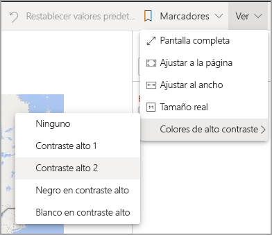
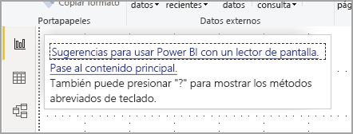
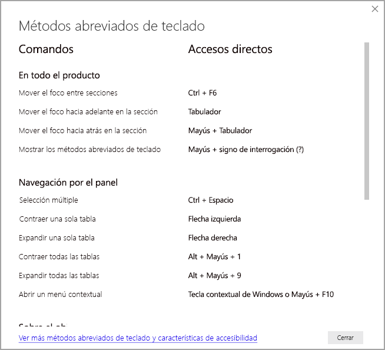
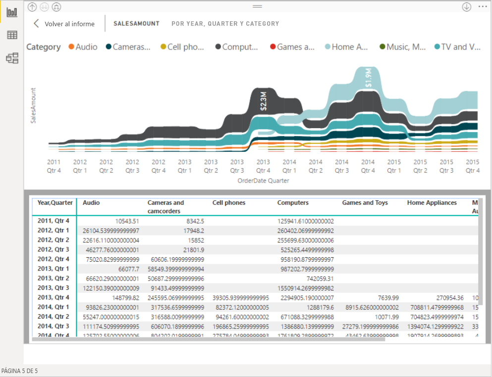

# Consumo de informes en Power BI con herramientas de accesibilidad
Power BI tiene muchas características integradas para ayudar a las personas con discapacidades a usar los informes de Power BI e interactuar con ellos más fácilmente. Estas herramientas ayudan a los usuarios a obtener la misma información de un informe que obtienen las personas que no usan la tecnología de asistencia.

Hay un par de términos que hay que conocer para leer este artículo:

* El **foco** es el lugar donde está situado el mouse en la página. El foco se suele indicar mediante un borde azul alrededor de un objeto.
* El **lienzo** es el área de la página del informe.

En las secciones siguientes se describen las herramientas de accesibilidad disponibles para consumir informes de Power BI.

## Navegación mediante el teclado

Cuando se inicia Power BI Desktop o el servicio Power BI, en cuanto se presiona la tecla **Tab**, aparece una información sobre herramientas en la esquina superior derecha. El vínculo **Sugerencias para usar Power BI con un lector de pantalla** abre este artículo y proporciona información sobre cómo consumir un informe con las herramientas de accesibilidad. Al hacer clic en el vínculo **Saltar al contenido principal**, se desplazará al lienzo del informe.

Al presionar **?** se abre un cuadro de diálogo con los métodos abreviados de teclado que se usan con más frecuencia en Power BI. Para ver una lista con todos los métodos abreviados de teclado disponibles en Power BI, vaya al vínculo situado en la parte inferior del cuadro de diálogo, que le llevará a la documentación de Power BI sobre los [métodos abreviados de teclado](desktop-accessibility-keyboard-shortcuts.md).

Puede cambiar el foco entre las pestañas de las páginas del informe o los objetos de una página determinada del informe mediante **Ctrl + F6**. Si el foco recae en una página del informe cargada, presione la tecla **Tabulador** para cambiarlo a cada objeto de la página, que incluye todos los cuadros de texto, imágenes, formas y gráficos. 

En general, usar **ENTRAR** para seleccionar o escribir y usar **ESC** para salir son comandos comunes en Power BI.

### Navegación mediante el teclado por los objetos visuales

Muchos creadores de informes de Power BI crean informes que contienen una gran cantidad de datos. Para desplazarse en los objetos visuales, puede resultar molesto tener que pulsar Tab en todos los elementos de un objeto visual. La navegación mediante el teclado por los objetos visuales se ha diseñado como una jerarquía de tres niveles. Estos tres niveles se describen en los párrafos siguientes.

Para navegar por el primer nivel, cuando se desplace a un objeto visual, presione **Ctrl + flecha derecha** para entrar en ese objeto. Una vez dentro, puede presionar **Tab** para desplazarse por las áreas principales del objeto visual. Las áreas principales que se pueden recorrer son el área de trazado de los datos, las categorías de los ejes (si es aplicable al objeto visual) y la leyenda (si el objeto visual tiene una).

El siguiente archivo .gif muestra cómo un usuario recorre el primer nivel de un objeto visual:

El segundo nivel de la jerarquía es entrar en una de las áreas principales (área de trazado de los datos, categorías del eje X, leyenda) del objeto visual. A medida que usa un informe, puede desplazarse a una de estas áreas principales y recorrer los puntos de datos o las categorías de esa sección del objeto visual. Cuando decida qué área desea explorar más, puede presionar **ENTRAR** para desplazarse por esa área concreta.

Si desea seleccionar todos los puntos de datos de una serie, vaya a la leyenda y presione **ENTRAR**. Una vez en la leyenda, puede presionar **Tab** para desplazarse por las distintas categorías de la leyenda. Presione **ENTRAR** para seleccionar una serie específica.

Si desea seleccionar puntos de datos específicos, vaya al área de trazado de los datos y presione **ENTRAR**. Una vez en el área de trazado de los datos, puede presionar **Tab** para navegar por los puntos de datos. Si el objeto visual tiene varias series, puede presionar la **flecha arriba** o la **flecha abajo** para saltar a los puntos de datos de otra serie.

Si desea seleccionar todos los puntos de datos de un eje de categorías, vaya a las etiquetas del eje y presione **ENTRAR**. Una vez en las etiquetas de los ejes, puede presionar **Tab** para desplazarse por los nombres de las etiquetas. Presione **ENTRAR** para seleccionar un nombre de etiqueta.

Si ha navegado a una capa, puede presionar **ESC** para salir de esa capa. El siguiente archivo .gif muestra cómo un usuario puede entrar y salir de los niveles de un objeto visual, y seleccionar los puntos de datos y las etiquetas de categoría del eje X, saltar a una serie diferente y seleccionar todos los puntos de datos de una serie.

Si no consigue navegar a un objeto o a un objeto visual con el teclado, puede deberse a que el autor del informe decidió ocultar ese objeto en el orden de tabulación. Los autores de los informes suelen ocultar objetos decorativos en el orden de tabulación. Si no puede moverse con la tabulación por informe de manera lógica, póngase en contacto con el autor del informe. Los autores de informes pueden establecer el orden de tabulación de los objetos y objetos visuales.

### Navegación mediante el teclado por las segmentaciones

Las segmentaciones de datos también tienen funcionalidades de accesibilidad integradas. Cuando seleccione una segmentación, use **Ctrl + flecha derecha** para desplazarse por los distintos controles dentro de la segmentación y ajustar el valor de la segmentación. Por ejemplo, cuando se presiona  **Ctrl + flecha derecha** inicialmente, el foco está en el borrador. Después, presionar la **barra espaciadora** es equivalente a hacer clic en el botón del borrador, que borra todos los valores de la segmentación.

Puede presionar la tecla **Tab** para desplazarse por los controles de una segmentación. Al presionar la tecla **Tab** cuando está en el borrador, se mueve al botón desplegable. Si vuelve a presionar **Tab**, pasa al primer valor de la segmentación (si tiene varios, como un intervalo).

### Cambiar de página

Cuando el foco recae en las pestañas de páginas de informes, use el **tabulador** o las teclas de **dirección** para cambiarlo de una página de un informe a la siguiente. El lector de pantalla lee el título de la página del informe y si está seleccionada actualmente. Para cargar la página del informe que tiene el foco actualmente, presione la tecla **ENTRAR** o la **barra espaciadora**.

### Acceder al encabezado del objeto visual
Mientras navega por los objetos visuales, puede presionar **Alt + Mayús + F10** para desplazar el foco al encabezado del objeto visual. El encabezado de objeto visual contiene varias opciones, como la ordenación, la exportación de los datos subyacentes al gráfico y el modo de enfoque. Los iconos que se ven en el encabezado del objeto visual dependerán de las opciones que haya decidido mostrar el autor del informe.

## Lector de pantalla

Al ver un informe, es mejor dejar desactivado el modo de examen. Power BI se debe tratar más como una aplicación y menos como un documento, por lo que se ha configurado con navegación personalizada para que sea más fácil moverse por él. Cuando se usa un lector de pantalla con Power BI Desktop, debe asegurarse de que el lector de pantalla esté abierto antes de abrir Power BI Desktop.

Al desplazarse por los objetos, el lector de pantalla lee el tipo de objeto y su título (si tiene uno). El lector de pantalla también lee una descripción del objeto (texto alternativo) si el autor del informe lo ha proporcionado.

### Mostrar datos
Puede presionar **Alt + Mayús + F11** para presentar una versión accesible de la ventana **Mostrar datos**. Esta ventana permite explorar los datos usados en el objeto visual en una tabla HTML, con los mismos métodos abreviados de teclado que se usan normalmente con el lector de pantalla.

La característica **Mostrar datos** es una tabla HTML que solo es accesible para un lector de pantalla con este método abreviado de teclado. Si abre **Mostrar datos** desde la opción del encabezado del objeto visual, se muestra una tabla que *no* es compatible con el lector de pantalla.  Si usa **Mostrar datos** con los métodos abreviados de teclado, active el modo de examen para aprovechar las teclas de acceso rápido que proporciona el lector de pantalla.

Para salir de la vista **Mostrar datos** y volver a un informe, presione **ESC**.

## Modos de contraste alto

El servicio Power BI intenta detectar la configuración de contraste alto seleccionada para Windows. La eficacia y precisión de esa detección dependen del explorador en el que se muestra el servicio Power BI. Si quiere establecer el tema manualmente en el servicio Power BI, puede seleccionar **Vista > Colores de alto contraste** y, después, seleccionar el tema que quiere aplicar al informe.

## Pasos siguientes

La colección de artículos sobre la accesibilidad de Power BI es la siguiente:

* [Información general sobre accesibilidad en Power BI](desktop-accessibility-overview.md) 
* [Creación de informes accesibles en Power BI](desktop-accessibility-creating-reports.md) 
* [Creación de informes de Power BI con herramientas de accesibilidad](desktop-accessibility-creating-tools.md)
* [Accesibilidad mediante métodos abreviados de teclado en informes de Power BI](desktop-accessibility-keyboard-shortcuts.md)
* [Lista de comprobación de accesibilidad de informes](desktop-accessibility-creating-reports.md#report-accessibility-checklist)

