# Creación de informes accesibles en Power BI
Puede diseñar y crear informes atractivos que también permitan la accesibilidad. Cada vez que cree un informe, con independencia de quién sea su público, debe poder usarlo el mayor número posible de personas, sin necesidad de adaptarlo con un tipo de diseño especial.

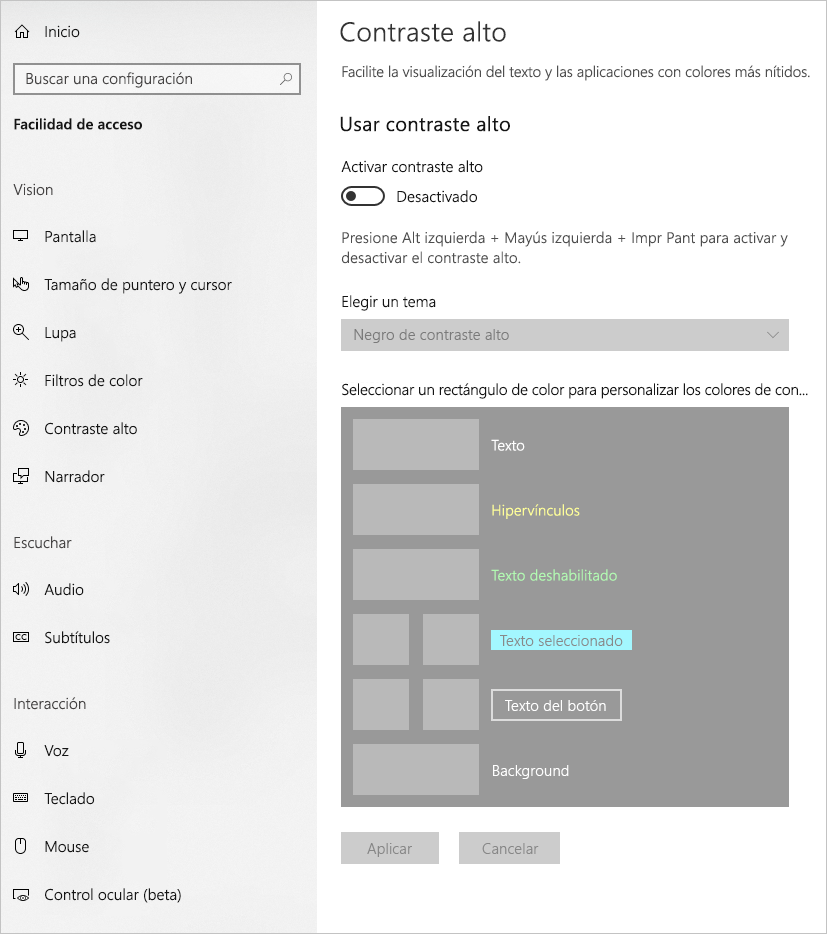

En este artículo se describen las características y las herramientas de accesibilidad para crear informes accesibles en Power BI.

Para mejorar el proceso de creación de informes con lectores de pantalla, hay un menú contextual disponible. El menú permite mover los campos de la lista **Campos** hacia arriba o hacia abajo. El menú también permite mover el campo a otras listas, como **Leyenda**, **Valor**, etc.

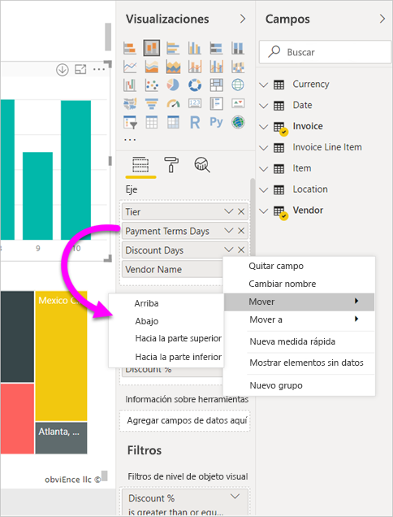

## Tipos de características de accesibilidad

Aunque Power BI ofrece funcionalidades para crear informes accesibles, es decisión suya, como autor del informe, incluirlas en ellos. En este artículo se describen tres categorías de características de accesibilidad:

* Características de accesibilidad integradas (no se requiere configuración)
* Características de accesibilidad integradas (se requiere configuración)
* Otras sugerencias y consideraciones

En las secciones siguientes se describe cada una de estas categorías.

## Características de accesibilidad integradas

Power BI presenta características de accesibilidad integradas en el producto, que no requieren ninguna configuración por parte del autor del informe. Estas características son las siguientes:

* Navegación mediante el teclado
* Compatibilidad con el lector de pantalla
* Vista de colores en contraste alto
* Modo de enfoque
* Vista de los datos en una tabla

También hay características que ayudan a la experiencia de consumo de informes. Los artículos que describen esas características se pueden encontrar en la sección [Pasos siguientes](#next-steps), al final de este artículo.

Echemos un vistazo a cada una de estas características de accesibilidad integradas. 

### Navegación mediante el teclado

Los autores de informes no tienen que preocuparse de si los consumidores pueden usar el teclado para desplazarse por un informe. Todos los objetos visuales de Power BI se pueden recorrer con el teclado y el consumidor del informe puede desplazarse por sus puntos de datos, cambiar entre las pestañas de página y tener acceso a funcionalidades interactivas, como el resaltado cruzado, el filtrado y la segmentación.

A medida que el consumidor del informe se desplaza, se muestra el foco para indicar dónde se encuentra el usuario en el informe. En función del explorador que se use, el modo de enfoque puede aparecer de manera diferente.

Para acceder a los métodos abreviados de teclado que se usan con más frecuencia, puede presionar *?* para mostrar un cuadro de diálogo de métodos abreviados de teclado. Para más información, consulte estos artículos sobre experiencias de consumo accesible y métodos abreviados de teclado en la sección [Pasos siguientes](#next-steps) al final de este artículo.

### Compatibilidad con el lector de pantalla

En general, todos los objetos de Power BI con navegación mediante el teclado también son compatibles con lectores de pantalla. Cuando el consumidor de un informe se desplaza hasta un objeto visual, el lector de pantalla leerá el título, el tipo de objeto visual y cualquier texto alternativo que se haya establecido.

### Vista de colores en contraste alto

Power BI incluye compatibilidad con contraste alto en los informes. Si usa un modo de contraste alto en Windows, Power BI Desktop detecta automáticamente qué tema de contraste alto se está usando en Windows y aplica esa configuración a los informes. Esos colores de contraste alto permanecen en el informe cuando se publica en el servicio Power BI o en otra parte.

El servicio Power BI también intenta detectar la configuración de contraste alto seleccionada para Windows, pero el grado de eficacia y de precisión de esa detección dependerá del explorador usado en el servicio Power BI. Si quiere establecer el tema manualmente en el servicio Power BI, puede seleccionar **Vista > Colores de alto contraste** en la esquina superior derecha y, después, el tema que quiere aplicar al informe.

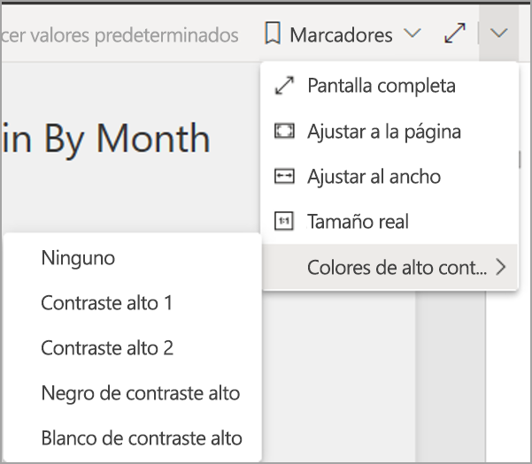

### Modo de enfoque
Si el consumidor de un informe examina un objeto visual de un panel, puede expandirlo para llenar más la pantalla; para ello, debe ir al menú contextual del objeto visual y seleccionar **Abrir en modo enfoque**.

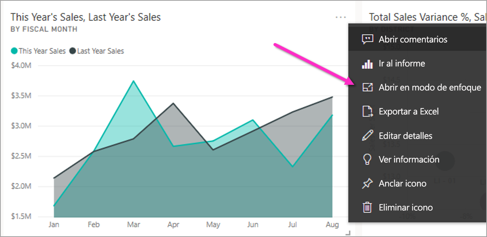

### Vista de los datos en una tabla
Los consumidores del informe también pueden ver los datos de un objeto visual en formato de tabla mediante **Alt+Mayús+F11**. Esta tabla es similar a presionar **Mostrar datos** en el menú contextual del objeto visual, pero la tabla es fácil de usar para el lector de pantalla.

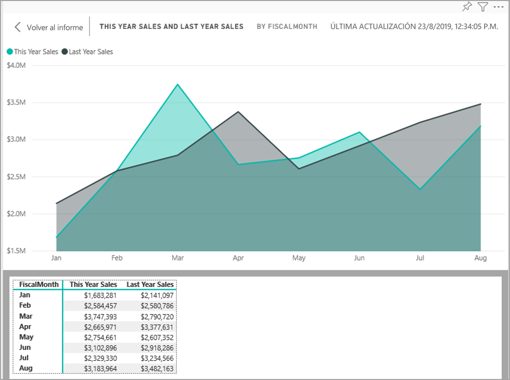

## Características de accesibilidad integradas que requieren configuración

Power BI presenta características de accesibilidad que están integradas en el producto y que el autor del informe debe configurar.  Estas características son:

* Texto alternativo
* Orden de tabulación
* Títulos y etiquetas
* Marcadores
* Temas de informes

## Texto alternativo

El texto alternativo (descripciones de texto alternativo) se usa para describir la apariencia y la función de los objetos visuales y de las imágenes de la página del informe para los usuarios del lector de pantalla. Los autores de informes deben agregar texto alternativo a cada objeto de un informe que transmita información significativa. De esta forma, se garantiza que los usuarios del informe entienden lo que se trata de comunicar con un objeto visual, incluso aunque no puedan ver el objeto visual, la imagen, la forma o el cuadro de texto. Para proporcionar texto alternativo para cualquier objeto de un informe de Power BI Desktop, seleccione el objeto (como un objeto visual, una forma, etc.) y, en el panel **Visualizaciones**, seleccione la sección **Formato**, expanda **General**, desplácese hacia abajo y rellene el cuadro de texto **Texto alternativo**. El cuadro de texto **Texto alternativo** tiene un límite de 250 caracteres.

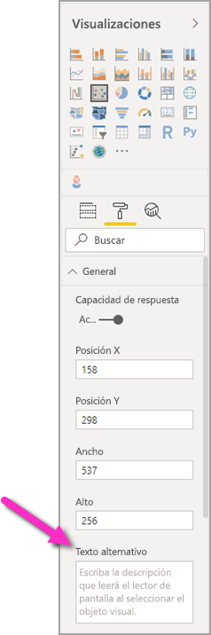

El texto alternativo debe incluir información sobre las conclusiones que quiere que el consumidor de un informe extraiga de un objeto visual. Dado que un lector de pantalla lee el título y el tipo de un objeto visual, solo tiene que rellenar una descripción. Un ejemplo de texto alternativo para el siguiente objeto visual podría ser: *Satisfacción neta del usuario por color de producto vendido, desglosada además por clase de producto.*

Tenga en cuenta que incluir texto alternativo estático en la llamada a conclusiones o puntos de datos específicos no sea lo más adecuado, ya que los datos de Power BI son dinámicos. Si quiere usar texto alternativo dinámico, consulte la siguiente sección donde se describe el formato condicional del texto alternativo.

### Formato condicional del texto alternativo

Una característica que hace que Power BI sea tan atractivo es que sus datos son dinámicos. Puede usar medidas DAX y formato condicional para crear texto alternativo dinámico. Los lectores de pantalla pueden llamar a valores específicos de los datos que ve el consumidor de un informe.

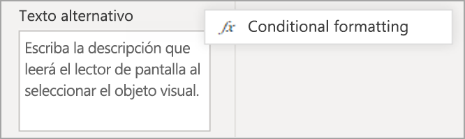

### Orden de tabulación
Definir el orden de tabulación ayuda a los usuarios del teclado a desplazarse por el informe en un orden que coincida con la forma en que los usuarios procesan visualmente los objetos visuales del informe. Si va a incluir formas e imágenes decorativas en el informe, debe quitarlas del orden de tabulación. 

Para establecer el orden de tabulación, seleccione la pestaña **Ver** de la cinta de opciones y seleccione el botón **Panel de selección** para mostrar el panel Selección.

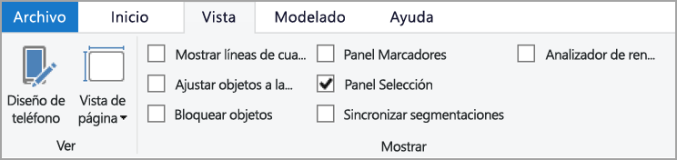

En el panel **Selección**, al seleccionar **Orden de tabulación** se muestra el orden de tabulación actual del informe. Puede seleccionar un objeto y, luego, usar los botones de flecha arriba y abajo para moverlo en la jerarquía; o puede seleccionar un objeto con el mouse y arrastrarlo a la posición en la que desea que se muestre en la lista. Al hacer clic en el número situado junto a un objeto, se oculta el objeto del orden de tabulación.

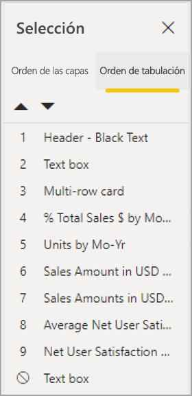

### Títulos y etiquetas
Los títulos de página de informes y objetos visuales son características de accesibilidad importantes que orientan al consumidor del informe. Evite el uso de acrónimos o jerga en los títulos de los informes; si comparte el informe con un nuevo usuario o con alguien externo a su organización, es posible que no sepa lo que significan. En la imagen siguiente se muestra un objeto visual con un acrónimo en el título (a la izquierda) y un título más claro del objeto visual a la derecha.

Dentro de un objeto visual, asegúrese de que los títulos, las etiquetas de los ejes, los valores de leyenda y las etiquetas de datos sean fáciles de leer y comprender. Compare las siguientes imágenes: la primera tiene pocos números o descripciones de los datos, mientras que la segunda tiene muchos.

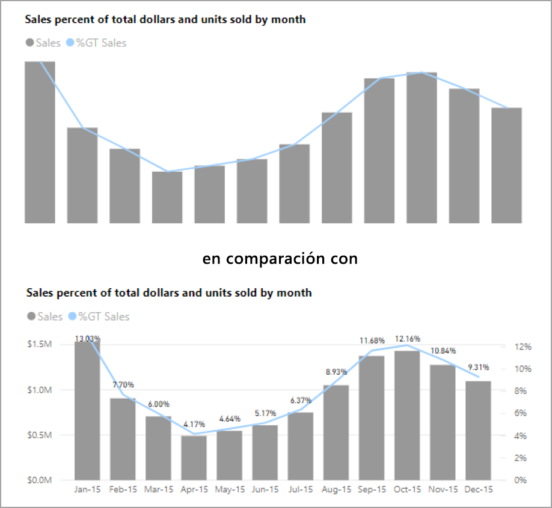

Con las etiquetas de datos, puede elegir incluso activar o desactivar las etiquetas de cada serie del objeto visual o situarlas encima o debajo de una serie. Aunque Power BI hace lo posible por colocar las etiquetas de datos encima o debajo de una línea, en ocasiones no está muy claro. En el siguiente objeto visual, las etiquetas de datos se mezclan y no son fáciles de leer.

Colocar las etiquetas de datos encima o debajo de la serie puede ayudar, sobre todo si usa un gráfico de líneas con varias líneas. Con unos cuantos ajustes, las etiquetas de datos ahora tienen un mejor aspecto.

### Marcadores

Se recomienda evitar el uso de colores (incluido el formato condicional de características) como única forma de transmitir información. En su lugar, puede usar marcadores para transmitir series diferentes.

Para los objetos visuales Línea, Área y Combinado, al igual que para Dispersión y Burbuja, puede activar los marcadores y usar una forma de marcador distinta para cada línea.

Para activar los marcadores, seleccione la sección Formato de la página Visualizaciones, expanda la sección **Formas**, luego desplácese hasta encontrar la opción de alternancia **Mostrar marcadores** y deslícela a **Activado**, como se muestra en la imagen siguiente. 

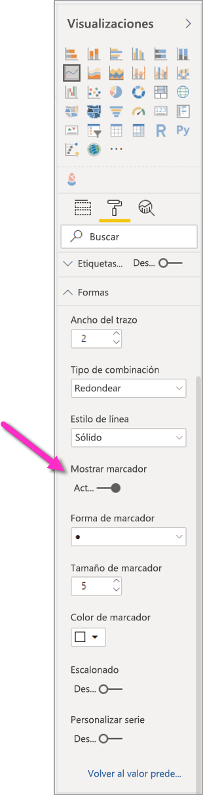

También puede usar **Personalizar serie** para seleccionar el nombre de cada línea (o área, si usa un gráfico de áreas) del cuadro desplegable de la sección Formas. Debajo de la lista desplegable, puede ajustar muchos aspectos del marcador utilizado para la línea seleccionada, entre otros, su forma, color y tamaño.

Aunque se recomienda que los autores de informes activen etiquetas de datos y marcadores, tenerlos todos activarlos en cada objeto visual puede ser molesto y hacer que el informe sea menos accesible. En la imagen siguiente, puede comparar un objeto visual que tenga activados etiquetas de datos y marcadores y, luego, una versión más comprensible con las etiquetas de datos desactivadas.

Si no está seguro de si el objeto visual o el informe están demasiado llenos, haga una [prueba con los ojos entrecerrados](https://chrome.google.com/webstore/detail/the-squint-test/gppnipfbappicilfniaimcnagbpfflpg) para comprobarlo.  Si los ojos se dirigen más a las etiquetas de datos que a los puntos de datos, desactive las etiquetas de datos.

### Temas, contraste y colores para personas daltónicas

Asegúrese de que los informes tengan suficiente contraste entre los colores del texto y del fondo. El criterio de éxito 1.4.3 de WCAG 2.1 determina que el color del texto y del fondo debe tener una relación de contraste de al menos 4.5:1. Hay varias herramientas como [Color Contrast Analyzer](https://developer.paciellogroup.com/resources/contrastanalyser/), [WebAIM](https://webaim.org/resources/contrastchecker/) y [Accessible Colors](https://accessible-colors.com/) que se pueden usar para comprobar los colores del informe.

También debe tener en cuenta que algunos usuarios de informes pueden tener deficiencias visuales de los colores. Herramientas como [Coblis](https://www.color-blindness.com/coblis-color-blindness-simulator/) y [Vischeck](https://www.vischeck.com/vischeck/vischeckImage.php) simulan lo que ven los usuarios de informes con distintas deficiencias de color.  El uso de menos colores o de una paleta monocroma en el informe puede ayudar a reducir la creación de informes que sean inaccesibles.

Algunas combinaciones de colores son especialmente difíciles de distinguir para los usuarios con deficiencias visuales de los colores. Entre ellas se incluyen las siguientes combinaciones: 

* verde y rojo
* verde y marrón
* azul y púrpura
* verde y azul
* verde claro y amarillo
* azul y gris
* verde y gris
* verde y negro

Evite el uso de estos colores juntos en un gráfico o en la misma página del informe. Aunque Power BI tiene algunos temas integrados que contribuyen a que el informe sea más accesible, se recomienda comprobar el informe con algunas de las herramientas adicionales sugeridas en este artículo.

## Sugerencias y consideraciones
En esta sección se proporcionan instrucciones, sugerencias y consideraciones que se deben tener en cuenta a la hora de crear informes con la mente puesta en la accesibilidad.

### Comprensión de lo que desea la audiencia

La creación de un informe es un proceso iterativo. Antes de empezar a colocar objetos visuales en la página, hable con algunos de los consumidores del informe para conocer mejor la información que desean obtener de él y cómo quieren verla.  

Parte de este proceso debe ser la creación basada en la accesibilidad. Es posible que descubra que su visión no es lo que tienen en cuenta los consumidores del informe. Cuando haya preparado un borrador inicial del informe, muéstreselo a uno de sus consumidores y recopile más comentarios. Para los autores de informes, la recopilación de comentarios puede ayudar a reducir la avalancha futura de solicitudes de cambios por parte de consumidores de informes insatisfechos.

### Informes sencillos y coherentes

El informe debe ser lo más sencillo posible. Con frecuencia, las personas intentan colocar demasiado contenido en un solo objeto visual. Así que dividirlo en varios objetos visuales hace que sea más sencillo y fácil de comprender. Considere la posibilidad de emplear varios objetos visuales si muestran diferentes facetas de los datos y usar filtros o interacciones visuales para crear una experiencia enriquecida. Al mismo tiempo, reduzca al mínimo el número de objetos visuales en una página. Intente evitar redundancia innecesaria y desorden en las páginas. No se necesitan dos objetos visuales para mostrar lo mismo. Los consumidores de informes pueden sobrecargarse de toda la información que proporcionan demasiados objetos visuales, o bien pueden tener una capacidad de atención limitada y distraerse. Como resultado, no solo el informe es más difícil de consumir, sino que al tener demasiados objetos visuales en una página también se ralentiza su rendimiento.

Mantenga el mismo color de fuente y estilo en los elementos de los objetos visuales del informe para dotarlo de coherencia. Use el mismo tamaño de fuente en todos los títulos de objetos visuales, igual que haría con los títulos de los ejes y las etiquetas de datos. Si usa segmentaciones en varias páginas del informe, guárdelas en la misma ubicación en cada una de estas páginas.

### Prueba de deficiencia visual

Una forma rápida de probar cuál será la apariencia de un informe para los consumidores con deficiencia visual sería reducir el brillo de la pantalla o del dispositivo móvil.  Hay complementos del explorador que puede usar que le ayudarán a realizar una prueba con los ojos entrecerrados.

## Lista de comprobación de accesibilidad de informes

Además de proporcionar herramientas y funcionalidades de accesibilidad, Power BI ofrece la siguiente lista de comprobación que puede usar al crear informes. Esta lista de comprobación ayuda a garantizar que los informes son accesibles y están disponibles para el público más amplio antes de publicarlos. 

### Todos los objetos visuales

* Asegúrese de que el contraste de color entre el texto y el fondo del título, la etiqueta del eje y la etiqueta de datos sea al menos 4.5:1.
* Evite usar el color como el único medio de transmitir información. Utilice texto o iconos como complemento al color o para reemplazarlo.
* Reemplace jerga o acrónimos innecesarios.
* Asegúrese de agregar **texto alternativo** a todos los objetos visuales no decorativos de la página.
* Compruebe que la página del informe funciona para los usuarios con deficiencias visuales de los colores.

### Segmentaciones
* Si tiene una colección de varias segmentaciones en las páginas del informe, asegúrese de que el diseño sea coherente en todas las páginas. En la medida de lo posible, use la misma fuente, colores y posición espacial.

### Cuadro de texto
* Asegúrese de que el contraste de color entre la fuente y el fondo sea al menos 4.5:1.
* Asegúrese de colocar contenido de texto del cuadro de **texto alternativo** para que los lectores de pantalla puedan leerlo.

### Interacciones de objetos visuales
* ¿La información clave solo es accesible a través de una interacción? Si es así, reorganice los objetos visuales para que se filtren previamente de forma que la conclusión importante sea más obvia.
* ¿Usa marcadores para la navegación? Intente desplazarse por el informe con un teclado para asegurarse de que la experiencia sea aceptable para los usuarios que solo emplean teclado.

### Criterio de ordenación
* ¿Ha establecido de forma intencionada el criterio de ordenación de cada objeto visual de la página? La tabla accesible **Mostrar datos** muestra los datos en el criterio de ordenación que ha establecido en el objeto visual.

### Información sobre herramientas
* No use información sobre herramientas para transmitir información importante. Los usuarios con problemas motores y los usuarios que no usan un mouse tendrán dificultades para acceder a ella.
* Agregue información sobre herramientas a los gráficos como información auxiliar. Se incluye en la tabla accesible **Mostrar datos** para cada uno de los objetos visuales.

### Vídeo
* Evite el vídeo que se inicia automáticamente cuando se representa la página.
* Asegúrese de que el vídeo tenga subtítulos o que proporcione una transcripción.

### Audio
* Evite el audio que se inicia automáticamente cuando se representa la página.
* Proporcione una transcripción para el audio.

### Formas
* Asegúrese de que las formas decorativas estén marcadas como ocultas en el orden de tabulación, para que el lector de pantalla no las anuncie.
* Evite el uso de demasiadas formas decorativas hasta el punto que terminen por distraer.
* Al usar formas para llamar a puntos de datos, utilice **texto alternativo** para explicarlo.

### Imágenes
* Cuando se usen imágenes para llamar a puntos de datos, utilice **texto alternativo** para explicarlo.
* Asegúrese de que las imágenes decorativas estén marcadas como ocultas en el orden de tabulación, para que el lector de pantalla no las anuncie.
* Evite el uso de demasiadas imágenes decorativas hasta el punto que terminen por distraer.

### Objetos visuales personalizados
* Compruebe la tabla accesible **Mostrar datos** para los objetos visuales personalizados. Si la información que se muestra no es suficiente, busque otro objeto visual.
* Si usa el objeto visual personalizado *Eje de reproducción*, asegúrese de que no se reproduzca automáticamente. Deje claro que el usuario debe presionar el botón de reproducción o pausa para iniciar o detener los valores cambiantes.

### En los objetos visuales de la página
* Establezca el orden de tabulación y desactívelo (marque el elemento como oculto) en los elementos decorativos.

## Consideraciones y limitaciones
Hay algunos problemas y limitaciones conocidos con las características de accesibilidad. En la lista siguiente se incluyen las descripciones de esos problemas y limitaciones:

* Cuando se usan lectores de pantalla con **Power BI Desktop**, se obtiene una experiencia óptima si se abre el lector de pantalla antes de abrir cualquier archivo en **Power BI Desktop**.

## Pasos siguientes

La colección de artículos sobre la accesibilidad de Power BI es la siguiente:

* [Información general sobre accesibilidad en Power BI](desktop-accessibility-overview.md) 
* [Consumo de informes de Power BI con herramientas de accesibilidad](desktop-accessibility-consuming-tools.md)
* [Creación de informes de Power BI con herramientas de accesibilidad](desktop-accessibility-creating-tools.md)
* [Accesibilidad mediante métodos abreviados de teclado en informes de Power BI](desktop-accessibility-keyboard-shortcuts.md)
* [Lista de comprobación de accesibilidad de informes](#report-accessibility-checklist)
