# Creación de informes en Power BI mediante herramientas de accesibilidad

Para los creadores de informes que usan herramientas de accesibilidad para crear informes, Power BI tiene muchas funcionalidades integradas que pueden ayudar en el proceso.

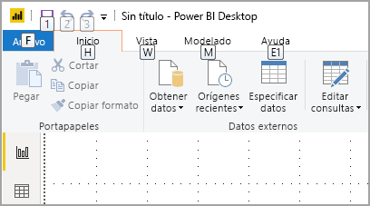

En este artículo se describen los numerosos tipos de herramientas de accesibilidad disponibles para los creadores de informes en Power BI Desktop.

## Navegación en el nivel de la aplicación
Cuando recorre Power BI Desktop, puede desplazar el foco a las áreas principales de la aplicación presionando **Ctrl + F6**. Este desplazamiento en el área principal de Power BI Desktop se realiza en el siguiente orden:

1. Objetos en lienzos
2. Pestañas de página
3. Paneles (cada uno por separado, de izquierda a derecha para los que estén abiertos)
4. Navegador de vistas
5. Pie de página
6. Iniciar sesión
7. Barra amarilla de advertencias/errores/actualizaciones

En Power BI se usa normalmente la tecla **ENTRAR** para seleccionar o entrar en un área, y la tecla **Esc** para salir.

## Navegación mediante la cinta de opciones

Presione **Alt** para ver las pequeñas casillas denominadas *KeyTips* que aparecen encima de cada comando disponible de la vista actual de la cinta. Después, presione la letra que aparece en la *KeyTip* cuando mantiene el puntero sobre el comando que desea usar. 

Por ejemplo, en la siguiente imagen se ha pulsado la tecla **Alt** para que aparezcan las KeyTips que contienen las letras de los siguientes comandos de accesibilidad. Si después presiona **M** se abrirá la pestaña **Modelado** en la cinta.

Según la letra que presione, podrían aparecer KeyTips adicionales. Por ejemplo, si la pestaña **Inicio** está activa y presiona **W**, aparece la pestaña **Vista** junto con las KeyTips de los grupos de la pestaña **Vista** de la cinta de opciones. Puede continuar presionando las letras que aparecen en las KeyTips hasta que presione la letra del comando específico que desea usar. Para ir al conjunto anterior de KeyTips, presione **Esc**. Para cancelar la acción que iba a realizar y ocultar las KeyTips, presione la tecla **Alt**.

## Navegación por el panel visual

Para navegar por el panel **Visualizaciones**, primero debe asegurarse de que el foco está en el panel; para ello, presione **Ctrl + F6** hasta llegar a ese panel. Cuando un usuario navega por el panel de visualizaciones, el foco se centra primero en el encabezado. Empezando desde la parte superior, el orden de las pestañas es el que aparece en la siguiente imagen:

1. El título del encabezado
2. El acento circunflejo para expandir o contraer
3. El primer icono de objeto visual

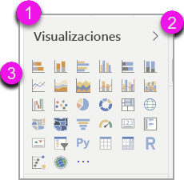

Cuando llegue a los objetos visuales, puede usar las teclas de dirección para ir a un determinado objeto visual y puede presionar **ENTRAR** para seleccionarlo. Si usa un lector de pantalla, este le indica si ha creado un nuevo gráfico y de qué tipo es, o bien le indica que ha cambiado un gráfico de un tipo determinado a otro. 

Después de la sección de objetos visuales del panel, el orden del foco cambia a los elementos dinámicos del panel, como se muestra en la siguiente imagen.

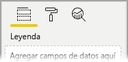

Cuando el foco está en los elementos dinámicos del panel, la tabulación aterriza solo en el icono del panel que está seleccionado. Para cambiar a otros paneles, utilice las teclas de dirección.

## Área Campos

Cuando el foco está en los elementos dinámicos del panel, como se describe en la sección anterior, si presiona de nuevo el tabulador el foco avanza al **área Campos**. 

En el **área Campos**, el orden del foco se desplaza a:

* el título de cada área (en primer lugar)
* seguido de un campo determinado de cada área (en segundo lugar)
* el botón desplegable para abrir el menú de campos (en tercer lugar)
* y, finalmente, el botón de eliminación (por último)

La siguiente imagen muestra este orden de progresión del foco.

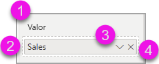

Un lector de pantalla leerá el nombre del área y su información sobre herramientas. Con cada campo de un área, el lector de pantalla leerá el nombre del campo y su información sobre herramientas. Si un área está vacía, el foco se moverá a toda el área vacía. El lector de pantalla leerá el nombre del área y la información sobre herramientas, y que está vacía.

Si el menú de campos está abierto, puede desplazarse por él mediante la tecla **TAB**, o presionando **Mayús + Tab**, o mediante las teclas de dirección **Arriba** / **Abajo**. Un lector de pantalla leerá los nombres de las opciones.

Si desea trasladar un campo de un depósito del área Campos a otro depósito, puede usar el teclado y utilizar la opción **Mover a** del menú del área Campos, tal como se muestra en la siguiente imagen.

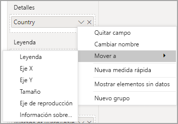

## Panel de formato

El orden del foco para el panel **Formato** se desplaza desde la parte superior hacia abajo, en el orden de la tarjeta. El foco se desplaza al nombre de la tarjeta, seguido del botón de alternancia **Activar / Desactivar**, si existe. Cuando el foco está sobre el nombre de la tarjeta, un lector de pantalla lee dicho nombre y si la tarjeta está expandida o contraída. Puede presionar **ENTRAR** para expandir o contraer la tarjeta. La tecla **ENTRAR** también sirve para **activar** o **desactivar** con el botón de alternancia.

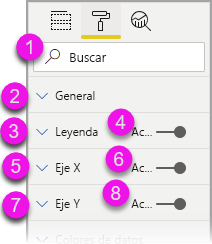

Si una tarjeta está abierta, el **tabulador** permite desplazarse por los controles de la tarjeta antes de pasar a la tarjeta siguiente. En el caso de los controles de una tarjeta, el lector de pantalla lee el título, el valor actual y el tipo de control.  

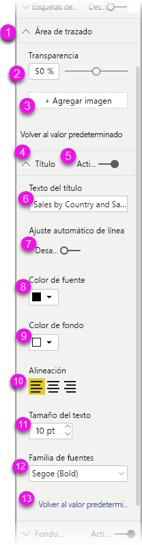

## Navegación por la lista Campos

Puede presionar la tecla **TAB** para desplazarse por la lista **Campos**. De forma similar al panel de formato, si las tablas están contraídas, el orden del foco se realiza en el orden siguiente:

1. El encabezado de la lista **Campos**
2. La barra de búsqueda
3. El nombre de cada tabla

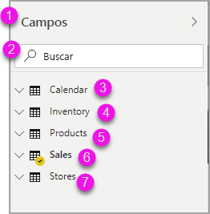

Para expandir todas las tablas del área **Campos**, presione **Alt + Mayús + 9**. Para contraer todas las tablas, presione **Alt + Mayús + 1**. Para expandir una única tabla, presione la tecla de **flecha derecha**. Para contraer una única tabla, presione la tecla de **flecha izquierda**. Al igual que con el panel Formato, si una tabla está expandida, la tabulación y la navegación a través de la lista Campos incluirá los campos que se muestran. Un lector de pantalla avisará de si ha expandido o contraído una tabla.

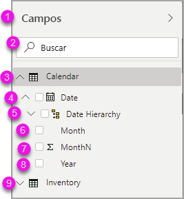

Para marcar un campo, vaya hasta el campo que desee y presione **ENTRAR**.   Un lector de pantalla indicará el campo sobre el que está el foco y si el campo está activado o desactivado.

Normalmente, los usuarios del mouse arrastran y colocan los campos en el lienzo, o en los depósitos de filtros correspondientes que deseen. Si desea usar el teclado, puede agregar un campo a un depósito de filtros; para ello, seleccione el menú contextual de campo presionando **Mayús + F10**, utilice las teclas de dirección para ir a **Agregar a filtros** y, a continuación, presione **ENTRAR** en el tipo de filtro al que desea agregar el campo.

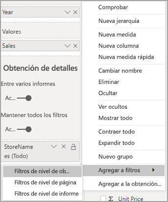

## Navegación por el panel Selección
El panel **Selección** tiene el siguiente orden de foco:

1. Título del encabezado
2. Botón Salir
3. Selector de orden de capas y pestañas
4. Botón Move up in layer (Mover hacia arriba en la capa)
5. Botón Move down in layer (Mover hacia abajo en la capa)
6. Botón Mostrar
7. Botón Ocultar
8. Objetos

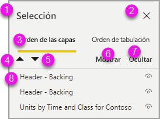

Puede desplazarse siguiendo el orden del foco y presionar **ENTRAR** para seleccionar el elemento que le interese.  

Cuando llegue al selector de orden de capas y pestañas, use las teclas de dirección izquierda y derecha para alternar entre el orden de capas y el orden de pestañas.

Cuando llegue a los objetos del panel **Selección**, presione **F6** para activar el panel **Selección**. Después de activar el panel **Selección**, puede usar las teclas de dirección arriba y abajo para desplazarse por los diferentes objetos del panel **Selección**.
Cuando llegue a un objeto de su interés, puede realizar varias acciones:

* Presionar **Ctrl + Mayús + S** para ocultar o mostrar un objeto
* Presionar **Ctrl + Mayús + F** para mover un objeto hacia arriba en el orden de capas
* Presionar **Ctrl + Mayús + B** para mover un objeto hacia abajo en el orden de capas
* Presione **Ctrl + barra espaciadora** para seleccionar varios objetos

## Cuadros de diálogo de Power BI Desktop

Todos los cuadros de diálogo de Power BI Desktop son accesibles a través de la navegación mediante el teclado y funcionan con los lectores de pantalla.

Entre los cuadros de diálogo de Power BI Desktop se incluyen los siguientes:

* Cuadro de diálogo Medida rápida
* Cuadro de diálogo Formato condicional y Barras de datos
* Cuadro de diálogo del explorador de preguntas y respuestas
* Cuadro de diálogo de introducción
* Menú Archivo y cuadro de diálogo Acerca de
* Barra de advertencia
* Cuadro de diálogo Restauración de archivos
* Cuadro de diálogo de desaprobaciones

## Compatibilidad con el contraste alto

Al usar los modos de contraste alto en Windows, esta configuración y la paleta que seleccione también se aplicarán a los informes de Power BI Desktop.

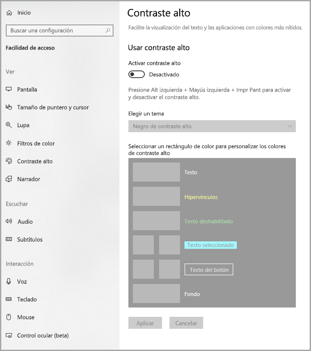

Power BI Desktop detecta de forma automática el tema de contraste alto que se usa en Windows y aplica esa configuración a los informes. Los colores de contraste alto siguen el informe a la hora de publicarlo en el servicio Power BI o en otro lugar.

## Pasos siguientes

La colección de artículos sobre la accesibilidad de Power BI es la siguiente:

* [Información general sobre accesibilidad en Power BI](desktop-accessibility-overview.md) 
* [Creación de informes accesibles en Power BI](desktop-accessibility-creating-reports.md) 
* [Consumo de informes en Power BI con herramientas de accesibilidad](desktop-accessibility-consuming-tools.md)
* [Accesibilidad mediante métodos abreviados de teclado en informes de Power BI](desktop-accessibility-keyboard-shortcuts.md)
* [Lista de comprobación de accesibilidad de informes](desktop-accessibility-creating-reports.md#report-accessibility-checklist)

