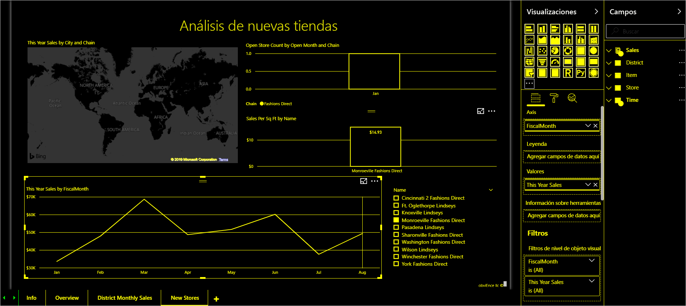

# Información general sobre accesibilidad en Power BI

Al trabajar con Power BI, tenga en cuenta los diferentes tipos de usuarios que pueden interactuar con los informes. Puede crear informes que los usuarios de lectores de pantalla o teclado puedan comprender y por los que puedan navegar con facilidad. Este tipo de informes permite a los usuarios que puedan tener dificultades visuales o físicas aprovechar todas las ventajas que ofrecen los informes.

En este artículo se proporciona información general sobre Power BI y la accesibilidad. En artículos adicionales se proporcionan instrucciones y herramientas que pueden ayudarle a crear excelentes informes desde el punto de vista de la accesibilidad.

## Diseño universal

El diseño universal es el diseño de productos que podrán usar tantas personas como sea razonablemente posible, sin necesidad de una adaptación especial o un diseño especializado. Al crear informes o experiencias en Power BI, es importante tener en cuenta las necesidades de los usuarios. El diseño de una experiencia accesible no solo beneficiará a los usuarios finales que puedan tener discapacidades auditivas, motrices, cognitivas o visuales. También puede ayudar a todos los usuarios finales de su organización. Power BI proporciona las herramientas para crear y utilizar informes accesibles. Como creador del informe, tiene la opción de usar esas herramientas para mejorar la experiencia de todos los usuarios.

## Estándares de accesibilidad

Power BI respeta los siguientes estándares de accesibilidad. Los estándares ayudan a garantizar que las experiencias con Power BI sean accesibles para tantos usuarios como sea posible. Al crear informes o paneles accesibles, ese contenido es accesible para cualquiera que lo vea mediante Power BI Mobile.

### WCAG 2.1

Las Directrices de accesibilidad a contenido web (WCAG) ayudan a que el contenido web sea accesible para usuarios con discapacidad. Los siguientes son principios clave de las directrices:

1. **Perceptible**. La información y los componentes de la interfaz de usuario se deben mostrar a los usuarios en formas que ellos puedan percibir.
2. **Ejecutable**. Los componentes de la interfaz de usuario y la navegación se deben poder ejecutar.
3. **Comprensible**. La información y el funcionamiento de la interfaz de usuario deben ser comprensibles.

### US Section 508

La norma US Section 508 es un estándar estadounidense que requiere que los organismos gubernamentales y federales garanticen la accesibilidad a sus productos electrónicos y de tecnología de la información para personas con discapacidades.

### EN 301 549

La norma EN 301 549 es el estándar europeo armonizado para los requisitos de accesibilidad de los productos y servicios de TIC.  

## Pasos siguientes

Para obtener más información sobre la accesibilidad en Power BI, vea los recursos siguientes:

* [Diseño de informes accesibles de Power BI](desktop-accessibility-creating-reports.md)
* [Uso de informes de Power BI mediante características de accesibilidad](desktop-accessibility-consuming-tools.md)
* [Creación de informes en Power BI mediante herramientas de accesibilidad](desktop-accessibility-creating-tools.md)
* [Métodos abreviados de teclado en Power BI Desktop](desktop-accessibility-keyboard-shortcuts.md)
* [Lista de comprobación de accesibilidad de informes](desktop-accessibility-creating-reports.md#report-accessibility-checklist)

