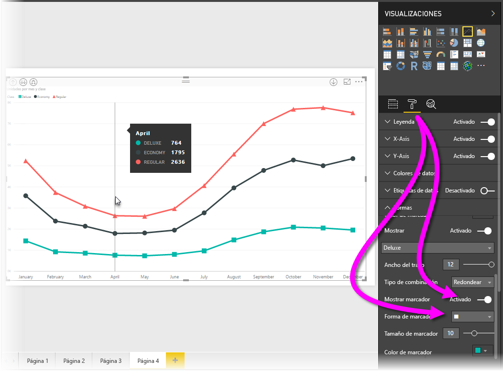
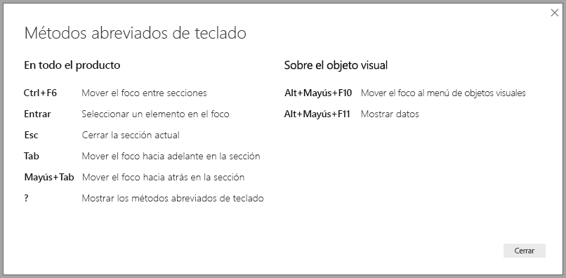
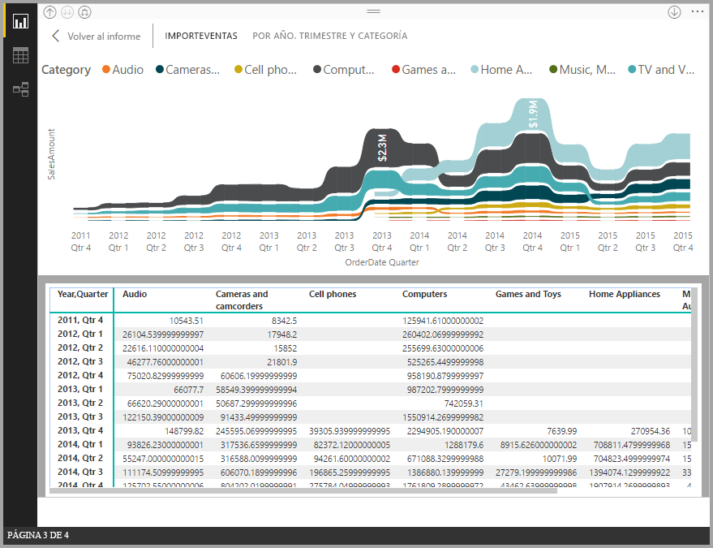
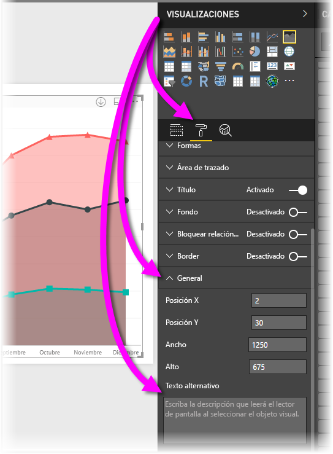

# Accesibilidad a informes de Power BI Desktop
Power BI presenta características que permiten a las personas con discapacidades usar los informes de Power BI e interactuar con ellos con más facilidad. Estas características incluyen la capacidad de interactuar con el informe mediante el teclado o un lector de pantalla, la tabulación para centrar la atención en varios objetos de una página y el uso apropiado de marcadores en las visualizaciones.

> [!NOTE]
> Estas características de accesibilidad están disponibles con la versión de **Power BI Desktop** de junio de 2017 y posteriores. También se prevé una funcionalidad de accesibilidad adicional en futuras versiones.
> 
> 

## Interactuación con un informe de Power BI Desktop mediante un teclado o un lector de pantalla
A partir de la versión de septiembre de 2017 de **Power BI Desktop**, puede presionar la tecla **?** para mostrar una ventana que describe los métodos abreviados de teclado de accesibilidad disponibles en **Power BI Desktop**.

Con las mejoras de accesibilidad, puede usar un informe de Power BI con un teclado o un lector de pantalla mediante las siguientes técnicas:

Puede cambiar el enfoque entre las pestañas de las páginas del informe o los objetos de la página de un informe determinada con las teclas **Ctrl+F6**.

* Cuando el enfoque recae en las *pestañas de páginas de informes*, use el *tabulador* o las teclas de *dirección* para cambiar el enfoque de la página de un informe a la siguiente. El lector de pantalla lee el título de la página del informe e identifica si dicha página está seleccionada actualmente. Para cargar la página del informe en la que recae el enfoque actualmente, use la tecla *ENTRAR* o la *barra espaciadora*.
* Si el enfoque recae en una *página del informe* cargada, use el *tabulador* para cambiar el enfoque a cada objeto de la página, que incluye todos los cuadros de texto, imágenes, formas y gráficos. El lector de pantalla lee el tipo de objeto, su título, si lo tiene, y una descripción de ese objeto, si el autor del informe la ha proporcionado. 

Al desplazarse entre objetos visuales, si quiere interactuar más con ellos, puede presionar **Alt + Mayús + F10** para mover el foco al encabezado visual, que contiene distintas opciones, como ordenar, exportar los datos del gráfico y el modo de enfoque. 

Puede presionar **Alt + Mayús + F11** para presentar una versión accesible de la ventana *Mostrar datos*. Esto le permite explorar los datos usados en el objeto visual de una tabla HTML con los mismos métodos abreviados de teclado que se usan normalmente con el lector de pantalla. 

> [!NOTE]
> La característica Mostrar datos solo es accesible mediante un lector de pantalla con este método abreviado de teclado. Si abre Mostrar datos con la opción del encabezado visual, no será accesible mediante un lector de pantalla.

A partir de la versión de **Power BI Desktop** de julio de 2018, las segmentaciones también tienen integrada la funcionalidad de accesibilidad. Cuando seleccione una segmentación, use CTRL+flecha derecha (tecla Control más la tecla de flecha derecha) para moverse por los distintos controles dentro de la segmentación. Por ejemplo, cuando presiona inicialmente CTRL+flecha derecha, el foco está en el borrador y presionar la barra espaciadora equivale a hacer clic en el botón del borrador, con lo que se borran todos los valores de la segmentación. 

Puede presionar la tecla TAB para desplazarse por los controles de una segmentación. Al presionar la tecla TAB cuando está en el borrador, se mueve a la parte inferior del menú desplegable; si vuelve a presionarla, pasa al primer valor de la segmentación (si hay varios valores para la segmentación, como un intervalo). 

Estas incorporaciones de accesibilidad se han creado para que los usuarios puedan aprovechar en su totalidad los informes de Power BI mediante un lector de pantalla y la navegación con el teclado.

## Sugerencias para la creación de informes accesibles
Las siguientes sugerencias pueden ayudarlo a crear informes de **Power BI Desktop** que sean más accesibles.

* Para los objetos visuales de **línea**, **área** y **combinados**, al igual que para **Dispersión** y **Burbuja** active los marcadores y use una *forma de marcador* distinta para cada línea.
  
  * Para activar los *marcadores*, seleccione la sección **Formato** en el panel **Visualizaciones** y expanda la sección **Formas**; a continuación, desplácese hacia abajo para encontrar la opción de activación/desactivación de **Marcadores** y *actívela*.
  * A continuación, seleccione el nombre de cada línea (o de área, si usa un gráfico de **área**) en el cuadro de lista desplegable de la sección **Formas**. Debajo de la lista desplegable, puede ajustar muchos aspectos del marcador utilizado para la línea seleccionada, entre otros, su forma, color y tamaño.
  
  
  
  * La utilización de una *forma de marcador* distinta para cada línea permite que los lectores del informe puedan diferenciar cada una de las líneas o áreas con más facilidad.
* Como continuación del punto anterior, no se base en el color para transmitir información. Además de usar formas en gráficos de líneas y de dispersión, no dependa del formato condicional para proporcionar información en tablas y matrices. 
* Elija un criterio de ordenación intencionado para cada objeto visual del informe. Cuando los usuarios de lectores de pantalla se desplacen por los datos del gráfico, elegirán el mismo criterio de ordenación que el del objeto visual.
* Seleccione un *tema* en la galería de temas con un alto contraste y un color apropiado para invidentes y, después, impórtelo en la [característica de versión preliminar **Temas**](desktop-report-themes.md).
* Proporcione *texto alternativo* para cada objeto de un informe. De esta forma, se asegura de que los usuarios del informe entienden lo que trata de comunicar con un objeto visual, incluso aunque ellos no puedan ver el objeto visual, la imagen, la forma o el cuadro de texto. Para proporcionar *texto alternativo* para cualquier objeto de un informe de **Power BI Desktop**, seleccione el objeto (como un objeto visual, una forma, etc.) y, en el panel **Visualizaciones**, seleccione la sección **Formato**, expanda **General**, desplácese hacia abajo y rellene el cuadro de texto **Texto alternativo**.
  
  
* Asegúrese de que los informes tengan suficiente contraste entre el texto y los colores de fondo. Hay varias herramientas, como [Colour Contrast Analyser](https://developer.paciellogroup.com/resources/contrastanalyser/), que se pueden usar para comprobar los colores del informe. 
* Use tamaños de texto y fuentes que sean fácilmente legibles. El texto o las fuentes de pequeño tamaño podrían ser difíciles de leer y poco prácticos de cara a la accesibilidad.
* Incluya un título, etiquetas de eje y etiquetas de datos en todos los objetos visuales.
* Use títulos significativos para todas las páginas del informe.
* Si es posible, evite formas e imágenes decorativas en el informe, ya que se incluyen en el orden de tabulación de este. Si necesita incluir objetos decorativos en el informe, actualice el texto alternativo de este para indicar a los usuarios de lectores de pantalla que tienen uso decorativo.

## Compatibilidad con el contraste alto en los informes

Al usar los modos de contraste alto en Windows, esta configuración y la paleta que seleccione también se aplicarán a los informes de **Power BI Desktop**. 

**Power BI Desktop** detecta automáticamente el tema de contraste alto que se usa en Windows y aplica esta configuración a los informes. Los colores de contraste alto seguirán al informe a la hora de publicarlo en el servicio Power BI o en otro lugar.

El servicio Power BI también intenta detectar la configuración de contraste alto seleccionada para Windows, pero el grado de eficacia y de precisión de esa detección dependerá del explorador usado en el servicio Power BI. Si quiere establecer el tema manualmente en el servicio Power BI, puede seleccionar **Vista > Colores de alto contraste** y, después, seleccionar el tema que quiere aplicar al informe.

Cuando esté en **Power BI Desktop** se percatará de que algunas áreas, como los campos **Visualizaciones** y **Campos**, no reflejan la selección de combinaciones de colores de contraste alto de Windows.

## Consideraciones y limitaciones
Hay algunos problemas conocidos y limitaciones con las características de accesibilidad, que se describen en la lista siguiente:

* Cuando se usan lectores de pantalla con **Power BI Desktop**, se obtiene una experiencia óptima si se abre el lector de pantalla preferido antes de abrir cualquier archivo en Power BI Desktop.
* Si usa Narrador, existen algunas limitaciones en cuanto al desplazamiento por Mostrar datos como una tabla HTML.

## Pasos siguientes
* [Uso de los temas para los informes en Power BI Desktop (versión preliminar)](desktop-report-themes.md)

