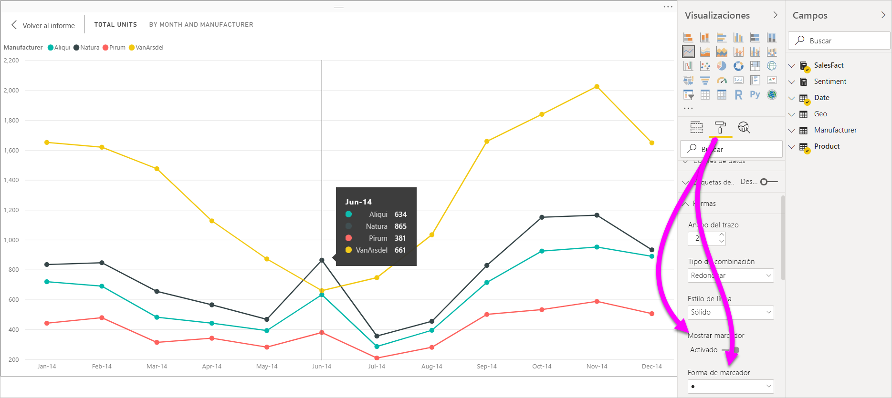
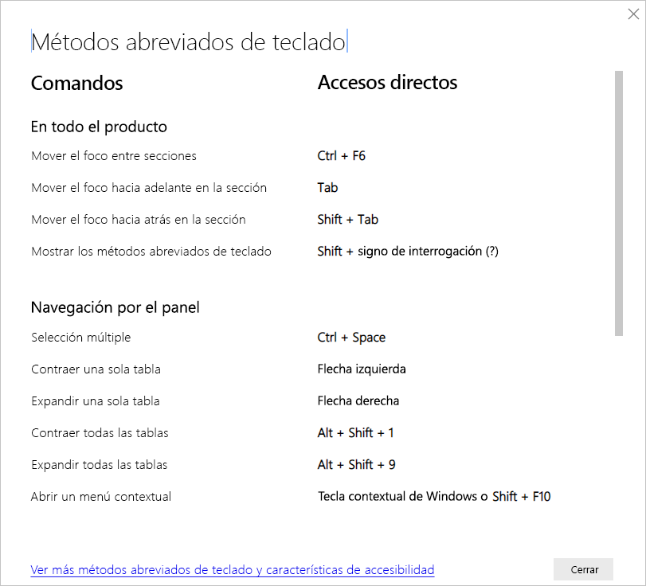
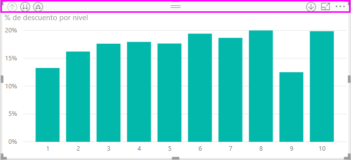
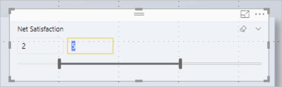
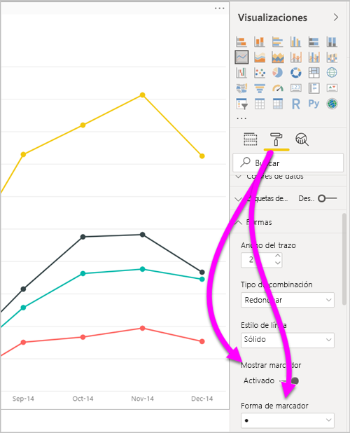
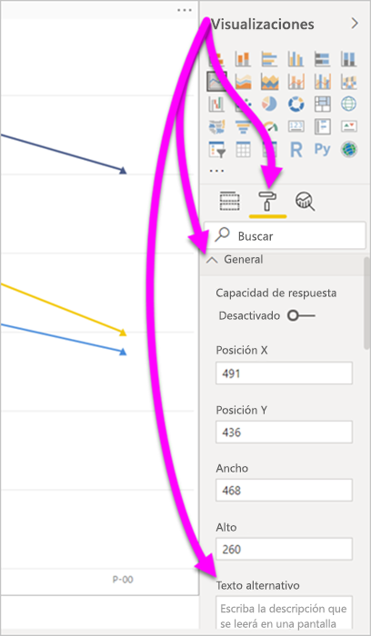
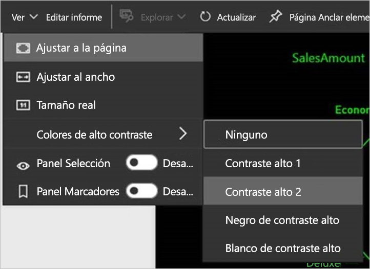

# Accesibilidad a informes de Power BI Desktop
Power BI presenta características que permiten a las personas con discapacidades usar los informes de Power BI e interactuar con ellos con más facilidad. Estas características incluyen la capacidad de interactuar con el informe mediante el teclado o un lector de pantalla, la tabulación para centrar la atención en varios objetos de una página y el uso apropiado de marcadores en las visualizaciones.

## Interactuación con un informe de Power BI Desktop mediante un teclado o un lector de pantalla
A partir de la versión de septiembre de 2017 de **Power BI Desktop**, puede presionar **Mayús + ?** para mostrar una ventana en la que se describen los métodos abreviados de teclado de accesibilidad disponibles en **Power BI Desktop**.

Con las mejoras de accesibilidad, puede usar un informe de Power BI con un teclado o un lector de pantalla mediante las siguientes técnicas:

> [!NOTE]
> Al ver un informe, normalmente el modo de examen debería estar desactivado.

Puede cambiar el foco entre las pestañas de las páginas del informe o los objetos de la página de un informe determinada mediante **Ctrl + F6**.

* Cuando el foco recae en las pestañas de páginas de informes, use el **tabulador** o las teclas de **dirección** para cambiarlo de una página de un informe a la siguiente. El lector de pantalla lee el título de la página del informe y si está seleccionada actualmente. Para cargar la página del informe en la que recae el foco actualmente, presione la tecla **Entrar** o la barra espaciadora.
* Si el foco recae en una página del informe cargada, presione la tecla **Tabulador** para cambiarlo a cada objeto de la página, que incluye todos los cuadros de texto, imágenes, formas y gráficos. El lector de pantalla lee el tipo y el título del objeto (si tiene). El lector de pantalla también lee una descripción de ese objeto si el autor del informe la ha proporcionado. 

Mientras navega por los objetos visuales, puede presionar **Alt + Mayús + F10** para desplazar el foco al encabezado del objeto visual. El encabezado de objeto visual contiene varias opciones, como la ordenación, la exportación de los datos subyacentes al gráfico y el modo de enfoque. 

Puede presionar **Alt + Mayús + F11** para presentar una versión accesible de la ventana **Mostrar datos**. Esta ventana permite explorar los datos usados en el objeto visual en una tabla HTML, con los mismos métodos abreviados de teclado que se usan normalmente con el lector de pantalla. 

> [!NOTE]
> La característica **Mostrar datos** solo es accesible para un lector de pantalla con este método abreviado de teclado. Si abre **Mostrar datos** con la opción del encabezado de objeto visual, no será accesible para un lector de pantalla. Al usar **Mostrar datos**, active el modo de examen para aprovechar las teclas de acceso rápido que proporciona el lector de pantalla.

A partir de la versión de **Power BI Desktop** de julio de 2018, las segmentaciones también tienen integrada la funcionalidad de accesibilidad. Cuando seleccione una segmentación, para ajustar su valor presione **Ctrl + flecha derecha** (tecla Control más la tecla de flecha derecha) para moverse por los distintos controles dentro de la segmentación. Por ejemplo, cuando se presiona  **Ctrl + flecha derecha** inicialmente, el foco está en el borrador. Después, presionar la barra espaciadora es equivalente a hacer clic en el botón del borrador, que borra todos los valores de la segmentación. 

Puede presionar la tecla **Tab** para desplazarse por los controles de una segmentación. Al presionar la tecla **Tab** cuando está en el borrador, se mueve al menú desplegable. Si vuelve a presionar **Tab**, pasa al primer valor de la segmentación (si tiene varios, como un intervalo). 

Estas incorporaciones de accesibilidad permiten a los usuarios aprovechar en su totalidad los informes de Power BI mediante un lector de pantalla y la navegación con el teclado.

## Sugerencias para la creación de informes accesibles
Las siguientes sugerencias pueden ayudarlo a crear informes de **Power BI Desktop** que sean más accesibles.

### Sugerencias generales para la creación de informes accesibles

* Para los objetos visuales de **línea**, **área** y **combinados**, y para **Dispersión** y **Burbuja**, active el botón de alternancia **Mostrar marcadores** y use otra **forma de marcador** para cada línea.
  
  * Para activar el botón de alternancia **Mostrar marcadores**, seleccione la sección **Formato** del panel **Visualizaciones** y expanda la sección **Formas**. Desplácese hacia abajo para localizar el botón de alternancia **Mostrar marcadores** y **actívelo**.
  * Para personalizar líneas individuales, busque el botón de alternancia **Personalizar serie** y **actívelo**. A continuación, seleccione el nombre de cada línea (o de área, si usa un gráfico de **área**) en el cuadro de lista desplegable de la sección **Formas**. Debajo de la lista desplegable, puede ajustar muchos aspectos del marcador utilizado para la línea seleccionada, entre otros, su forma, color y tamaño.
  
    
  
  * La utilización de una **forma de marcador** distinta para cada línea permite que los lectores del informe puedan diferenciar cada una de las líneas o áreas con más facilidad.
* Como continuación del punto anterior, no se base en el color para transmitir información. Al usar formas en gráficos de líneas y de dispersión, no dependa del formato condicional para proporcionar información en tablas y matrices. 
* Elija un criterio de ordenación intencionado para cada objeto visual del informe. Cuando los usuarios de lectores de pantalla se desplacen por los datos del gráfico, elige el mismo criterio de ordenación que el del objeto visual.
* En la galería de temas, seleccione un tema con un alto contraste y un color apropiado para invidentes. Impórtelo mediante la [característica de versión preliminar **Temas**](desktop-report-themes.md).
* Proporcione texto alternativo para todos los objetos de un informe. Esto garantiza que los consumidores del informe sepan lo que intenta comunicar con un objeto visual. Incluso ayuda si no pueden ver el objeto visual, la imagen, la forma o el cuadro de texto. Para proporcionar texto alternativo para cualquier objeto de un informe de **Power BI Desktop**, seleccione el objeto (como un objeto visual, una forma, etc.) y, en el panel **Visualizaciones**, seleccione la sección **Formato**. Después, expanda **General**, desplácese hacia abajo y rellene el cuadro de texto **Texto alternativo**.
  
  
  
  También se puede cambiar dinámicamente el texto alternativo con una expresión, por ejemplo, reflejando los filtros que se aplican a un objeto visual. Una expresión se establece de la misma forma que lo haría para el título de un objeto visual. [Formato condicional para títulos de objetos visuales](desktop-conditional-format-visual-titles.md)
  
* Asegúrese de que los informes tengan suficiente contraste entre el texto y los colores de fondo. Hay varias herramientas, como [Colour Contrast Analyser](https://developer.paciellogroup.com/resources/contrastanalyser/), que se pueden usar para comprobar los colores del informe. 
* Use tamaños de texto y fuentes que sean fácilmente legibles. El texto o las fuentes de pequeño tamaño podrían ser difíciles de leer y poco prácticos de cara a la accesibilidad.
* Incluya un título, etiquetas de eje y etiquetas de datos en todos los objetos visuales.
* Use títulos significativos para todas las páginas del informe.
* Si es posible, evite formas e imágenes decorativas en el informe, ya que se incluyen en el orden de tabulación de este. Si necesita incluir objetos decorativos en el informe, actualice el texto alternativo de este para indicar a los usuarios de lectores de pantalla que tienen uso decorativo.

### Organización de elementos en depósitos por Campo
A partir de la versión de octubre de 2018 de **Power BI Desktop**, se puede desplazar a la lista **Campos** con un teclado y también interactúa con los lectores de pantalla. 

Para mejorar el proceso de creación de informes con lectores de pantalla, hay un menú contextual disponible. El menú permite mover los campos de la lista **Campos** hacia arriba o hacia abajo. El menú también permite mover el campo a otras listas, como **Leyenda**, **Valor**, etc.

## Compatibilidad con el contraste alto en los informes

Al usar los modos de contraste alto en Windows, esta configuración y la paleta que seleccione también se aplicarán a los informes de **Power BI Desktop**. 

**Power BI Desktop** detecta de forma automática el tema de contraste alto que se usa en Windows y aplica esa configuración a los informes. Los colores de contraste alto siguen el informe a la hora de publicarlo en el servicio Power BI o en otro lugar.

El servicio Power BI también intenta detectar la configuración de contraste alto seleccionada para Windows. La eficacia y precisión de esa detección dependen del explorador en el que se muestra el servicio Power BI. Si quiere establecer el tema manualmente en el servicio Power BI, puede seleccionar **Vista** > **Colores de alto contraste** y después el tema que quiera aplicar al informe.

## Consideraciones y limitaciones
Hay algunos problemas y limitaciones conocidos con las características de accesibilidad. En la lista siguiente se incluyen las descripciones de esos problemas y limitaciones:

* Cuando se usan lectores de pantalla con **Power BI Desktop**, se obtiene una experiencia óptima si se abre el lector de pantalla antes de abrir cualquier archivo en **Power BI Desktop**.
* Si usa Narrador, existen algunas limitaciones relativas al desplazamiento por **Mostrar datos** como una tabla HTML.

## Métodos abreviados de teclado
Los métodos abreviados de teclado son útiles para desplazarse por los informes de Power BI mediante un teclado. En las tablas siguientes se describen los métodos abreviados disponibles en un informe de Power BI. Además de usar estos métodos abreviados de teclado en **Power BI Desktop**, también funcionan en las experiencias siguientes:

* Cuadro de diálogo **Explorador de preguntas y respuestas**
* Cuadro de diálogo **Introducción**
* Menú **Archivo** y cuadro de diálogo **Acerca de**
* Barra de **advertencia**
* Cuadro de diálogo **Restauración de archivos**
* Cuadro de diálogo de **desaprobaciones**

En nuestro continuo esfuerzo por mejorar la accesibilidad, la lista anterior de experiencias también admiten lectores de pantalla y configuración de contraste alto.

### Métodos abreviados de uso frecuente
| Para realizar esta acción           | Presione                |
| :------------------- | :------------------- |
| Mover el foco entre secciones  | **Ctrl + F6** |
| Mover el foco hacia adelante en la sección | **Tabulador**         |
| Mover el foco hacia atrás en la sección | **Mayús + Tabulador** |
| Activar o desactivar la selección de un objeto | **Entrar** o **Barra espaciadora** |
| Seleccionar varios objetos | **Ctrl + Barra espaciadora** |

### Sobre el objeto visual
| Para realizar esta acción           | Presione                |
| :------------------- | :------------------- |
| Mover el foco al menú de objetos visuales | **Alt + Mayús + F10** |
| Mostrar datos | **Alt + Mayús + F11**  |
| Especificar un objeto visual | **Ctrl + Flecha derecha** |
| Especificar una capa | **Entrar** |
| Salir de una capa o un objeto visual | **Esc** |
| Activar o desactivar la selección de un punto de datos | **Entrar** o **Barra espaciadora** |
| Selección múltiple | **Ctrl + Entrar** o **Ctrl + Barra espaciadora** |
| Clic con el botón derecho | <ul><li>Teclado de Windows: **Tecla contextual de Windows + F10**. La clave de contexto de Windows está entre la tecla Alt de la izquierda y la tecla de flecha izquierda.</li><li>Otro teclado: **Mayús + F10**</li></ul> |
| Borrar selección | **Ctrl + Mayús + C** |

### Navegación de tablas y matrices
| Para realizar esta acción          | Presione                |
| :------------------- | :------------------- |
| Subir o bajar el foco una celda (en todas las celdas de todas las áreas)  | **Tecla Flecha arriba** / **Tecla Flecha abajo** |
| Mover el foco una celda a la izquierda o la derecha (en todas las celdas de todas las áreas)  | **Tecla Flecha izquierda** / **Tecla Flecha derecha** |

### Navegación por el panel
| Para realizar esta acción           | Presione                |
| :------------------- | :------------------- |
| Selección múltiple | **Ctrl + Barra espaciadora** |
| Contraer una sola tabla | **Tecla Flecha izquierda** |
| Expandir una sola tabla | **Tecla Flecha derecha** |
| Contraer todas las tablas | **Alt + Mayús + 1** |
| Expandir todas las tablas | **Alt + Mayús + 9** |
| Abrir un menú contextual | <ul><li>Teclado de Windows: **Tecla contextual de Windows + F10**.  La clave de contexto de Windows está entre la tecla Alt de la izquierda y la tecla de flecha izquierda.</li><li>Otro teclado: **Mayús + F10**</li></ul> |

### Segmentación
| Para realizar esta acción         | Presione                |
| :------------------- | :------------------- |
| Interactuar con una segmentación | **Ctrl + tecla Flecha derecha** |

### Panel Selección
| Para realizar esta acción           | Presione                |
| :------------------- | :------------------- |
| Activar panel de selección | **F6** |
| Mover un objeto hacia arriba en la disposición en capas | **Ctrl + Mayús + F** |
| Mover un objeto hacia abajo en la disposición en capas | **Ctrl + Mayús + B** |
| Ocultar o mostrar (alternar) un objeto | **Ctrl + Mayús + S** |

### Editor DAX
| Para realizar esta acción          | Presione                |
| :------------------- | :------------------- |
| Subir o bajar una línea | **Alt + tecla Flecha arriba** / **tecla Flecha abajo** |
| Copiar línea arriba o abajo | **Mayús + Alt + tecla Flecha arriba** / **tecla Flecha abajo** |
| Insertar línea debajo | **Ctrl + Entrar** |
| Insertar línea encima | **Ctrl + Mayús + Entrar** |
| Saltar al corchete correspondiente | **Ctrl + Mayús +**  \ |
| Aplicar sangría a la línea o extender la línea en el margen | **Ctrl + ]**  /  **[** |
| Insertar cursor | **Alt + clic** |
| Seleccionar la línea actual | **Ctrl + I** |
| Seleccionar todas las apariciones de la selección actual | **Ctrl + Mayús + L** |
| Seleccionar todas las apariciones de la palabra actual | **Ctrl + F2** |

### Escribir datos
| Para realizar esta acción           | Presione                |
| :------------------- | :------------------- |
| Salir de la cuadrícula editable | **Ctrl + Tab** |

## Pasos siguientes
* [Uso de los temas para los informes en Power BI Desktop (versión preliminar)](desktop-report-themes.md)

