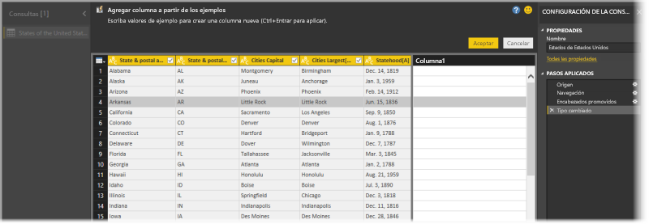
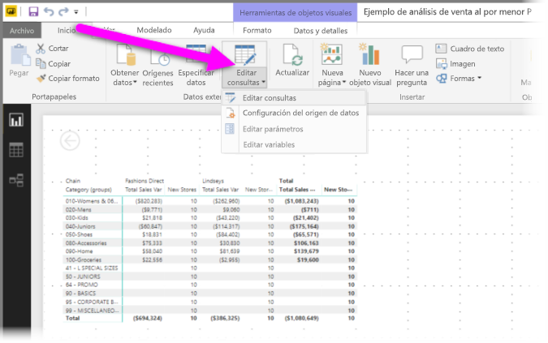
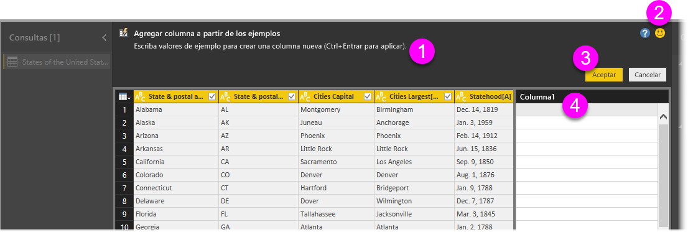
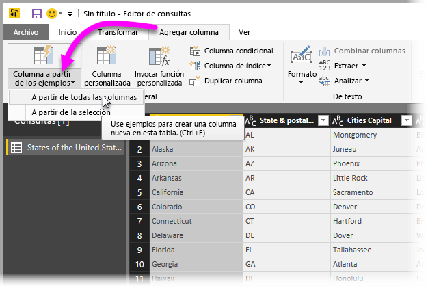
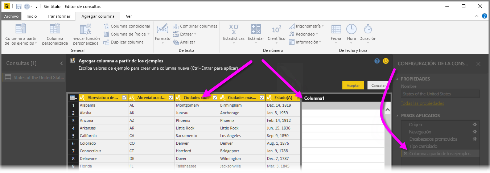
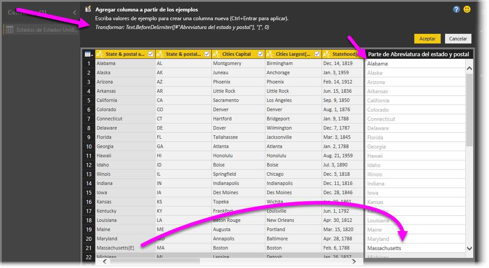

# Adición de una columna a partir de ejemplos en Power BI Desktop
Con *Agregar columna a partir de los ejemplos* en el Editor de Power Query, se pueden agregar columnas nuevas al modelo de datos simplemente proporcionando uno o más valores de ejemplo para las columnas nuevas. Se pueden crear los nuevos ejemplos de columnas a partir de una selección, o bien proporcionar entradas basadas en todas las columnas existentes en la tabla.

El uso de *Agregar columna a partir de los ejemplos* permite crear columnas nuevas de forma más rápida y sencilla, y es muy útil para estas situaciones:

- Sabe qué datos quiere tener en la columna nueva, pero no tiene la certeza de qué transformación, o colección de transformaciones, le ayudará a conseguirlo.
- Ya sabe qué transformaciones necesita, pero no sabe qué seleccionar en la interfaz de usuario para que se realicen.
- Sabe cuáles son las transformaciones que necesita gracias a una expresión *Columna personalizada* en lenguaje *M*, pero una o varias de ellas no están disponibles en la interfaz de usuario.

Agregar una columna a partir de un ejemplo es fácil y sencillo. En las secciones siguientes se muestra lo fácil que es.

## Adición de una columna nueva a partir de ejemplos

Para obtener datos de ejemplo de Wikipedia, seleccione **Obtener datos** > **Web** en la pestaña **Inicio** de la cinta de Power BI Desktop. 

Pegue la dirección URL siguiente en el cuadro de diálogo que aparece y seleccione **Aceptar**: 

*https:\//es.wikipedia.org/wiki/Anexo:Estados_y_Territorios_de_los_Estados_Unidos*

En el cuadro de diálogo **Navegador**, seleccione la tabla **Los 50 estados de los Estados Unidos** y, después, seleccione **Transformar datos**. La tabla se abre en el Editor de Power Query.

O bien, para abrir los datos ya cargados desde Power BI Desktop, seleccione **Editar consultas** en la pestaña **Inicio** de la cinta de opciones. Los datos se abren en el Editor de Power Query. 

Una vez que los datos de ejemplo se abren en Editor de Power Query, seleccione la pestaña **Agregar columna** de la cinta de opciones y, luego, **Columna a partir de los ejemplos**. Seleccione el icono **Columna a partir de los ejemplos** para crear la columna a partir de todas las columnas existentes o seleccione la flecha desplegable para elegir entre **A partir de todas las columnas** o **A partir de la selección**. En este tutorial, use **A partir de todas las columnas**.

## Panel Agregar columna a partir de los ejemplos
Al seleccionar **Agregar columna** > **A partir de los ejemplos**, se abre el panel **Agregar columna a partir de los ejemplos** en la parte superior de la tabla. La nueva **Columna 1** aparece a la derecha de las columnas existentes (puede que tenga que desplazarse para verlas todas). Al escribir los valores de ejemplo en las celdas en blanco de **Columna 1**, Power BI crea reglas y transformaciones para que coincidan con los ejemplos y las usa para rellenar el resto de la columna.

Observe que **Columna a partir de ejemplos** también aparece como **Paso aplicado** en el panel **Configuración de la consulta**. Como siempre, el Editor de Power Query registra los pasos de transformación y los aplica a la consulta en orden.

Cuando escribe el ejemplo en la nueva columna, Power BI muestra una vista previa del aspecto que tendrá el resto de la columna, en función de las transformaciones que crea. Por ejemplo, si escribe *Alabama* en la primera fila, se corresponde con el valor **Alabama** de la primera columna de la tabla. En cuanto presione Entrar, Power BI rellenará el resto de la nueva columna en función del primer valor de columna y asignará el nombre **Nombre y abreviatura postal[12]: copiar** a la columna.

Ahora, vaya a la fila **Massachusetts[E]** de la columna nueva y elimine la parte **[E]** de la cadena. Power BI detecta el cambio y usa el ejemplo para crear una transformación. Power BI describe las transformaciones del panel **Agregar columna a partir de los ejemplos** y se cambia el nombre de la columna a **Texto antes del delimitador**. 

A medida que se sigan proporcionando ejemplos, el Editor de Power Query los agregará a las transformaciones. Cuando los resultados sean los que espera, seleccione **Aceptar** para confirmar los cambios. 

Para cambiar el nombre de la nueva columna en cualquier momento, haga doble clic en el encabezado de esta o haga clic con el botón derecho y seleccione **Cambiar nombre**. 

Consulte este vídeo para ver un ejemplo práctico de **Agregar columna a partir de los ejemplos**, mediante el origen de datos de ejemplo: 

[Power BI Desktop: Agregar columna a partir de los ejemplos](https://www.youtube.com/watch?v=-ykbVW9wQfw). 

## Lista de transformaciones admitidas
Al usar **Agregar columna a partir de los ejemplos**, hay muchas transformaciones disponibles, pero no todas. La siguiente lista muestra las transformaciones admitidas:

**General**

- Columna condicional

**Referencia**
  
- Referencia a una columna específica, incluidas las transformaciones de recorte, limpieza y aplicación de mayúsculas

**Transformaciones de texto**

- Combinar (admite la combinación de cadenas literales y valores de columnas enteras)
- Sustituir
- Longitud
- Extraer   
  - Primeros caracteres
  - Últimos caracteres
  - Intervalo
  - Texto antes del delimitador
  - Texto después del delimitador
  - Texto entre delimitadores
  - Longitud
  - Quitar caracteres
  - Mantener caracteres

> [!NOTE]
> Todas las transformaciones de *texto* tienen en cuenta la posible necesidad de recortar, limpiar o aplicar una transformación de mayúsculas en el valor de columna.

**Transformaciones de fecha**

- Día
- Día de la semana
- Nombre de día de la semana
- Día del año
- Mes
- Nombre del mes
- Trimestre del año
- Semana del mes
- Semana del año
- Año
- Antigüedad
- Inicio del año
- Final del año
- Inicio del mes
- Final del mes
- Inicio del trimestre
- Días del mes
- Final del trimestre
- Inicio de la semana
- Final de la semana
- Día del mes
- Inicio del día
- Final del día

**Transformaciones de tiempo**

- Hour
- Minuto
- Second  
- A la hora local

> [!NOTE]
> Todas las transformaciones de *fecha* y *tiempo* tienen en cuenta la posible necesidad de convertir el valor de columna a *Date*, *Time* o *DateTime*.

**Transformaciones de número** 

- Valor absoluto
- Arcocoseno
- Arcoseno
- Arcotangente
- Convertir en número
- Coseno
- Cubo
- Dividir
- Exponente
- Factorial
- División de entero
- Es par
- Es impar
- Lín
- Logaritmo en base 10
- Módulo
- Multiplicar
- Redondear a la baja
- Redondear al alza
- Signo
- Seno
- Raíz cuadrada
- Cuadrado
- Restar
- Sumar
- Tangente
- Creación de depósitos y rangos

