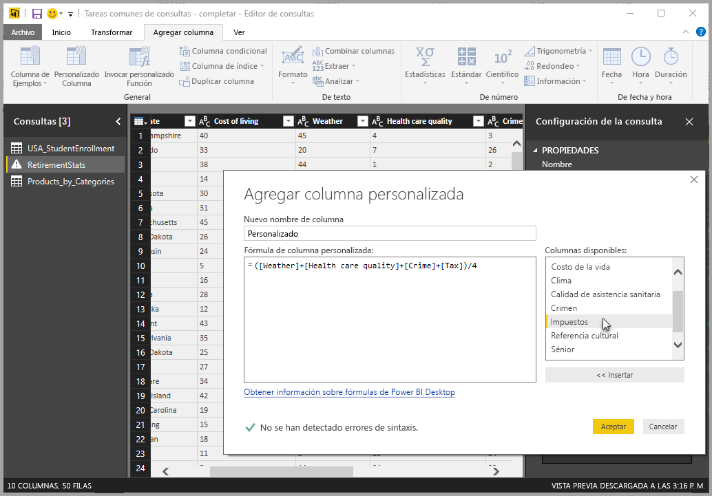
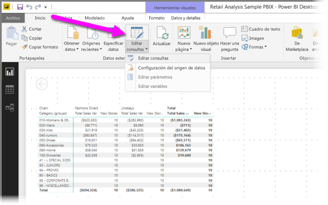
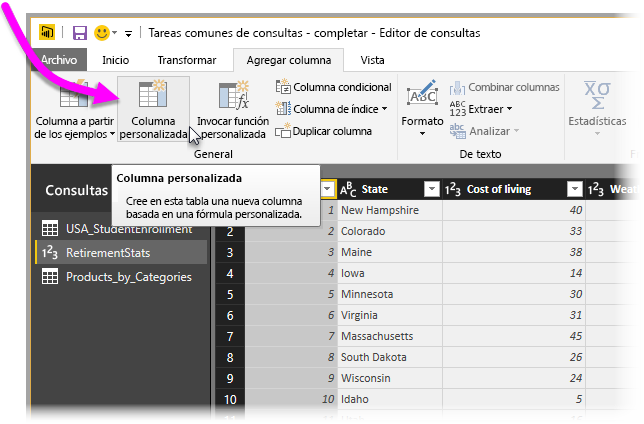
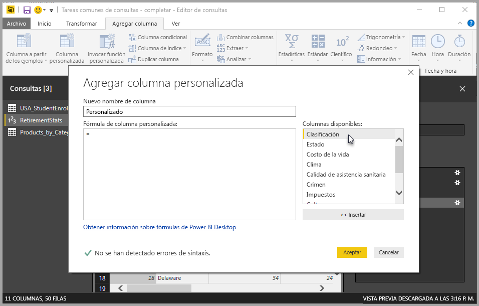
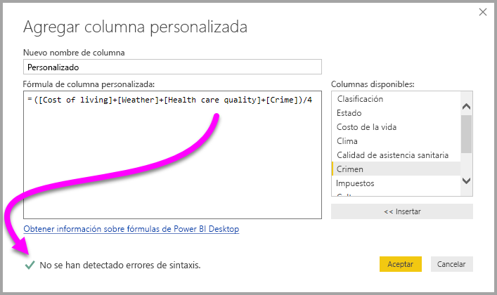
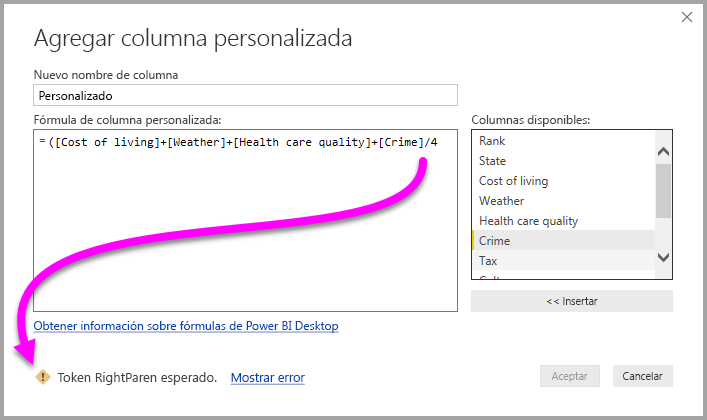
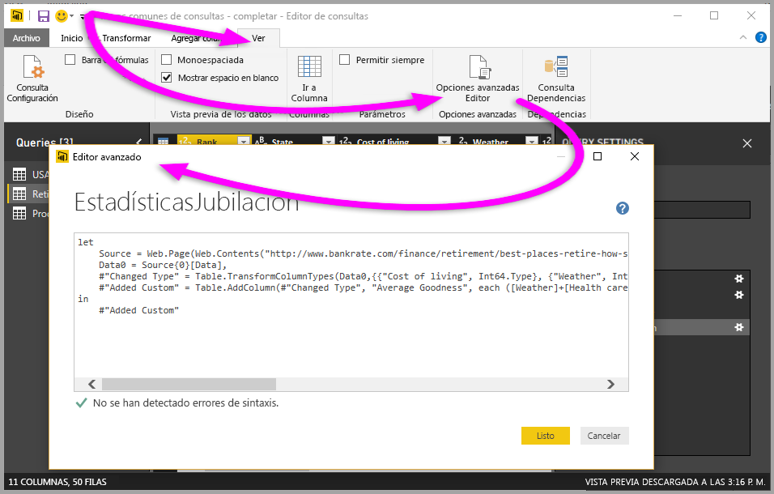

# Agregar una columna personalizada en Power BI Desktop

En Power BI Desktop puede agregar fácilmente una nueva columna personalizada de datos al modelo mediante el Editor de consultas. Con el Editor de consultas, puede crear y cambiar el nombre de la columna personalizada para crear [consultas de fórmula de Power Query M](https://docs.microsoft.com/powerquery-m/quick-tour-of-the-power-query-m-formula-language) y así definir la columna personalizada. La fórmula de Power Query M tiene un [conjunto de contenido de referencia de función completo](https://docs.microsoft.com/powerquery-m/power-query-m-function-reference). 

Cuando se crea una columna personalizada en el Editor de consultas, Power BI Desktop la agrega como un **paso aplicado** en la **Configuración de la consulta** de la consulta. Esto se puede cambiar, migrar o modificar en cualquier momento.

## Uso del Editor de consultas para agregar una columna personalizada

Para empezar a crear una columna personalizada, siga estos pasos:

1. Inicie Power BI Desktop y cargue algunos datos.

2. En la pestaña **Inicio** de la cinta de opciones, seleccione **Editar consultas**y, a continuación, seleccione **Editar consultas** en el menú.

   

   Se abre la ventana del **Editor de consultas**. 

2. En la pestaña **Agregar columna** en la cinta de opciones, seleccione **Columna personalizada**.

   

   Se abre la ventana **Agregar columna personalizada**.

## La ventana Agregar columna personalizada

La ventana **Agregar columna personalizada** tiene las siguientes características: 
- Una lista de columnas a su disposición, en la lista **Columnas disponibles** a la derecha.

- El nombre inicial de la columna personalizada, en el cuadro **Nuevo nombre de columna**. Puede cambiar nombre de esta columna.

- [Las consultas de fórmula de PowerQuery M](https://docs.microsoft.com/powerquery-m/power-query-m-function-reference), en el cuadro **Fórmula de columna personalizada**. Cree estas consultas compilando la fórmula en la que se define la nueva columna personalizada. 

   

## Crear fórmulas para la columna personalizada

1. Seleccione una columna en la lista **Columnas disponibles:** situada a la derecha y después seleccione **Insertar** debajo de la lista para agregarlas a la fórmula de la columna personalizada. También puede agregar una columna haciendo doble clic en ella en la lista.

2. A medida que escriba la fórmula y cree la columna, tenga en cuenta el indicador en la parte inferior de la ventana **Agregar columna personalizada**. 

   Si no hay ningún error, verá una marca de verificación verde y el mensaje *No se han detectado errores de sintaxis*.

   

   Si hay un error de sintaxis, verá un icono de advertencia amarillo, junto con un vínculo a la ubicación en la que se produjo el error en la fórmula.

   

3. Seleccione **Aceptar**. 

   Power BI Desktop agrega la columna personalizada al modelo y agrega el paso **Personalizada agregada** a la lista **Pasos aplicados** de la consulta en **Configuración de la consulta**.

   

4. Para modificar la columna personalizada, haga doble clic en el paso **Personalizada agregada** en la lista **Pasos aplicados**. 

   Se abre la ventana **Agregar columna personalizada** con la fórmula de columna personalizada que ha creado.

## Uso del Editor avanzado para columnas personalizadas

Después de crear la consulta, también puede usar el **Editor avanzado** para modificar cualquier paso de la consulta. Para ello, siga estos pasos:

1. En la ventana del **Editor de consulta**s, seleccione la pestaña **Ver** de la cinta de opciones. 

2. Seleccione **Editor avanzado**.

   Aparece la página **Editor avanzado** que le proporciona un control total sobre la consulta. 

   

   
## Pasos siguientes

- Hay otras maneras de crear una columna personalizada, incluida la creación de una columna basada en los ejemplos que le proporcione al Editor de consultas. Para más información consulte [Incorporación de una columna de un ejemplo en Power BI Desktop](desktop-add-column-from-example.md).

- Para información de referencia acerca de Power Query M, consulte [Referencia de funciones de Power Query M](/powerquery-m/power-query-m-function-reference).

