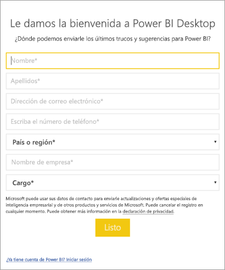

# <a name="how-administrators-can-manage-the-power-bi-desktop-sign-in-form"></a>Administración del formulario de inicio de sesión de Power BI Desktop por parte de los administradores
La primera vez que se inicia Power BI Desktop, aparece un formulario de inicio de sesión. Se puede rellenar la información o iniciar sesión en Power BI para continuar. Los administradores administran este formulario mediante una clave de registro. 



Los administradores usan la siguiente clave de registro para deshabilitar el formulario de inicio de sesión. Esto también se puede desarrollar en toda la organización mediante directivas globales.

```
Key: HKEY_CURRENT_USER\SOFTWARE\Policies\Microsoft\Microsoft Power BI Desktop
valueName: ShowLeadGenDialog
```
También puede probar la siguiente clave, que ha funcionado para algunos clientes según sus configuraciones:

```
Key: HKEY_CURRENT_USER\SOFTWARE\Microsoft\Microsoft Power BI Desktop
valueName: ShowLeadGenDialog
```

Un valor de 0 deshabilitará el cuadro de diálogo.


¿Tiene más preguntas? [Pruebe a preguntar a la comunidad de Power BI](http://community.powerbi.com/)

