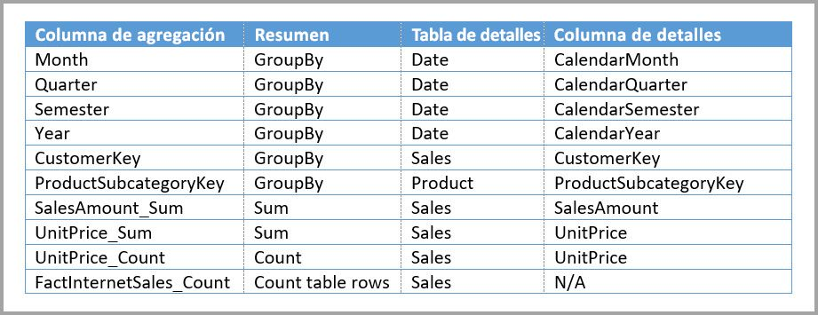

# Uso de agregaciones en Power BI Desktop

El uso de *agregaciones* en Power BI permite reducir el tamaño de las tablas para que pueda centrarse en los datos importantes y mejorar el rendimiento de las consultas. Las agregaciones permiten la realización de análisis interactivos de macrodatos que, de otro modo, no sería posible. Además, pueden reducir drásticamente el costo de desbloquear grandes conjuntos de datos para la toma de decisiones.

Estas son algunas de las ventajas de usar agregaciones:

- **Mejora del rendimiento de las consultas sobre macrodatos**. Cada interacción con objetos visuales de Power BI envía consultas DAX al conjunto de datos. Los datos agregados almacenados en memoria caché usan una fracción de los recursos necesarios para los datos detallados, por lo que puede desbloquear macrodatos que, de otro modo, serían inaccesibles.
- **Optimización de la actualización de los datos**. Un tamaño de caché menor permite reducir el tiempo de actualización, por lo que los datos se obtienen más rápidamente.
- **Equilibrio de las arquitecturas**. La caché en memoria de Power BI puede controlar consultas agregadas, lo cual limita las consultas enviadas en el modo DirectQuery le ayuda a cumplir los límites de simultaneidad. El resto de las consultas de nivel de detalles tienden a ser consultas filtradas de nivel transaccional, algo que suelen controlar bien los almacenes de datos y los sistemas de macrodatos.

Los orígenes de datos dimensionales, como los almacenes de datos y data marts, pueden usar [agregaciones basadas en relaciones](#aggregation-based-on-relationships). Los orígenes de macrodatos basados en Hadoop suelen ser [agregaciones base en columnas GroupBy](#aggregation-based-on-groupby-columns). En este artículo se describen las diferencias de modelado habitual en Power BI para cada tipo de origen de datos.

## Creación de una tabla agregada

Para crear una tabla agregada:
1. Configure una nueva tabla con los campos que quiera, según el origen de datos y el modelo. 
1. Defina las agregaciones en el cuadro de diálogo **Administrar agregaciones**.
1. Si procede, cambie el [modo de almacenamiento](#storage-modes) para la tabla agregada. 

### Administrar agregaciones

Después de crear la nueva tabla que contiene los campos deseados, en el panel **Campos** de cualquier vista de Power BI Desktop, haga clic con el botón derecho en la tabla y seleccione **Administrar agregaciones**.

El cuadro de diálogo **Administrar agregaciones** muestra una fila para cada columna de la tabla, donde se puede especificar el comportamiento de la agregación. En el ejemplo siguiente, las consultas a la tabla de detalles **Sales** se redirigen internamente a la tabla de agregación **Sales Agg**. 

En la lista desplegable **Resumen** del cuadro de diálogo **Administrar agregaciones**, se ofrecen los valores siguientes:
- Recuento
- GroupBy
- Max
- Mín.
- Suma
- Contar filas de tabla

En este ejemplo de agregación basada en relaciones, las entradas de GroupBy son opcionales. Excepto DISTINCTCOUNT, no afectan al comportamiento de la agregación y su función principal es mejorar la legibilidad. Sin las entradas GroupBy, se seguirían obteniendo agregaciones en función de las relaciones. Esto es diferente del [ejemplo de macrodatos](#aggregation-based-on-groupby-columns) que aparece más adelante en este artículo, donde se requieren entradas GroupBy.

Después de definir las agregaciones que quiera, seleccione **Aplicar todo**. 

### Validaciones

El cuadro de diálogo **Administrar agregaciones** aplica las siguientes validaciones importantes:

- La **columna de detalles** debe tener el mismo tipo de datos que la **columna de agregación**, excepto las funciones de **Resumen** de las filas Recuento y Contar filas de tabla. Recuento y Contar filas de tabla solo están disponibles para las columnas de agregación de enteros y no necesitan un tipo de datos coincidente.
- No se permiten las agregaciones encadenadas que abarcan tres o más tablas. Por ejemplo, las agregaciones en la **Tabla A** no pueden hacer referencia a una **Tabla B** que tenga agregaciones que hagan referencia a una **Tabla C**.
- No se permiten las agregaciones duplicadas donde dos entradas usen la misma función de **Resumen** y hagan referencia a la misma **tabla de detalles** y a la misma **columna de detalles**.
- La **tabla de detalles** debe usar el modo de almacenamiento DirectQuery, no Importar.
- No se admite la agrupación por una columna de clave externa usada por una relación inactiva, ni tampoco recurrir a la función USERELATIONSHIP para los aciertos de agregación.

La mayoría de las validaciones se aplican al deshabilitar los valores de la lista desplegable y mostrar el texto explicativo de la información sobre herramientas, como se muestra en esta imagen.

### Tablas de agregación ocultas

Los usuarios con acceso de solo lectura al conjunto de datos no pueden consultar las tablas de agregación. Esto evita problemas de seguridad cuando se usan con *seguridad de nivel de fila (RLS)*. Los consumidores y las consultas hacen referencia a la tabla de detalles, no a la tabla de agregación, y no necesitan saber que dicha tabla de agregación existe.

Por este motivo, las tablas de agregación están ocultas en la vista **Informes**. Si la tabla no está oculta, el cuadro de diálogo **Administrar agregaciones** la establecerá como oculta al seleccionar **Aplicar todo**.

### Modos de almacenamiento
La característica de agregación interactúa con los modos de almacenamiento de nivel de tabla. Las tablas de Power BI pueden usar los modos de almacenamiento *DirectQuery*, *Importar* o *Dual*. DirectQuery consulta el back-end directamente, mientras que Importar almacena los datos en la memoria caché y envía las consultas a los datos almacenados en caché. Todos los orígenes de datos de Importar de Power BI y DirectQuery no multidimensionales funcionan con agregaciones. 

Para establecer el modo de almacenamiento de una tabla agregada en Importar a fin de acelerar las consultas, seleccione la tabla agregada en la vista **Modelo** de Power BI Desktop. En el panel **Propiedades**, expanda **Avanzado** y, en la lista desplegable situada bajo **Modo de almacenamiento**, seleccione **Importar**. Tenga en cuenta que esta acción es irreversible. 

Para obtener más información sobre el modo de almacenamiento de tablas, consulte [Administración del modo de almacenamiento en Power BI Desktop](desktop-storage-mode.md).

### RLS para agregaciones

Para funcionar correctamente con las agregaciones, las expresiones de RLS deben filtrar la tabla de agregación y la tabla de detalles. 

En el ejemplo siguiente, la expresión RLS en la tabla **Geography** funciona con las agregaciones, dado que Geografía se encuentra en el lado de filtrado de las relaciones con las tablas **Sales** y **Sales Agg**. RLS se aplicará correctamente tanto en las consultas que alcanzan la tabla de agregación como en las que no.

Una expresión de RLS en la tabla **Product** solo filtrará la tabla **Sales**, no la tabla agregada **Sales Agg**. Como la tabla de agregación es otra representación de los datos de la tabla de detalles, no sería seguro responder a las consultas de la tabla de agregación si no se puede aplicar el filtro RLS. No se recomienda filtrar solo la tabla de detalles, ya que las consultas de usuario de este rol no se beneficiarán de los aciertos de agregación. 

No se permite una expresión de RLS que filtre solo la tabla de agregación **Sales Agg** y no la tabla de detalles **Sales**.

En las [agregaciones basadas en columnas GroupBy](#aggregation-based-on-groupby-columns), se puede usar una expresión RLS aplicada a la tabla de detalles para filtrar la tabla de agregación, ya que todas las columnas GroupBy de la tabla de agregación se incluyen en la tabla de detalles. Por otro lado, un filtro RLS en la tabla de agregación no se puede aplicar a la tabla de detalles, por lo que no se permite.

## Agregación basada en relaciones

Los modelos dimensionales suelen usar *agregaciones basadas en relaciones*. Los conjuntos de datos de Power BI que proceden de almacenes de datos y data marts son similares a esquemas de estrella o copo de nieve, con relaciones entre tablas de dimensiones y de hechos.

En el siguiente modelo de un solo origen de datos, las tablas usan el modo de almacenamiento DirectQuery. La tabla de hechos **Sales** contiene miles de millones de filas. Si se establece el modo de almacenamiento de **Sales** en Importar para almacenamiento en caché, se consumirá una cantidad considerable de memoria y habrá una sobrecarga de la administración.

En su lugar, cree la tabla de agregación **Sales Agg**. En la tabla **Sales Agg**, el número de filas es igual a la suma de **SalesAmount**, agrupadas por **CustomerKey**, **DateKey** y **ProductSubcategoryKey**. La tabla **Sales Agg** tiene una granularidad más alta que **Sales**, por lo que, en lugar de miles de millones, podría contener solo millones de filas, que son mucho más fáciles de administrar.

Si las siguientes tablas de dimensiones son las que se usan con más frecuencia para las consultas con un valor de negocio alto, pueden filtrar **Sales Agg** mediante relaciones *uno a varios* o *varios a uno*.

- Geografía
- Cliente
- Fecha
- Subcategoría de producto
- Product Category

La siguiente imagen muestra este modelo.

En esta tabla se muestran las agregaciones para la tabla **Sales Agg**.

> [!NOTE]
> La tabla **Sales Agg**, como cualquier tabla, tiene la flexibilidad de cargarse de distintas formas. Se puede realizar la agregación en la base de datos de origen mediante procesos ETL/ELT, o mediante la [expresión M](/powerquery-m/power-query-m-function-reference) para la tabla. La tabla agregada puede usar el modo de almacenamiento Importar con o sin [actualización incremental en Power BI Premium](service-premium-incremental-refresh.md), o puede usar DirectQuery y optimizarse para consultas rápidas con [índices de almacén de columnas](/sql/relational-databases/indexes/columnstore-indexes-overview). Esta flexibilidad permite arquitecturas equilibradas que pueden distribuir la carga de consultas para evitar cuellos de botella.

Si se cambia el modo de almacenamiento de la tabla **Sales Agg** agregada a **Importar**, se abre un cuadro de diálogo que indica que las tablas de dimensiones relacionadas pueden establecerse en el modo de almacenamiento *Dual*. 

Al configurar las tablas de dimensiones relacionadas en Dual, pueden actuar como Importar o DirectQuery, según la subconsulta. En el ejemplo:

- De la caché en memoria se pueden devolver consultas que agregan métricas desde la tabla **Sales Agg**, cuyo modo es Importar, y se agrupan por atributos desde las tablas Dual relacionadas.
- Las consultas que agregan métricas desde la tabla **Sales** de DirectQuery, y se agrupan por atributos desde las tablas Dual, pueden devolverse en el modo DirectQuery. La lógica de consulta, incluida la operación GroupBy, se pasará a la base de datos de origen.

Para obtener más información sobre el modo de almacenamiento Dual, consulte [Administración del modo de almacenamiento en Power BI Desktop](desktop-storage-mode.md).

### Relaciones seguras frente a débiles

Los aciertos de agregaciones basadas en relaciones requieren relaciones fuertes.

Las relaciones fuertes incluyen las siguientes combinaciones de modo de almacenamiento, en las que ambas tablas proceden de un único origen:

| Tabla en los lados de *varios* | Tabla en el lado de *uno* |
| ------------- |----------------------| 
| Dual          | Dual                 | 
| Importación        | Importación o dual       | 
| DirectQuery   | DirectQuery o dual  | 

El único caso en el que una relación de *origen cruzado* se considera fuerte es cuando ambas tablas se establecen en Importar. Las relaciones varios a varios siempre se consideran débiles.

Para los aciertos de agregaciones de *origen cruzado* que no dependen de las relaciones, consulte [Agregaciones basadas en columnas GroupBy](#aggregation-based-on-groupby-columns). 

### Ejemplos de consulta de agregación basada en relaciones

La siguiente consulta alcanzará la agregación porque las columnas de la tabla **Date** están en la granularidad que les permite alcanzar la agregación. La columna **SalesAmount** usa la agregación **SUM**.

La siguiente consulta no alcanza la agregación. A pesar de solicitar la suma de **SalesAmount**, la consulta realiza una operación GroupBy en una columna en la tabla **Product**, que no está en la granularidad que puede alcanzar la agregación. Si observa las relaciones en el modelo, una subcategoría de producto puede tener varias filas **Product**. La consulta no podría determinar a qué producto se agrega. En este caso, la consulta revierte a DirectQuery y envía una consulta SQL al origen de datos.

Las agregaciones no son solo para cálculos sencillos que realizan una suma sencilla. También se pueden beneficiar los cálculos complejos. Conceptualmente, un cálculo complejo se desglosa en subconsultas para cada SUM, MIN, MAX y COUNT, y cada subconsulta se evalúa para determinar si puede alcanzar la agregación. Esta lógica no es verdadera en todos los casos debido a la optimización del plan de consulta, pero en general debería aplicarse. En el ejemplo siguiente se alcanza la agregación:

La función COUNTROWS puede beneficiarse de las agregaciones. La siguiente consulta alcanza la agregación porque hay una agregación **Contar filas de tabla** definida para la tabla **Sales**.

La función AVERAGE puede beneficiarse de las agregaciones. La siguiente consulta alcanza la agregación porque AVERAGE se dobla internamente en SUM dividido por COUNT. Puesto que la columna **UnitPrice** tiene agregaciones definidas para SUM y COUNT, se alcanza la agregación.

En algunos casos, la función DISTINCTCOUNT puede beneficiarse de las agregaciones. La siguiente consulta alcanza la agregación porque hay una entrada de GroupBy para **CustomerKey**, que mantiene la diferenciación de **CustomerKey** en la tabla de agregación. Esta técnica todavía podría alcanzar el umbral de rendimiento donde más de entre dos y cinco millones de valores distintos pueden afectar al rendimiento de las consultas. A pesar de ello, puede ser útil en escenarios donde hay miles de millones de filas en la tabla de detalles, pero entre dos y cinco millones de valores distintos en la columna. En este caso, DISTINCTCOUNT puede realizarse más rápido que si se examina la tabla con miles de millones de filas, aunque se hayan almacenado en caché en memoria.

## Agregación basada en columnas GroupBy 

Los modelos de macrodatos basados en Hadoop tienen características diferentes de modelos dimensionales. Para evitar combinaciones entre tablas grandes, los modelos de macrodatos no suelen usar relaciones, sino que desnormalizan los atributos de dimensión en tablas de hechos. Estos modelos de datos tan grandes pueden desbloquearse para un análisis interactivo mediante *agregaciones basadas en columnas GroupBy*.

Esta tabla contiene la columna numérica **Movement** que se va a agregar. El resto de las columnas son atributos para GroupBy. La tabla contiene datos de IoT y un gran número de filas. El modo de almacenamiento es DirectQuery. Las consultas en el origen de datos que se agregan a través de todo el conjunto de datos son lentas debido simplemente al volumen. 

Para habilitar los análisis interactivos en este conjunto de datos, se puede agregar una tabla de agregación que se agrupa por la mayoría de los atributos, pero excluye los atributos de alta cardinalidad, como la longitud y la latitud. De este modo se reduce drásticamente el número de filas y es lo suficientemente pequeña como para encajar cómodamente en una caché en memoria. 

En el cuadro de diálogo **Administrar agregaciones**, se definen las asignaciones de agregaciones para la tabla **Actividad de conductor agregada**. 

En las agregaciones basadas en columnas GroupBy, las entradas de **GroupBy** no son opcionales. Sin ellas, las agregaciones no se alcanzarán. Esto es diferente de usar agregaciones basadas en relaciones, en las que las entradas de GroupBy son opcionales.

En esta tabla se muestran las agregaciones para la tabla **Driver Activity Agg**.

El modo de almacenamiento de la tabla **Actividad de conductor agregada** se puede establecer en Importar.

### Ejemplo de consulta de agregación de GroupBy

La siguiente consulta alcanza la agregación porque la tabla de agregación abarca la columna **Activity Date**. La función COUNTROWS usa la agregación **Contar filas de tabla**.

Especialmente para los modelos que contienen atributos de filtro en tablas de hechos, es buena idea usar agregaciones de **Contar filas de tabla**. Es posible que Power BI envíe consultas al conjunto de datos mediante COUNTROWS en casos donde el usuario no lo pida expresamente. Por ejemplo, en el cuadro de diálogo de filtro se muestra el recuento de filas para cada valor.

## Técnicas de agregación combinadas

Las técnicas de relaciones y las columnas GroupBy se pueden combinar para las agregaciones. Puede que para las agregaciones basadas en relaciones sea necesario que las tablas de dimensiones desnormalizadas se dividan en varias tablas. Si esto resulta costoso o poco práctico para algunas tablas de dimensión, se pueden replicar los atributos necesarios en la tabla de agregación para ciertas dimensiones y usar relaciones para otras.

Por ejemplo, en este modelo se replica **Mes**, **Trimestre**, **Semestre** y **Año** en la tabla **Sales Agg**. No hay ninguna relación entre **Sales Agg** y la tabla **Date**, pero sí que hay relaciones para **Customer** y **Product Subcategory**. El modo de almacenamiento de **Sales Agg** es Import.

En esta tabla se muestran las entradas establecidas en el cuadro de diálogo **Administrar agregaciones** para la tabla **Sales Agg**. Las entradas GroupBy donde **Date** es la tabla de detalles son obligatorias para alcanzar agregaciones para las consultas que se agrupan por atributos de tipo **Date**. Como se muestra en el ejemplo anterior, las entradas **GroupBy** para **CustomerKey** y **ProductSubcategoryKey** no afectan a los aciertos de agregaciones debido a la presencia de relaciones (a excepción de DISTINCTCOUNT).

### Ejemplo de consulta de agregación combinada

Esta consulta alcanza la agregación porque **CalendarMonth** está cubierto por la tabla de agregación y **CategoryName** es accesible a través de relaciones de uno a varios. **SalesAmount** usa la agregación **SUM**.

La siguiente consulta no alcanza la agregación porque la tabla de agregación no abarca **CalendarDay**.

La siguiente consulta de inteligencia de tiempo no alcanzará la agregación porque la función DATESYTD genera una tabla de valores de tipo **CalendarDay** y la tabla de agregación no abarca **CalendarDay**.

## Prioridad de agregación

La prioridad de agregación permite que una única subconsulta tenga en cuenta varias tablas de agregación.

El ejemplo siguiente es un [modelo compuesto](desktop-composite-models.md) que contiene varios orígenes:

- La tabla **Driver Activity** es DirectQuery y contiene más de un billón de filas de datos de IoT procedentes de un sistema de macrodatos. Atiende consultas de obtención de detalles para ver lecturas de IoT individuales en contextos de filtro controlado.
- La tabla **Drive Activity Agg** es una tabla de agregación intermedia en el modo DirectQuery. Contiene más de mil millones de filas en Azure SQL Data Warehouse y está optimizada en el origen mediante índices de almacén de columnas.
- La tabla **Driver Activity Agg2** es Importar y tiene una granularidad alta porque los atributos group-by son pocos y de baja cardinalidad. El número de filas podría ser de tan solo unos miles, por lo que puede adaptarse fácilmente a una caché en memoria. Estos atributos suelen usarse en un panel ejecutivo de alto perfil, por lo que las consultas que hacen referencia a ellos deben ser tan rápidas como sea posible.

> [!NOTE]
> Las tablas de agregación de DirectQuery que usan un origen de datos distinto al de la tabla de detalles solo se admiten si la tabla de agregación procede de un origen de SQL Server, Azure SQL o Azure SQL Data Warehouse.

La superficie de memoria de este modelo es relativamente pequeña, pero desbloquea un enorme conjunto de datos. Representa una arquitectura equilibrada porque distribuye la carga de consultas a través de los componentes de la arquitectura y los usa en función de sus puntos fuertes.

El cuadro de diálogo **Administrar agregaciones** de **Driver Activity Agg2** establece el campo **Prioridad** en *10*, que es mayor que para **Driver Activity Agg**. La configuración de mayor prioridad significa que las consultas que usan agregaciones tendrán primero en cuenta **Driver Activity Agg2**. En su lugar, las subconsultas que no están en la granularidad a la que se puede responder mediante **Driver Activity Agg2** contemplarán **Driver Activity Agg**. Las consultas de detalles que no se pueden responder mediante cualquier tabla de agregación se dirigirán a **Driver Activity**.

La tabla especificada en la columna **Tabla de detalles** es **Driver Activity**, en lugar de **Driver Activity Agg** porque no se permiten las agregaciones encadenadas.

En esta tabla se muestran las agregaciones para la tabla **Driver Activity Agg2**.

## Detección de si las consultas alcanzan o no las agregaciones

SQL Profiler puede detectar si las consultas se devuelven desde el motor de almacenamiento en caché en memoria o si se insertan en el origen de datos mediante DirectQuery. Ese proceso también puede usarse para detectar si se están alcanzando las agregaciones. Para obtener más información, vea [Consultas que aciertan o pierden la memoria caché](desktop-storage-mode.md#queries-that-hit-or-miss-the-cache). 

SQL Profiler también proporciona el evento extendido `Query Processing\Aggregate Table Rewrite Query`.

El siguiente fragmento de código JSON muestra un ejemplo de la salida del evento cuando se usa una agregación.

- **matchingResult** muestra que la subconsulta ha usado una agregación.
- **dataRequest** muestra las columnas GroupBy y las columnas agregadas usadas por la subconsulta.
- **mapping** muestra las columnas en la tabla de agregación que se les asignó.

## Sincronización de las cachés

Las agregaciones que combinan los modos de almacenamiento DirectQuery, Importar y Dual pueden devolver datos diferentes a menos que la caché en memoria se mantenga sincronizada con los datos de origen. Por ejemplo, la ejecución de consultas no intentará enmascarar los problemas de datos mediante el filtrado de los resultados de DirectQuery para coincidir con los valores en caché. Hay técnicas establecidas para controlar este tipo de problemas en el origen, si es necesario. Las optimizaciones de rendimiento deben usarse solo de forma que no pongan en peligro su capacidad para satisfacer los requisitos de negocio. Es su responsabilidad conocer los flujos de datos, así que conviene diseñarlos en consecuencia. 

## Pasos siguientes

Para obtener más información sobre los modelos compuestos, vea:

- [Usar modelos compuestos en Power BI Desktop](desktop-composite-models.md)
- [Aplicación de relaciones de varios a varios en Power BI Desktop](desktop-many-to-many-relationships.md)
- [Administración del modo de almacenamiento en Power BI Desktop](desktop-storage-mode.md)

Para obtener más información sobre DirectQuery, vea:

- [Acerca del uso de DirectQuery en Power BI](desktop-directquery-about.md)
- [Orígenes de datos de Power BI](desktop-directquery-data-sources.md)
