# Agregaciones en Power BI Desktop (versión preliminar)

El uso de **agregaciones** en Power BI permite hacer análisis interactivos sobre macrodatos de maneras que antes no eran posibles. Las **agregaciones** pueden reducir considerablemente el costo de desbloquear grandes conjuntos de datos para tomar decisiones.

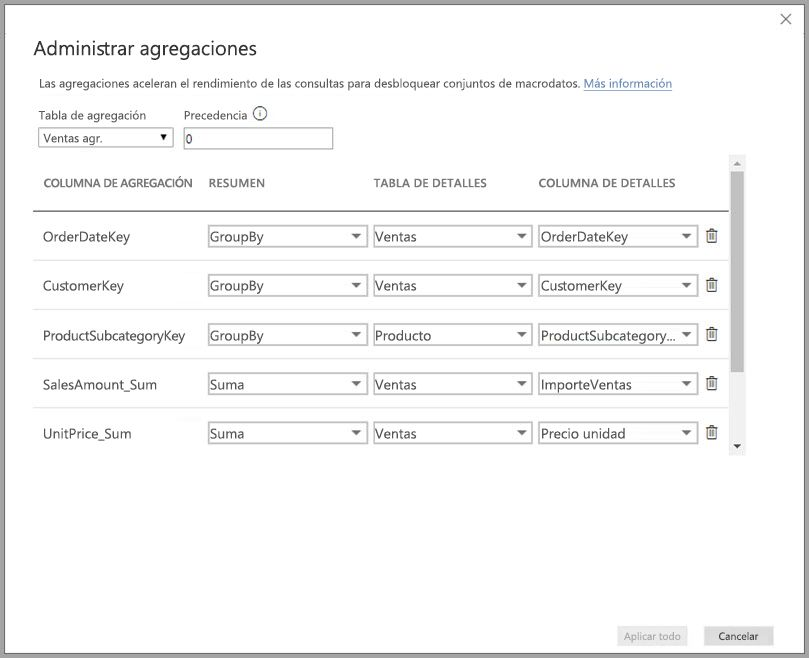

En esta lista se indican las ventajas de usar **agregaciones**:

* **Rendimiento de consultas sobre grandes conjuntos de datos**: cuando los usuarios interactúan con objetos visuales en los informes de Power BI, las consultas de DAX se envían al conjunto de datos. Acelere la velocidad de consulta mediante el almacenamiento en caché de datos en el nivel de agregados, usando una fracción de los recursos necesarios en el nivel de detalle. Desbloquee datos de gran tamaño que, de otra manera, sería imposible hacer.
* **Optimización de la actualización de datos**: reduzca el tamaño de caché y los tiempos de actualización mediante el almacenamiento de datos en caché en el nivel de agregados. Agilice el tiempo para poner los datos a disposición de los usuarios.
* **Lograr arquitecturas equilibradas**: permita que la caché en memoria de Power BI controle las consultas agregadas, ya que lo hace de forma eficaz. Limite las consultas enviadas al origen de datos en el modo DirectQuery, lo que ayudará a permanecer dentro de los límites de simultaneidad. Las consultas que logran pasar tienden a ser consultas filtradas de nivel transaccional, algo que suelen controlar bien los almacenes de datos y los sistemas de macrodatos.

### Almacenamiento de nivel de tabla
El almacenamiento de nivel de tabla se suele usar con la característica de agregaciones. Vea el artículo [Modo de almacenamiento en Power BI Desktop (versión preliminar)](desktop-storage-mode.md) para más información.

### Tipos de origen de datos
Las agregaciones se usan con orígenes de datos que representan modelos dimensionales, como los almacenes de datos y los data marts, así como los orígenes de macrodatos basados en Hadoop. En este artículo se describen las diferencias de modelado típico en Power BI para cada tipo de origen de datos.

Todos los orígenes de Power BI Import y DirectQuery (no multidimensionales) funcionan con agregaciones.

## Habilitar la característica en vista previa de agregaciones

La característica **agregaciones** está en versión preliminar y se debe habilitar en **Power BI Desktop**. Para habilitar las **agregaciones**, seleccione **Archivo > Opciones y configuración > Opciones > Características en vista previa** y active **Modelos compuestos** y **Administrar agregaciones**. 

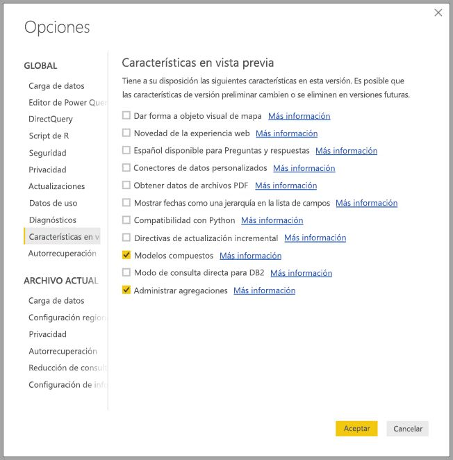

Deberá reiniciar **Power BI Desktop** para que se habilite la característica.

## Agregaciones basadas en relaciones

Las **agregaciones** basadas en relaciones se usan normalmente con modelos dimensionales. Los conjuntos de datos de Power BI que proceden de almacenes de datos y data marts son similares a esquemas de estrella o copo de nieve, con relaciones entre tablas de dimensiones y tablas de hechos.

Tenga en cuenta el modelo siguiente, que procede de un origen de datos único. Supongamos que todas las tablas usan DirectQuery para empezar. La tabla de hechos **Sales** contiene miles de millones de filas. Si se establece el modo de almacenamiento de **Sales** en **Import** para almacenamiento en caché, consumiría una cantidad considerable de memoria y sobrecarga de administración.

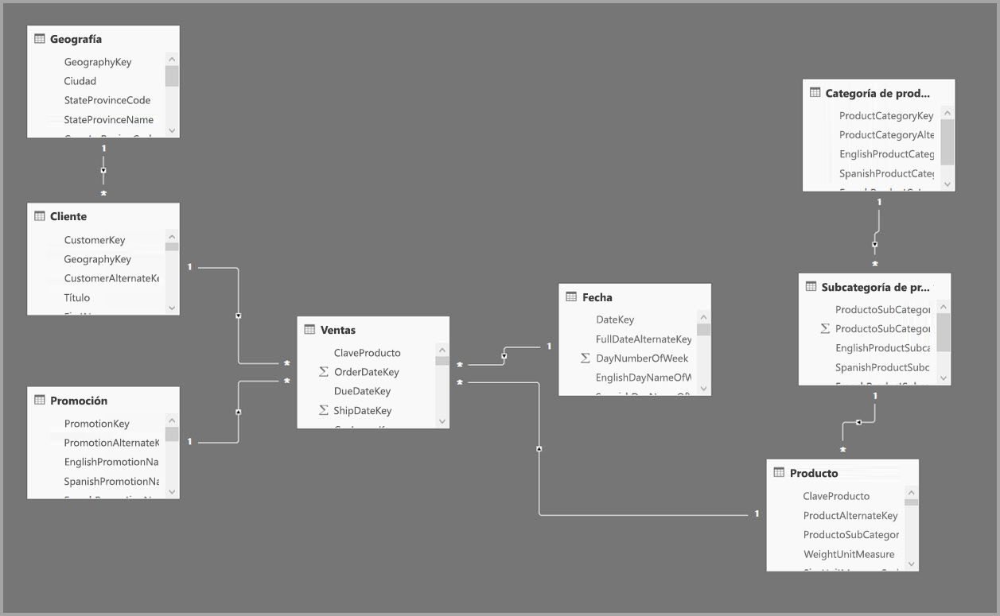

En su lugar, creamos la tabla **Sales Agg** como una tabla de agregación. Tiene una mayor granularidad que **Sales**, por lo que va a contener muchas menos filas. El número de filas debe ser igual a la suma de **SalesAmount**, agrupadas por **CustomerKey**, **DateKey** y **ProductSubcategoryKey**. En lugar de miles de millones, podría ser millones de filas, lo cual es mucho más fácil de administrar.

Supongamos que las tablas de dimensiones siguientes son las más usadas para las consultas con alto valor de negocio. Son las tablas que pueden filtrar **Sales Agg** mediante relaciones de *uno a varios* (o *varios a uno*). Para las agregaciones no se tienen en cuenta otros tipos de relación, como *varios a varios* o *varios orígenes*.

* Geografía
* Customer
* Fecha
* Subcategoría de producto
* Categoría de producto

La siguiente imagen muestra este modelo.

> [!NOTE]
> La tabla **Sales Agg** es simplemente otra tabla, por lo que tiene la flexibilidad de cargarse de distintas formas. Por ejemplo, se puede realizar la agregación en la base de datos de origen mediante procesos ETL/ELT, o mediante la [expresión M](https://msdn.microsoft.com/query-bi/m/power-query-m-reference) para la tabla. Puede usar el modo de almacenamiento Import con o sin [actualización incremental en Power BI Premium](service-premium-incremental-refresh.md), o puede ser DirectQuery y optimizado para consultas rápidas con [índices de almacén de columnas](https://docs.microsoft.com/sql/relational-databases/indexes/columnstore-indexes-overview). Esta flexibilidad permite arquitecturas equilibradas que distribuyen la carga de consultas para evitar cuellos de botella.

### Modo de almacenamiento 
Vamos a continuar con el ejemplo que estamos usando. Establecemos el modo de almacenamiento de **Sales Agg** en **Import** para acelerar las consultas.

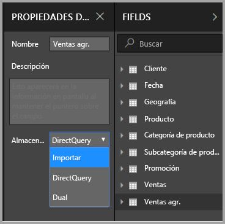

Al hacerlo, aparece el cuadro de diálogo siguiente, que nos indica que las tablas de dimensiones relacionadas se establecerán en el modo de almacenamiento **Dual**. 

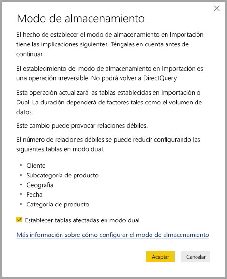

Al configurarlas en **Dual**, las tablas de dimensiones relacionadas pueden actuar como Import o DirectQuery, según la subconsulta.

* De la caché en memoria se pueden devolver consultas que agregan métricas desde la tabla **Sales Agg**, que es Import, y agrupan por atributos desde las tablas Dual relacionadas.
* Las consultas que agregan métricas desde la tabla **Sales**, que es DirectQuery, y agrupan por atributos desde las tablas Dual, pueden devolverse desde el modo DirectQuery. La lógica de consulta, incluido el grupo por operación, se pasará a la base de datos de origen.

Para más información sobre el modo de almacenamiento **Dual**, vea el artículo [Modo de almacenamiento en Power BI Desktop (versión preliminar)](desktop-storage-mode.md).

> Nota: La tabla **Sales Agg** está oculta. Las tablas de agregación deben ocultarse a los consumidores del conjunto de datos. Los consumidores y las consultas hacen referencia a la tabla de detalles, no a la tabla de agregación; ni siquiera necesitan saber que existe dicha tabla de agregación.

### Cuadro de diálogo Administrar agregaciones
Después, definimos las agregaciones. Haga clic con el botón derecho en la tabla para seleccionar el menú contextual **Administrar agregaciones** para la tabla **Sales Agg**.

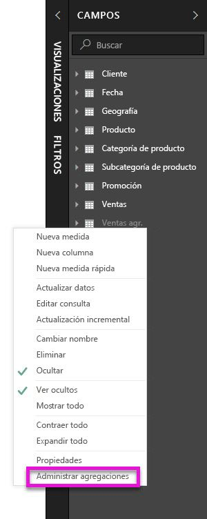

Se muestra el cuadro de diálogo **Administrar agregaciones**. Muestra una fila para cada columna de la tabla **Sales Agg**, donde podemos especificar el comportamiento de la agregación. Las consultas enviadas al conjunto de datos de Power BI que hace referencia a la tabla **Sales** se redirigen internamente a la tabla **Sales Agg**. Los consumidores del conjunto de datos ni siquiera necesitan saber que existe la tabla **Sales Agg**.

En esta tabla se muestran las agregaciones para la tabla **Sales Agg**.

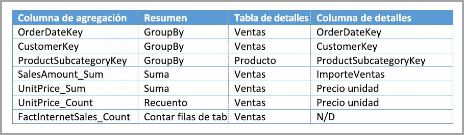

#### Función de resumen

La lista desplegable Resumen ofrece los siguientes valores para elegir.
* Recuento
* GroupBy
* Máx.
* Mín.
* Suma
* Contar filas de tabla

#### Validaciones

Se aplican estas validaciones importantes mediante el cuadro de diálogo:

* La columna de detalles seleccionada debe tener el mismo tipo de datos que la columna de agregación, excepto las funciones de suma Recuento y Contar filas de tabla. Recuento y Contar filas de tabla se ofrecen solo para las columnas de agregación de enteros y no necesitan un tipo de datos coincidente.
* No se permiten las agregaciones encadenadas que abarcan tres o más tablas. Por ejemplo, no es posible configurar las agregaciones en la **tabla A** que hace referencia a la **tabla B** que tiene las agregaciones que hacen referencia a la **tabla C**.
* No se permiten las agregaciones duplicadas donde dos entradas usan la misma función de resumen y hacen referencia a la misma columna o tabla de detalles.

Durante esta versión preliminar pública para **agregaciones**, también se aplican estas validaciones. Tenemos previsto quitar estas validaciones tras el lanzamiento de disponibilidad general.

* Las agregaciones no se pueden usar con seguridad de nivel de fila (RLS). *Limitación de la versión preliminar pública.*
* La tabla de detalles debe ser DirectQuery, no Import. *Limitación de la versión preliminar pública.*

La mayoría de estas validaciones se aplican al deshabilitar los valores de la lista desplegable y mostrar el texto explicativo de la información sobre herramientas, como se muestra en esta imagen.

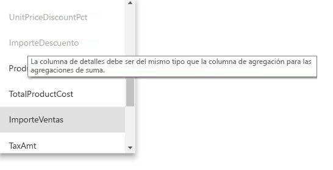

### Agrupar por columnas

En este ejemplo, las tres entradas de GroupBy son opcionales; no afectan al comportamiento de agregación (excepto para la consulta de ejemplo DISTINCTCOUNT, que se muestra en la imagen de abajo). Se incluyen principalmente con fines de legibilidad. Sin estas entradas GroupBy, se seguirían obteniendo agregaciones en función de las relaciones. Este comportamiento es diferente a cuando se usan las agregaciones sin relaciones, que está cubierto por el ejemplo de macrodatos que se incluye más adelante en este artículo.

### Detectar si las consultas alcanzan agregaciones o no

Para más información sobre cómo detectar si las consultas se devuelven desde la caché en memoria (motor de almacenamiento) o DirectQuery (insertadas en el origen de datos) mediante SQL Profiler, vea el artículo [Modo de almacenamiento en Power BI Desktop (versión preliminar)](desktop-storage-mode.md). Ese proceso también puede usarse para detectar si se están obteniendo agregaciones.

Además, se proporcionan los siguientes eventos extendidos en SQL Profiler.

    Query Processing\Aggregate Table Rewrite Query

El siguiente fragmento de código JSON muestra un ejemplo de la salida del evento cuando se usa una agregación.

* **matchingResult** muestra que se ha usado una agregación para la subconsulta.
* **dataRequest** muestra las columnas group-by y las columnas agregadas usadas por la subconsulta.
* **mapping** muestra las columnas en la tabla de agregación que se les asignó.

### Ejemplos de consultas
La siguiente consulta alcanzará la agregación porque las columnas de la tabla *Date* están en la granularidad que les permite alcanzar la agregación. Se usará la agregación **Sum** para **SalesAmount**.

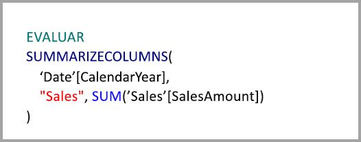

La consulta de abajo no alcanzará la agregación. A pesar de que pide la suma de **SalesAmount**, se realiza una operación de agrupación en una columna en la tabla **Product**, que no está en la granularidad que puede alcanzar la agregación. Si observa las relaciones en el modelo, una subcategoría de producto puede tener varias filas **Product**; la consulta no sería capaz de determinar qué producto se ha agregado a cuál. En este caso, la consulta revierte a DirectQuery y envía una consulta SQL al origen de datos.

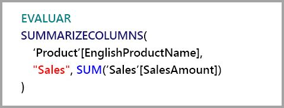

Las agregaciones no son solo para cálculos sencillos que realizan una suma sencilla. También se pueden beneficiar los cálculos complejos. Conceptualmente, un cálculo complejo se desglosa en subconsultas para cada SUM, MIN, MAX y COUNT, y cada subconsulta se evalúa para determinar si se puede alcanzar la agregación. Esta lógica no es verdadera en todos los casos debido a la optimización del plan de consulta, pero en general debería aplicarse. En este ejemplo se alcanza la agregación:

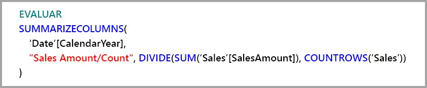

La función COUNTROWS puede beneficiarse de las agregaciones. La siguiente consulta alcanzará la agregación porque hay una agregación de filas de la tabla **Count** definida para la tabla **Sales**.

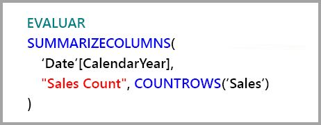

La función AVERAGE puede beneficiarse de las agregaciones. La siguiente consulta alcanzará la agregación porque AVERAGE se dobla internamente en SUM dividida por COUNT. Puesto que la columna **UnitPrice** tiene agregaciones definidas para SUM y COUNT, se alcanza la agregación.

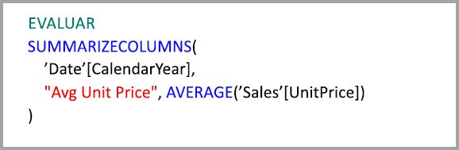

En algunos casos, la función DISTINCTCOUNT puede beneficiarse de las agregaciones. La siguiente consulta alcanzará la agregación porque hay una entrada de GroupBy para **CustomerKey**, que mantiene la diferenciación de **CustomerKey** en la tabla de agregación. Esta técnica todavía está sujeta al umbral de rendimiento donde aproximadamente de dos a cinco millones de valores distintos pueden afectar al rendimiento de las consultas. A pesar de ello, puede ser útil en escenarios donde hay miles de millones de filas en la tabla de detalles y de dos a cinco millones de valores distintos en la columna. En este caso, el recuento distintivo puede realizarse más rápido que si se examina la tabla con miles de millones de filas, aunque se hayan almacenado en caché en memoria.

## Agregaciones basadas en columnas group-by 

Los modelos de macrodatos basados en Hadoop tienen características diferentes de modelos dimensionales. Para evitar combinaciones entre tablas de gran tamaño, a menudo no dependen de las relaciones. En su lugar, los atributos de dimensión a menudo se desnormalizan a tablas de hechos. Estos modelos de datos tan grandes pueden desbloquearse para un análisis interactivo mediante **agregaciones** basado en columnas group-by.

Esta tabla contiene la columna numérica **Movement** que se va a agregar. El resto de las columnas son atributos para group-by. Contiene datos de IoT y un gran número de filas. El modo de almacenamiento es DirectQuery. Las consultas en el origen de datos que se agregan a través de todo el conjunto de datos son lentas debido simplemente al volumen.

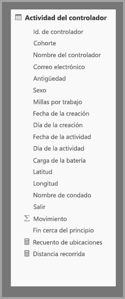

Para habilitar el análisis interactivo en este conjunto de datos, agregamos una tabla de agregación que se agrupa por la mayoría de los atributos, pero excluye los atributos de alta cardinalidad como longitud y latitud. De este modo se reduce drásticamente el número de filas y es lo suficientemente pequeña como para encajar cómodamente en una caché en memoria. El modo de almacenamiento de **Driver Activity Agg** es Import.

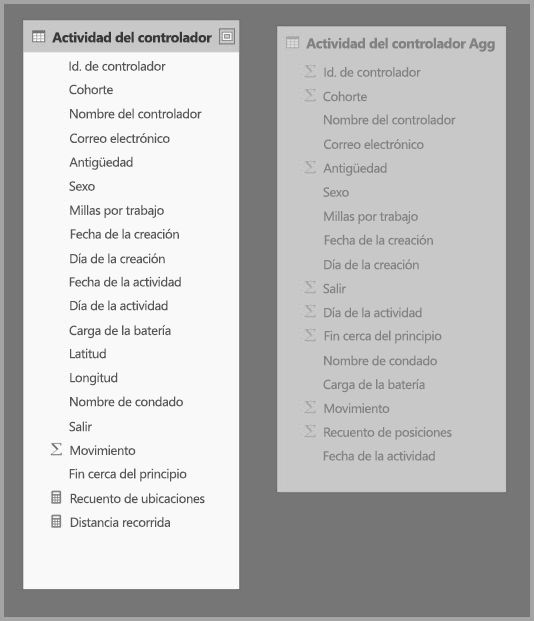

Después, definimos las asignaciones de agregación en el cuadro de diálogo **Administrar agregaciones**. Muestra una fila para cada columna de la tabla **Driver Activity Agg**, donde podemos especificar el comportamiento de agregación.

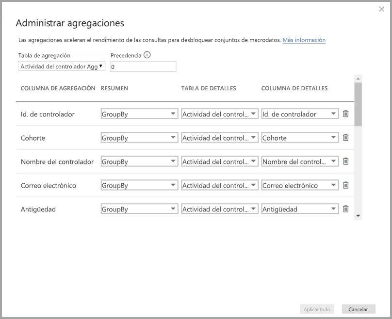

En esta tabla se muestran las agregaciones para la tabla **Sales Agg**.

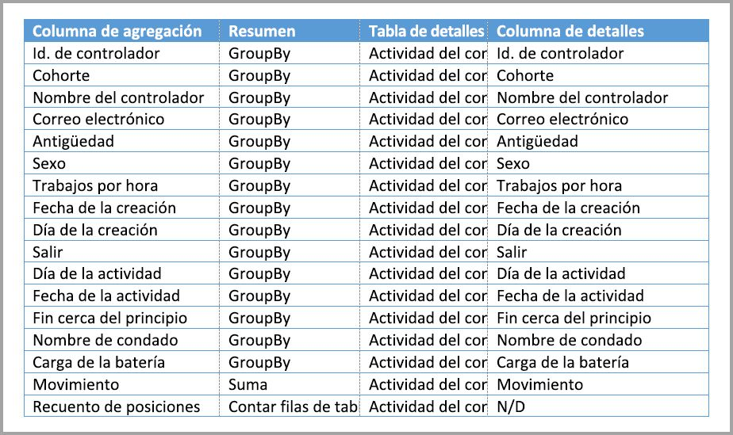

### Agrupar por columnas

En este ejemplo, las entradas de **GroupBy** **no son opcionales**; sin ellas no se alcanzarían las agregaciones. Este comportamiento es diferente al uso de agregaciones basadas en relaciones, que se explica mediante el ejemplo de modelo dimensional proporcionado anteriormente en este artículo.

### Ejemplos de consultas

La siguiente consulta alcanzará la agregación porque la tabla de agregación abarca la columna **Activity Date**. La función COUNTROWS usa la agregación Contar filas de tabla.

Especialmente para los modelos que contienen atributos de filtro en tablas de hechos, es una buena idea usar agregaciones de Contar filas de tabla. Es posible que Power BI envíe consultas al conjunto de datos mediante COUNTROWS en casos donde el usuario no lo pida expresamente. Por ejemplo, en el cuadro de diálogo de filtro se muestra el recuento de filas para cada valor.

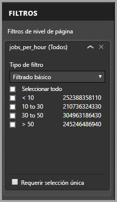

## Prioridad de agregación

La prioridad de agregación permite que una única subconsulta tenga en cuenta varias tablas de agregación.

Considere el ejemplo siguiente. Es un [modelo compuesto](desktop-composite-models.md) que contiene varios orígenes DirectQuery.

* La tabla Import **Driver Activity Agg2** tiene una granularidad alta porque los atributos group-by son pocos y de baja cardinalidad. El número de filas podría ser de tan solo unos miles, por lo que puede adaptarse fácilmente a una caché en memoria. Estos atributos suelen usarse en un panel ejecutivo de alto perfil, por lo que las consultas que hacen referencia a ellos deben ser tan rápidas como sea posible.
* La tabla **Drive Activity Agg** es una tabla de agregación intermedia en el modo DirectQuery. Contiene más de mil millones de filas y está optimizado en el origen mediante índices de almacén de columnas.
* La tabla **Driver Activity** es DirectQuery y contiene más de un billón de filas de datos de IoT procedentes de un sistema de macrodatos. Atiende consultas de obtención de detalles para ver lecturas de IoT individuales en contextos de filtro controlado.

La superficie de memoria de este modelo es relativamente pequeña, pero desbloquea un enorme conjunto de datos. Representa una arquitectura equilibrada porque distribuye la carga de consultas a través de los componentes de la arquitectura, usándolos en función de sus puntos fuertes.

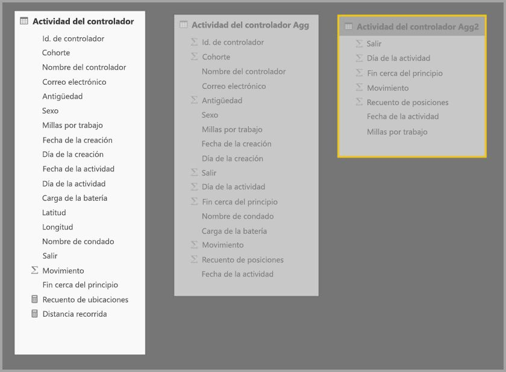

El cuadro de diálogo **Administrar agregaciones** para **Driver Activity Agg2** muestra el campo *Prioridad* con un valor de 10, el cual es superior al de **Driver Activity Agg**; esto significa que aquel campo será tenido en cuenta antes por las consultas que usen agregaciones. Las subconsultas que no están en la granularidad que se puede responder mediante **Driver Activity Agg2** tendrán en cuenta **Driver Activity Agg** en su lugar. Las consultas de detalles que no se pueden responder mediante cualquier tabla de agregación se dirigirán a **Driver Activity**.

La tabla especificada en la columna **Tabla de detalles** es **Driver Activity**, en lugar de **Driver Activity Agg** porque no se permiten las agregaciones encadenadas (vea el apartado [Validaciones](#validations) antes en este artículo).

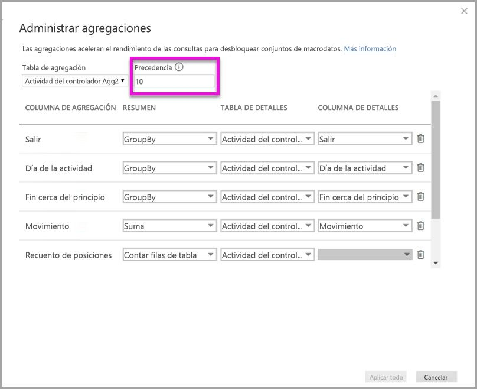

En esta tabla se muestran las agregaciones para la tabla **Sales Agg**.

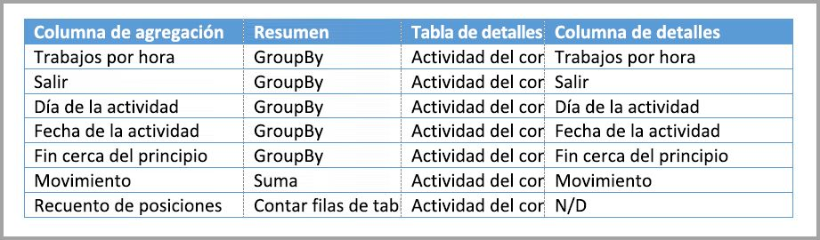

## Agregaciones basadas en columnas group-by combinadas con relaciones

Incluso puede combinar las dos técnicas para agregaciones anteriormente descritas en este artículo. Puede que para las **agregaciones** basadas en relaciones sea necesario que las tablas de dimensiones sin normalizar se dividan en varias tablas. Si resulta costoso o poco práctico para algunas tablas de dimensión, se pueden replicar los atributos necesarios en la tabla de agregación para ciertas dimensiones y relaciones usadas para otros usuarios.

El este modelo se replica *Month*, *Quarter*, *Semester* y *Year* en la tabla **Sales Agg**. No hay ninguna relación entre la tabla **Sales Agg** y **Date**. Hay relaciones a **Customer** y **Product Subcategory**. El modo de almacenamiento de **Sales Agg** es Import.

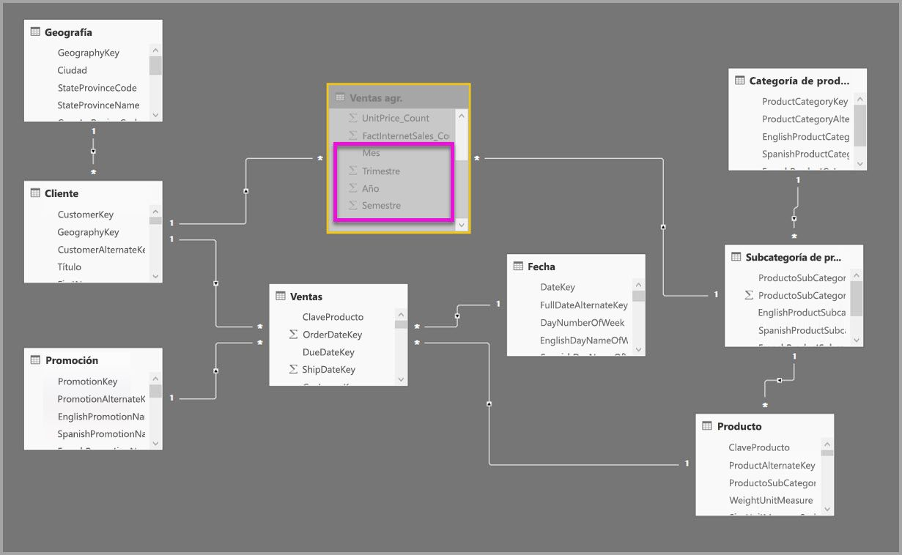

En esta tabla se muestran las entradas establecidas en el cuadro de diálogo **Administrar agregaciones** para la tabla **Sales Agg**. Las entradas de GroupBy donde **Date** es la tabla de detalles son obligatorias para alcanzar agregaciones para las consultas que agrupan por atributos Date. Como se muestra en el ejemplo anterior, las entradas de GroupBy para CustomerKey y ProductSubcategoryKey no afectan a los aciertos de agregaciones debido a la presencia de relaciones (de nuevo, a excepción de DISTINCTCOUNT).

> Nota: este modelo necesita que la tabla **Date** sea DirectQuery para rellenar el cuadro de diálogo Administrar agregaciones, porque se trata de una tabla de detalles. Es una limitación de la versión preliminar que queremos quitar para Disponibilidad general.

### Ejemplos de consultas

Esta consulta alcanza la agregación porque CalendarMonth está cubierto por la tabla de agregación y CategoryName es accesible a través de relaciones uno a varios. Se usará la agregación Sum para **SalesAmount**.

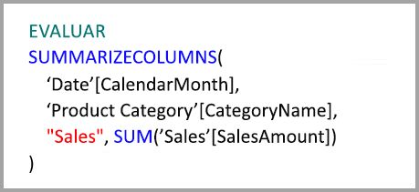

La siguiente consulta no alcanzará la agregación porque la tabla de agregación no abarca CalendarDay.

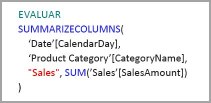

La siguiente consulta de inteligencia de tiempo no alcanzará la agregación porque la función DATESYTD genera una tabla de valores de CalendarDay, que la tabla de agregación no abarca.

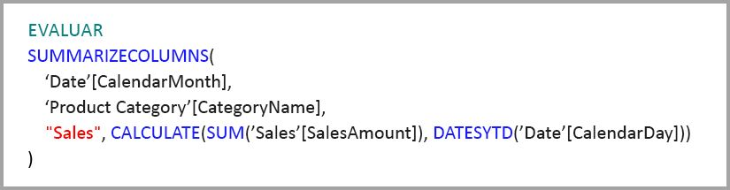

## Las cachés se deben mantener sincronizadas

Las **agregaciones** que combinan DirectQuery y el modo de almacenamiento de importación y/o dual, pueden devolver datos diferentes si la caché en memoria no se mantiene sincronizada con los datos de origen. La ejecución de consultas no intentará enmascarar los problemas de datos mediante, por ejemplo, el filtrado de los resultados de DirectQuery para coincidir con los valores en caché. Estas características son optimizaciones de rendimiento y se deben usar solo de forma que no pongan en peligro su capacidad para satisfacer los requisitos de negocio. Es su responsabilidad conocer los flujos de datos, así que diséñelos en consecuencia. Hay técnicas establecidas para controlar este tipo de problemas en el origen, si es necesario.

## Pasos siguientes

Los artículos siguientes describen más información sobre los modelos compuestos y también describen DirectQuery detalladamente.

* [Modelos compuestos en Power BI Desktop (versión preliminar)](desktop-composite-models.md)
* [Relaciones de varios a varios en Power BI Desktop (versión preliminar)](desktop-many-to-many-relationships.md)
* [Modo de almacenamiento en Power BI Desktop (versión preliminar)](desktop-storage-mode.md)

Artículos sobre DirectQuery:

* [Uso de DirectQuery en Power BI](desktop-directquery-about.md)
* [Orígenes de datos admitidos por DirectQuery en Power BI](desktop-directquery-data-sources.md)

