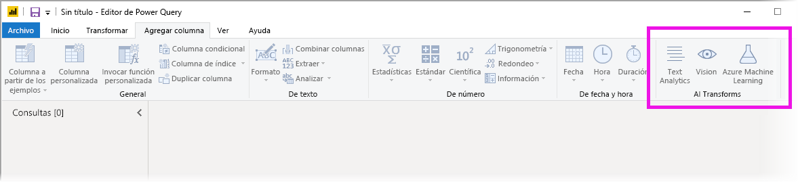
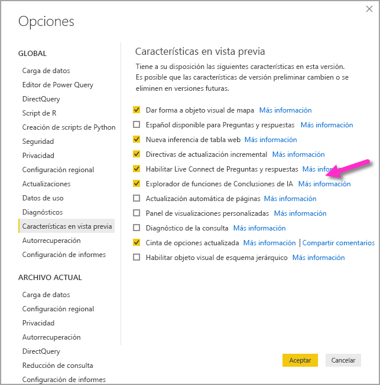
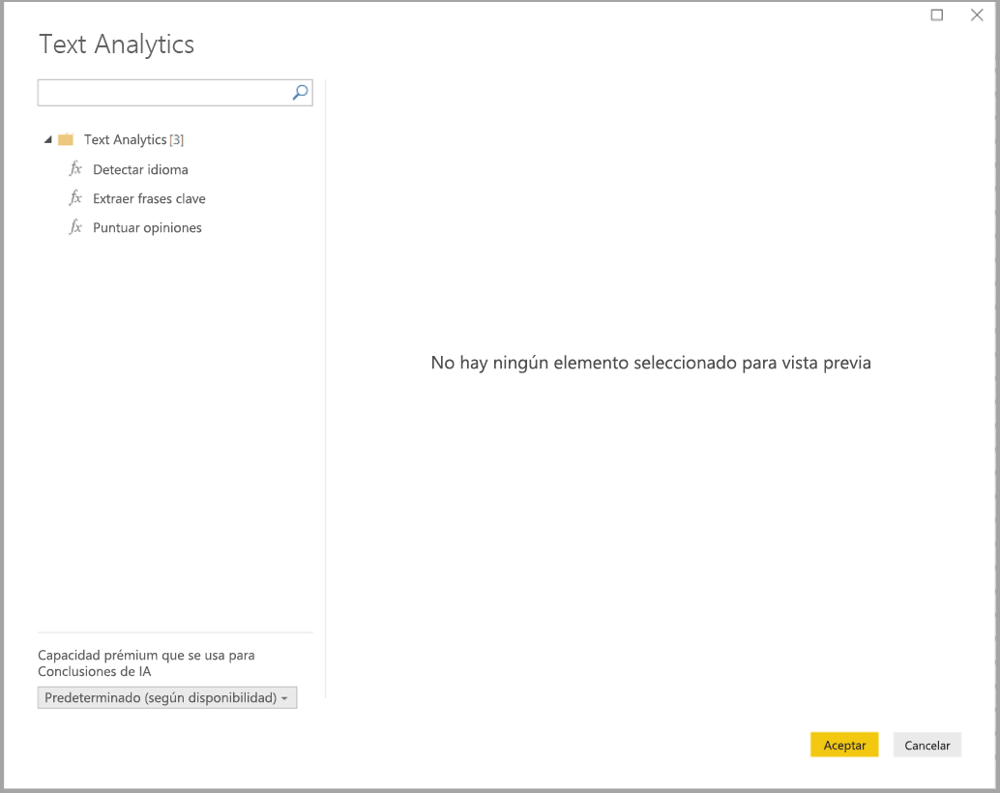
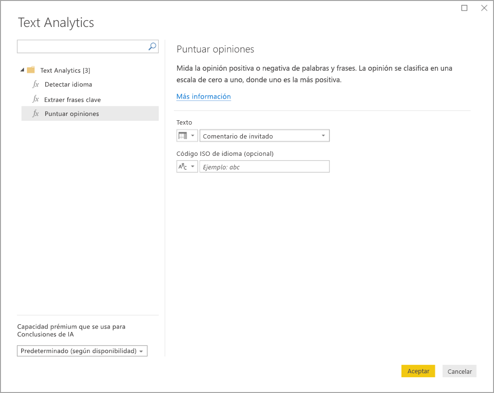
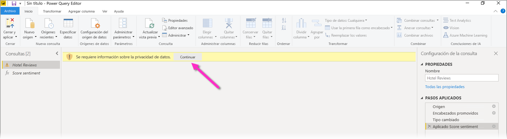
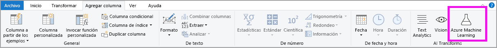
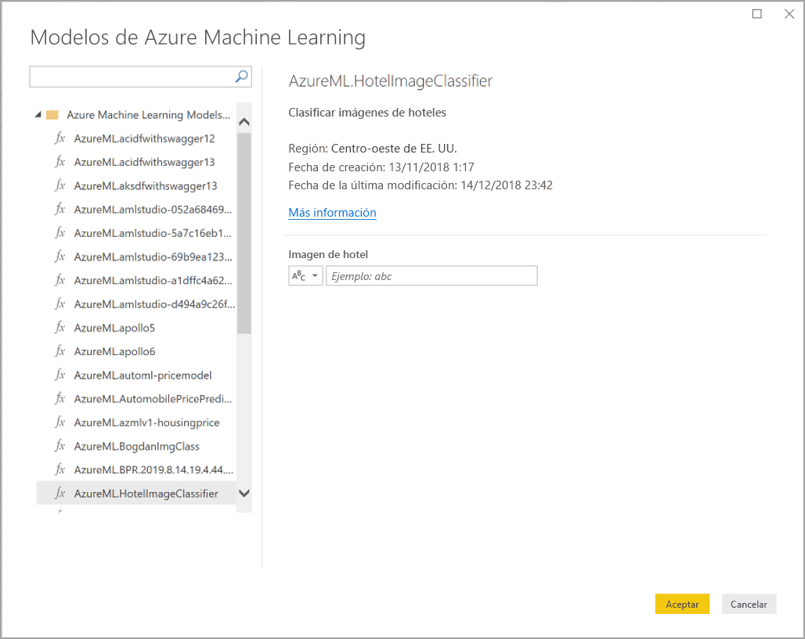

# Uso de Conclusiones de IA en Power BI Desktop (versión preliminar)

En Power BI, puede usar Conclusiones de IA para obtener acceso a una colección de modelos de Machine Learning entrenados previamente que mejoran los esfuerzos de preparación de datos. A Conclusiones de IA se accede en el **Editor de Power Query** y es posible acceder a sus características y funciones asociadas a través de las pestañas **Inicio** y **Agregar columna** del **Editor de Power Query**. 

En este artículo se describen las funciones de Text Analytics y Vision, ambas de Azure Cognitive Services. En este artículo también hay una sección en la que se describen las funciones personalizadas disponibles en Power BI de Azure Machine Learning.

## Habilitación de Conclusiones de IA

Conclusiones de IA de Power BI es una característica en vista previa (GB) y se debe habilitar. Para habilitarla, seleccione **Archivo > Opciones y configuración > Opciones** y, luego, **Características en vista previa (GB)** en la columna de la izquierda. En el panel de la derecha hay una selección del **explorador de funciones de Conclusiones de IA**. Active la casilla junto al **explorador de funciones de Conclusiones de IA** para habilitar la característica en vista previa (GB). Para que el cambio de la característica en vista previa (GB) se aplique, debe reiniciar Power BI Desktop.

## Uso de Text Analytics y Vision

Con Text Analytics y Vision en Power BI, puede aplicar algoritmos distintos de [Azure Cognitive Services](https://azure.microsoft.com/services/cognitive-services/) para enriquecer los datos en Power Query.

Estos son los servicios compatibles actualmente:

* [Análisis de sentimiento](https://docs.microsoft.com/azure/cognitive-services/text-analytics/how-tos/text-analytics-how-to-sentiment-analysis)
* [Extracción de frases clave](https://docs.microsoft.com/azure/cognitive-services/text-analytics/how-tos/text-analytics-how-to-keyword-extraction)
* [Detección de idioma](https://docs.microsoft.com/azure/cognitive-services/text-analytics/how-tos/text-analytics-how-to-language-detection)
* [Etiquetado de imágenes](https://docs.microsoft.com/azure/cognitive-services/computer-vision/concept-tagging-images) 

Las transformaciones se ejecutan en el servicio Power BI y no requieren una suscripción a Azure Cognitive Services. 

> [!IMPORTANT]
> 
> El uso de las características de Text Analytics o de Vision requiere Power BI Premium.

### Habilitación de Text Analytics y Vision en capacidades Premium

Cognitive Services son compatibles con los nodos de la capacidad Premium EM2, A2 o P1 y posteriores. Una carga de trabajo de IA independiente en la capacidad se usa para ejecutar Cognitive Services. Durante la versión preliminar pública de estas características (antes de junio de 2019), esta carga de trabajo se deshabilita de manera predeterminada. Antes de usar Cognitive Services en Power BI, la carga de trabajo de IA debe habilitarse en la **configuración de capacidad** del portal de administración. Puede activar la **carga de trabajo de IA** en la sección de **cargas de trabajo** y definir la cantidad máxima de memoria que desea que consuma esta carga de trabajo. El límite de memoria recomendado es del 20 %. Superar este límite hace que la consulta se ralentice.

### Funciones disponibles

En esta sección se describen las funciones disponibles en Cognitive Services en Power BI.

#### Detección de idioma

La función de detección de idioma evalúa la entrada de texto y, para cada campo, devuelve el nombre del idioma y el identificador ISO. Esta función es útil para las columnas de datos que recopilan texto arbitrario, donde se desconoce el idioma. La función espera los datos en formato de texto como entrada.

Text Analytics reconoce hasta 120 idiomas. Para obtener más información, consulte los [idiomas admitidos](https://docs.microsoft.com/azure/cognitive-services/text-analytics/text-analytics-supported-languages).

#### Extracción de frases clave

La función **Extracción de frases clave** evalúa el texto no estructurado y, para cada campo de texto, devuelve una lista de frases clave. La función requiere un campo de texto como entrada y acepta una entrada opcional para **información de referencia cultural**.

La extracción de frases clave funciona mejor si proporciona fragmentos de texto más grandes con los que trabajar. Con el análisis de sentimiento ocurre lo contrario, ya que su rendimiento es mejor en bloques de texto más pequeños. Para obtener los mejores resultados de ambas operaciones, considere la posibilidad de reestructurar las entradas en consecuencia.

#### Puntuación de opiniones

La función **Score Sentiment** (Puntuar opiniones) evalúa la entrada de texto y devuelve una puntuación de opiniones para cada documento, que va desde 0 (negativa) a 1 (positiva). Esta función es útil para detectar opiniones positivas y negativas en las redes sociales, revisiones del cliente y foros de debate.

Text Analytics usa un algoritmo de clasificación de aprendizaje automático para generar una puntuación de opiniones entre 0 y 1. Las puntuaciones más cercanas a 1 indican opiniones positivas, mientras que las más cercanas a 0 indican opiniones negativas. El modelo se entrena previamente con un cuerpo de texto extenso con asociaciones de opiniones. Actualmente, no es posible proporcionar sus propios datos de aprendizaje. El modelo usa una combinación de técnicas durante el análisis de texto, incluidas el procesamiento de texto, el análisis de funciones de sintaxis, la colocación de palabras y las asociaciones de palabras. Para obtener más información sobre el algoritmo, consulte [Introducción a Text Analytics](https://blogs.technet.microsoft.com/machinelearning/2015/04/08/introducing-text-analytics-in-the-azure-ml-marketplace/).

El análisis de sentimiento se realiza en todo el campo de entrada, en lugar de extraerse opiniones para una entidad concreta del texto. En la práctica, existe una tendencia a la precisión de la puntuación para mejorar cuando los documentos contienen una o dos frases en lugar de un gran bloque de texto. Durante una fase de evaluación de objetividad, el modelo determina si un campo de entrada como un todo es objetivo o contiene opiniones. Un campo de entrada que es principalmente objetivo no avanza a la fase de detección de sentimiento, lo que da lugar a una puntuación de 0,50 sin ningún procesamiento adicional. Para los campos de entrada que continúan en la canalización, la siguiente fase genera una puntuación superior o inferior a 0,50, dependiendo del grado de sentimiento detectado en el campo de entrada.

Actualmente, Análisis de sentimiento admite inglés, alemán, español y francés. Otros idiomas están en versión preliminar. Para obtener más información, consulte los [idiomas admitidos](https://docs.microsoft.com/azure/cognitive-services/text-analytics/text-analytics-supported-languages).

#### Etiquetado de imágenes

La función **Etiquetar imágenes** devuelve etiquetas basadas en más de 2000 objetos reconocibles, seres vivos, paisajes y acciones. Cuando las etiquetas son ambiguas o no son conocimientos habituales, el resultado proporciona *sugerencias* para aclarar el significado de la etiqueta en el contexto de una configuración conocida. Las etiquetas no se organizan como taxonomía y no existe ninguna jerarquía de herencia. Una colección de etiquetas de contenido constituye la base de una *descripción* de la imagen mostrada como lenguaje legible para el ser humano con formato en frases completas.

Después de cargar una imagen o especificar una dirección URL de la imagen, los algoritmos de Computer Vision generan etiquetas basadas en los objetos, seres vivos y acciones identificados en la imagen. El etiquetado no se limita al sujeto principal, como una persona en primer plano, sino que también incluye la configuración (interior o exterior), muebles, plantas, animales, accesorios, gadgets, etc.

Esta función requiere una dirección URL de la imagen o un campo Base 64 como entrada. En este momento, el etiquetado de imágenes admite inglés, español, japonés, portugués y chino simplificado. Para obtener más información, consulte los [idiomas admitidos](https://docs.microsoft.com/rest/api/cognitiveservices/computervision/tagimage/tagimage#uri-parameters).

### Invocación de funciones de Text Analytics o Vision en Power Query

Para enriquecer sus datos con funciones de Text Analytics o Vision, abra el **Editor de Power Query**. En este ejemplo se describe la puntuación de la opinión de un texto. Los mismos pasos se pueden usar para extraer frases clave, detectar el idioma y etiquetar las imágenes.

Seleccione el botón **Text Analytics** en la cinta de opciones **Inicio** o **Agregar columna**. Se le pedirá que inicie sesión.

Después de iniciar sesión, seleccione la función que quiere usar y la columna de datos que quiere transformar en la ventana emergente.

Power BI selecciona una capacidad Premium en la que se ejecutará la función y se devolverán los resultados a Power BI Desktop. La capacidad seleccionada solo se usa para la función de Text Analytics y Vision durante la aplicación y se actualiza en Power BI Desktop. Una vez que se publica el informe, las actualizaciones se ejecutan en la capacidad Premium del área de trabajo en que se publica el informe. Puede cambiar la capacidad usada para todas las instancias de Cognitive Services en la lista desplegable situada en la esquina inferior izquierda de la ventana emergente.

**Cultureinfo** es una entrada opcional para especificar el idioma del texto. Este campo es un código ISO. Puede usar una columna como entrada para Cultureinfo, o bien un campo estático. En este ejemplo, se especifica el idioma como inglés (en) para toda la columna. Si deja este campo en blanco, Power BI detectará automáticamente el idioma antes de aplicar la función. A continuación, seleccione **Aplicar**.

La primera vez que use Conclusiones de IA en un origen de datos nuevo, se le pedirá que establezca el nivel de privacidad de los datos.

> [!NOTE]
> Las actualizaciones del conjunto de datos en Power BI solo funcionarán para los orígenes de datos en los que el nivel de privacidad esté establecido en público o en organizacional.

Tras invocar la función, se agregará el resultado como una nueva columna a la tabla. También se agregará la transformación como un paso aplicado en la consulta.

En los casos de etiquetado de imágenes y extracción de frases clave, los resultados pueden devolver varios valores. Cada resultado individual se devuelve en un duplicado de la fila original.

### Publicación de un informe con las funciones de Text Analytics o Vision

Al editar en Power Query y realizar actualizaciones en Power BI Desktop, Text Analytics y Vision usan la capacidad Premium que se seleccionó en el Editor de Power Query. Después de publicar el informe en Power BI, usa la capacidad Premium del área de trabajo en la que se publicó.

Los informes con funciones de Text Analytics y Vision aplicadas se deben publicar en un área de trabajo que no esté en una capacidad Premium. De lo contrario, se producirá un error al actualizar del conjunto de datos.

### Administración del impacto en una capacidad Premium

En las secciones siguientes se describe cómo se pueden administrar los impactos de Text Analytics y Vision en una capacidad.

#### Selección de una capacidad

Los autores de los informes pueden seleccionar en qué capacidad Premium ejecutar Conclusiones de IA. De manera predeterminada, Power BI selecciona la primera capacidad creada a la que tiene acceso el usuario.

#### Supervisión con la aplicación Métricas de capacidad

Los propietarios de la capacidad Premium pueden supervisar el impacto de las funciones de Text Analytics y Vision en una capacidad con la [aplicación Métricas de capacidad de Power BI Premium](service-admin-premium-monitor-capacity.md). La aplicación proporciona métricas detalladas sobre el estado de las cargas de trabajo de IA dentro de la capacidad. En el gráfico superior se muestra el consumo de memoria por parte de las cargas de trabajo de IA. Los administradores de capacidad Premium pueden establecer el límite de memoria para la carga de trabajo de IA por capacidad. Cuando el uso de memoria alcanza el límite de memoria, puede considerar la posibilidad de aumentar el límite de memoria o mover algunas áreas de trabajo a una capacidad distinta.

### Comparación de Power Query y Power Query Online

Las funciones de Text Analytics y Vision que se usan en Power Query y Power Query Online son las mismas. Estas son las únicas diferencias entre ambas experiencias:

* Power Query tiene botones independientes para Text Analytics, Vision y Azure Machine Learning. En Power Query Online, se combinan en un menú.
* En Power Query, el autor del informe puede seleccionar la capacidad Premium que se usa para ejecutar las funciones. Esto no es necesario en Power Query Online, debido a que un flujo de datos ya está en una capacidad específica.

### Consideraciones y limitaciones de Text Analytics

Hay algunas consideraciones y limitaciones que se deben tener en cuenta al usar Text Analytics.

* Se admite la actualización incremental, pero puede causar problemas de rendimiento cuando se usa en consultas con Conclusiones de IA.
* No se admite DirectQuery.

## Uso de Azure ML

Numerosas organizaciones usan modelos de **Machine Learning** para obtener mejores conclusiones y predicciones sobre sus negocios. La capacidad de visualizar e invocar conclusiones de estos modelos en sus informes, paneles y otros análisis puede ayudar a divulgar estas conclusiones a los usuarios profesionales que más lo necesiten. Power BI facilita la incorporación de las conclusiones de modelos hospedados en Azure Machine Learning, mediante movimientos sencillos de apuntar y hacer clic.

Para usar esta funcionalidad, un científico de datos puede conceder acceso al modelo de Azure ML al analista de BI simplemente mediante Azure Portal. A continuación, al inicio de cada sesión, Power Query detecta todos los modelos de Azure ML a los que tiene acceso el usuario y los expone como funciones de Power Query dinámicas. Después, el usuario puede invocar esas funciones obteniendo acceso a ellas desde la cinta de opciones del Editor de Power Query o invocando directamente la función M. Power BI también procesa por lotes las solicitudes de acceso de forma automática al invocar el modelo de Azure ML para que un conjunto de filas logre un mejor rendimiento.

Actualmente, esta funcionalidad solo es compatible con los flujos de datos de Power BI y con Power Query Online en el servicio Power BI.

Para más información sobre los flujos de datos, consulte [Preparación de datos de autoservicio en Power BI](service-dataflows-overview.md).

Para más información sobre Azure Machine Learning, consulte los artículos siguientes:

- Información general: [¿Qué es Azure Machine Learning?](https://docs.microsoft.com/azure/machine-learning/service/overview-what-is-azure-ml)
- Guías de inicio rápido y tutoriales de Azure Machine Learning: [Documentación de Azure Machine Learning](https://docs.microsoft.com/azure/machine-learning/)

### Concesión de acceso a un modelo de Azure ML

Para obtener acceso a un modelo de Azure ML desde Power BI, el usuario debe tener acceso de **lectura** a la suscripción a Azure. Además, deben tener lo siguiente:

- En los modelos de Machine Learning Studio (clásico), acceso de **lectura** al servicio web Machine Learning Studio (clásico)
- En los modelos de Machine Learning, acceso de **lectura** al área de trabajo de Machine Learning

En los pasos de esta sección se describe cómo conceder un acceso de usuario de Power BI a un modelo hospedado en el servicio Azure ML de modo que pueda tener acceso a este modelo como función de Power Query. Para más detalles, consulte [Manage access using RBAC and the Azure portal](https://docs.microsoft.com/azure/role-based-access-control/role-assignments-portal) (Administrar el acceso mediante RBAC y Azure Portal).

1. Inicie sesión en [Azure Portal](https://portal.azure.com/).
2. Vaya a la página **Suscripciones**. Encontrará la página **Suscripciones** a través de la lista **Todos los servicios** del menú de navegación izquierdo de Azure Portal.
3. Seleccionar su suscripción
4. Seleccione **Control de acceso (IAM)** y, a continuación, el botón **Agregar**.
5. Seleccione **Lector** como rol. Seleccione el usuario de Power BI a quien desea conceder acceso al modelo de Azure ML.
6. Seleccione **Guardar**.
7. Repita los pasos del tres al seis para conceder acceso de **lectura** al usuario para el servicio web Machine Learning Studio (clásico) específico, *o bien* al área de trabajo de Machine Learning que hospeda el modelo.

### Detección de esquema para modelos de Machine Learning

Los científicos de datos usan principalmente Python para desarrollar e incluso implementar sus modelos de aprendizaje automático para Machine Learning. A diferencia de Machine Learning Studio (clásico), que ayuda a automatizar la tarea de creación de un archivo de esquema para el modelo, en el caso de Machine Learning, el científico de datos debe generar de forma explícita el archivo de esquema mediante Python.

Este archivo de esquema se debe incluir en el servicio web implementado para los modelos de Machine Learning. Para generar de forma automática el esquema para el servicio web, debe proporcionar un ejemplo de la entrada y salida en el script de entrada para el modelo implementado. Consulte la subsección sobre [Generación automática de esquemas de Swagger (opcional) en los modelos de implementación con la documentación del servicio Azure Machine Learning](https://docs.microsoft.com/azure/machine-learning/service/how-to-deploy-and-where#optional-automatic-schema-generation). El vínculo incluye el script de entrada de ejemplo con las instrucciones para la generación de esquemas.

En concreto, las funciones _@input\_schema_ y _@output\_schema_ del script de entrada hacen referencia a los formatos de ejemplo de entrada y salida de las variables _input\_sample_ y _output\_sample_, y usan estos ejemplos para generar una especificación OpenAPI (Swagger) para el servicio web durante la implementación.

Estas instrucciones para la generación de esquemas mediante la actualización del script de entrada también se deben aplicar a los modelos creados mediante experimentos automatizados de aprendizaje automático con el SDK de Azure Machine Learning.

> [!NOTE]
> Actualmente, en los modelos creados con la interfaz visual de Azure Machine Learning no se admite la generación de esquemas, pero se admitirá en versiones posteriores.
> 
### Invocación de un modelo de Azure ML en Power Query

Puede invocar cualquier modelo de Azure ML al que se le haya concedido acceso directamente desde el Editor de Power Query. Para tener acceso a los modelos de Azure ML, seleccione el botón **Azure Machine Learning** en la cinta de opciones **Inicio** o **Agregar columna** del Editor de Power Query.

Todos los modelos de Azure ML a los que tiene acceso se recogen aquí como funciones de Power Query. Asimismo, los parámetros de entrada para el modelo de Azure ML se asignan automáticamente como parámetros de la función de Power Query correspondiente.

Para invocar un modelo de Azure ML, puede especificar cualquiera de las columnas de la entidad seleccionadas como entrada del menú desplegable. También puede especificar un valor constante que se va a usar como entrada cambiando el icono de la columna a la izquierda del cuadro de diálogo de entrada.

Seleccione **Aceptar** para ver la versión preliminar del resultado del modelo de Azure ML como nueva columna en la tabla de entidades. También verá la invocación de modelos como paso aplicado para la consulta.

Si el modelo devuelve varios parámetros de salida, se agrupan como registro en la columna de salida. Puede expandir la columna para producir parámetros de salida individuales en columnas independientes.

### Consideraciones y limitaciones de Azure ML

Las consideraciones y limitaciones siguientes se aplican a Azure ML en Power BI Desktop.

* Actualmente, en los modelos creados con la interfaz visual de Azure Machine Learning no se admite la generación de esquemas. Se prevé compatibilidad en versiones posteriores.
* Se admite la actualización incremental, pero puede causar problemas de rendimiento cuando se usa en consultas con Conclusiones de IA.
* No se admite DirectQuery.

## Pasos siguientes

En este artículo se proporcionó información de la integración de Machine Learning en Power BI Desktop. Los siguientes artículos también podrían ser interesantes y útiles.

- [Tutorial: Invocación de un modelo de Machine Learning Studio (clásico) en Power BI](service-tutorial-invoke-machine-learning-model.md)
- [Tutorial: Uso de Cognitive Services en Power BI](service-tutorial-use-cognitive-services.md)
- [Cognitive Services en Power BI](service-cognitive-services.md)
- [Integración de Azure Machine Learning en Power BI](service-machine-learning-integration.md)
- [Supervisión de capacidades Premium con la aplicación](service-admin-premium-monitor-capacity.md)
- [Métricas de IA en la aplicación Métricas de capacidad Premium](https://powerbi.microsoft.com/blog/ai-metrics-now-available-in-power-bi-premium-capacity-metrics-app/)
