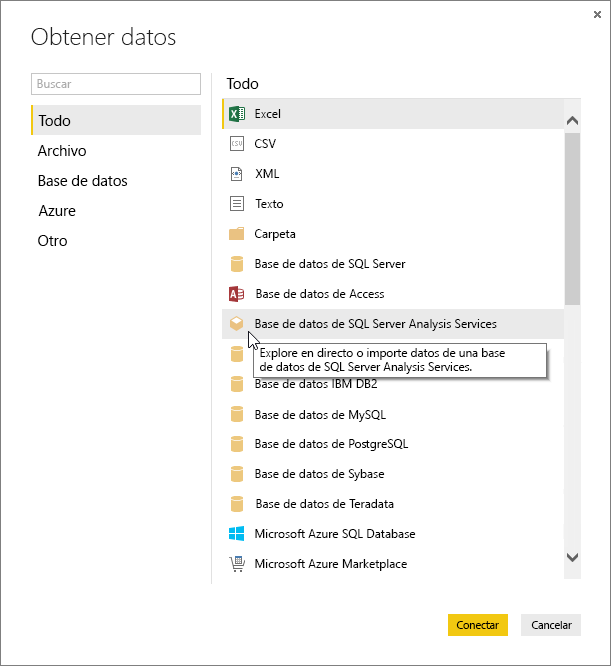
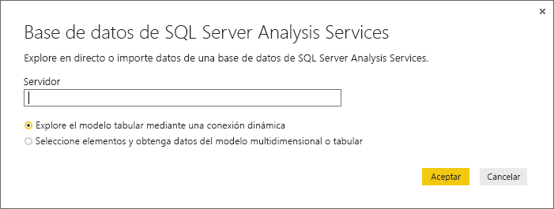
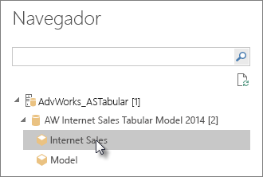
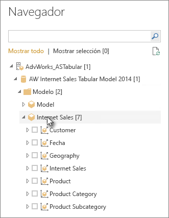

# Conexión a datos tabulares de Analysis Services en Power BI Desktop
En Power BI Desktop hay dos maneras de conectarse a los datos y obtenerlos a partir del modelo tabular de SQL Server Analysis Services: Puede explorar mediante una conexión dinámica, o bien seleccionar los elementos e importarlos en Power BI Desktop.

Analicemos la cuestión más detenidamente.

**Exploración mediante una conexión dinámica**: cuando se usa una conexión dinámica, los elementos del modelo tabular o la perspectiva (como las tablas, columnas y medidas) aparecen en la lista del panel **Campos** de Power BI Desktop. Puede usar las herramientas avanzadas de informe y visualización de Power BI Desktop para explorar el modelo tabular de formas nuevas y altamente interactivas.

Cuando se realiza la conexión dinámica, no se importa ningún dato del modelo tabular en Power BI Desktop. Cada vez que interactúe con una visualización, Power BI Desktop consulta el modelo tabular y calcula los resultados obtenidos. Siempre consulta los datos más recientes disponibles en el modelo tabular, ya sea desde la última hora de procesamiento o desde tablas de DirectQuery disponibles en el modelo tabular. 

Tenga en cuenta que los modelos tabulares son muy seguros. Los elementos que aparecen en Power BI Desktop dependen de los permisos del modelo tabular al que está conectado.

Cuando haya creado los informes dinámicos en Power BI Desktop, podrá compartirlos publicándolos en el sitio de Power BI. Al publicar un archivo de Power BI Desktop con una conexión dinámica en un modelo tabular en un sitio de Power BI, un administrador debe instalar y configurar una puerta de enlace de datos local. Para más información, consulte [Puerta de enlace de datos local](service-gateway-onprem.md).

**Selección de elementos e importación en Power BI Desktop**: cuando se conecte con esta opción, podrá seleccionar elementos (como tablas, columnas y medidas) en el modelo tabular o la perspectiva, y cargarlos en un modelo de Power BI Desktop. Use el Editor de Power Query de Power BI Desktop para dar forma adicional a lo que quiere y a sus características de modelado para seguir modelando los datos. Como no se mantiene ninguna conexión dinámica entre Power BI Desktop y el modelo tabular, puede explorar el modelo de Power BI Desktop sin conexión o publicar en el sitio de Power BI.

## Conexión a un modelo tabular
1. En Power BI Desktop, en la pestaña **Inicio**, seleccione **Obtener datos** > **Más** > **Base de datos**.
   
1. Seleccione **Base de datos SQL Server Analysis Services** y, después **Conectar**.
   
   
3. En la ventana **Base de datos SQL Server Analysis Services**, escriba el nombre del **Servidor**, elija un modo de conexión y, después, seleccione **Aceptar**.
   
   
4. Este paso de la ventana **Navegador** depende del modo de conexión que haya seleccionado:

   - Si realiza una conexión dinámica, seleccione un modelo tabular o una perspectiva.
  
      
   - Si elige la selección de elementos y la obtención de datos, seleccione un modelo tabular o una perspectiva y, después, seleccione una tabla o columna determinada para cargar. Para dar forma a los datos antes de cargarlos, seleccione **Editar consultas** para abrir el Editor de Power Query. Cuando esté listo, seleccione **Cargar** para importar los datos en Power BI Desktop.

      

## Preguntas más frecuentes
**Pregunta:** ¿Se necesita una puerta de enlace de datos local?

**Respuesta:** Depende. Si usa Power BI Desktop para realizar la conexión dinámica a un modelo tabular, pero no tiene intención de publicar en el sitio de Power BI, no necesita una puerta de enlace. Por otro lado, si piensa realizar la publicación en su sitio de Power BI, es necesaria una puerta de enlace de datos para garantizar una comunicación segura entre el servicio Power BI y el servidor de Analysis Services local. Asegúrese de hablar con el administrador del servidor de Analysis Services antes de instalar una puerta de enlace.

Si elige la selección de elementos y la obtención de datos, los datos del modelo tabular se importan directamente en el archivo de Power BI Desktop, por lo que no se necesita ninguna puerta de enlace.

**Pregunta:** ¿Cuál es la diferencia entre la conexión dinámica a un modelo tabular desde el servicio de Power BI y la conexión dinámica desde Power BI Desktop?

**Respuesta:** Cuando se realiza una conexión dinámica a un modelo tabular desde el sitio en el servicio Power BI a una base de datos de Analysis Services local de la organización, se necesita una puerta de enlace de datos local para garantizar las comunicaciones entre ellos. Cuando se realiza una conexión dinámica con un modelo tabular desde Power BI Desktop, no se necesita una puerta de enlace porque tanto Power BI Desktop como el servidor de Analysis Services al que se está conecta se ejecutan de forma local en la organización. Sin embargo, si publica el archivo de Power BI Desktop a su sitio de Power BI, se requiere una puerta de enlace.

**Pregunta:** Si creo una conexión dinámica, ¿puedo conectarme a otro origen de datos en el mismo archivo de Power BI Desktop?

**Respuesta:** No. No puede explorar datos dinámicos y conectarse a otro tipo de origen de datos en el mismo archivo. Si ya ha importado los datos o se ha conectado a otro origen de datos en un archivo de Power BI Desktop, tendrá que crear un archivo para realizar la exploración dinámica.

**Pregunta:** Si creo una conexión dinámica, ¿puedo modificar el modelo o la consulta en Power BI Desktop?

**Respuesta:** Puede crear medidas de nivel de informe en Power BI Desktop, pero se deshabilitan todas las demás características de consulta y el modelado al explorar datos activos.

**Pregunta:** ¿Es seguro crear una conexión dinámica?

**Respuesta:** Sí. Las credenciales de Windows actuales se usan para conectarse al servidor de Analysis Services. No puede usar las credenciales básicas o almacenadas en el servicio Power BI o en Power BI Desktop cuando se realiza la exploración dinámica.

**Pregunta:** En el navegador, veo un modelo y una perspectiva. ¿Cuál es la diferencia?

**Respuesta:** Una perspectiva es una vista determinada de un modelo tabular. Puede incluir solo tablas, columnas o medidas, según la necesidad de análisis de datos únicos. Un modelo tabular siempre contiene al menos una perspectiva, que podría incluir todo el contenido del modelo. Si no está seguro de qué perspectiva debe seleccionar, consulte con su administrador.

**Pregunta:** ¿Hay alguna característica de Analysis Services que cambie el comportamiento de Power BI?

**Respuesta:** Sí. En función de las características que use el modelo tabular, la experiencia en Power BI Desktop podría cambiar. Estos son algunos ejemplos:
* Es posible que vea las medidas del modelo agrupadas en la parte superior de la lista del panel **Campos** en lugar de en tablas junto a las columnas. No se preocupe, todavía puede usarlas de la forma habitual; es más fácil encontrarlas de esta manera.

* Si el modelo tabular tiene grupos de cálculo definidos, solo puede usarlos junto con las medidas del modelo y no con las medidas implícitas que cree al agregar campos numéricos a un objeto visual. Es posible que también se haya establecido la marca **DiscourageImplicitMeasures** de forma manual en el modelo, lo que tiene el mismo efecto. Para obtener más información, vea [Grupos de cálculo en Analysis Services](https://docs.microsoft.com/analysis-services/tabular-models/calculation-groups#benefits).

## Para cambiar el nombre del servidor después de la conexión inicial
Después de crear un archivo de Power BI Desktop con una conexión dinámica de exploración, podría haber algunos casos en los que quiera cambiar la conexión a otro servidor. Por ejemplo, si ha creado el archivo de Power BI Desktop al conectarse a un servidor de desarrollo y antes de realizar la publicación en el servicio de Power BI, desea cambiar la conexión al servidor de producción.

Para cambiar el nombre del servidor:

1. Seleccione **Editar consultas** en la pestaña **Inicio**.

2. En la ventana **Base de datos SQL Server Analysis Services**, escriba el nombre del **Servidor** nuevo y, después, seleccione **Aceptar**.

   
## Solución de problemas 
En la lista siguiente se describen todos los problemas conocidos al conectarse a SQL Server Analysis Services (SSAS) o Azure Analysis Services: 

* **Error: No se ha podido cargar el esquema de modelo**: este error se suele producir si el usuario que intenta conectarse a Analysis Services no tiene acceso a la base de datos o al modelo.

