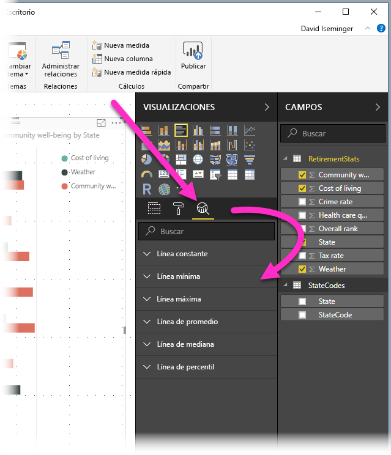
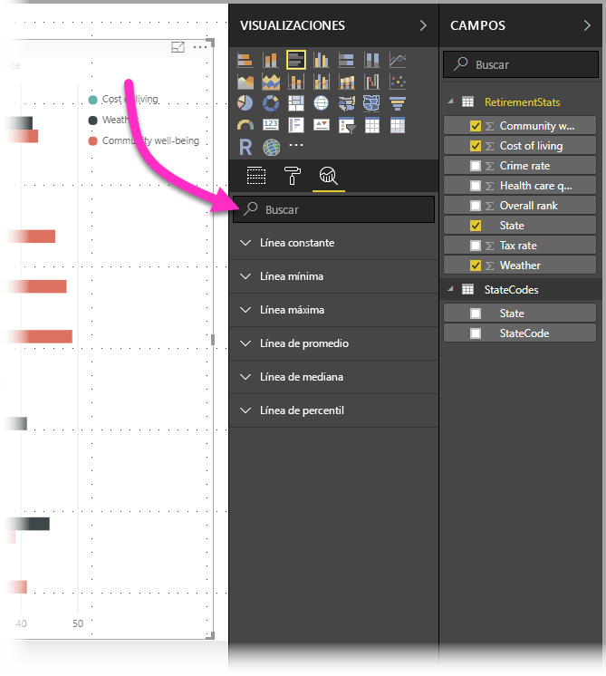
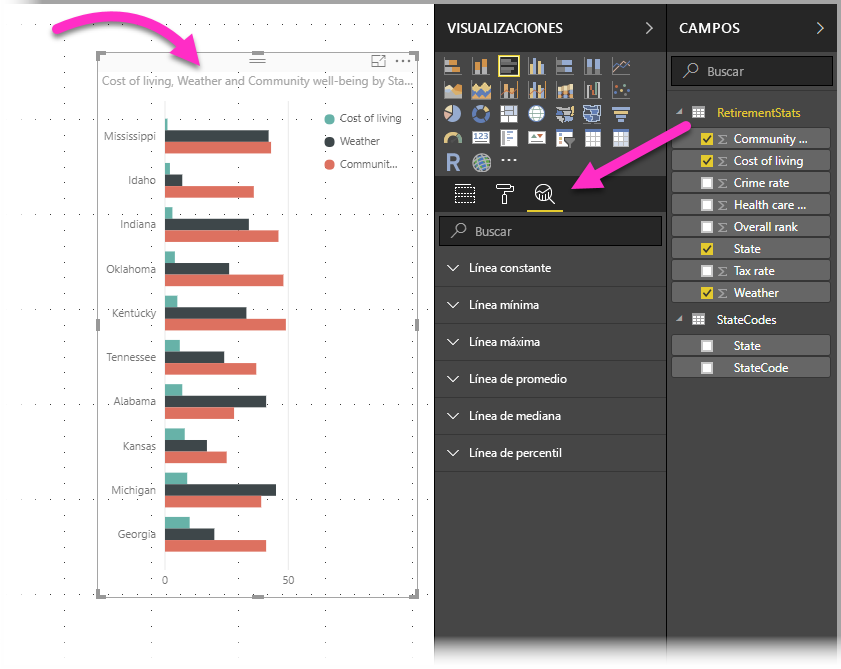
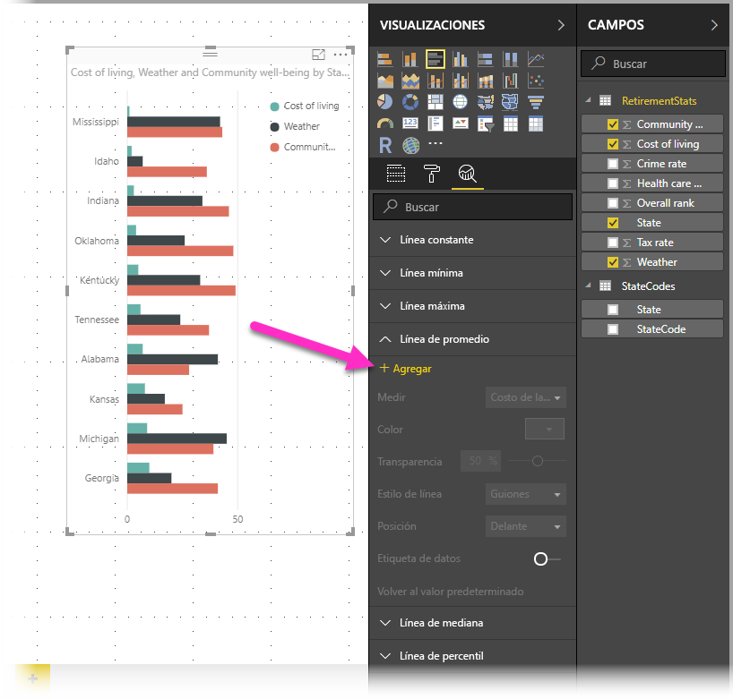
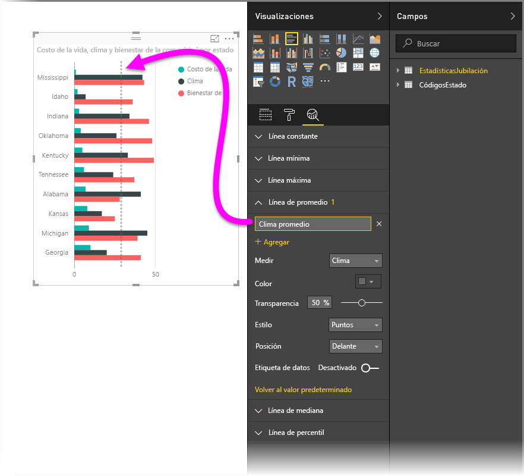
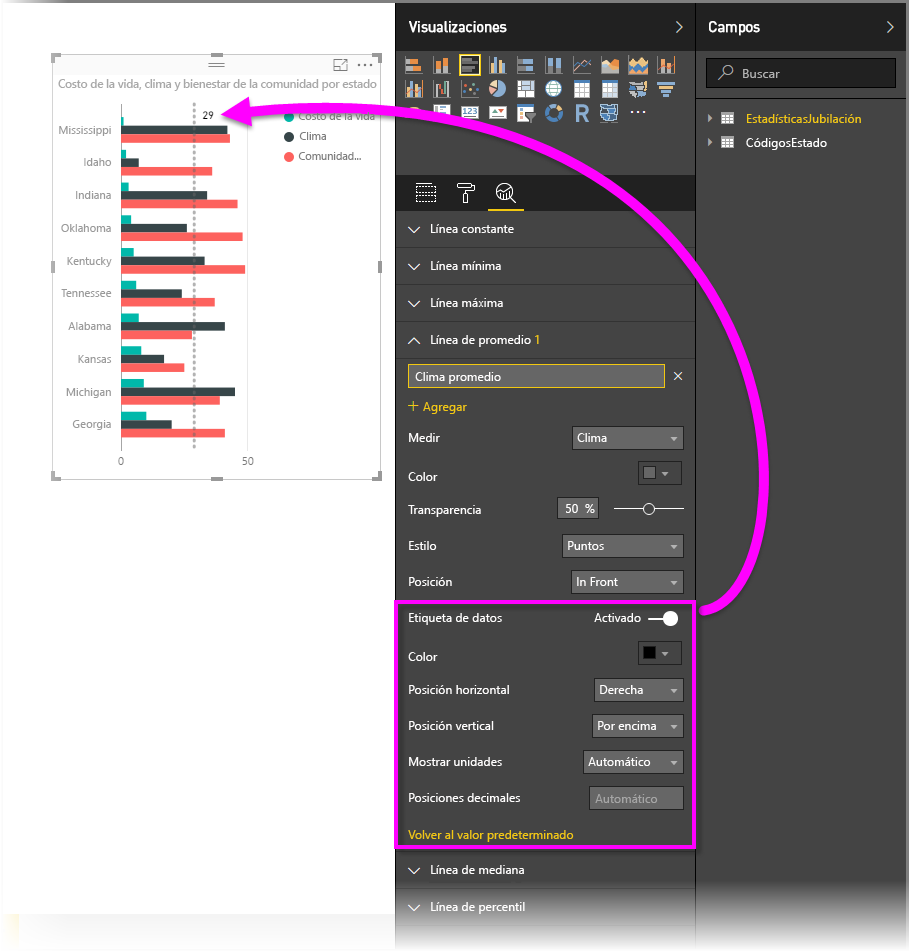
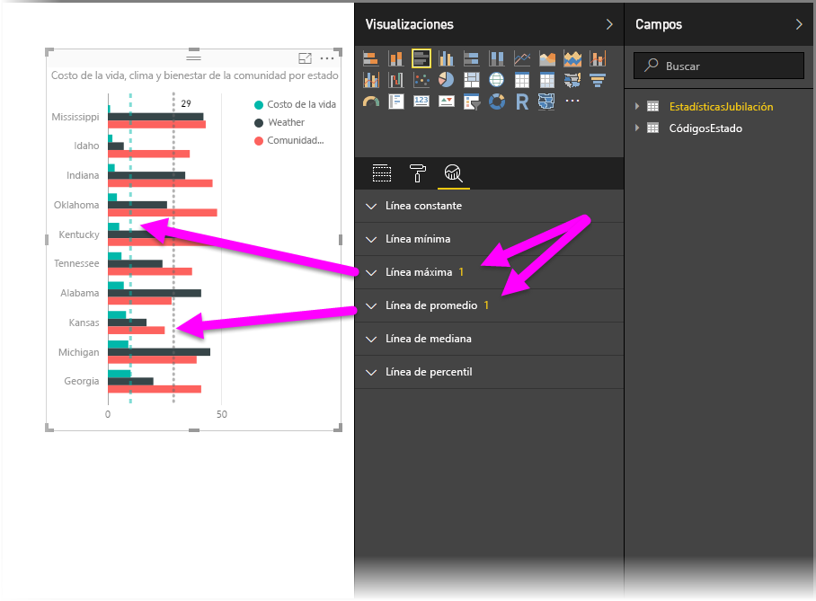
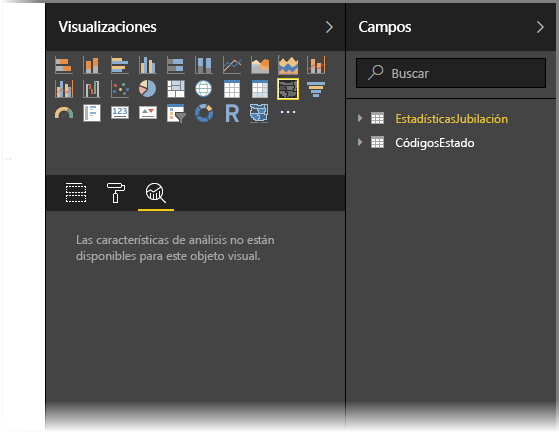
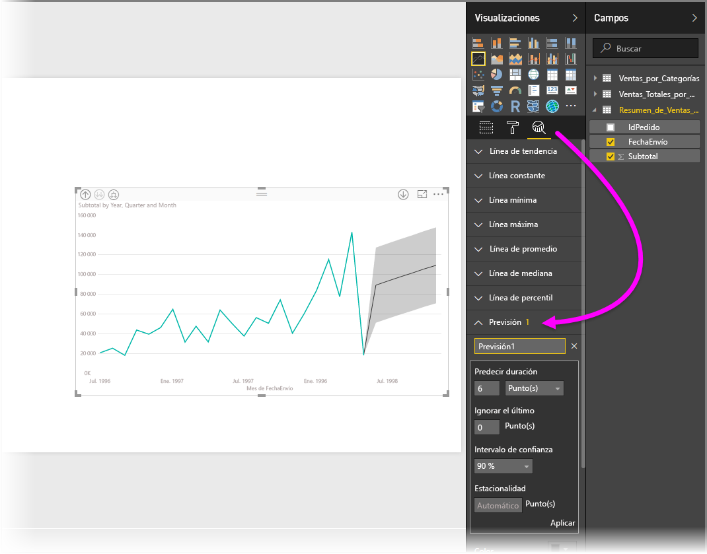

# Uso del panel Análisis en Power BI Desktop

Con el panel **Análisis** en *Power BI Desktop*, puede agregar líneas de referencia dinámicas en objetos visuales y destacar las tendencias o detalles importantes. El panel e icono **Análisis** se encuentran en el área **Visualizaciones** de Power BI Desktop.

> [!NOTE]
> El panel **Analytics** solo se muestra cuando se selecciona un objeto visual en el lienzo de Power BI Desktop.

## Búsqueda en el panel Análisis

Desde la versión de febrero de 2018 de Power BI Desktop (versión 2.55.5010.201 o posterior), puede buscar en el panel **Análisis**, que es una subsección del panel **Visualizaciones**. El cuadro de búsqueda aparece cuando se selecciona el icono **Análisis**.

## Uso del panel Analytics

Con el panel **Análisis**, puede crear estos tipos de líneas de referencias dinámicas:

* Línea constante del eje X
* Línea constante del eje Y
* Línea mínima
* Línea máxima
* Línea promedio
* Línea mediana
* Línea de percentil
* Sombreado de simetría

> [!NOTE]
> No todas las líneas están disponibles para todos los tipos de objetos visuales.

Las secciones siguientes muestran cómo se puede usar el panel **Analytics** y las líneas de referencia dinámicas en las visualizaciones.

Para ver las líneas de referencia dinámicas disponibles para un objeto visual, siga estos pasos:

1. Seleccione o cree un objeto visual y, a continuación, seleccione el icono **Analytics** desde la sección **Visualizaciones**.

    

2. Seleccione el tipo de línea que desea crear para expandir sus opciones. En este caso, seleccionaremos **Línea promedio**.

    

3. Para crear una línea, seleccione **+&nbsp;Agregar**. Luego, puede asignarle un nombre a la línea. Haga doble clic en el cuadro de texto y escriba su nombre.

    Ahora tiene todo tipo de opciones para la línea. Puede especificar su **Color**, el porcentaje de **Transparencia**, el **Estilo de línea** y la **Posición** (en comparación con los elementos de datos del objeto visual). También puede elegir si quiere incluir la **Etiqueta de datos**. Para especificar la medida visual en la que se basará la línea, seleccione la lista desplegable **Medida**, que se rellena automáticamente con los elementos de datos del objeto visual. Aquí seleccionaremos **Referencia cultural** como medida, la etiquetaremos como *Promedio de referencia cultural* y personalizaremos algunas de las otras opciones.

    

4. Si quiere que aparezca una etiqueta de datos, cambie **Etiqueta de datos** de **Desactivada** a **Activada**. Al hacerlo, obtendrá una gran variedad de opciones adicionales para la etiqueta de datos.

    

5. Observe el número que aparece junto al elemento **Línea promedio** en el panel **Analytics**. Eso le indica cuántas líneas dinámicas tiene actualmente en el objeto visual y de qué tipo son. Si agregamos una **Línea máxima** para **Affordability** (Asequibilidad), el panel **Análisis** muestra que ahora también tenemos una línea de referencia dinámica de **Línea máxima** aplicada a este objeto visual.

    

Si el objeto visual seleccionado no puede tener líneas de referencia dinámica aplicadas (en este caso, un objeto visual de **Mapa**), verá el mensaje siguiente al seleccionar el panel **Análisis**.

Puede resaltar distintos tipos de información interesante mediante la creación de líneas de referencia dinámicas con el panel **Análisis**.

Estamos planeando más características y funcionalidades, como la ampliación de los objetos visuales que pueden tener líneas de referencia dinámicas aplicadas. Vuelva periódicamente para ver las novedades.

## Aplicación de Previsión

Si tiene datos de tiempo en el origen, puede usar la característica de *previsión*. Simplemente debe seleccionar un objeto visual y, luego, expandir la sección **Previsión** del panel **Análisis**. Puede especificar muchas entradas para modificar la previsión, como **Predecir duración** o el **Intervalo de confianza**. En la imagen siguiente se muestra un objeto visual de línea básica con la previsión aplicada. Use su imaginación (y juegue con la previsión) para ver cómo se puede aplicar a los modelos.

> [!NOTE]
> La característica de previsión solo está disponible para los objetos visuales de gráfico de líneas.

## Limitaciones

La capacidad de usar líneas de referencia dinámicas se basa en el tipo de objeto visual que se está usando. En las listas siguientes se describen estas limitaciones de manera más específica.

Puede usar la *línea constante del eje x*, la *línea constante del eje y* y el *sombreado de simetría* en el objeto visual siguiente:

* Gráfico de dispersión

El uso de *línea constante*, *línea mínima*, *línea máxima*, *línea promedio*, *línea mediana* y *línea de percentil* solo está disponible en estos objetos visuales:

* Gráfico de áreas
* Gráfico de barras agrupadas
* Gráfico de columnas agrupadas
* Gráfico de líneas
* Gráfico de dispersión

Los siguientes objetos visuales solo pueden usar una *línea constante* del panel **Analytics**:

* Gráfico de áreas apiladas
* Gráfico de barras apiladas
* Gráfico de columnas apiladas
* Gráfico de cascada
* Gráfico de barras 100 % apiladas
* Gráfico de columnas 100 % apiladas

Los objetos visuales siguientes pueden usar una *línea de tendencia* si hay datos de tiempo:

* Gráfico de áreas
* Gráfico de columnas agrupadas
* Gráfico de líneas
* Gráfico de líneas y columnas agrupadas

Por último, actualmente no se pueden aplicar líneas dinámicas a muchos objetos visuales, incluidos, entre otros, los siguientes:

* Embudo
* Gráfico de líneas y columnas agrupadas
* Gráfico de líneas y columnas apiladas
* Gráfico de la barra de herramientas
* Objetos visuales no cartesianos, como gráficos de anillos, medidores, matrices, gráficos circulares y tablas

La *línea de percentil* solo está disponible cuando se usan datos importados en Power BI Desktop o cuando se establece una conexión dinámica con un modelo en un servidor que ejecuta **Analysis Service 2016** o posterior, **Azure Analysis Services** o un conjunto de datos en el servicio Power BI.

## Pasos siguientes

Puede hacer todo tipo de cosas con Power BI Desktop. Para obtener más información sobre sus capacidades, consulte los siguientes recursos:

* [Novedades de Power BI Desktop](desktop-latest-update.md)
* [Obtener Power BI Desktop](desktop-get-the-desktop.md)
* [¿Qué es Power BI Desktop?](desktop-what-is-desktop.md)
* [Información general sobre consultas con Power BI Desktop](desktop-query-overview.md)
* [Tipos de datos en Power BI Desktop](desktop-data-types.md)
* [Combinar datos y darles forma con Power BI Desktop](desktop-shape-and-combine-data.md)
* [Realización de tareas de consultas comunes en Power BI Desktop](desktop-common-query-tasks.md)
