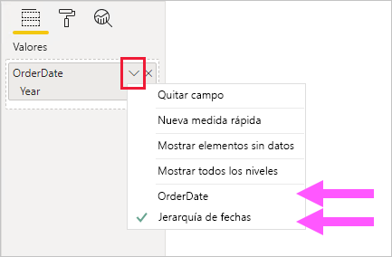
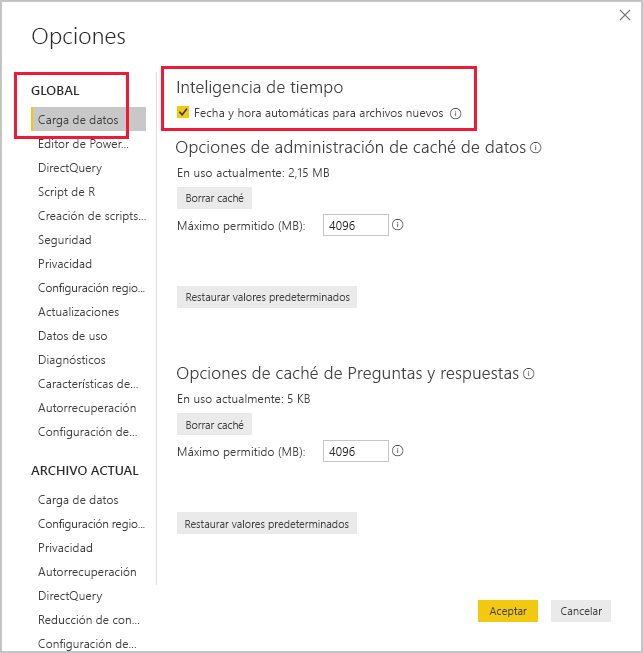

# <a name="auto-datetime-in-power-bi-desktop"></a>Fecha y hora automáticas en Power BI Desktop

Este artículo se dirige a los modeladores de datos que desarrollan modelos compuestos o de importación en Power BI Desktop. Presenta y describe la opción _Fecha y hora automáticas_.

La opción Fecha y hora automáticas es una opción de carga de datos de Power BI Desktop. El objetivo de esta opción es facilitar la creación de prácticos informes de inteligencia de tiempo basados en columnas de fecha cargadas en un modelo. En concreto, permite a los autores de los informes usar el modelo de datos para filtrar, agrupar y explorar en profundidad empleando períodos de tiempo de calendario (años, trimestres, meses y días). Lo importante es que no es necesario desarrollar de forma explícita estas funcionalidades de inteligencia de tiempo.

Cuando se habilita esta opción, Power BI Desktop crea una tabla oculta de fecha y hora automáticas para cada columna de fecha, siempre que se cumplan todas las condiciones siguientes:

- El modo de almacenamiento de tabla es Importar
- El tipo de datos de la columna es fecha o fecha/hora
- La columna no es el lado "varios" de una relación de modelo

## <a name="how-it-works"></a>Cómo funciona

Cada tabla de fecha y hora automáticas es en realidad una [tabla calculada](desktop-calculated-tables.md) que genera filas de datos mediante la función DAX [CALENDAR](/dax/calendar-function-dax). Cada tabla también incluye seis columnas calculadas: **Day**, **MonthNo**, **Month**, **QuarterNo**, **Quarter** y **Year**.

> [!NOTE]
> Power BI traduce y da formato a los nombres de las columnas y a los valores según el [lenguaje del modelo](supported-languages-countries-regions.md#choose-the-language-for-the-model-in-power-bi-desktop).

Power BI Desktop también crea una relación entre la columna **Date** de la tabla de fecha y hora automáticas y la columna de fecha del modelo.

La tabla de fecha y hora automáticas contiene años naturales completos que abarcan todos los valores de fecha almacenados en la columna de fecha del modelo. Por ejemplo, si el valor más antiguo de una columna de fecha es el 20 de marzo de 2016 y el último valor es el 23 de octubre de 2019, la tabla contendrá 1461 filas. Representa una fila por cada fecha en los cuatro años naturales de 2016 a 2019. Cuando Power BI actualiza el modelo, también se actualizan todas las tablas de fecha y hora automáticas. De este modo, el modelo siempre contiene fechas que abarcan los valores de la columna de fecha.

Si fuera posible ver las filas de una tabla de fecha y hora automáticas, podrían tener un aspecto similar al siguiente:


> [!NOTE]
> Las tablas de fecha y hora automáticas están ocultas permanentemente, incluso para los modeladores. No se pueden ver en el panel **Campos** ni en el diagrama de vistas de modelos y sus filas no se pueden ver en la vista de datos. Además, las expresiones DAX no pueden hacer referencia directamente a la tabla y a su columna.

La tabla también define una jerarquía, que proporciona objetos visuales con una ruta de exploración en profundidad a través de los niveles de año, trimestre, mes y día.

Si fuera posible ver una tabla de fecha y hora automáticas en el diagrama de vistas de modelos, podría tener el siguiente aspecto (se resaltan las columnas relacionadas):

![Ejemplo del posible aspecto de una tabla oculta de fecha y hora automáticas. Se muestran dos tablas: Sales y LocalDateTime. Las tablas se relacionan mediante la columna OrderDate de la tabla Sales y la columna Date de la tabla LocalDateTime. LocalDateTime define siete columnas: Date, Day, Month, MonthNo, Quarter, QuarterNo, Year y una única jerarquía. La jerarquía se denomina Date Hierarchy (Jerarquía de fechas) y consta de cuatro niveles: Year (Año), Quarter (Trimestre), Month (Mes) y Day (Día).](media/desktop-auto-date-time/auto-date-time-hidden-table-example-diagram.png)

## <a name="work-with-auto-datetime"></a>Trabajar con fecha y hora automáticas

Cuando existe una tabla de fecha y hora automáticas para una columna de fecha (y esa columna está visible), los autores de informes no encontrarán esa columna como un campo en el panel **Campos**. En su lugar, buscan un objeto expansible que tiene el nombre de la columna de fecha. Puede identificarlo fácilmente porque está indicado con un icono de calendario. Cuando los autores de los informes expandan el objeto de calendario, encontrarán una jerarquía denominada **Jerarquía de fechas**. Al expandir la jerarquía, encontrarán cuatro niveles: **Year** (Año), **Quarter** (Trimestre), **Month** (Mes) y **Day** (Día).


La jerarquía generada de fecha y hora automáticas se puede usar para configurar un objeto visual exactamente de la misma manera que se pueden usar las jerarquías normales. Los objetos visuales se pueden configurar con la jerarquía **Date Hierarchy** (Jerarquía de fechas) completa o con niveles específicos de la jerarquía.

Sin embargo, existe una funcionalidad agregada que no admiten las jerarquías normales. Cuando la jerarquía de fecha y hora automáticas (o un nivel de la jerarquía) se agrega a un contenedor de objetos visuales, los autores de los informes pueden usar la jerarquía o bien la columna de fecha. Este enfoque tiene sentido para algunos objetos visuales, cuando lo único que necesitan es la columna de fecha, no la jerarquía y sus niveles. En primer lugar, configurarán el campo visual (haga clic con el botón derecho en el campo visual o haga clic en la flecha hacia abajo) y, a continuación, usarán el menú contextual para cambiar entre la columna de fecha o la jerarquía de fechas.



Por último, los cálculos del modelo, escritos en DAX, pueden hacer referencia a una columna de fecha _directamente_ o a las columnas de la tabla oculta de fecha y hora automáticas _indirectamente_.

La fórmula escrita en Power BI Desktop puede hacer referencia a una columna de fecha de la manera habitual. Sin embargo, se debe hacer referencia a las columnas de la tabla de fecha y hora automáticas con una sintaxis extendida especial. En primer lugar, debe hacer referencia a la columna de fecha seguida de un punto (.). A continuación, la funcionalidad de autocompletar de la barra de fórmulas le permitirá seleccionar una columna de la tabla de fecha y hora automáticas.

![Ejemplo de entrada de una expresión de medida DAX en la barra de fórmulas. Por ahora, la fórmula es Date Count = COUNT(Sales[OrderDate]. y una lista de autocompletar presenta las siete columnas de la tabla oculta de fecha y hora automáticas. Estas columnas son las siguientes: Date, Day, Month, MonthNo, Quarter, QuarterNo y Year.](media/desktop-auto-date-time/auto-date-time-dax-auto-complete.png)

En Power BI Desktop, una expresión de medida válida podría ser:

```dax
Date Count = COUNT(Sales[OrderDate].[Date])
```

> [!NOTE]
> Aunque esta expresión de medida es válida en Power BI Desktop, no es una sintaxis DAX correcta. Internamente, Power BI Desktop transpone la expresión para hacer referencia a la columna de la tabla (oculta) de fecha y hora automáticas real.

## <a name="configure-auto-datetime-option"></a>Configuración de la opción de fecha y hora automáticas

La fecha y hora automáticas se pueden configurar _globalmente_ o para el _archivo actual_. La opción global se aplica a los nuevos archivos de Power BI Desktop y se puede activar o desactivar en cualquier momento. Para una nueva instalación de Power BI Desktop, ambas opciones están activadas de forma predeterminada.

También se puede activar o desactivar la opción de archivo actual en cualquier momento. Cuando esta opción está activada, se crean tablas de fecha y hora automáticas. Si está desactivada, todas las tablas de fecha y hora automáticas se quitan del modelo.

> [!CAUTION]
> Tenga cuidado a la hora de desactivar la opción de archivo actual, ya que se quitarán las tablas de fecha y hora automáticas. Asegúrese de corregir los objetos visuales o filtros de informes con errores que se hayan configurado para usarse.

En Power BI Desktop, seleccione _Archivo > Opciones y configuración > Opciones_ y, luego, seleccione la página **Global** o **Archivo actual**. En cualquiera de las páginas, la opción está en la sección **Inteligencia de tiempo**.



## <a name="next-steps"></a>Pasos siguientes

Para obtener más información sobre este artículo, consulte los recursos siguientes:

- [Guía sobre la fecha y hora automáticas en Power BI Desktop](guidance/auto-date-time.md)
- [Configuración y uso de tablas de fechas en Power BI Desktop](desktop-date-tables.md)
- ¿Tiene alguna pregunta? [Pruebe a preguntar a la comunidad de Power BI](https://community.powerbi.com/)
