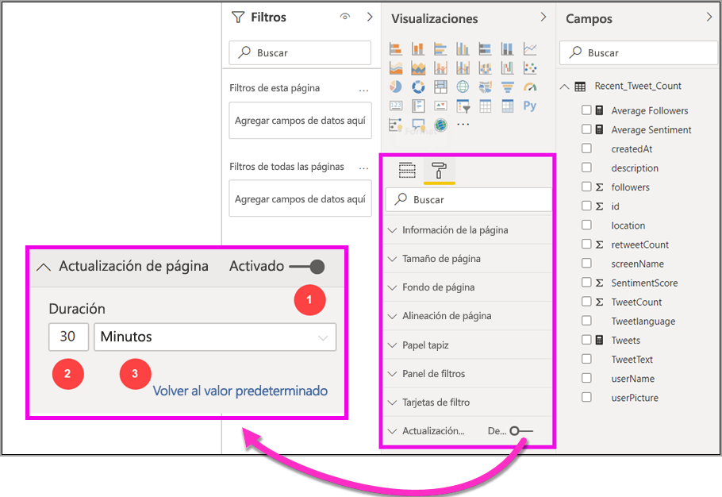
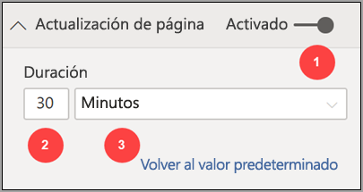
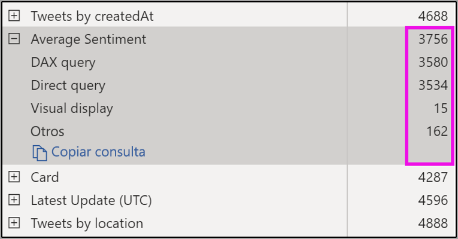
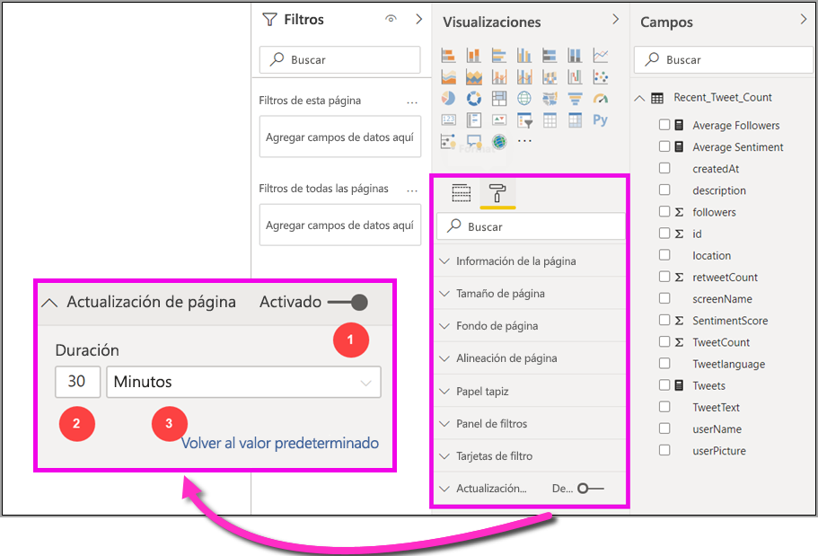

# Actualización automática de la página en Power BI Desktop (versión preliminar)

Al supervisar eventos críticos, es importante que los datos se actualicen en cuanto lo hagan los datos de origen. Por ejemplo, en el sector de fabricación, es fundamental saber cuándo una máquina funciona mal o está a punto de hacerlo.

La característica de actualización automática de páginas de Power BI permite que la página de informe que está activa consulte, con una cadencia predefinida, si hay datos nuevos relacionados con los [orígenes de DirectQuery ](https://docs.microsoft.com/power-bi/desktop-directquery-about).

## Usar la actualización automática de páginas

En esta versión preliminar, la característica de actualización automática de páginas se debe habilitar en Power BI Desktop. Vaya a **Archivo > Opciones y configuración**, seleccione **Opciones** y, después, seleccione **Características de versión preliminar** en el panel izquierdo. Para habilitar la característica, active la casilla situada junto *Actualización automática de páginas*. La actualización automática de páginas solo está disponible en orígenes de datos de DirectQuery.

Para usar la actualización automática de páginas, seleccione la página del informe donde quiera habilitar la actualización. En el panel **Visualizaciones**, seleccione el icono **Formato** (un rodillo de pintura) y busque **Actualización de página** cerca de la parte inferior del panel. 

En la siguiente imagen se muestra la tarjeta **Actualización de página**. En los próximos párrafos se explican los elementos numerados:

1.  Control deslizante de la actualización automática de páginas: activa o desactiva la actualización de página
2.  Valor del intervalo de actualización de página: valor numérico correspondiente al intervalo de actualización
3.  Unidad de intervalo de actualización de página: intervalo de la actualización de página

Aquí se puede activar la actualización de página y seleccionar la duración de la actualización. El valor predeterminado es 30 minutos y el intervalo de actualización mínimo, un segundo. El informe comenzará a actualizarse en el intervalo establecido. 

## Determinar el intervalo de actualización de página

Cuando la actualización automática de páginas se habilita, Power BI Desktop envía consultas al origen de DirectQuery ininterrumpidamente. Habrá un retraso entre el envío de la consulta y la obtención de datos, de modo que si el intervalo de actualización establecido es breve, deberá confirmar que las consultas devuelven correctamente los datos consultados en el intervalo configurado. Si no se devuelven datos dentro del intervalo, quiere decir que existen situaciones en las que los objetos visuales se actualizan con una frecuencia inferior a la configurada.

Como procedimiento recomendado, el intervalo de actualización debe coincidir al menos con la frecuencia de llegada de datos nuevos que se prevé:

* Si llegan datos nuevos al origen cada 20 minutos, el intervalo de actualización no puede ser inferior a 20 minutos. 

* Si llegan datos nuevos cada segundo, el intervalo deberá establecerse en un segundo. 

En el caso de los intervalos de actualización bajos (como un segundo), también se debe tener en cuenta el tipo de origen de datos de consulta directa, la carga que las consultas crean en dicho origen, la distancia del centro de datos de capacidad a la que se encuentran quienes consultan los informes, etc. 

Se puede realizar una estimación con el Analizador de rendimiento de Power BI Desktop, que permite confirmar si cada consulta visual tiene tiempo suficiente para volver con resultados del origen y dónde se emplea el tiempo. En función de los resultados del Analizador de rendimiento, el origen de datos se puede ajustar y realizar cambios en él, o se puede experimentar con otros objetos visuales y medidas en el informe.

En la siguiente imagen se muestran los resultados de una consulta DirectQuery en el Analizador de rendimiento:

Veamos otras características sobre este origen de datos. 

1.  Llegan datos con una frecuencia de dos segundos. 
2.  El Analizador de rendimiento muestra un tiempo máximo de consulta+visualización de aproximadamente 4,9 segundos (4688 milisegundos). 
3.  El origen de datos está configurado para asimilar aproximadamente 1000 consultas simultáneas por segundo. 
4.  Se espera que unos 10 usuarios vean el informe al mismo tiempo.

Todo esto resulta en lo siguiente:

* **5 objetos visuales x 10 usuarios = aproximadamente 50 consultas**

Este cálculo genera una carga mucho mayor de lo que el origen de datos es capaz de admitir. Llegan datos con una frecuencia de dos segundos, así que esa debe ser la frecuencia de actualización. Pero como la consulta tarda unos cinco segundos en completarse, debemos establecerla en más de cinco segundos. 

Cabe mencionar también que este resultado puede diferir al publicar el informe en el servicio, ya que el informe usará la instancia de Analysis Services hospedada en la nube. Posiblemente convenga ajustar las frecuencias de actualización en consecuencia. 

Para tener en cuenta las consultas y el tiempo de actualización, Power BI ejecutará la siguiente consulta de actualización únicamente cuando se hayan completado todas las consultas de actualización restantes. Por lo tanto, aun cuando el intervalo de actualización sea menor que el tiempo que las consultas tardan en procesarse, Power BI volverá a actualizar solamente cuando las consultas restantes se completen. 

Veamos ahora cómo un administrador de la capacidad puede detectar y diagnosticar problemas de rendimiento. Puede consultar también la sección **preguntas más frecuentes sobre la actualización automática de páginas**, más adelante en este artículo, para obtener más preguntas y respuestas sobre el rendimiento y la solución de problemas.

## Actualización automática de páginas en el servicio Power BI

También se pueden establecer intervalos de actualización automática de páginas en los informes creados en Power BI Desktop y publicados en el servicio Power BI. 

La actualización automática de páginas de informes en el servicio Power BI se configura de modo similar a Power BI Desktop. Al configurarla en el servicio Power BI, la actualización automática de páginas también admite [contenido insertado de Power BI](developer/embedding.md). En la siguiente imagen se muestra la configuración de **Actualización de página** del servicio Power BI:

1.  Control deslizante de la actualización automática de páginas: activa o desactiva la actualización de página
2.  Valor del intervalo de actualización de página: valor numérico correspondiente al intervalo de actualización, que debe ser un número entero
3.  Unidad de intervalo de actualización de página: intervalo de la actualización de página

### Intervalos de actualización de página

Los intervalos de actualización de página permitidos en el servicio Power BI vienen determinados por el tipo de área de trabajo del informe. Esto se aplica en todas estas situaciones:

* Al publicar un informe en un área de trabajo que tiene habilitada la actualización automática de páginas
* Al editar un intervalo de actualización de página que ya existe en un área de trabajo
* Al crear un informe directamente en el servicio

Power BI Desktop no tiene ninguna restricción de intervalo de actualización (el intervalo de actualización puede ser tan frecuente como cada segundo), pero cuando se publican informes en el servicio Power BI, existen ciertas restricciones, que se describen en las siguientes secciones.

### Restricciones de intervalos de actualización

En el servicio Power BI, se imponen restricciones de actualización automática de páginas en función de factores como el área de trabajo y si se usan servicios Premium.

Para aclarar cómo funciona esto, se comenzará con algunos conceptos previos sobre capacidades y áreas de trabajo:

Las **capacidades** son un concepto básico de Power BI que representa un conjunto de recursos (almacenamiento, procesador y memoria) que se usan para hospedar y facilitar contenido de Power BI. Las capacidades son compartidas o dedicadas. Una **capacidad compartida** es la que se comparte con otros clientes de Microsoft, mientras que una **dedicada** está confirmada plenamente para un solo cliente. Las capacidades dedicadas se describen en el artículo [Administración de las capacidades Premium](service-premium-capacity-manage.md).

En la capacidad compartida, las cargas de trabajo se ejecutan en recursos informáticos compartidos con otros clientes. Como la capacidad debe compartir recursos, se imponen ciertas limitaciones para garantizar un "*juego limpio*", como establecer un tamaño de modelo máximo (1 GB) y una frecuencia de actualización diaria máxima (ocho veces al día).

Las **áreas de trabajo** de Power BI residen en las capacidades y son contenedores de seguridad, de colaboración y de implementación. Cada usuario de Power BI tiene un área de trabajo personal que se conoce como **Mi área de trabajo**. Se pueden crear áreas de trabajo adicionales para permitir la colaboración y la implementación; estas se denominan **áreas de trabajo**. Las áreas de trabajo, incluidas las personales, se crean de forma predeterminada en la **capacidad compartida**.

Estos son algunos detalles de estos dos escenarios de área de trabajo:

**Áreas de trabajo compartidas**: en las áreas de trabajo normales (aquellas que no forman parte de una capacidad Premium), la actualización automática de páginas tiene un intervalo mínimo de 30 minutos (que es el mínimo permitido).

**Áreas de trabajo Premium** : la disponibilidad de la actualización automática de páginas en áreas de trabajo Premium dependerá de la configuración de la carga de trabajo que el administrador de Premium haya configurado como capacidad de Power BI Premium. Hay dos variables que pueden afectar a la posibilidad de configurar la actualización automática de páginas:

 1. *Activación/desactivación de la característica*: si el administrador de la capacidad ha decidido deshabilitar la característica, no se podrá configurar ningún tipo de actualización de página en el informe publicado.

 2. *Intervalo de actualización mínimo*: al habilitar la característica, el administrador de la capacidad debe configurar un intervalo de actualización mínimo. Si su intervalo es inferior al mínimo, el servicio Power BI lo invalida para respetar el intervalo mínimo establecido por el administrador de la capacidad.

En la siguiente tabla se describe con más detalle dónde está disponible esta característica, así como los límites de cada tipo de capacidad y [modo de almacenamiento](service-dataset-modes-understand.md).

| Modo de almacenamiento | Capacidad dedicada | Capacidad compartida |
| --- | --- | --- |
| Direct Query | **Admitida**: sí.  **Intervalo de actualización mínimo**: 1 segundo.  **Invalidación de la administración de capacidad**: sí. | **Admitida**: sí.  **Intervalo de actualización mínimo**: 30 minutos.  **Invalidación de la administración de capacidad**: no. |
| Importación | **Admitida**: no.  **Intervalo de actualización mínimo**: no procede.  **Invalidación de la administración de capacidad**: no procede. | **Admitida**: no.  **Intervalo de actualización mínimo**: no procede.  **Invalidación de la administración de capacidad**: no procede. |
| Modo mixto (DirectQuery+otros) | **Admitida**: sí.  **Intervalo de actualización mínimo**: 1 segundo.  **Invalidación de la administración de capacidad**: sí. | **Admitida**: sí.  **Intervalo de actualización mínimo**: 30 minutos.  **Invalidación de la administración de capacidad**: no. |
| Live Connect AS | **Admitida**: no.  **Intervalo de actualización mínimo**: no procede.  **Invalidación de la administración de capacidad**: no procede. | **Admitida**: no.  **Intervalo de actualización mínimo**: no procede.  **Invalidación de la administración de capacidad**: no procede. |
| Live Connect PBI | **Admitida**: no.  **Intervalo de actualización mínimo**: no procede.  **Invalidación de la administración de capacidad**: no procede. | **Admitida**: no.  **Intervalo de actualización mínimo**: no procede.  **Invalidación de la administración de capacidad**: no procede. |

> [!NOTE]
> Al publicar el informe con la actualización automática de páginas habilitada desde Power BI Desktop al servicio, tendrá que proporcionar las credenciales del origen de datos de DirectQuery en el menú de configuración del conjunto de datos.

## Consideraciones y limitaciones

Hay algunos aspectos que se deben tener en cuenta al usar la actualización automática de páginas, ya sea en Power BI Desktop o en el servicio Power BI.

* La actualización automática de páginas no admite los modos de almacenamiento de importación, conexión dinámica ni inserción.  
* Se admiten modelos compuestos que tengan al menos un origen de datos de DirectQuery.
* Power BI Desktop no tiene ninguna restricción de intervalo de actualización (puede ser tan frecuente como cada segundo). Cuando se publican informes en el servicio Power BI, existen ciertas restricciones, como se ha indicado anteriormente en este documento.

### Diagnóstico de rendimiento

La actualización automática de páginas es útil en escenarios de supervisión y para explorar los datos que cambian rápidamente. Con todo, hay veces en que esto puede suponer una carga innecesaria en la capacidad o el origen de datos.

Para evitar una carga innecesaria en los orígenes de datos, Power BI cuenta con las siguientes medidas de seguridad:

1. Todas las consultas de actualización automática de páginas se ejecutan con una prioridad **más baja** para procurar que las consultas interactivas (como la carga de páginas y el filtrado cruzado de objetos visuales) tengan prioridad.
2. Si la consulta no ha finalizado antes del siguiente ciclo de actualización, Power BI no emitirá consultas de actualización nuevas hasta que la consulta anterior se complete. Por ejemplo, si el intervalo de actualización es de un segundo y las consultas tardan de media cuatro segundos, Power BI solo emitirá una consulta cada cuatro segundos.

Hay dos áreas en las que todavía podrían producirse cuellos de botella de rendimiento:

1. **La capacidad**: la consulta llega en primer lugar a la capacidad Premium, que evaluará la consulta DAX generada a partir de las visualizaciones de informes en las consultas de origen.
2. **El origen de datos de DirectQuery**: las consultas convertidas en el paso anterior se ejecutan en el origen, que pueden ser servidores SQL Server, orígenes de SAP Hana, etc.

El uso de la [aplicación Métricas Premium](service-admin-premium-monitor-capacity.md), disponible para los administradores, permite visualizar cuánta capacidad usan las consultas con una prioridad baja.

Las consultas con una prioridad baja se componen de consultas de actualización automática de páginas y de consultas de actualización de modelos. Actualmente, no existe forma alguna de distinguir la carga de las consultas de actualización automática de páginas de la de las consultas de actualización de modelos.

Si observa que la capacidad se está sobrecargando con consultas de prioridad baja, existen algunas medidas que puede tomar:

1. Solicitar una SKU Premium más grande
2. Ponerse en contacto con el propietario del informe y pedirle que reduzca el intervalo de actualización
3. En el portal de administración de la capacidad, se puede:
  1. Desactivar la actualización automática de páginas en esa capacidad
  2. Aumentar el intervalo de actualización mínimo, que afectará a todos los informes de esa capacidad

### Preguntas más frecuentes

En esta sección se proporcionan preguntas y respuestas comunes sobre el asunto que nos ocupa. 

1. Soy el autor de un informe. He establecido el intervalo de actualización del informe en 1 segundo en Desktop pero, tras publicarlo, no se actualiza en el servicio.

    * Compruebe que la actualización automática de páginas está activada en la página. Puesto que esta configuración se aplica por página, debe asegurarse de que está activada en cada página del informe que le gustaría actualizar.
    * Compruebe que ha cargado en un área de trabajo con una capacidad Premium asociada; si no, el intervalo de actualización se bloqueará a 30 minutos.
    * Si el informe se encuentra en un área de trabajo Premium, acuda al administrador para saber si esta característica se ha habilitado para la capacidad asociada. Asegúrese además de que el intervalo de actualización mínimo de la capacidad es menor o igual que el del informe.

2. Soy un administrador de capacidad. He cambiado la configuración del intervalo de actualización automática de páginas, pero esto no se ve reflejado. En otras palabras, los informes se siguen actualizando a una frecuencia que no deben, o no se actualizan aunque haya activado esta característica.

    * La configuración de la actualización automática de páginas establecida en la interfaz de usuario de administración de la capacidad tarda hasta 5 minutos en propagarse a los informes.
    * Aparte de activar la actualización automática de páginas de la capacidad, también hay que activarla en las páginas del informe donde quiera ver reflejada la actualización.

3. Mi informe funciona en modo mixto (DirectQuery+Importación). No todos los objetos visuales se están actualizando.

    * Si los objetos visuales hacen referencia a las tablas de importación, esto entra dentro de lo previsto. La actualización automática de páginas no se admite en el modo de importación.
    * Vea la pregunta 1 de esta sección.

4. Mi informe se ha estado actualizando bien en el servicio y, de repente, ya no lo hace.

    * Pruebe a actualizar la página para ver si el problema se resuelve solo.
    * Acuda a su administrador de la capacidad, ya que puede haber desactivado la característica o incrementado el intervalo de actualización mínimo (vea la pregunta 2).

5. Soy el autor de un informe. Los objetos visuales no se están actualizando con la cadencia que he establecido, sino a una frecuencia menor.

    * Si las consultas tardan más tiempo en ejecutarse, el intervalo de actualización se retrasará. La actualización automática de páginas espera a que todas las consultas terminen de ejecutarse antes de ejecutar otras nuevas.
    * Es posible que el administrador de la capacidad haya establecido un intervalo de actualización mínimo superior al que ha establecido en su informe. Póngase en contacto con el administrador de la capacidad y pídale que lo reduzca.

6. ¿Las consultas de actualización automática de páginas se sirven desde la memoria caché?

    * No. Todas las consultas de actualización automática de páginas pasan por alto los datos almacenados en caché.

## Pasos siguientes

Para obtener más información, consulte los artículos siguientes:

* [Uso de DirectQuery en Power BI](desktop-directquery-about.md)
* [Usar el Analizador de rendimiento para examinar el rendimiento de los elementos de informe](desktop-performance-analyzer.md)
* [Implementación y administración de las capacidades de Power BI Premium](whitepaper-powerbi-premium-deployment.md)
* [Orígenes de datos en Power BI Desktop](desktop-data-sources.md)
* [Combinar datos y darles forma con Power BI Desktop](desktop-shape-and-combine-data.md)
* [Connect to Excel workbooks in Power BI Desktop (Conectarse a libros de Excel en Power BI Desktop)](desktop-connect-excel.md)   
* [Especificar datos directamente en Power BI Desktop](desktop-enter-data-directly-into-desktop.md)   
