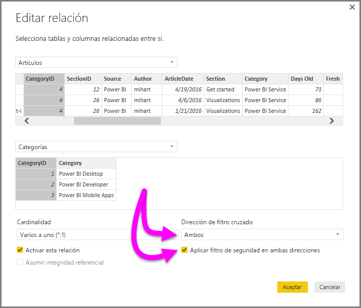

# Habilitación del filtrado cruzado bidireccional para DirectQuery en Power BI Desktop

Al filtrar las tablas para crear la vista adecuada de los datos, los creadores de informes y los modeladores de datos se enfrentan a desafíos que determinan cómo aplicar filtros a un informe. Anteriormente, el contexto de filtro de la tabla se ha retenido en un lado de la relación, pero no en el otro. Esta organización a menudo requiere una fórmula DAX compleja para obtener los resultados deseados.

Con el filtrado cruzado bidireccional, los creadores de informes y los modeladores de datos ahora tienen más control sobre cómo pueden aplicar filtros al trabajar con tablas relacionadas. El filtrado cruzado bidireccional permite aplicar filtros en *ambos* lados de una relación de tabla. Puede aplicar los filtros propagando el contexto de filtro en una segunda tabla relacionada en el otro lado de una relación de tabla.

## Habilitación del filtrado cruzado bidireccional para DirectQuery

Puede habilitar el filtrado cruzado en el cuadro de diálogo **Editar relación**. Para habilitar el filtrado cruzado de una relación, debe configurar las opciones siguientes:

* Establezca **Dirección del filtro cruzado** en **Ambos**.
* Seleccione **Aplicar filtro de seguridad en ambas direcciones**.

  

> [!NOTE]
> Al crear fórmulas DAX de filtrado cruzado en Power BI Desktop, use *UserPrincipalName*. Este campo suele ser el mismo que el inicio de sesión de un usuario, por ejemplo <em>joe@contoso.com</em>, en lugar de *UserName*. Por tanto, puede que necesite crear una tabla relacionada que asigne *UserName* o *EmployeeID* a *UserPrincipalName*.

Para obtener más información y ejemplos de cómo funciona el filtrado cruzado bidireccional, consulte las [notas del producto sobre el filtrado cruzado bidireccional para Power BI Desktop](https://download.microsoft.com/download/2/7/8/2782DF95-3E0D-40CD-BFC8-749A2882E109/Bidirectional%20cross-filtering%20in%20Analysis%20Services%202016%20and%20Power%20BI.docx).

