# Uso de marcadores para compartir información detallada y crear historias en Power BI 
El uso de **marcadores** en Power BI le permite capturar la vista configurada actualmente de una página del informe, incluidos los filtros y el estado de los objetos visuales y, posteriormente, volver a ese estado simplemente seleccionando el marcador guardado. 

También puede crear una colección de marcadores, organizarlos en el orden que desee y, posteriormente, usarlos en una presentación para resaltar una serie de informaciones detalladas o la historia que desea contar a través de los objetos visuales e informes. 

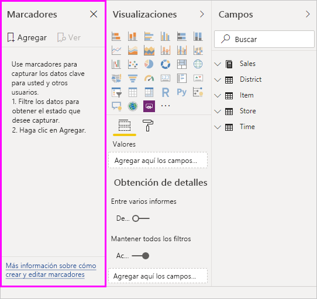

Los marcadores tienen muchos usos. Puede usarlos para hacer un seguimiento de su progreso en la creación de un informe (los marcadores son fáciles de agregar, eliminar y cambiar de nombre), y también puede usar marcadores para crear una presentación similar a las de PowerPoint que recorra los marcadores en orden, lo cual permite contar una historia a través del informe. También podría haber otros usos en función de cómo crea que los marcadores le pueden ayudar.

### Habilitar la versión preliminar de los marcadores (versiones anteriores a marzo de 2018)
Los marcadores están disponibles con carácter general a partir de la versión de marzo de 2018 de Power BI Desktop. 

Siempre se recomienda actualizar a la versión más reciente, pero si su versión de Power BI Desktop es anterior a esa versión, puede probar la característica de **marcadores** a partir de la versión de **octubre de 2017** de **Power BI Desktop** y, en el caso de los informes habilitados para marcadores, también en el **servicio Power BI**. Para habilitar la característica de la versión preliminar, seleccione **Archivo > Opciones y configuración > Opciones > Características en vista previa** y, a continuación, marque la casilla situada junto a **Marcadores**. 

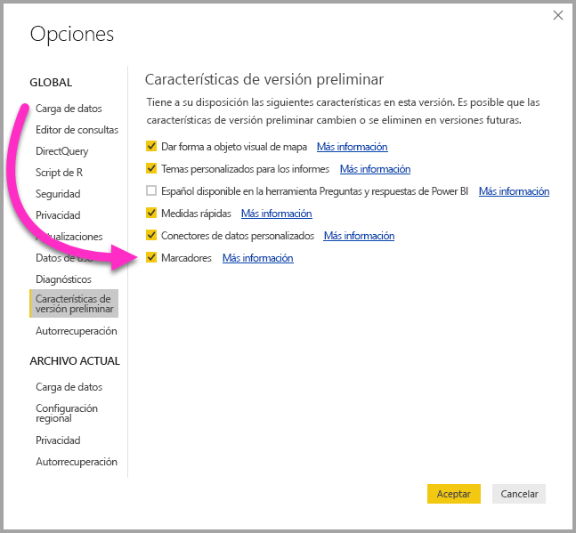

Deberá reiniciar **Power BI Desktop** después de realizar la selección para habilitar la versión preliminar de los marcadores.

## Uso de marcadores
Para utilizar marcadores, seleccione la cinta de opciones de **Vista** y, a continuación, seleccione la casilla de **Panel Marcadores**. 

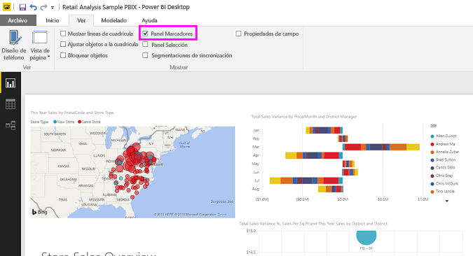

Cuando crea un marcador, los siguientes elementos se guardan con él:

* La página actual
* Filtros
* Segmentaciones
* Criterio de ordenación
* Ubicación de exploración
* Visibilidad (de un objeto, mediante el panel **Selección**)
* Los modos de enfoque o de **Destacados** de cualquier objeto visible

En este momento, los marcadores no permiten guardar el estado del resaltado cruzado. 

Configure una página de informe de la forma en que desee que aparezca en el marcador. Una vez que la página del informe y los objetos visuales estén organizados a su gusto, seleccione **Agregar** en el panel **Marcadores** para agregar un marcador. 

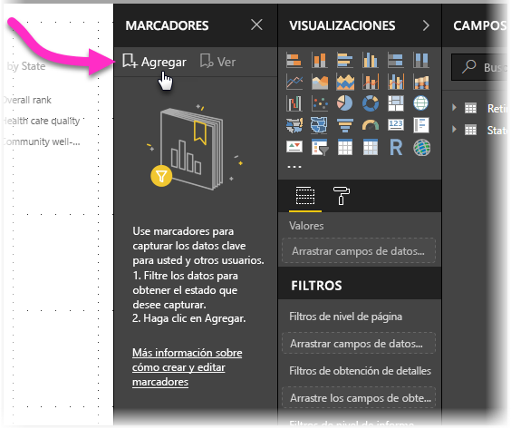

**Power BI Desktop** crea un marcador y le da un nombre genérico. Puede *cambiar de nombre*, *eliminar* o *actualizar* un marcador con suma facilidad. Para ello, seleccione los puntos suspensivos junto al nombre del marcador y, después, seleccione una acción en el menú que aparece.

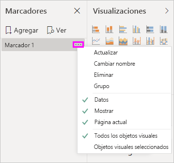

Una vez que tiene un marcador, puede mostrarlo simplemente con hacer clic en él en el panel **Marcadores**. 

También puede seleccionar si cada marcador aplicará propiedades de *datos*, como filtros y segmentaciones, propiedades de *visualización*, como el destacado y su visibilidad, y cambios de página que presentan la página que estaba visible cuando se agregó el marcador. Estas funciones son útiles cuando se utilizan marcadores para cambiar entre los tipos de objeto visual, en cuyo caso es probable que desee desactivar las propiedades de datos, de manera que los filtros no se restablezcan a medida que los usuarios cambien los tipos de objeto visual. 

Para realizar estos cambios, seleccione los puntos suspensivos junto al nombre del marcador, tal y como se muestra en la imagen anterior y, luego, seleccione o anule la selección de las marcas de verificación junto a *Datos*, *Mostrar* y otros controles. 

## Organización de los marcadores
A medida que cree marcadores, puede que el orden en que se han creado no sea necesariamente el mismo orden en el que le gustaría presentarlos a la audiencia. No hay problema, se puede reorganizar fácilmente el orden de los marcadores.

En el panel **Marcadores**, basta con arrastrar y colocar los marcadores para cambiar su orden, tal como se muestra en la siguiente imagen. La barra amarilla entre marcadores indica donde se colocará el marcador arrastrado.

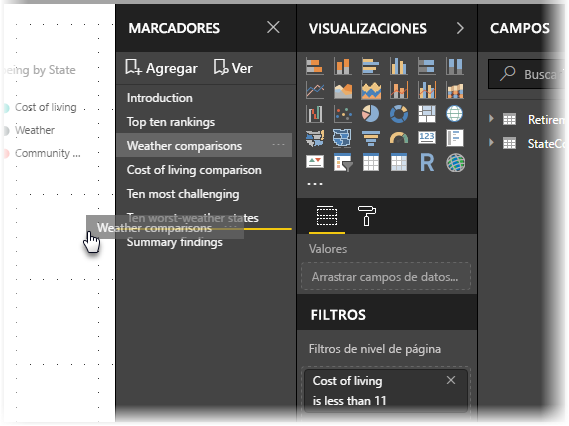

El orden de los marcadores puede ser importante a la hora de usar la característica **Vista** de los marcadores, como se describe en la sección siguiente.

## Marcadores como una presentación con diapositivas
Si tiene una colección de marcadores que le gustaría presentar en orden, puede seleccionar **Vista** en el panel **Marcadores** para empezar una presentación.

Cuando está en el modo **Vista**, hay algunas características a tener en cuenta:

1. El nombre del marcador aparece en la barra de título de este, la cual, a su vez, aparece en la parte inferior del lienzo.
2. La barra de título del marcador tiene flechas que le permiten moverse al marcador siguiente o al anterior.
3. Puede salir del modo **Vista** seleccionando **Salir** en el panel **Marcadores** o la **X** que se encuentra en la barra de título del marcador. 

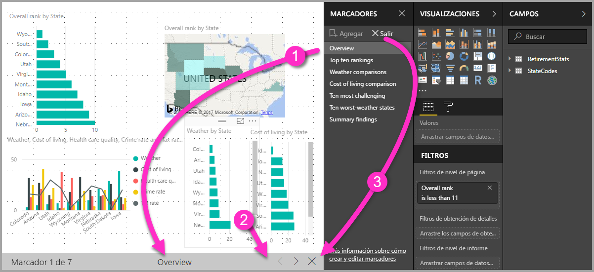

Cuando está en modo **Vista**, puede cerrar el panel **Marcadores** (haciendo clic en la X en ese panel) para proporcionar más espacio para la presentación. Siempre que esté en el modo **Vista**, todos los objetos visuales serán interactivos y estarán disponibles para realizar el resaltado cruzado, al igual que lo estarían en caso contrario si interactúa con ellos. 

## Visibilidad: uso del panel Selección
Con la publicación de los marcadores, también se ha introducido el nuevo panel **Selección**. El panel **Selección** proporciona una lista de todos los objetos de la página actual y le permite seleccionar el objeto y especificar si un objeto especificado es visible. 

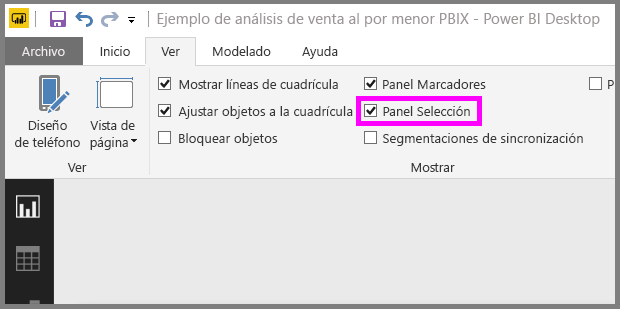

Puede seleccionar un objeto mediante el panel **Selección**). Además, puede hacer que el objeto sea visible o no haciendo clic en el icono de ojo situado a la derecha del objeto visual. 

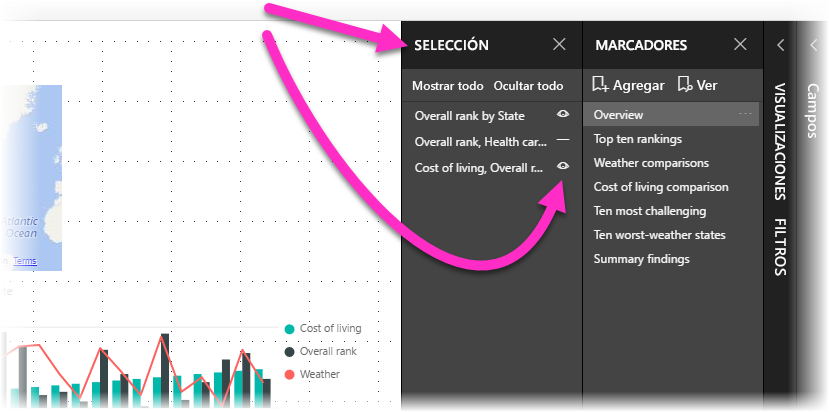

Cuando se agrega un marcador, el estado de visibilidad de cada objeto también se guarda en función de su configuración en el panel **Selección**. 

Es importante tener en cuenta que las **segmentaciones de datos** siguen estando disponibles para filtrar una página de informe, independientemente de si están visibles o no. Por lo tanto, puede crear muchos marcadores diferentes, con diferentes configuraciones de segmentación de datos, y hacer que una única página del informe tenga muchos aspectos diferentes (y se resalten diferentes datos) en distintos marcadores.

## Marcadores para formas e imágenes
También puede vincular formas e imágenes a los marcadores. Con esta característica, al hacer clic en un objeto, se mostrará el marcador asociado a él. Esto puede ser especialmente útil cuando se trabaja con botones; para obtener más información, lea el artículo sobre [el uso de botones en Power BI](desktop-buttons.md). 

Para asignar un marcador a un objeto, seleccione el objeto y, a continuación, amplíe la sección **Acción** en el panel **Formato de forma**, como se muestra en la siguiente imagen.

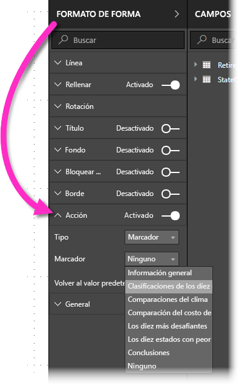

Una vez que sitúe el control deslizante de **Acción** en **Activado**, puede seleccionar si el objeto es un botón de retroceso, un marcador o un comando de preguntas y respuestas. Si selecciona el marcador, podrá seleccionar a cual de los marcadores se vincula el objeto.

Hay todo tipo de cosas interesantes que puede hacer con marcadores con objetos vinculados. Puede crear un índice de objetos visuales en la página del informe, o puede proporcionar vistas diferentes (por ejemplo, los tipos de objeto visual) de la misma información solo con hacer clic en un objeto.

Si está en modo de edición puede usar ctrl+clic para seguir el vínculo y, si no lo está, basta con hacer clic en el objeto para seguir el vínculo. 

## Grupos de marcadores

A partir de la versión de agosto de 2018 de **Power BI Desktop**, puede crear y usar grupos de marcadores. Un grupo de marcadores es una colección de marcadores que especifica y que se pueden mostrar y organizar como un grupo. 

Para crear un grupo de marcadores, mantenga presionada la tecla CTRL y seleccione los marcadores que quiera incluir en el grupo; después, haga clic en los puntos suspensivos situados junto a cualquiera de los marcadores seleccionados y haga clic en **Agrupar** en el menú que aparece.

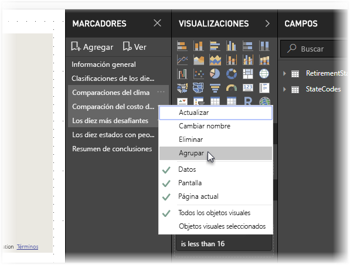

**Power BI Desktop** denomina automáticamente al grupo *Grupo 1*. Si quiere cambiarle el nombre, solo tiene que hacer doble clic en él.

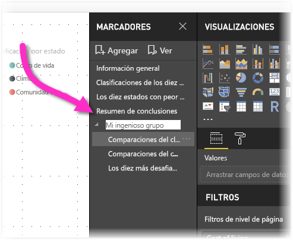

Al hacer clic en el nombre de cualquier grupo de marcadores, solo se expande o contrae el grupo, y no se representa ningún marcador por sí mismo. 

Al usar la característica **Ver** de los marcadores, se aplica lo siguiente:

* Si el marcador seleccionado está en un grupo cuando se hace clic en **Ver** en los marcadores, solo los marcadores *de ese grupo* se muestran en la sesión de visualización. 

* Si el marcador seleccionado no es un grupo, o bien si se encuentra en el nivel superior (por ejemplo, el nombre de un grupo de marcadores), se reproducen todos los marcadores de todo el informe, incluidos los marcadores de cualquier grupo. 

Para desagrupar los marcadores, solo tiene que seleccionar cualquier marcador de un grupo, hacer clic en el botón de puntos suspensivos y, después, hacer clic en **Desagrupar** en el menú que aparece. 

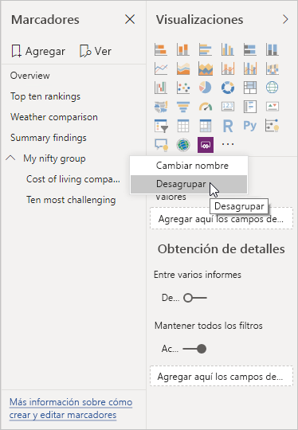

Tenga en cuenta que, si hace clic en **Desagrupar** en cualquier marcador de un grupo, todos los marcadores abandonan el grupo (se elimina el grupo, pero no los marcadores). Para quitar un único marcador de un grupo, tiene que **desagrupar** cualquier miembro de ese grupo, lo que elimina la agrupación; después, seleccione los miembros que quiera en el nuevo grupo (pulse CTRL y haga clic en cada marcador) y vuelva a hacer clic en **Agrupar**. 

## Uso de Destacados
Otra característica que se ha publicado junto con los marcadores es **Destacados**. Con **Destacados** se puede llamar la atención sobre un gráfico concreto, por ejemplo, al presentar los marcadores en el modo **Vista**.

Comparemos los modos de **Destacados** y de **enfoque** para ver en qué se diferencian.

1. En el modo de **enfoque**, puede hacer que un objeto visual ocupe todo el lienzo seleccionando el icono del **modo de enfoque**.
2. En **Destacados**, puede resaltar un objeto visual en su tamaño original, haciendo que todos los demás objetos visuales de la página se atenúen hasta casi ser transparentes. 

Si se ha hecho clic en el icono de **enfoque** del objeto visual de la imagen anterior, la página tendrá el siguiente aspecto:

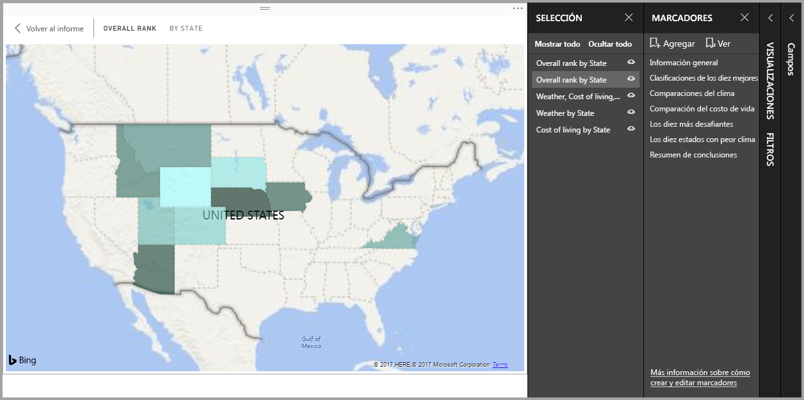

En cambio, si se ha seleccionado **Destacados** en el menú de puntos suspensivos del objeto visual, la página se parecerá a esta:

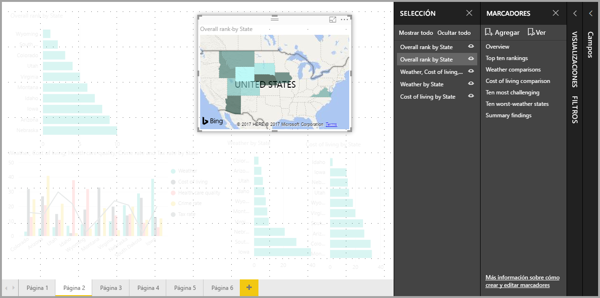

Si selecciona cualquiera de estos modos al agregar un marcador, ese modo (enfoque o Destacados) se conservará en el marcador.

## Marcadores en el servicio Power BI
Cuando publica un informe en el **servicio Power BI** con al menos un marcador, puede verlos e interactuar con ellos en el **servicio Power BI**. Si los marcadores están disponibles en un informe, puede seleccionar **Vista > Panel Selección** o **Vista > Panel Marcadores** para mostrar cada uno de esos paneles.

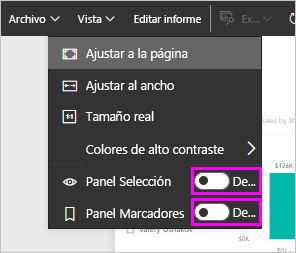

En el **servicio Power BI** el **panel Marcadores** funciona igual que en **Power BI Desktop**, incluida la posibilidad de seleccionar **Vista** para mostrar los marcadores en orden, como en una presentación con diapositivas.

Tenga en cuenta que debe utilizar la barra de título del marcador atenuado para navegar por los marcadores y no las flechas negras (las flechas negras le permiten moverse a través de las páginas del informe, no de los marcadores).

## Limitaciones y consideraciones
En esta versión de los **marcadores** hay algunas limitaciones y consideraciones que debe tener en cuenta.

* La mayoría de objetos visuales personalizados deben funcionar bien con marcadores. Si experimenta problemas con marcadores y un objeto visual personalizado, póngase en contacto con el creador de ese objeto visual personalizado y pídale que haga los marcadores compatibles con su objeto visual. 
* Si agrega un objeto visual en una página de informe después de crear un marcador, se mostrará el objeto visual en su estado predeterminado. Esto también significa que si se introduce una segmentación de datos en una página en la que previamente creó marcadores, la segmentación de datos se comportará según su estado predeterminado.
* Si se desplaza por los objetos visuales después de haber creado un marcador se reflejará en este. 

## Pasos siguientes
Para más información acerca de las características que son similares o que interactúan con los marcadores, eche un vistazo a los siguientes artículos:

* [Uso de la obtención de detalles en Power BI Desktop](desktop-drillthrough.md)
* [Mostrar un icono de panel o un objeto visual de informe en modo Enfoque](service-focus-mode.md)

