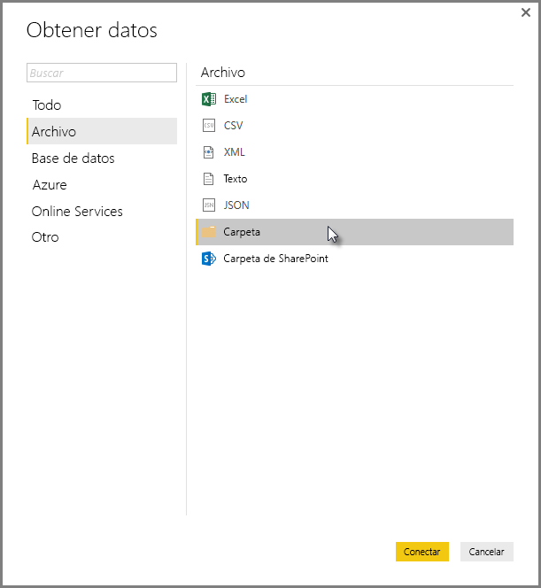
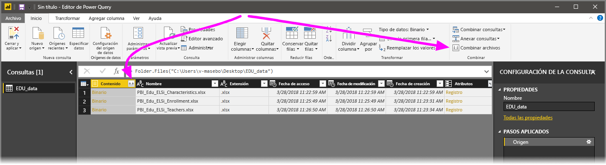
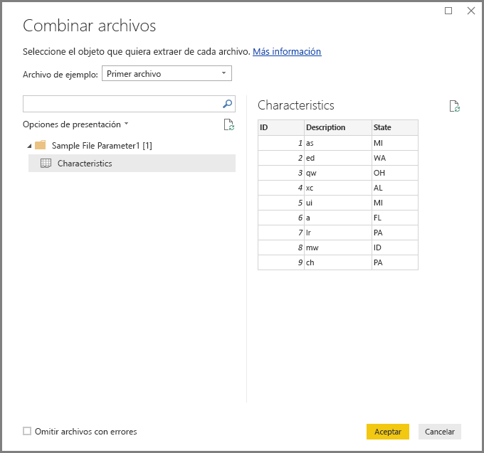
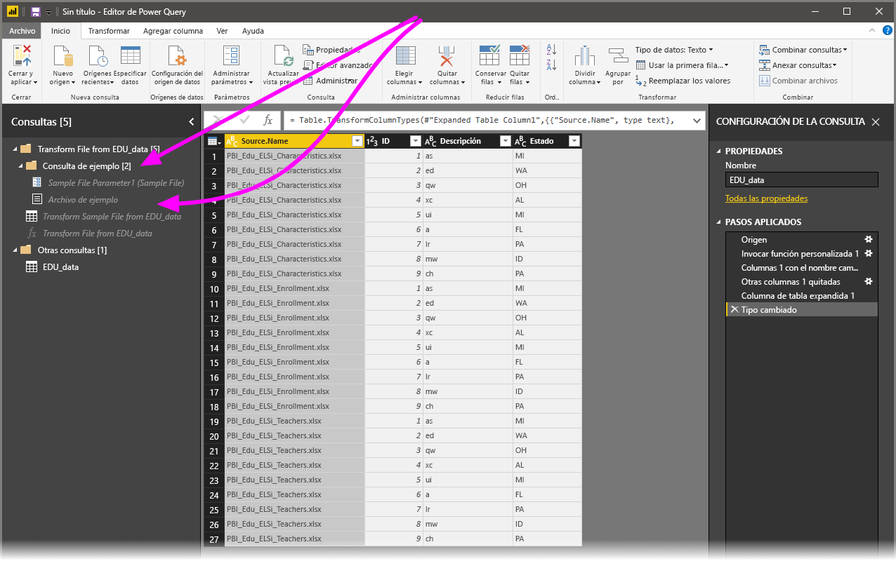

# Combinación de archivos (binarios) en Power BI Desktop
Un método eficaz para importar los datos en **Power BI Desktop** consiste en combinar varios archivos —que tengan el mismo esquema— en una única tabla lógica. Este popular enfoque se ha vuelto más práctico y expansivo, como se describe en el presente artículo.

Para iniciar el proceso de combinar archivos de una misma carpeta, seleccione **Obtener datos > Archivo > Carpeta**.

## Comportamiento al combinar archivos
Para **combinar archivos (binarios)** , seleccione **combinar archivos**, bien en la pestaña **Inicio** de la cinta de opciones del **Editor de consultas** o bien desde la misma columna.

La transformación **Combinar archivos** se comporta como se especifica debajo:

* La transformación **Combinar archivos** analiza todos los archivos de entrada y determina el formato de archivo correcto que debe usarse, como *texto*, *libro de Excel* o *JSON*.
* La transformación permite seleccionar un objeto específico del primer archivo (por ejemplo, un *libro de Excel*) para extraerlo.
  
  
* **Combinar archivos** entonces realiza automáticamente las consultas siguientes:
  
  * Crea una consulta de ejemplo que realiza todos los pasos de extracción necesarios en un único archivo.
  * Crea una *consulta de función* que parametriza la entrada de archivo/binario en la *consulta de ejemplo*. La consulta de ejemplo y la consulta de función se vinculan, de modo que los cambios hechos en la consulta de ejemplo se reflejan en la consulta de función.
  * Aplica la *consulta de función* a la consulta original con binarios de entrada (por ejemplo, la consulta *Carpeta*), por lo que aplica la consulta de función para entradas binarias en cada fila y, luego, expande el resultado de la extracción de datos como columnas de nivel superior.
    
    

> [!NOTE]
> El ámbito de la selección en un libro de Excel afectará al comportamiento de combinar binarios. Por ejemplo, puede seleccionar una hoja de cálculo específica para combinar esa hoja de cálculo o seleccionar la raíz para combinar el archivo completo. Al seleccionar una carpeta se combinan los archivos que se encuentran en esa carpeta. 

Con el comportamiento de **combinar archivos**, se pueden combinar fácilmente todos los archivos de una determinada carpeta, siempre y cuando tengan el mismo tipo de archivo y estructura (como, por ejemplo, las mismas columnas).

Además, se pueden aplicar fácilmente pasos de transformación o extracción adicionales mediante la modificación de la *consulta de ejemplo* creada automáticamente y sin necesidad de preocuparse de la modificación o creación de más pasos de *consulta de función*. Cualquier cambio hecho en la *consulta de ejemplo* se generará automáticamente en la consulta de *función vinculada*.

## Pasos siguientes
Hay todo tipo de datos a los que puede conectarse con Power BI Desktop. Para obtener más información sobre orígenes de datos, consulte los siguientes recursos:

* [¿Qué es Power BI Desktop?](desktop-what-is-desktop.md)
* [Orígenes de datos en Power BI Desktop](desktop-data-sources.md)
* [Combinar datos y darles forma con Power BI Desktop](desktop-shape-and-combine-data.md)
* [Conectarse a archivos CSV en Power BI Desktop](desktop-connect-csv.md)   
* [Especificar datos directamente en Power BI Desktop](desktop-enter-data-directly-into-desktop.md)   

