# Realización de tareas de consultas comunes en Power BI Desktop

En la ventana Editor de Power Query de Power BI Desktop, hay una serie de tareas de uso frecuente. En este artículo se muestran las tareas comunes y vínculos para obtener información adicional.

Las tareas comunes de consultas que aquí se explican son las siguientes:

* Conectar a datos
* Dar forma a los datos y combinarlos
* Agrupar filas
* Dinamizar columnas
* Crear columnas personalizadas
* Fórmulas de consulta

Usaremos algunas conexiones de datos para completar estas tareas. Los datos están disponibles para descargar o conectarse, en caso de que desee realizar paso a paso las tareas.

La primera conexión de datos es [un libro de Excel](https://download.microsoft.com/download/5/7/0/5701F78F-C3C2-450C-BCCE-AAB60C31051D/PBI_Edu_ELSi_Enrollment_v2.xlsx), que puede descargar y guardar localmente. La otra es un recurso web que se usa también en otros artículos de Power BI Desktop:

<https://www.bankrate.com/retirement/best-and-worst-states-for-retirement/>

Las tareas comunes de la consulta comienzan por los pasos necesarios para conectarse a ambos orígenes de datos.

## Conectar a datos

Para conectarse a los datos de Power BI Desktop, seleccione **Inicio** y, a continuación, **Obtener datos**. Power BI Desktop presenta un menú con los orígenes de datos más comunes. Para obtener una lista completa de los orígenes de datos a los que Power BI Desktop se puede conectar, seleccione **Más** situado al final del menú. Para más información, consulte [Orígenes de datos en Power BI Desktop](desktop-data-sources.md).

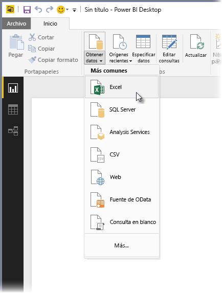

Para comenzar, seleccione **Excel**, especifique el libro de Excel mencionado anteriormente y, a continuación, seleccione **Abrir**. La consulta inspecciona el libro y, a continuación, muestra los datos encontrados en el cuadro de diálogo **Navegador** tras seleccionar una tabla.

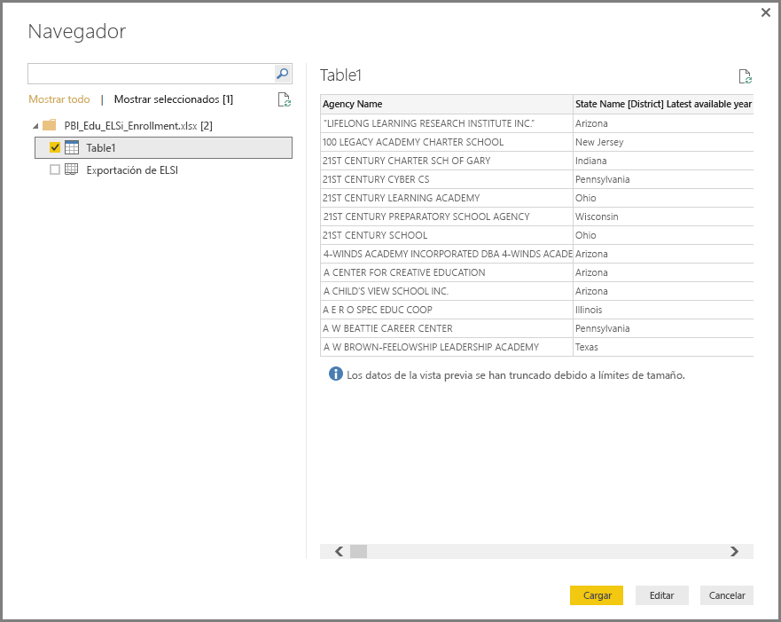

Puede seleccionar **Transformar datos** para editar, ajustar o *dar forma* a los datos antes de cargarlos en Power BI Desktop. La edición es especialmente útil si trabaja con conjuntos de datos grandes que desea reducir antes de cargar.

Conectarse a distintos tipos de datos es igual de fácil. También quiere conectarse a un recurso web. Elija **Obtener datos** > **Más** y, a continuación, seleccione **Otros** > **Web** > **Conectar**.

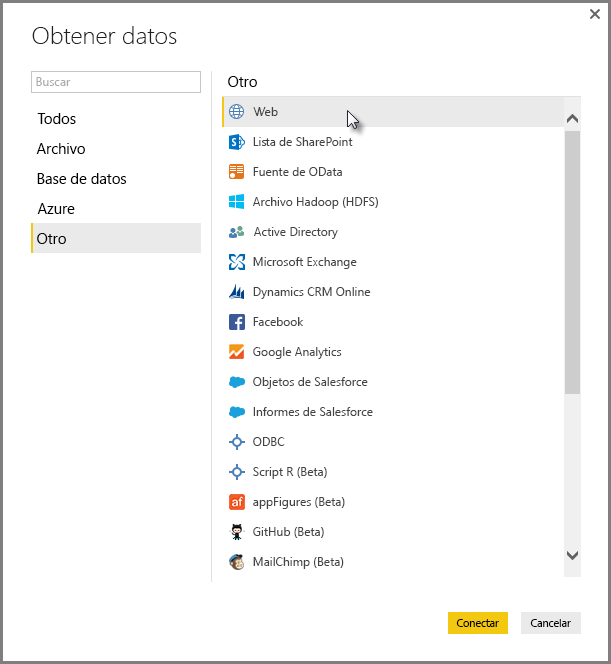

Aparece la ventana **Desde web**, donde puede escribir la dirección URL de la página web.

Seleccione **Aceptar**. Al igual que antes, Power BI inspecciona los datos de la página web y muestra opciones de vista previa en el cuadro de diálogo **Navegador**. Al seleccionar una tabla, muestra una vista previa de los datos.

Las demás conexiones de datos son similares. Si se requiere autenticación para realizar una conexión de datos, Power BI Desktop solicitará las credenciales correspondientes.

Para una demostración paso a paso de la conexión a datos en Power BI Desktop, consulte [Conectarse a los datos en Power BI Desktop](desktop-connect-to-data.md).

## Dar forma a los datos y combinarlos

Puede fácilmente combinar y dar forma a los datos con el Editor de Power Query. Esta sección incluye algunos ejemplos de cómo puede dar forma a los datos. Para una demostración más completa de cómo combinar y dar forma a los datos, consulte [Combinar datos y darles forma en Power BI Desktop](desktop-shape-and-combine-data.md).

En la sección anterior se conectó a dos conjuntos de datos: un libro de Excel y un recurso web. Una vez que se carguen los datos en el Editor de Power Query, seleccione la consulta de la página web entre las consultas disponibles en el panel **Consultas**, tal como se muestra aquí:

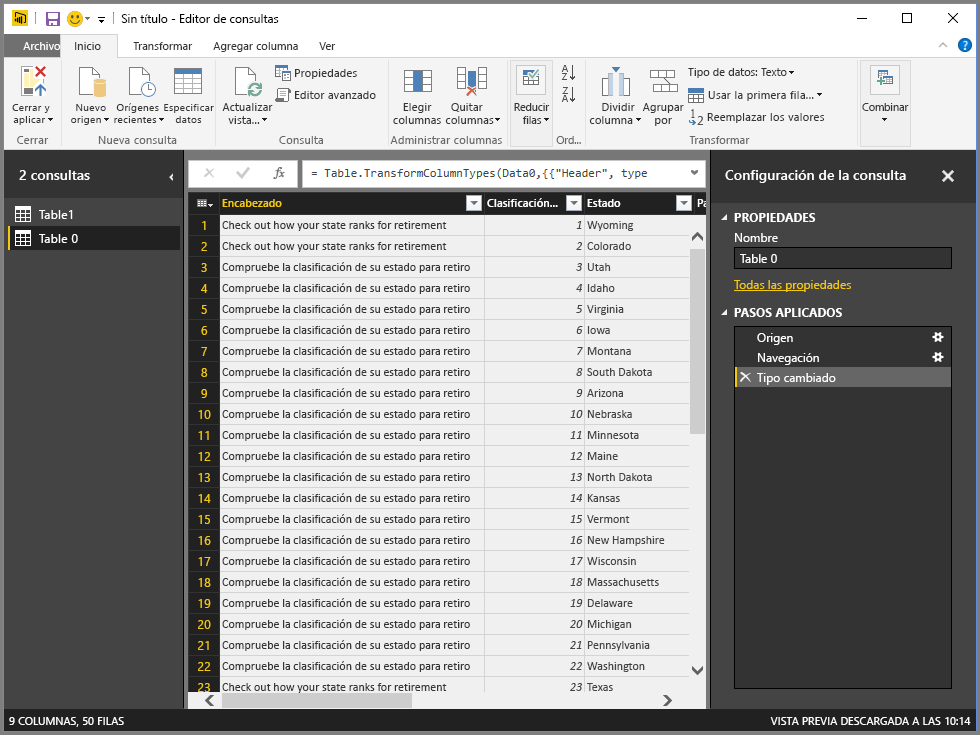

Dar forma a datos significa transformar un origen de datos a la forma y formato que se ajuste a sus necesidades.

En el Editor de Power Query, muchos comandos pueden encontrarse en la cinta de opciones y en los menús contextuales. Por ejemplo, cuando hace clic con el botón derecho en una columna, el menú contextual le permite quitar la columna. También puede seleccionar una columna y, a continuación, seleccionar el botón **Quitar columnas** de la pestaña **Inicio** de la cinta de opciones.

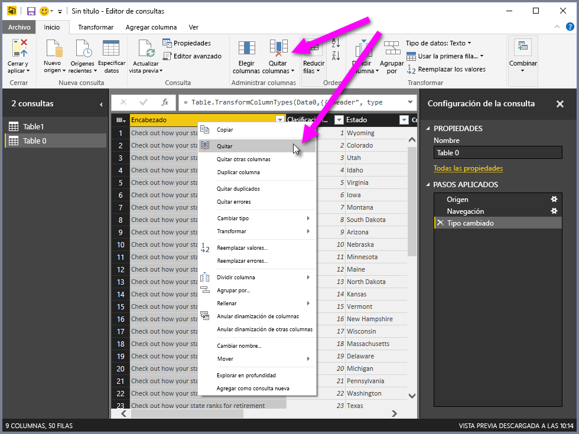

Puede dar forma a los datos de muchas otras formas en esta consulta. Puede quitar cualquier número de filas de la parte superior o inferior. O bien, puede agregar columnas, dividir columnas, reemplazar valores y realizar otras tareas de modelado. Con estas características, puede dirigir el Editor de Power Query para obtener los datos de la forma que desee.

## Agrupar filas

En el Editor de Power Query, puede agrupar los valores de muchas filas en un único valor. Esta característica puede ser útil cuando se quiere resumir el número de productos ofrecidos, las ventas totales o el número de alumnos.

En este ejemplo, se agruparon filas en un conjunto de datos de inscripción a recursos educativos. Los datos pertenecen al libro de Excel. Se ha dado forma en el Editor de Power Query para obtener solo las columnas que necesita, quitar la tabla y realizar algunas otras transformaciones.

Descubramos cuántas instituciones tiene cada estado (las instituciones pueden incluir distritos escolares, otras instituciones educativas como distritos de servicios regionales, etc.). Seleccione la columna **Agency ID - NCES Assigned \[District\] Latest available year**. A continuación, seleccione el botón **Agrupar por** de la pestaña **Transformar** o la pestaña **Inicio** de la cinta de opciones (**Agrupar por** está disponible en ambas pestañas).

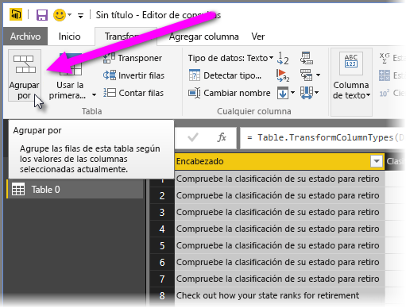

Aparece el cuadro de diálogo **Agrupar por**. Cuando el Editor de Power Query agrupa filas, se crea una nueva columna donde se colocan los resultados de la acción **Agrupar por**. Puede ajustar la operación **Agrupar por** de las siguientes maneras:

1. La lista desplegable sin etiquetar especifica la columna que se va a agrupar. El Editor de Power Query aplica de forma predeterminada este valor a la columna seleccionada, pero puede cambiarlo para que sea cualquier columna de la tabla.
2. **Nuevo nombre de columna**: El Editor de Power Query sugiere un nombre para la nueva columna, en función de la operación que aplica a la columna que se agrupa. Puede dar el nombre que desee a la nueva columna, sin embargo.
3. **Operation**: puede elegir la operación que aplica el Editor de Power Query, como **Suma**, **Mediana** o **Contar filas distintas**. El valor predeterminado es **Contar filas**.
4. **Agregar agrupación** y **Agregar agregación**: estos botones están disponibles solo si selecciona la opción **Opciones avanzadas**. En una sola operación, puede realizar operaciones de agrupación (acciones **Agrupar por**) en muchas columnas y crear varias agregaciones mediante estos botones. Según las selecciones realizadas en este cuadro de diálogo, el Editor de Power Query crea una nueva columna que opera en varias columnas.

Seleccione **Agregar agrupación** o **Agregar agregación** para agregar más agrupaciones o agregaciones a una operación **Agrupar por**. Para quitar una agrupación o agregación, seleccione el icono de puntos suspensivos ( **...** ) a la derecha de la fila y, a continuación, **Eliminar**. No se detenga y pruebe la operación **Agrupar por** mediante los valores predeterminados para ver qué ocurre.

Cuando se selecciona **Aceptar**, la consulta realiza la operación **Agrupar por** y devuelve los resultados. Vaya, ahí están: Ohio, Texas, Illinois, Texas y California ahora tienen cada uno más de mil instituciones.

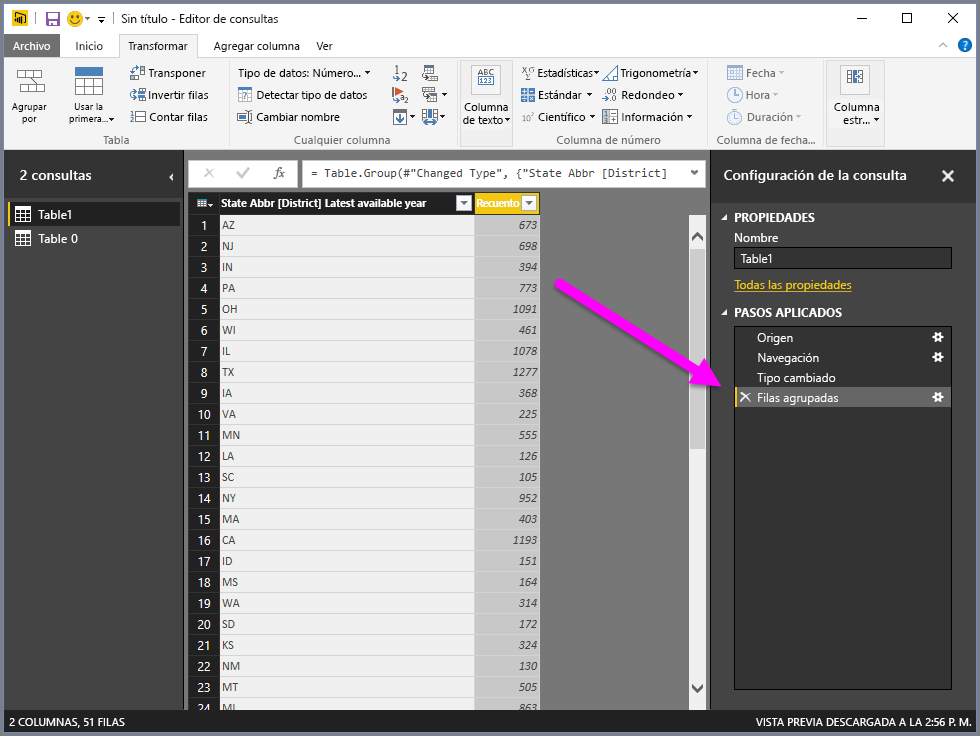

Además, con el Editor de Power Query, siempre puede quitar la última operación de modelado. En el panel **Configuración de la consulta**, en **Pasos aplicados**, solo tiene que seleccionar **X** junto al paso completado recientemente. No se detenga, experimente. Si no le complacen los resultados, repita el paso hasta que el Editor de Power Query forme los datos tal como lo requiere.

## Dinamizar columnas

Puede dinamizar columnas y crear una tabla con valores agregados para cada valor único en una columna. Por ejemplo, para saber cuántos productos diferentes hay en cada categoría, puede crear rápidamente una tabla que muestre eso.

Veamos un ejemplo. La siguiente tabla **Products_by_Categories** se ha formado para mostrar únicamente productos únicos (por nombre) y la categoría a la que pertenece cada producto. Para crear una nueva tabla que muestre el número de productos de cada categoría (según la columna **CategoryName**), seleccione la columna y después seleccione **Transformar** > **Dinamizar columna**.

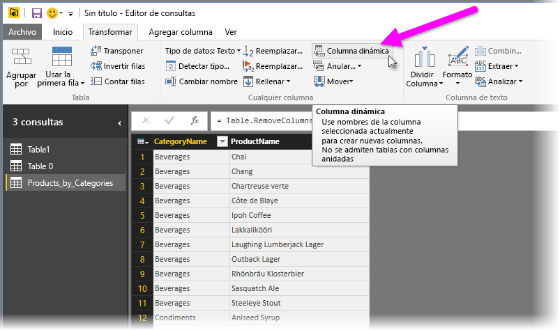

Aparece el cuadro de diálogo **Dinamizar columna**, que le permite saber qué valores de la columna se usarán para crear nuevas columnas (1) (si no se muestra el nombre de la columna deseada de **CategoryName**, selecciónelo en la lista desplegable). Al expandir **Opciones avanzadas** (2), puede seleccionar la función que se aplicará a los valores agregados (3).

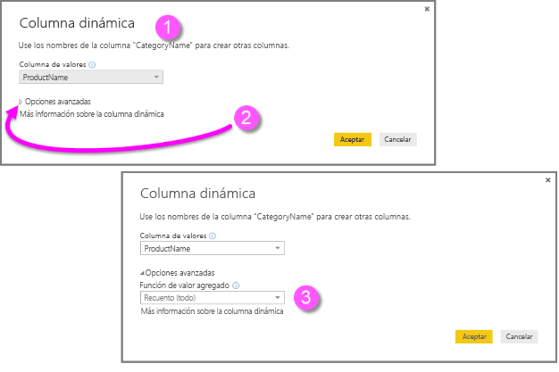

Al seleccionar **Aceptar**, la consulta muestra la tabla según las instrucciones de transformación proporcionadas en el cuadro de diálogo **Dinamizar columna**.

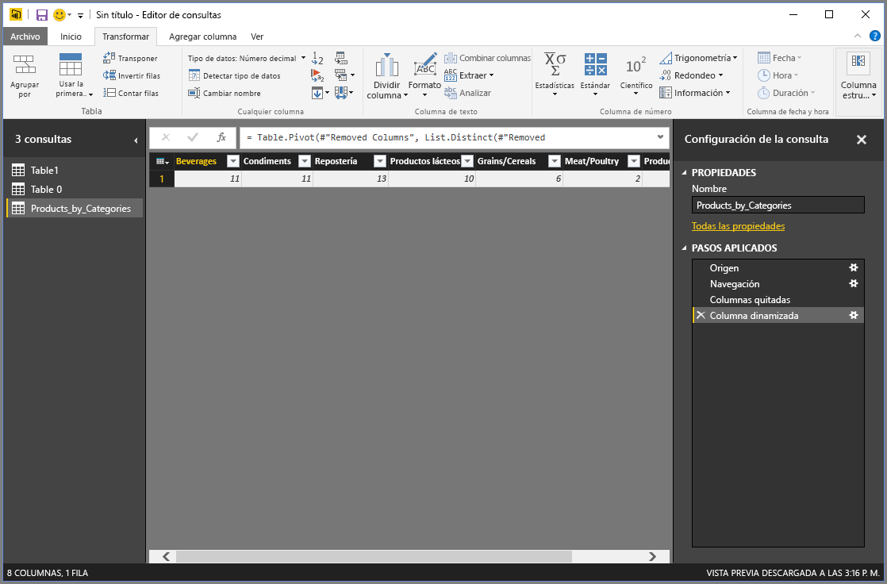

## Crear columnas personalizadas

En el Editor de Power Query, puede crear fórmulas personalizadas que operen en varias columnas de su tabla. A continuación, puede colocar los resultados de estas fórmulas en una nueva columna (personalizada). El Editor de Power Query facilita la creación de columnas personalizadas.

Con los datos del libro de Excel en el Editor de Power Query, vaya a la pestaña **Agregar columna** de la cinta de opciones y, a continuación, seleccione **Columna personalizada**.

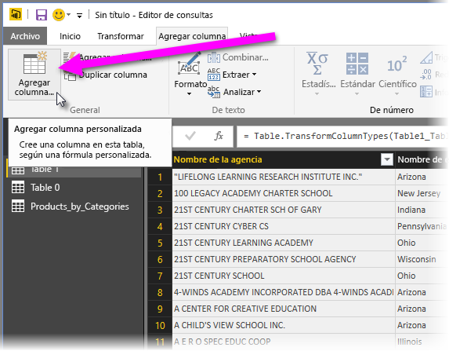

Aparecerá el siguiente cuadro de diálogo. En este ejemplo, se creó una columna personalizada denominada *Porcentaje de ELL* que calcula el porcentaje total de alumnos que estudian el idioma inglés (ELL, por sus siglas en inglés).

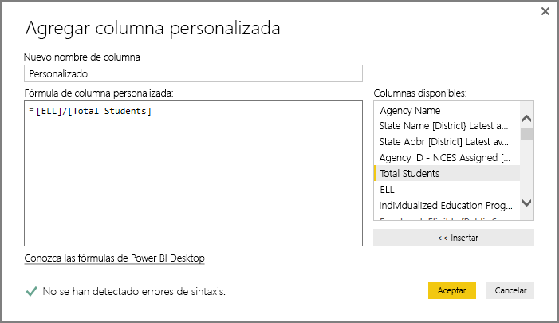

Al igual que con cualquier otro paso aplicado en el Editor de Power Query, si la nueva columna personalizada no proporciona los datos que busca, puede eliminar el paso. En el panel **Configuración de la consulta**, en **Pasos aplicados**, solo tiene que seleccionar **X** junto al paso **Personalizada agregada**.

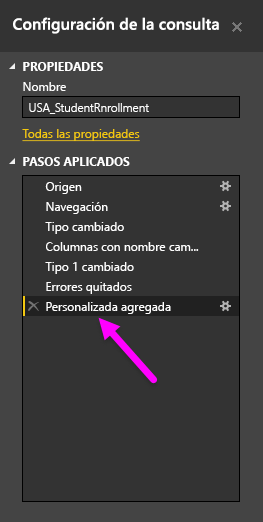

## Fórmulas de consulta

Puede editar los pasos que genera el Editor de Power Query. También puede crear fórmulas personalizadas, que le permiten conectarse a sus datos y darles forma con mayor precisión. Cada vez que el Editor de Power Query realiza una acción en los datos, se muestra la fórmula asociada con la acción en la barra de fórmulas. Para ver la barra de fórmulas, vaya a la pestaña **Vista** y, a continuación, seleccione **Barra de fórmulas**.

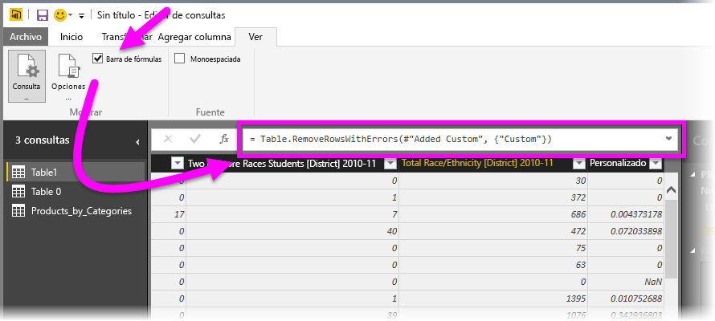

El Editor de Power Query conserva todos los pasos aplicados para cada consulta como texto que se puede ver o modificar. Puede ver o modificar el texto de cualquier consulta mediante el **Editor avanzado**. Solo tiene que seleccionar **Vista** y,a continuación, **Editor avanzado**.

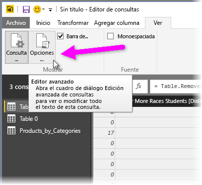

Aquí se puede ver el **Editor avanzado**, con los pasos de consulta asociados a la consulta **USA\_StudentEnrollment** mostrada. Estos pasos se crean en el lenguaje de fórmulas de Power Query, que se conoce a menudo como *M*. Para obtener más información, consulte [Más información acerca de las fórmulas de Power Query](https://support.office.com/article/learn-about-power-query-formulas-6bc50988-022b-4799-a709-f8aafdee2b2f). Para ver la especificación del lenguaje, consulte la [Especificación del lenguaje M de Power Query](/powerquery-m/power-query-m-language-specification).

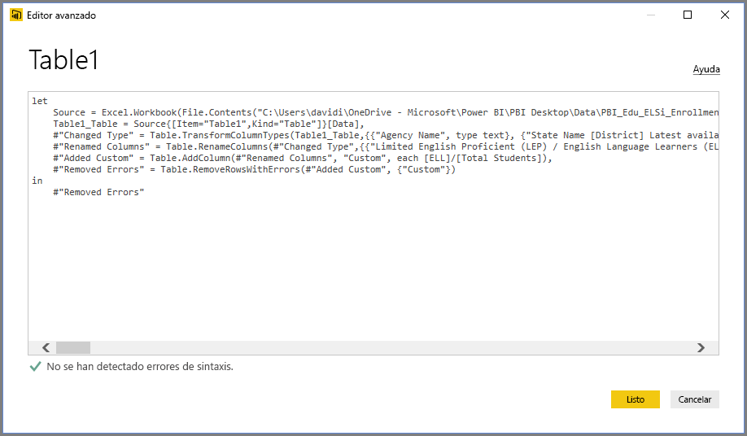

Power BI Desktop proporciona un amplio conjunto de categorías de fórmulas. Para más información y una referencia completa de todas las fórmulas del Editor de Power Query, consulte [Referencia de funciones M de Power Query](/powerquery-m/power-query-m-function-reference).

## Pasos siguientes

Puede hacer todo tipo de cosas con Power BI Desktop. Para obtener más información sobre sus funcionalidades, consulte los siguientes recursos:

* [¿Qué es Power BI Desktop?](desktop-what-is-desktop.md)
* [Información general sobre consultas con Power BI Desktop](desktop-query-overview.md)
* [Orígenes de datos en Power BI Desktop](desktop-data-sources.md)
* [Conectarse a los datos en Power BI Desktop](desktop-connect-to-data.md)
* [Combinar datos y darles forma con Power BI Desktop](desktop-shape-and-combine-data.md)
