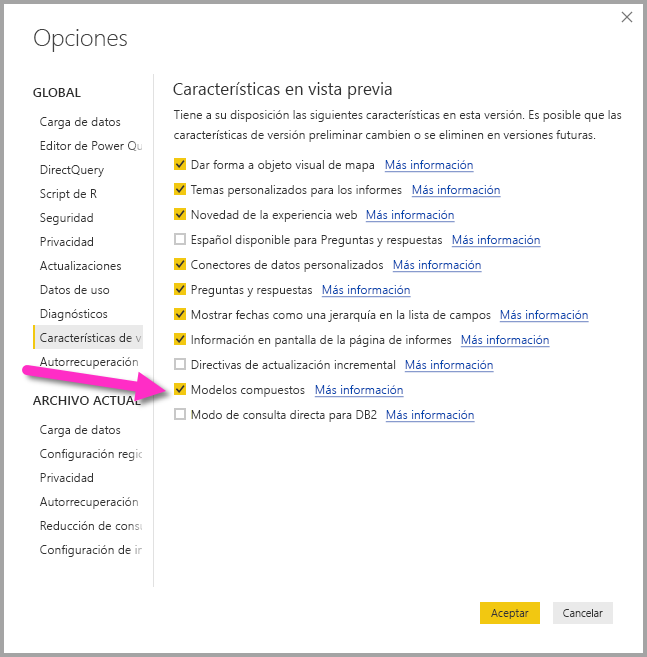

# Modelos compuestos en Power BI Desktop (versión preliminar)

Anteriormente en **Power BI Desktop**, cuando se usaba DirectQuery en un informe, no se permitía usar ninguna otra conexión de datos en ese informe, ya fuese que se tratara de DirectQuery o importación. Con los **modelos compuestos**, esa restricción ya no existe y un informe puede incluir sin problemas conexiones de datos de más de una conexión de datos de DirectQuery o de importación, en la combinación de su preferencia.

La funcionalidad de **modelos compuestos** de **Power BI Desktop** consta de tres características relacionadas:

* **Modelos compuestos**: esta característica permite que un informe tenga varias conexiones de datos, incluidas conexiones de DirectQuery o importación, en cualquier combinación de ambas.
* **Relaciones de varios a varios**: con los **modelos compuestos** puede establecer **relaciones de varios a varios** entre tablas, quitando los requisitos de valores únicos en las tablas y quitando soluciones alternativas anteriores, como la introducción de tablas nuevas solo para establecer relaciones. 
* **Modo de almacenamiento**: ahora puede especificar qué objetos visuales requieren una consulta a los orígenes de datos de back-end y los que no la requieren se importan incluso si están basados en DirectQuery, lo que permite mejorar el rendimiento y reducir la carga de back-end. Anteriormente, incluso los objetos visuales simples, como las segmentaciones, iniciaban consultas que se enviaban a los orígenes de back-end. 

Cada una de las tres características relacionadas de los **modelos compuestos** de esta colección se describe en artículos independientes:

* Los **modelos compuestos** se describen en detalle en este artículo.
* Las **relaciones de varios a varios** se describen en su propio artículo, [Relaciones de varios a varios en Power BI Desktop (versión preliminar)](desktop-many-to-many-relationships.md).
* El **modo de almacenamiento** se describe en su propio artículo, [Modo de almacenamiento en Power BI Desktop (versión preliminar)](desktop-storage-mode.md).

## Habilitación de la característica de modelos compuestos en versión preliminar

La característica de **modelos compuestos** está en versión preliminar y se debe habilitar en **Power BI Desktop**. Para habilitar los **modelos compuestos**, seleccione **Archivo > Opciones y configuración > Opciones > Características de versión preliminar** y active la casilla de verificación **Modelos compuestos**. 

Deberá reiniciar **Power BI Desktop** para que se habilite la característica.

## Uso de los modelos compuestos

Con los **modelos compuestos**, puede conectarse a todo tipo de orígenes de datos distintos cuando usa **Power BI Desktop** o el **servicio Power BI** y puede establecer esas conexiones de datos de distintas formas. Puede importar datos a Power BI, que es la forma más común de obtener datos, o bien puede conectarse directamente a los datos en su repositorio de origen original mediante DirectQuery. Puede obtener más información detallada sobre DirectQuery en el artículo [Uso de DirectQuery en Power BI](desktop-directquery-about.md).

Al usar DirectQuery, con los **modelos compuestos** es posible crear un modelo de Power BI (como un archivo .pbix de Power BI Desktop único) que hace lo siguiente:

* combina los datos de uno o varios orígenes de DirectQuery, o
* combina los datos de orígenes de DirectQuery e importa los datos

Por ejemplo, con los **modelos compuestos** es posible crear un modelo que combina datos de ventas de un almacenamiento de datos empresarial con los datos de destinos de ventas que se encuentran en una base de datos SQL Server departamental, junto con algunos datos importados desde una hoja de cálculo. Un modelo que combina datos de más de un origen de DirectQuery o que combina DirectQuery con datos importados se conoce como un *modelo compuesto*.

> [!NOTE]
> Si bien los modelos compuestos están en versión preliminar, no es posible publicarlos en el servicio Power BI. 

Puede crear relaciones entre tablas como siempre lo ha hecho, incluso cuando esas tablas provienen de distintos orígenes, con estas restricciones: se debe definir que toda relación proveniente de distintos orígenes tiene una cardinalidad de **varios a varios**, independientemente de su cardinalidad real. De ese modo, el comportamiento de dichas relaciones es el mismo que el normal para las relaciones de **varios a varios**, tal como se describe en [Relaciones de varios a varios en Power BI Desktop (versión preliminar)](desktop-many-to-many-relationships.md). Tenga en cuenta que en el contexto de los modelos compuestos, todas las tablas importadas son efectivamente un solo origen, independientemente del real origen de datos subyacente desde donde se importan en realidad.   

## Ejemplo del uso de los modelos compuestos

Como ejemplo de un **modelo compuesto**, considere un informe conectado a un almacenamiento de datos corporativo (en SQL Server) mediante DirectQuery, donde el almacenamiento de datos contiene datos de *Sales by Country* (Ventas por país), *Quarter* (Trimestre) y *Bike (Product)* (Bicicleta [producto]), como se muestra en la imagen siguiente.

En este momento, podría crear objetos visuales sencillos con campos de este origen. Por ejemplo, el objeto visual siguiente muestra el importe de ventas total por *ProductName* para un trimestre seleccionado. 

Pero ¿qué pasaría si tuviera cierta información sobre el administrador de productos que se ha asignado a cada producto, junto con la prioridad de marketing, donde los datos se conservan en una hoja de cálculo de Excel? Puede desear ver *Sales Amount* (Importe de ventas) por *Product Manager* (Administrador de productos), si bien hacer que estos datos locales se agreguen al almacenamiento de datos corporativo probablemente sea inviable o, en el mejor de los escenarios, tarde varios meses. Aunque es posible importar esos datos de ventas desde el almacenamiento de datos (en lugar de usar DirectQuery), en cuyo momento se podrían combinar con los datos importados de la hoja de cálculo, ese enfoque no es razonable debido a los motivos que llevan a usar DirectQuery en primer lugar, como cierta combinación de las reglas de seguridad aplicadas en el origen subyacente, la necesidad de poder ver los datos más recientes y la escala total de los datos. 

Es ahí donde aparecen los **modelos compuestos**. Los modelos compuestos dan la opción de conectarse al almacenamiento de datos a través de DirectQuery y luego también usar GetData para los orígenes adicionales. En este caso, establecemos la conexión de DirectQuery al almacenamiento de datos corporativo, luego usamos GetData y elegimos Excel, navegamos a la hoja de cálculo que contiene los datos locales y podemos importar la hoja que contiene los elementos *ProductNames* y los elementos *SalesManager* y *Priority* asignados.  

Ahora en la lista de **campos** vemos la tabla *Bicicleta* original (de SQL Server) y una nueva tabla *Product Managers* (Administradores de productos) (con los datos importados desde Excel). 

Del mismo modo, si observamos la **Vista de relaciones** en **Power BI Desktop**, ahora veremos una tabla adicional denominada *Product Managers* (Administradores de productos). 

Ahora es necesario relacionar estas con las demás tablas del modelo, que lo hacemos tal como lo hemos hecho siempre, mediante la creación de una relación entre la tabla *Bike* (Bicicleta) (en SQL Server) y la tabla *Product Managers* (Administradores de productos) (importada) como entre *Bike[ProductName]* y *ProductManagers[ProductName]*. Tal como ya se describió en este artículo, todas las relaciones que van por distintos orígenes deben tener una cardinalidad de **varios a varios** y, por tanto, se trata de la cardinalidad predeterminada que se selecciona. 

Una vez que se crea esta relación, se muestra en **Vista de relaciones** en **Power BI Desktop** tal como se esperaría.

Con esas relaciones de tablas establecidas, ahora podemos crear objetos visuales con cualquiera de los campos que aparecen en la lista de **campos**, mediante la combinación sin problemas de datos provenientes de distintos orígenes. Por ejemplo, el objeto visual siguiente muestra el *importe de ventas* total para cada *administrador de productos*. 

En este ejemplo se muestra un caso común de una tabla de *dimensión* (como *Producto* o *Cliente*) que se extiende con ciertos datos adicionales importados desde otro lugar y también es posible que las tablas usen conexiones de DirectQuery con distintos orígenes. Por tanto, para extender el ejemplo, imaginemos que *SalesTargets* por *Country* (País) y *Period* (Período) se almacenan en una base de datos departamental independiente. Puede usar **GetData** para conectarse a esos datos como lo haría habitualmente, tal como se muestra en la imagen siguiente. 

A continuación, de manera similar a cómo lo hicimos anteriormente en este ejemplo, podemos crear relaciones entre la tabla nueva y las demás tablas del modelo, además de crear objetos visuales que combinen sus datos. Volvamos a examinar la **Vista de relaciones**, donde establecimos relaciones nuevas en nuestro escenario extendido de ejemplo.

Tal como se muestra en la imagen siguiente, que se basa en los datos nuevos y en las relaciones que acabamos de crear, el objeto visual que aparece en la esquina inferior izquierda muestra *Importe de ventas* frente a *Destino*, con el cálculo de la varianza que muestra la diferencia, donde *Importe de ventas* y *Destino* provienen de dos bases de datos de SQL Server distintas. 

## Establecimiento del modo de almacenamiento

Cada tabla de un **modelo compuesto** tiene un **modo de almacenamiento** que indica si la tabla se basa en DirectQuery o en importación. El **modo de almacenamiento** se puede ver y modificar en el panel **Propiedad**. Para llegar ahí, seleccione **Propiedades** en el menú contextual de la lista de **Campos** que aparece cuando hace clic con el botón derecho. En la imagen siguiente se muestra el **modo de almacenamiento** (que en la imagen se abrevia como **Storage ...** debido al ancho del panel).

El **modo de almacenamiento** también se puede ver en la información sobre herramientas de cada tabla.

Para cualquier archivo de **Power BI Desktop** (un archivo .pbix) que contiene algunas tablas desde DirectQuery y algunas tablas de importación, la barra de estado muestra un **modo de almacenamiento** de **Mixed** (Combinado). Puede hacer clic en ese término en la barra de estado y cambiar fácilmente todas las tablas para importación.

Los detalles sobre el **modo de almacenamiento** se describen en su totalidad en el artículo [Modo de almacenamiento en Power BI Desktop (versión preliminar)](desktop-storage-mode.md).  

## Tablas calculadas

Las tablas calculadas se pueden agregar a un modelo que usa DirectQuery y la expresión DAX que define la tabla calculada puede hacer referencia ya sea a las tablas importadas o a las tablas de DirectQuery, o bien una combinación de ambas. 

Las tablas calculadas siempre se importan y los datos de dichas tablas se actualizan cuando se actualiza la tabla. Por tanto, si una tabla calculada hace referencia a una tabla de DirectQuery, los objetos visuales que hacen referencia a la tabla de DirectQuery siempre muestran los valores más recientes del origen subyacente, pero los objetos visuales que hacen referencia a la tabla calculada muestran los valores en el momento en que se actualizó por última vez la tabla calculada.

## Implicaciones de seguridad 

Los modelos compuestos tienen algunas implicaciones de seguridad. Una consulta enviada a un origen de datos puede incluir valores de datos que se han recuperado desde otro origen de datos. Para el ejemplo descrito anteriormente en este artículo, el objeto visual que muestra *Importe de ventas* por *Administrador de productos* hará que se envíe una consulta SQL a la base de datos relacional de **Ventas**, donde una consulta SQL puede contener los nombres de *Administradores de productos* y sus *Productos* asociados. 

Por este motivo, la información que se almacena en la hoja de cálculo ahora se incluye en una consulta enviada a la base de datos relacional. Si esta información es confidencial, se deben considerar las implicaciones de seguridad de esto. En concreto, se deben considerar las implicaciones siguientes:

* Cualquier administrador de la base de datos que pueda ver registros de auditoría o seguimientos podría ver esta información, incluso si no cuenta con los permisos para los datos en su origen original (en este caso, permisos para el archivo de Excel).

* Se debe considerar la configuración de cifrado para cada origen, con el fin de evitar que se recupere la información de un origen a través de una conexión cifrada y que, más adelante y de manera inadvertida, se incluya en una consulta enviada a otro origen a través de una conexión no cifrada. 

**Power BI Desktop** muestra un mensaje de advertencia cuando se realiza una acción para crear un modelo compuesto con el fin de permitir la confirmación de que se consideraron todas las implicaciones de seguridad.  

Por motivos similares, se debe tener cuidado al abrir un archivo de **Power BI Desktop** enviado desde un origen que no es de confianza. Si ese archivo incluye modelos compuestos, significa que se enviará información recuperada de un origen (a través de las credenciales del usuario que abre el archivo) a otro origen de datos como parte de la consulta (donde posiblemente podría verla el autor malintencionado del archivo de Power BI Desktop). Por tanto, al abrir por primera vez el archivo de Power BI Desktop, aparecerá una advertencia si contiene varios orígenes. Esta advertencia es similar a la que aparece al abrir un archivo que incluye consultas SQL nativas.  

## Implicaciones de rendimiento  

Siempre se debe considerar el rendimiento al usar DirectQuery, principalmente para garantizar que el origen de back-end tenga los recursos suficientes para proporcionar una buena experiencia para los usuarios. Una buena experiencia significa que los objetos visuales se deberían actualizar en 5 segundos o menos. También debe cumplir con el consejo sobre el rendimiento que aparece en el artículo [Uso de DirectQuery en Power BI](desktop-directquery-about.md). El uso de los modelos compuestos agrega consideraciones de rendimiento adicionales, porque un solo objeto visual puede resultar en el envío de consultas a varios orígenes, a menudo pasando los resultados de una consulta a un segundo origen. Esta situación puede generar las siguientes formas de ejecución posibles:

* **Una consulta SQL que incluye un gran número de valores literales**: por ejemplo, un objeto visual que solicita el *Importe de ventas* total (desde la base de datos SQL) para un conjunto de *Administradores de productos* seleccionado (desde la tabla relacionada que se importó desde una hoja de cálculo) primero necesitaría encontrar los *productos* que son administrados por dichos administradores de productos antes de enviar una consulta SQL que incluya todos los id. de productos de una cláusula *WHERE*.

* **Una consulta SQL que consulta en un nivel inferior de granularidad, con los datos que se agregan localmente**: usando el mismo ejemplo que en el elemento de viñeta anterior de esta lista, cuando la cantidad de *productos* que cumple con el filtro de *Administrador de productos* aumenta considerablemente, en cierto punto se vuelve ineficaz o es inviable incluirlos todos en una cláusula *WHERE*. En su lugar, es necesario consultar el origen relacional en el nivel inferior de *Producto* y, a continuación, agregar localmente los resultados. Si la cardinalidad de los *productos* supera un límite de 1 millón, la consulta generará un error.

* **Varias consultas SQL, una por grupo por valor**: cuando la agregación usa **DistinctCount**, agrupado por alguna columna desde otro origen, si el origen externo no admite pasar de manera eficaz varios valores literales que definen la agrupación, es necesario enviar una consulta SQL por grupo por valor. Por ejemplo, un objeto visual que solicita un recuento distinto de *CustomerAccountNumber* (desde la tabla de SQL Server) por *Administrador de productos* (desde la tabla relacionada que se importó desde una hoja de cálculo) debería pasar los detalles de la tabla *Administradores de productos* en la consulta enviada a SQL Server. A través de otros orígenes, por ejemplo Redshift, esto no es viable y, en su lugar, habría una consulta SQL enviada por *Administrador de ventas* (hasta algún límite práctico, momento en el cual se generaría un error en la consulta). 

Cada uno de estos casos tiene sus propias implicaciones en el rendimiento y los detalles exactos varían en función de cada origen de datos. Una buena regla general es que mientras la cardinalidad de las columnas usadas en la relación que combina ambos orígenes permanece baja (unos pocos miles), el rendimiento no debería verse demasiado afectado. A medida que la cardinalidad aumenta, es necesario poner más atención al impacto en el rendimiento resultante. 

Además, el uso de las relaciones de **varios a varios** significa que se deben enviar consultas independientes al origen subyacente de cada nivel total o subtotal, en lugar de agregar localmente los valores detallados. Por tanto, un objeto visual de tabla simple con totales podría enviar dos consultas SQL en lugar de una. 

## Limitaciones y consideraciones

Existen algunas limitaciones para esta versión de los **modelos compuestos**.

Los orígenes multidimensionales siguientes no se pueden usar con los **modelos compuestos**:

* SAP HANA
* SAP Business Warehouse
* SQL Server Analysis Services
* Conjuntos de datos de Power BI

Al conectarse a esos orígenes multidimensionales mediante DirectQuery, no se puede conectar también a otro origen de DirectQuery ni combinar con los datos importados.

Las limitaciones existentes de usar DirectQuery siguen aplicándose cuando se usan los **modelos compuestos**. Muchas de esas limitaciones son ahora por tabla, en función del **modo de almacenamiento** de la tabla. Por ejemplo, una columna calculada en una tabla importada puede hacer referencia a otras tablas, pero una columna calculada en una tabla de DirectQuery sigue restringida para hacer referencia solo a columnas de la misma tabla. Otras limitaciones se aplican al modelo como un todo, si cualquiera de las tablas dentro del modelo son DirectQuery. Por ejemplo, las características **Conclusiones rápidas** y **Preguntas y respuestas** no están disponibles en un modelo si cualquiera de las tablas dentro del mismo tiene un **modo de almacenamiento** de DirectQuery. 

## Pasos siguientes

Los artículos siguientes describen más información sobre los modelos compuestos y también describen DirectQuery detalladamente.

* [Relaciones de varios a varios en Power BI Desktop (versión preliminar)](desktop-many-to-many-relationships.md)
* [Modo de almacenamiento en Power BI Desktop (versión preliminar)](desktop-storage-mode.md)

Artículos sobre DirectQuery:

* [Uso de DirectQuery en Power BI](desktop-directquery-about.md)
* [Orígenes de datos admitidos por DirectQuery en Power BI](desktop-directquery-data-sources.md)

