# Formato condicional en tablas 
Con el formato condicional de tablas, se pueden especificar colores personalizados de las celdas en función de los valores de esas celdas o de otros valores o campos, usando incluso colores de degradado. También puede mostrar valores de celda con barras de datos. 

Para acceder al formato condicional, en el área **Campos** del panel **Visualizaciones** de Power BI Desktop, seleccione la flecha hacia abajo que está situada junto al valor del área **Valores** que desea formatear (o haga clic con el botón derecho en el campo). El formato condicional solo se puede administrar en el área **Valores** de **Campos**.

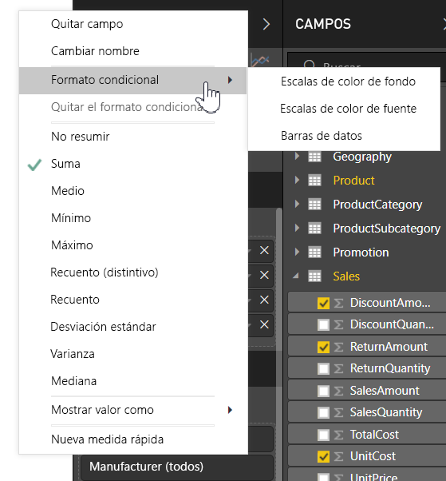

En estas secciones se describen cada una de estas opciones de formato condicional. Una o varias opciones pueden combinarse en una sola columna de tabla.

> [!NOTE]
> Cuando se aplica a una tabla, el formato condicional reemplaza cualquier estilo de tabla personalizada aplicado a las celdas con formato condicional.

Para quitar el formato condicional de una visualización, simplemente vuelva a hacer clic con el botón derecho en el campo, seleccione **Quitar formato condicional** y elija el tipo de formato que va a quitar.

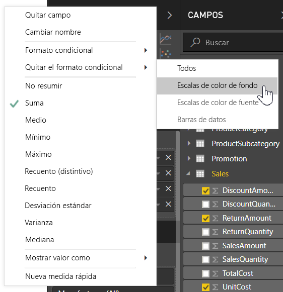

## Escalas de color de fondo

Seleccione **Formato condicional** y **Escalas de color de fondo**. Se abrirá el cuadro de diálogo siguiente.

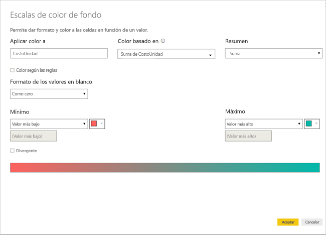

Puede seleccionar un campo en el modelo de datos en el que basar los colores, estableciendo **Color based on** (Color basado en) en ese campo. Además, puede especificar el tipo de agregación para el campo seleccionado con el valor **Resumen**. El campo que se coloreará se especifica en el campo **Apply color to** (Aplicar color a), para que pueda realizar un seguimiento. Se puede aplicar formato condicional a los campos de texto y de fecha, siempre y cuando se elija un valor numérico como base del formato.

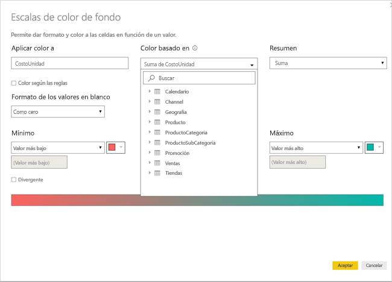

Para usar valores de colores discretos para determinados intervalos de valor, seleccione **Color by rules** (Color por reglas). Para usar un espectro de colores, deje **Color by rules** (Color por reglas) desactivado. 

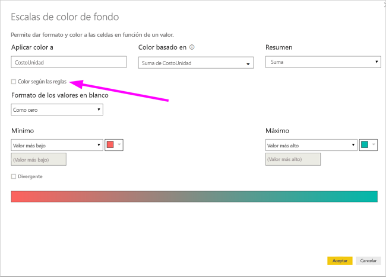

### Color según las reglas

Cuando selecciona **Color by rules** (Color por reglas), puede especificar uno o varios intervalos de valor, cada uno con un conjunto de colores.  Cada intervalo de valor empieza por una condición de valor *Si* y una condición de valor *Y*, y un color.

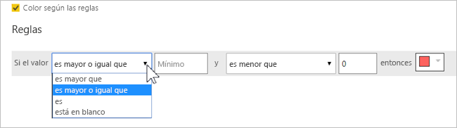

Las celdas de la tabla con valores en cada intervalo se rellenan con el color especificado. Hay tres reglas en esta imagen.

La tabla de ejemplo se parece a esta:

### Color mínimo a máximo

Puede configurar los valores *Mínimo* y *Máximo* y sus colores. Si selecciona el cuadro **Diverging**, puede configurar un valor *Centro* opcional.

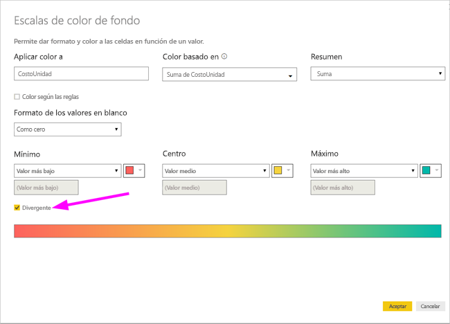

La tabla de ejemplo se parece a esta:

## Escalas de color de fuente

Al seleccionar **Formato condicional** y **Escalas de color de fuente**, se abre este cuadro de diálogo. Este cuadro de diálogo es similar a **Escalas de color de fondo**, pero cambia el color de la fuente en lugar del color de fondo de la celda.

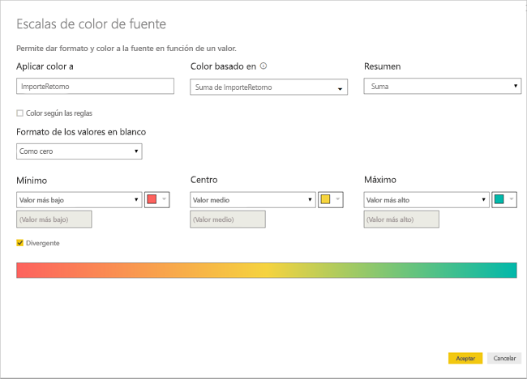

La tabla de ejemplo se parece a esta:

## Barras de datos

Al seleccionar **Formato condicional** y **Barras de datos**, se abre este cuadro de diálogo. 

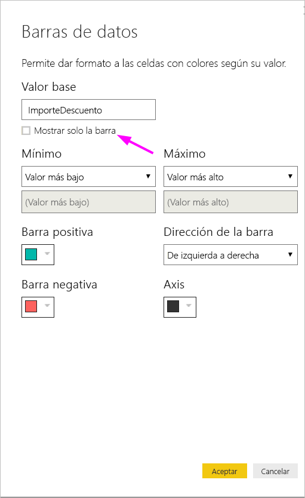

De forma predeterminada, la opción **Show bar only** (Mostrar solo la barra) está desactivada, por lo que la celda de tabla muestra la barra y el valor real.

Si la opción **Show bar only** (Mostrar solo la barra) está activada, la celda de tabla solo muestra la barra.

## Formato de color por valor de campo

Puede usar una medida o una columna que especifique un color, ya sea mediante un valor de texto o un código hexadecimal, para aplicar ese color al fondo del color de fuente de un objeto visual de matriz o tabla. También puede crear una lógica personalizada para un campo determinado y hacer que esa lógica aplique el color que quiera a la fuente o al fondo.

Por ejemplo, en la tabla siguiente hay un color asociado a cada modelo de producto. 

Para dar formato a esa celda según su valor de campo, seleccione el cuadro de diálogo **Formato condicional**; para ello, haga clic con el botón derecho en la columna *Color* de ese objeto visual y, en este caso, haga clic en **Color de fondo** en el menú. 

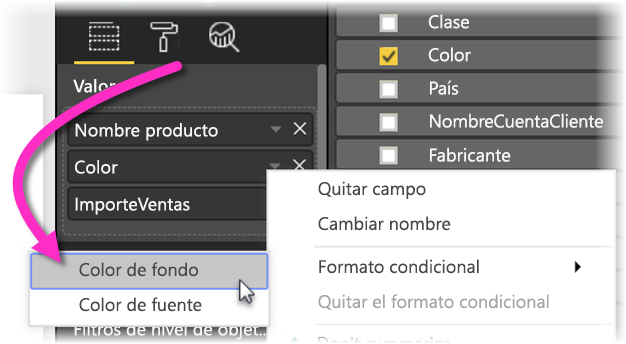

En el cuadro de diálogo que aparece, haga clic en **Valor de campo** en el área desplegable **Dar formato por**, tal como se muestra en la siguiente imagen.

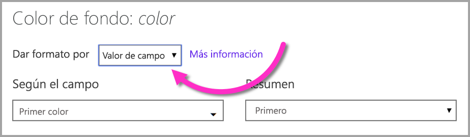

Puede repetir ese proceso para el color de fuente y el resultado en el objeto visual será un color sólido en la columna **Color**, tal como se muestra en la siguiente pantalla.

También podría crear un cálculo de DAX basado en la lógica de negocios que genere diferentes códigos hexadecimales según las condiciones que prefiera. Esto suele ser más sencillo que crear varias reglas en el cuadro de diálogo de formato condicional. Fíjese en el campo *ColorKPI* de la siguiente imagen de ejemplo.

Después, podría establecer el valor del campo **Color de fondo** de la siguiente forma.

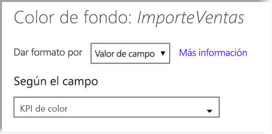

Y después podría obtener resultados como la siguiente matriz.

Podría crear muchas variaciones más solo con su imaginación y un poco de DAX.

Puede usar cualquiera de los valores enumerados en las especificaciones de color CSS en [ https://www.w3.org/TR/css-color-3/ ](https://www.w3.org/TR/css-color-3/) para colorear los objetos visuales:
* 3, por ejemplo, #3E4AFF códigos de 6 u 8 hex dígitos. Asegúrese de que incluir el símbolo # al principio del código. No se acepta "3E4AFF". 
* Por ejemplo, RGBA (234, 234, 234, 0,5) de los valores RGB o RGBA
* HSL o HSLA, por ejemplo, valores HSLA (123, 75%, 75%, 0,5)
* Por ejemplo, verde, azul claro, PeachPuff los nombres de color 

## Pasos siguientes
Para obtener más información, consulte el artículo siguiente:  

* [Sugerencias y trucos para el formato de color en Power BI](visuals/service-tips-and-tricks-for-color-formatting.md)  

