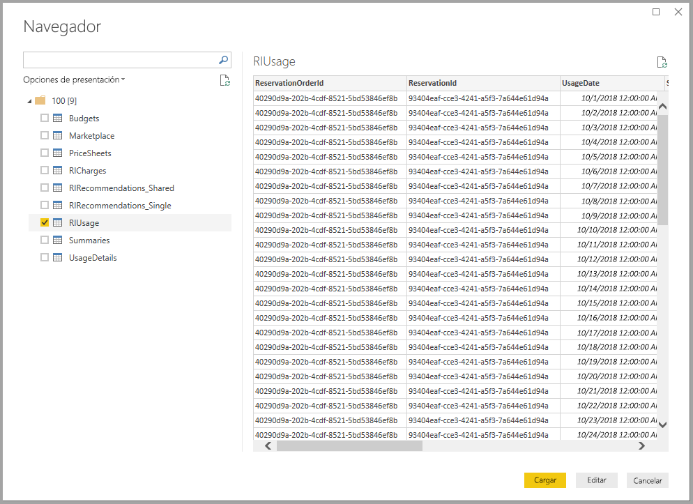
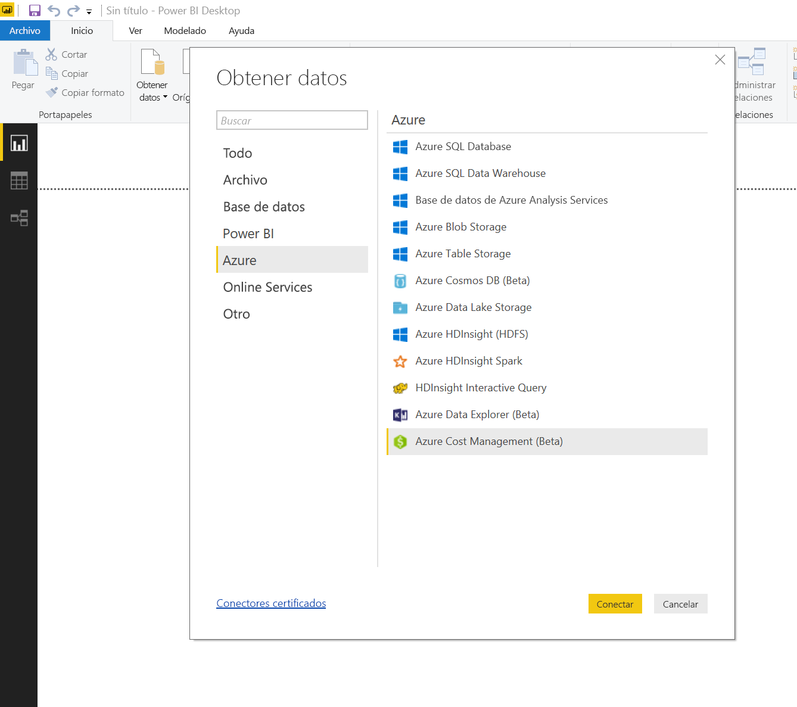
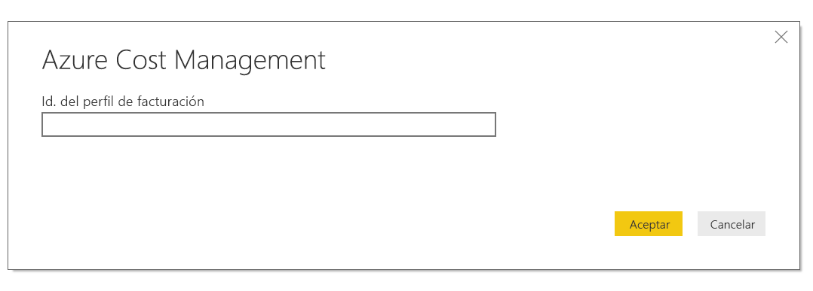
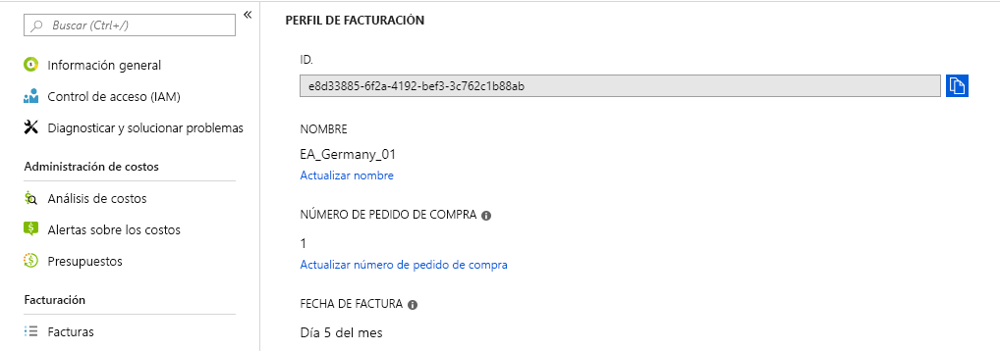
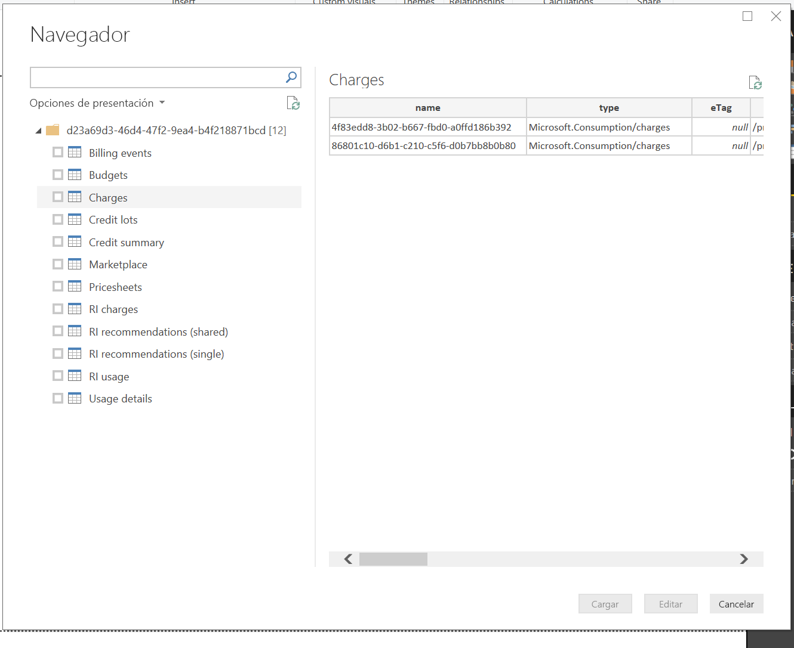
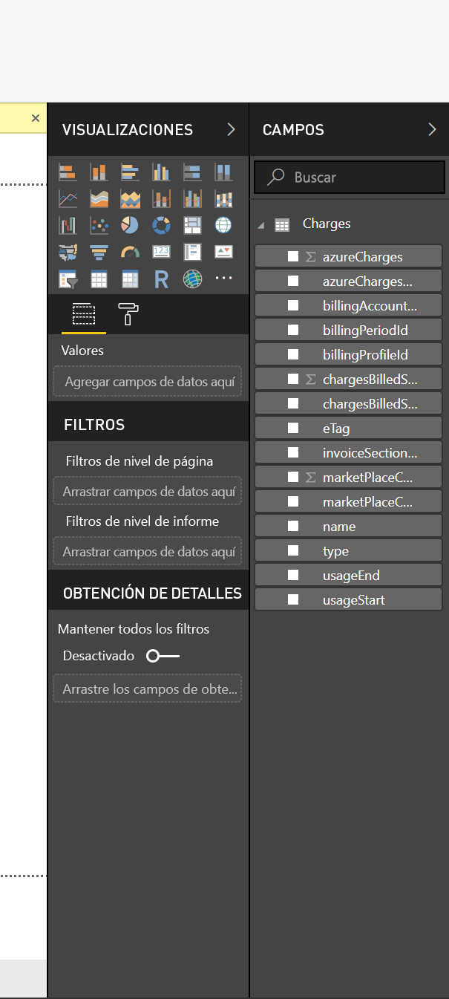

# <a name="analyze-azure-cost-and-usage-data-in-power-bi-desktop"></a>Análisis del costo y los datos de uso de Azure en Power BI Desktop

Power BI Desktop puede conectarse a Azure y obtener datos detallados sobre el uso del servicio de Azure de su organización. Estos datos permiten realizar cálculos y crear informes personalizados para comprender y analizar mejor el gasto derivado del uso de Azure.

Actualmente, Power BI admite la conexión a cuentas de facturación de contrato Enterprise y contrato de cliente.

Los usuarios de contrato Enterprise deben conectarse con el conector de Azure Consumption Insights. Los usuarios de cuentas de contrato de cliente deben conectarse con el conector de Azure Cost Management.

## <a name="connect-with-azure-consumption-insights"></a>Conexión con Azure Consumption Insights

Azure Consumption Insights le permite conectarse a cuentas de facturación de contratos de Azure Enterprise.

En esta sección, aprenderá a conectarse para obtener los datos que necesita, verá cómo se realiza la migración desde el conector de Azure Enterprise y verá las *columnas de detalles de uso* disponibles en la API de **ACI** (Azure Consumption Insights).

Para conectarse correctamente con el conector de **Azure Consumption Insights**, debe tener acceso a las características empresariales de Azure Portal.

Para conectarse mediante el conector de **Azure Consumption Insights**, seleccione **Obtener datos** en la cinta de opciones de **Inicio** de **Power BI Desktop**. Seleccione **Servicios en línea** en las categorías de la izquierda y verá **Microsoft Azure Consumption Insights (Beta)**. Seleccione **Conectar**.


En el cuadro de diálogo que aparece, proporcione su *número de inscripción*.


* Puede obtener este número en [Azure Enterprise Portal](https://ea.azure.com), en la ubicación que se muestra en esta imagen:
  
  
  
  Esta versión del conector solo admite las inscripciones empresariales de https://ea.azure.com. Actualmente no se admiten las inscripciones de China.

A continuación, proporcione la *clave de acceso* para conectarse.


* Puede encontrar la clave de acceso para la inscripción en [Azure Enterprise Portal](https://ea.azure.com).
  
  

Una vez que proporcione su *clave de acceso* y seleccione **Conectar**, aparece una ventana **Navegador** que muestra las nueve tablas que tiene disponibles: 
* **Presupuestos**: proporciona detalles de presupuesto para ver los costos o el uso reales frente a los objetivos de presupuesto existentes. 
* **MarketPlace**: proporciona los cargos de Azure Marketplace basados en el uso.
* **PriceSheets**: proporciona tarifas aplicables por medidor en una inscripción.
* **RICharges**: proporciona los cargos asociados a las instancias reservadas en los últimos 24 meses.
* **RIRecommendations_Single**: proporciona recomendaciones de compra de instancias reservadas según las tendencias de uso en una única suscripción durante los últimos 7, 30 o 60 días.
* **RIRecommendations_Shared**: proporciona recomendaciones de compra de instancias reservadas según las tendencias de uso de todas sus suscripciones durante los últimos 7, 30 o 60 días.
* **RIUsage**: proporciona detalles de consumo de las instancias reservadas existente en el último mes.
* **Summaries**: proporciona un resumen mensual de saldos, nuevas compras, cargos de servicio de Azure Marketplace, ajustes y cargos por el uso por encima del límite.
* **UsageDetails**: proporciona un desglose de las cantidades consumidas y los gastos estimados para una inscripción.

Puede seleccionar la casilla situada junto a cualquier tabla para ver una vista previa. Puede seleccionar una o más tablas activando la casilla situada junto a su nombre y, después, seleccionando **Cargar**.



> [!NOTE]
> Las tablas *Summary* y *PriceSheet* solo están disponibles para la clave de API en el nivel de inscripción. Además, los datos de estas tablas son, de forma predeterminada, los datos del mes actual de las tablas *Usage* y *PriceSheet*. Las tablas *Summary* y *MarketPlace* no se limitan al mes actual.
> 
> 

Cuando selecciona **Cargar** los datos se cargan en **Power BI Desktop**.


Una vez cargados los datos seleccionados, se pueden ver las tablas y campos que ha seleccionado en el panel **Campos**.


## <a name="using-azure-consumption-insights"></a>Uso de Azure Consumption Insights
Para usar el conector de **Azure Consumption Insights**, debe tener acceso a las características empresariales de Azure Portal.

Una vez cargados correctamente los datos mediante el conector de **Azure Consumption Insights**, puede crear sus propias medidas y columnas personalizadas mediante el **Editor de consultas**, y puede crear objetos visuales, informes, y paneles que se pueden compartir en el **servicio Power BI**.

Azure también incluye una colección de consultas de ejemplo que se pueden recuperar mediante una consulta en blanco. Para ello, en la cinta de opciones de **Inicio** de **Power BI Desktop**, seleccione la flecha desplegable de **Obtener datos** y, a continuación, seleccione **Consulta en blanco**. También puede hacer esto en el **Editor de consultas** haciendo clic con el botón derecho en el panel **Consultas** de la izquierda y seleccionando **Nueva consulta > Consulta en blanco** en el menú que aparece.

En la **barra de fórmulas**, escriba lo siguiente:

    = MicrosoftAzureConsumptionInsights.Contents

Aparece una colección de ejemplos, como se muestra en esta imagen:


Al trabajar con informes y crear consultas, utilice lo siguiente:

* Para definir el número de meses a partir de la fecha actual, use *numberOfMonth*.
  * Utilice un valor entre 1 y 36 para indicar el número de meses, a partir de la fecha actual, que desea importar. Le recomendamos que consulte menos de 12 meses de datos para evitar superar los límites de importación y de volumen de datos permitidos para las consultas de Power BI.
* Para definir un intervalo de meses en un período de tiempo histórico, utilice *startBillingDataWindow* y *endBillingDataWindow*
* *No* use *numberOfMonth* junto con *startBillingDataWindow* ni *endBillingDataWindow*.

## <a name="migrating-from-the-azure-enterprise-connector"></a>Migración desde el conector de Azure Enterprise
Algunos clientes creaban objetos visuales mediante el *conector de Azure Enterprise (Beta)*, cuyo uso finalmente se interrumpirá y se sustituirá por el uso del conector de **Azure Consumption Insights**. Entre las características y mejoras del conector de **Azure Consumption Insights** cabe destacar las siguientes:

* Orígenes de datos adicionales disponibles para *Resumen de saldos* y *Compras en Marketplace*
* Nuevos parámetros avanzados, como *startBillingDataWindow* y *endBillingDataWindow*
* Mejor rendimiento y capacidad de respuesta

Para ayudar a los clientes durante la transición al conector más reciente de **Azure Consumption Insights**, y para conservar el trabajo que han realizado en la creación de informes o paneles personalizados, los pasos siguientes muestran cómo cambiar al nuevo conector.

### <a name="step-1-connect-to-azure-using-the-new-connector"></a>Paso 1: Conexión a Azure con el nuevo conector
El primer paso consiste en conectarse con el conector de **Azure Consumption Insights** que se describió anteriormente en este artículo con detalle. En este paso, seleccione **Obtener datos > Consulta en blanco** en la cinta de opciones de **Inicio** en **Power BI Desktop**.

### <a name="step-2-use-the-advanced-editor-to-create-a-query"></a>Paso 2: Uso del Editor avanzado para crear una consulta
En el **Editor de consultas**, seleccione **Editor avanzado** en la sección **Consulta** de la cinta de opciones de **Inicio**. En la ventana **Editor avanzado** que aparece, escriba esta consulta:

    let    
        enrollmentNumber = "100",
        optionalParameters = [ numberOfMonth = 6, dataType="DetailCharges" ],
        data = MicrosoftAzureConsumptionInsights.Contents(enrollmentNumber, optionalParameters)   
    in     
        data


Naturalmente, debe reemplazar el valor de *enrollmentNumber* por su propio número de inscripción, que puede obtener en [Azure Enterprise Portal](https://ea.azure.com). El parámetro *numberOfMonth* es el número de meses de datos pasados sobre los que desea volver a partir de los datos actuales. Utilice cero (0) para el mes actual.

Una vez que seleccione **Listo** en la ventana **Editor avanzado** se actualizará la vista previa y podrá ver los datos del intervalo de meses especificado en la tabla. Seleccione **Cerrar y aplicar** y vuelva.

### <a name="step-3-move-measures-and-custom-columns-to-the-new-report"></a>Paso 3: Traslado de medidas y columnas personalizadas al nuevo informe
A continuación, deberá mover todas las columnas o medidas personalizadas que creó a la nueva tabla de detalles. Estos son los pasos que debe realizar.

1. Abra el Bloc de notas (u otro editor de texto).
2. Seleccione la medida que quiere mover y copie el texto del campo *Fórmula* y colóquelo en el Bloc de notas.
   
   
3. Cambie el nombre de *Query1* al nombre original de la tabla de detalles.
4. Para crear nuevas medidas y columnas personalizadas en la tabla, haga clic con el botón derecho en la tabla y elija **Nueva medida**. Después, corte y pegue las columnas y medidas almacenadas hasta que haya terminado con todas.

### <a name="step-4-re-link-tables-that-had-relationships"></a>Paso 4: Volver a vincular tablas que tenían relaciones
Muchos paneles tienen tablas adicionales que se usan para buscar o filtrar, como tablas de fechas o tablas que se usan para proyectos personalizados. Volver a establecer esas relaciones puede resolver la mayoría de los problemas restantes. Aquí se muestra cómo hacerlo.

- En la pestaña **Modelado** de **Power BI Desktop**, seleccione **Administrar relaciones** para que aparezca una ventana que le permita administrar las relaciones dentro del modelo. Vuelva a vincular las tablas según sea necesario.
   
    

### <a name="step-5-verify-your-visuals-and-adjust-field-formatting-as-needed"></a>Paso 5: Comprobación de los objetos visuales y ajuste del formato de los campos según sea necesario
Una vez que haya llegado hasta aquí, la mayor parte de los objetos visuales originales, tablas y exploraciones en profundidad deben estar funcionando según lo previsto. No obstante, puede que sean necesarios algunos retoques de formato para que los datos se muestren tal y como desea que lo hagan. Tómese un poco de tiempo para revisar los paneles y objetos visuales para asegurarse de que tienen el aspecto que desea.

## <a name="using-the-azure-consumption-and-insights-aci-api-to-get-consumption-data"></a>Uso de la API de Azure Consumption and Insights (ACI) para obtener datos de consumo
Azure también proporciona la [**API de Azure Consumption and Insights (ACI)**](https://azure.microsoft.com/blog/announcing-general-availability-of-consumption-and-charge-apis-for-enterprise-azure-customers/). Puede crear sus propias soluciones personalizadas para recopilar, crear informes y visualizar la información de consumo de Azure mediante la API de ACI.

### <a name="mapping-names-and-usage-details-between-the-portal-the-connector-and-the-api"></a>Asignación de nombres y detalles de uso entre el portal, el conector y la API
Las columnas y los nombres de los detalles en Azure Portal son similares en la API y en el conector, pero no siempre son idénticos. Para ayudar a aclararlo, en la tabla siguiente se proporciona una asignación entre las columnas de la API, del conector y las que aparecen en Azure Portal. También se indica si la columna está obsoleta. Para más información y definiciones de estos términos, eche un vistazo al [diccionario de datos de facturación de Azure](https://docs.microsoft.com/azure/billing/billing-enterprise-api-usage-detail).

| Conector ACI / ContentPack ColumnName | Nombre de columna en la API de ACI | Nombre de columna en EA | Obsoleta / presente para compatibilidad con versiones anteriores |
| --- | --- | --- | --- |
| AccountName |accountName |Nombre de cuenta |No |
| AccountId |accountId | |Sí |
| AcccountOwnerId |accountOwnerEmail |AccountOwnerId |No |
| AdditionalInfo |additionalInfo |AdditionalInfo |No |
| AdditionalInfold | | |Sí |
| Consumed Quantity |consumedQuantity |Consumed Quantity |No |
| Consumed Service |consumedService |Consumed Service |No |
| ConsumedServiceId |consumedServiceId | |Sí |
| Costo |cost |ExtendedCost |No |
| Cost Center |costCenter |Cost Center |No |
| Fecha |fecha |Fecha |No |
| Día | |Día |No |
| DepartmentName |departmentName |Nombre de departamento |No |
| DepartmentID |departmentId | |Sí |
| Instance ID | | |Sí |
| InstanceId |instanceId |Instance ID |No |
| Ubicación | | |Sí |
| Meter Category |meterCategory |Meter Category |No |
| Meter ID | | |Sí |
| Medidor Nombre |meterName |Medidor Nombre |No |
| Meter Region |meterRegion |Meter Region |No |
| Meter Sub-Category |meterSubCategory |Meter Sub-Category |No |
| MeterId |meterId |Meter ID |No |
| Mes | |Mes |No |
| Producto |producto |Producto |No |
| ProductId |productId | |Sí |
| Grupo de recursos |resourceGroup |Grupo de recursos |No |
| Resource Location |resourceLocation |Resource Location |No |
| ResourceGroupId | | |Sí |
| ResourceLocationId |resourceLocationId | |Sí |
| ResourceRate |resourceRate |ResourceRate |No |
| ServiceAdministratorId |serviceAdministratorId |ServiceAdministratorId |No |
| ServiceInfo1 |serviceInfo1 |ServiceInfo1 |No |
| ServiceInfo1Id | | |Sí |
| ServiceInfo2 |serviceInfo2 |ServiceInfo2 |No |
| ServiceInfo2Id | | |Sí |
| Store Service Identifier |storeServiceIdentifier |Store Service Identifier |No |
| StoreServiceIdentifierId | | |Sí |
| Nombre de suscripción |subscriptionName |Nombre de suscripción |No |
| Etiquetas |etiquetas |Etiquetas |No |
| TagsId | | |Sí |
| Unit Of Measure |unitOfMeasure |Unit Of Measure |No |
| Año | |Año |No |
| SubscriptionId |subscriptionId |SubscriptionId |Sí |
| SubscriptionGuid |subscriptionGuid |SubscriptionGuid |No |

## <a name="connect-with-azure-cost-management"></a>Conexión con Azure Cost Management

En esta sección, obtendrá información sobre cómo conectarse a su cuenta de facturación del contrato de cliente.

Para conectarse mediante el conector de **Azure Cost Management**, haga clic en la opción **Obtener datos** de la pestaña **Inicio** de **Power BI Desktop**.  Seleccione **Azure** en las categorías de la izquierda para ver **Azure Cost Management (Beta)**. Seleccione **Conectar**.



En el cuadro de diálogo que aparece, especifique su *Id. del perfil de facturación*.



Puede obtener este identificador en [Azure Portal](https://portal.azure.com).  Vaya a **Administración de costos y Facturación**, seleccione su cuenta de facturación y, después, haga clic en **Perfiles de facturación** en la barra lateral.  Seleccione su perfil de facturación y haga clic en **Propiedades** en la barra lateral.  Copie su id. del perfil de facturación.



Se le pedirá que inicie sesión con su correo electrónico y contraseña de Azure.  Una vez que se autentique, se le mostrará una ventana **Navigator** (Navegador) con las doce tablas disponibles:

* **Billing events** (Eventos de facturación): proporciona un registro de eventos de facturas nuevas, compras a crédito y mucho más.
* **Presupuestos**: proporciona detalles de presupuesto para ver los costos o el uso reales frente a los objetivos de presupuesto existentes. 
* **Charges** (Gastos): proporciona un resumen mensual del uso de Azure, los cargos de Marketplace y los cargos facturados por separado.
* **Credit lots** (Lotes de crédito): proporciona detalles de la compra de lotes de crédito de Azure para el perfil de facturación suministrado.
* **Credit summary** (Resumen de crédito): proporciona un resumen de crédito para el perfil de facturación en cuestión.
* **Marketplace**: proporciona los cargos de Azure Marketplace basados en el uso.
* **Pricesheets** (Hojas de precios): proporcionan las tarifas aplicables por medidor para el perfil de facturación facilitado.
* **RI charges** (Gastos de RI): proporciona los cargos asociados a las instancias reservadas en los últimos 24 meses.
* **RI recommendations (single)** [Recomendaciones de RI (única)]: proporciona recomendaciones de compra de instancias reservadas según las tendencias de uso en una única suscripción durante los últimos 7, 30 o 60 días.
* **RI recommendations (shared)** [Recomendaciones de RI (compartida)]: proporciona recomendaciones de compra de instancias reservadas según las tendencias de uso de todas sus suscripciones durante los últimos 7, 30 o 60 días.
* **RI usage** (Uso de RI): proporciona detalles de consumo de las instancias reservadas existente en el último mes.
* **Usage details** (Detalles de uso): proporciona un desglose de las cantidades consumidas y los gastos estimados para el identificador de perfil de facturación facilitado.

Puede seleccionar la casilla situada junto a cualquier tabla para ver una vista previa.  Puede seleccionar una o más tablas si activa la casilla situada junto a su nombre y selecciona **Cargar**.



Cuando selecciona **Cargar** los datos se cargan en **Power BI Desktop**.


Una vez cargados los datos seleccionados, se pueden ver las tablas y campos que ha seleccionado en el panel **Campos**.



## <a name="writing-custom-queries"></a>Escritura de consultas personalizadas

Si desea personalizar el número de meses, cambiar la versión de la API o crear una lógica más avanzada en los datos devueltos, puede crear una consulta personalizada de M.

Vaya a la pestaña **Inicio** de la cinta de **Power BI Desktop**, haga clic en el menú desplegable de **Obtener datos** y, después, seleccione **Consulta en blanco**.  También puede hacer esto en el **Editor de consultas**; para ello, haga clic con el botón derecho en el panel **Consultas** de la izquierda y seleccione **Nueva consulta > Consulta en blanco** en el menú que aparece.

En la **barra de fórmulas**, escriba lo siguiente, reemplazando `billingProfileId` por su identificador real y "charges" por cualquier nombre de tabla válido (la lista anterior).

```
let
    Source = AzureCostManagement.Tables(billingProfileId, [ numberOfMonths = 3 ]),
    charges = Source{[Key="charges"]}[Data]
in
    charges
```

Además de sustituir el valor de `numberOfMonths` por cualquier número entre 1 y 36, también puede proporcionar:

* `apiVersion` para personalizar la versión de la API a la que llamará la consulta.
* `lookbackWindow`, para obtener recomendaciones de RI (única o compartida), para modificar la ventana temporal para la que se van a generar las recomendaciones (las opciones válidas son 7, 30 o 60 días)


## <a name="next-steps"></a>Pasos siguientes
Hay todo tipo de datos a los que puede conectarse con Power BI Desktop. Para obtener más información sobre orígenes de datos, consulte los siguientes recursos:

* [¿Qué es Power BI Desktop?](desktop-what-is-desktop.md)
* [Orígenes de datos en Power BI Desktop](desktop-data-sources.md)
* [Combinar datos y darles forma con Power BI Desktop](desktop-shape-and-combine-data.md)
* [Connect to Excel workbooks in Power BI Desktop (Conectarse a libros de Excel en Power BI Desktop)](desktop-connect-excel.md)   
* [Especificar datos directamente en Power BI Desktop](desktop-enter-data-directly-into-desktop.md)   

