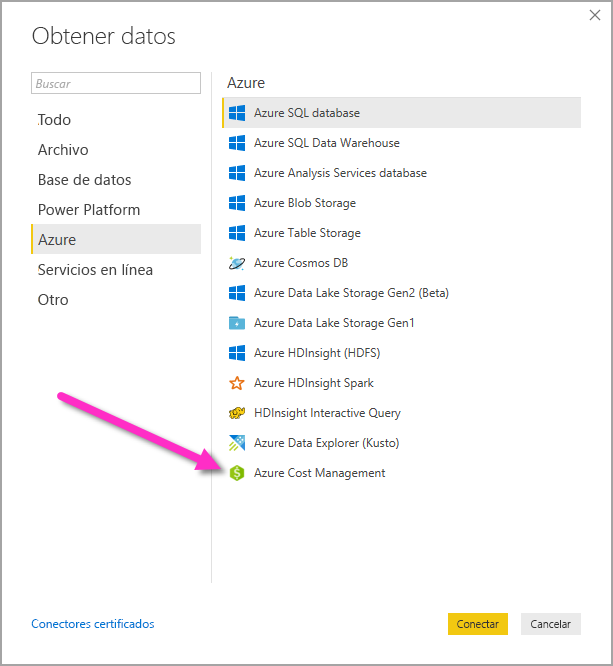
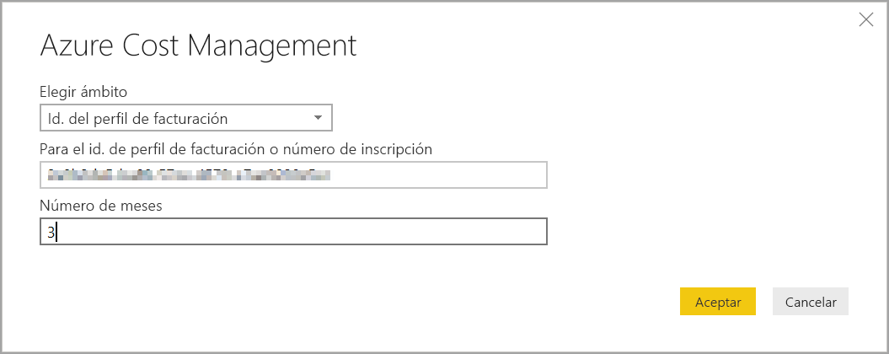
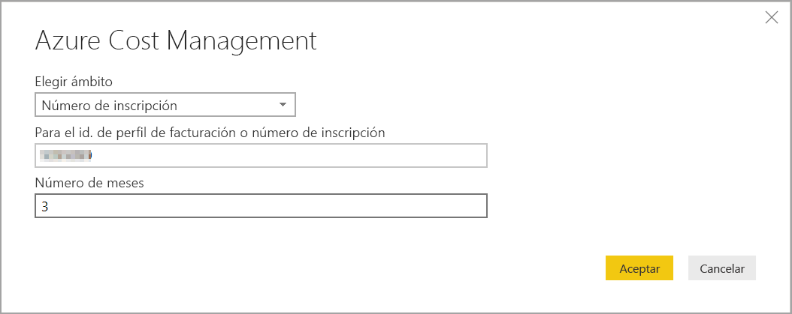
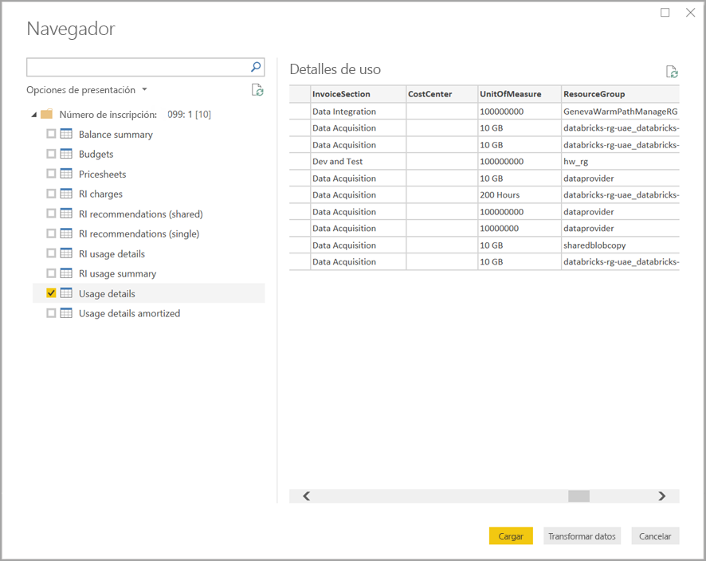

# Conexión a los datos de Azure Cost Management en Power BI Desktop

El conector de Azure Cost Management para Power BI Desktop se puede usar para crear informes y visualizaciones eficaces y personalizados que ayuden a comprender mejor su gasto con Azure. En la actualidad, el conector de Azure Cost Management admite clientes con un [Contrato de cliente de Microsoft](https://azure.microsoft.com/pricing/purchase-options/microsoft-customer-agreement/) o un [Contrato Enterprise](https://azure.microsoft.com/pricing/enterprise-agreement/).  

El conector de Azure Cost Management usa OAuth 2.0 para la autenticación con Azure. Para conectarse, debe usar una cuenta de [administrador de empresa](https://docs.microsoft.com/azure/billing/billing-understand-ea-roles) para Contratos Enterprise o ser [propietario de una cuenta de facturación](https://docs.microsoft.com/azure/billing/billing-understand-mca-roles) para Contratos de cliente de Microsoft. 

> [!NOTE]
> Este conector reemplaza el conector de [Azure Cost Management (beta)](desktop-connect-azure-consumption-insights.md), disponible previamente. Los informes creados con el conector anterior deben volver a crearse con este.

## Conectar mediante Azure Cost Management

Haga lo siguiente para usar el **conector de Azure Cost Management**:

1.  En la cinta **Inicio**, seleccione **Obtener datos**.
2.  Seleccione **Azure** en la lista de categorías de datos.
3.  Seleccione **Azure Cost Management**.

    

4. En el cuadro de diálogo que se abre, escriba el **Id. del perfil de facturación** de **Contratos de cliente de Microsoft** o el número de **inscripción** de **Contratos de Enterprise (EA)** . 

## Conectarse a una cuenta de Contrato de cliente de Microsoft 

Para conectarse con una cuenta de **Contrato de cliente de Microsoft**, puede obtener el **identificador de perfil de facturación** de Azure Portal:

1.  En [Azure Portal](https://portal.azure.com/), vaya a **Administración de costos + facturación**.
2.  Seleccione su perfil de facturación. 
3.  En **Configuración** en el menú, seleccione **Propiedades** en la barra lateral.
4.  En **Perfil de facturación**, copie el valor de **Id.** 
5.  En **Elegir ámbito**, seleccione **Id. del perfil de facturación** y pegue el identificador de perfil de facturación del paso anterior. 
6.  Escriba el número de meses y seleccione **Aceptar**.

    

7.  Cuando se le solicite, inicie sesión con su cuenta de usuario y contraseña de Azure. 

## Conectar a una cuenta de Contrato Enterprise

Si necesita conectarse a una cuenta de Contrato Enterprise (EA), puede obtener el identificador de inscripción en Azure Portal:

1.  En [Azure Portal](https://portal.azure.com/), vaya a **Administración de costos + facturación**.
2.  Seleccione la cuenta de facturación.
3.  En el menú **Información general**, copie el valor de **Id. de cuenta de facturación**.
4.  En **Elegir ámbito**, seleccione **Número de inscripción** y pegue el identificador de cuenta de facturación del paso anterior. 
5.  Escriba el número de meses y seleccione **Aceptar**.

    

6.  Cuando se le solicite, inicie sesión con su cuenta de usuario y contraseña de Azure. 

## Datos disponibles a través del conector

Una vez que se haya autenticado correctamente, aparecerá una ventana **Navegador** con las siguientes tablas de datos disponibles:

| **Tabla** | **Descripción** |
| --- | --- |
| **Resumen de saldos** | Resumen del saldo de los Contratos Enterprise (EA). |
| **Billing events** (Eventos de facturación) | Registro de eventos de nuevas facturas, compras de crédito, etc. Solo en Contratos de cliente de Microsoft. |
| **Budgets** | Detalles de presupuesto para ver los costos o el uso reales frente a los objetivos de presupuesto existentes. |
| **Charges** (Gastos) | Resumen mensual del uso de Azure, los cargos de Marketplace y los cargos facturados por separado. Solo en Contratos de cliente de Microsoft. |
| **Credit lots** (Lotes de crédito) | Detalles de la compra de lotes de crédito de Azure para el perfil de facturación suministrado. Solo en Contratos de cliente de Microsoft. |
| **Pricesheets** | Tarifas de medidor aplicables de la inscripción del Contrato Enterprise o perfil de facturación facilitado. |
| **RI charges** (Gastos de IR) | Cargos asociados a las instancias reservadas en los últimos 24 meses. |
| **RI recommendations (shared)** [Recomendaciones de IR (compartida)] | Recomendaciones de compra de instancias reservadas según las tendencias de uso de todas las suscripciones para los últimos 7, 30 o 60 días. |
| **RI recommendations (single)** [Recomendaciones de IR (única)] | Recomendaciones de compra de instancias reservadas según las tendencias de uso en una única suscripción para los últimos 7, 30 o 60 días. |
| **Detalles de uso de instancia reservada** | Detalles de consumo de las instancias reservadas existentes en el último mes. |
| **Resumen de uso de instancia reservada** | Porcentaje de uso de reserva diario en Azure. |
| **Usage details** (Detalles de uso) | Desglose de las cantidades consumidas y los gastos estimados del perfil de facturación facilitado en la inscripción del Contrato Enterprise. |
| **Detalles de uso amortizado** | Desglose de las cantidades consumidas y los gastos estimados amortizados del perfil de facturación facilitado en la inscripción del Contrato Enterprise. |

Puede seleccionar una tabla para ver un diálogo de vista previa. Para seleccionar una o más tablas, active las casillas situadas junto a los nombres correspondientes y, después, seleccione **Cargar**.

Al seleccionar **Cargar**, los datos se cargan en Power BI Desktop. 

Una vez cargados los datos seleccionados, los campos y las tablas de datos que haya seleccionado se muestran en el panel **Campos**.

## Pasos siguientes

Se puede conectar a muchos orígenes de datos distintos mediante Power BI Desktop. Para obtener más información, consulte los artículos siguientes:

* [¿Qué es Power BI Desktop?](desktop-what-is-desktop.md)
* [Orígenes de datos en Power BI Desktop](desktop-data-sources.md)
* [Combinar datos y darles forma con Power BI Desktop](desktop-shape-and-combine-data.md)
* [Connect to Excel workbooks in Power BI Desktop (Conectarse a libros de Excel en Power BI Desktop)](desktop-connect-excel.md)   
* [Especificar datos directamente en Power BI Desktop](desktop-enter-data-directly-into-desktop.md)   
