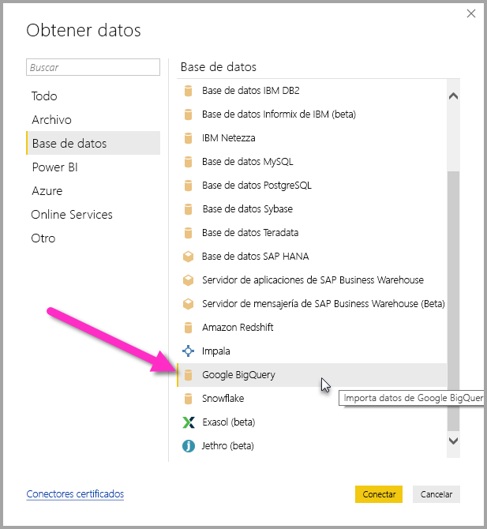
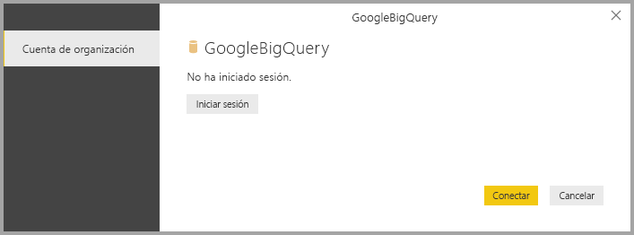
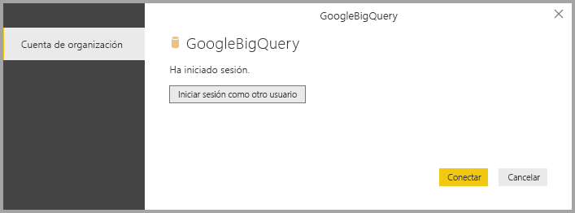
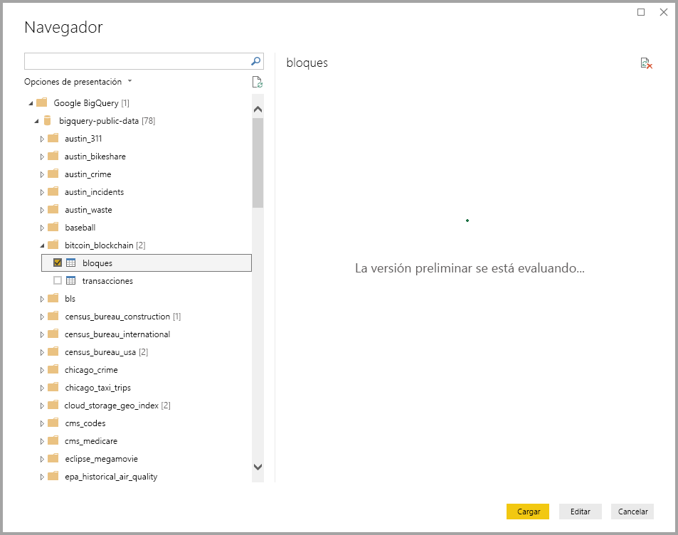

# <a name="connect-to-a-google-bigquery-database-in-power-bi-desktop"></a>Conexión a una base de datos de Google BigQuery en Power BI Desktop
En Power BI Desktop, puede conectarse a una base de datos de Google **BigQuery** y usar los datos subyacentes como con cualquier otro origen de datos en Power BI Desktop.

## <a name="connect-to-google-bigquery"></a>Conectarse a Google BigQuery
Para conectarse a una base de datos de Google **BigQuery**, seleccione **Obtener datos** en la cinta **Inicio** de Power BI Desktop. Seleccione **Base de datos** en las categorías de la izquierda para que se muestre **Google BigQuery**.



En la ventana de **Google BigQuery** que aparece, inicie sesión en su cuenta de Google BigQuery y seleccione **Conectar**.



Cuando haya iniciado sesión, verá la ventana siguiente que indica que se ha autenticado. 



Una vez que se haya conectado correctamente, aparece la ventana **Navegador**, en la que se muestran los datos disponibles en el servidor, desde donde puede seleccionar uno o varios elementos para importar y usar en **Power BI Desktop**.



## <a name="considerations-and-limitations"></a>Consideraciones y limitaciones
Hay algunos límites y consideraciones que se deben tener en cuenta con el conector de Google **BigQuery**:

* El conector de Google BigQuery está disponible en Power BI Desktop y en el servicio Power BI. En el servicio Power BI, se puede acceder al conector mediante la conexión de nube a nube de Power BI a Google BigQuery.

Puede usar Power BI con el **proyecto de facturación** de Google BigQuery. De forma predeterminada, Power BI usa el primer proyecto de la lista que se devuelve para el usuario. Para personalizar el comportamiento del proyecto de facturación cuando se usa con Power BI, siga estos pasos:

 * Especificando la opción siguiente en la M subyacente en el paso de origen, que se puede personalizar mediante el uso del **editor de Power Query** en Power BI Desktop:

    ```Source = GoogleBigQuery.Database([BillingProject="Include-Billing-Project-Id-Here"])```

## <a name="next-steps"></a>Pasos siguientes
Hay todo tipo de datos a los que puede conectarse con Power BI Desktop. Para obtener más información sobre orígenes de datos, consulte los siguientes recursos:

* [¿Qué es Power BI Desktop?](desktop-what-is-desktop.md)
* [Orígenes de datos en Power BI Desktop](desktop-data-sources.md)
* [Combinar datos y darles forma con Power BI Desktop](desktop-shape-and-combine-data.md)
* [Connect to Excel workbooks in Power BI Desktop (Conectarse a libros de Excel en Power BI Desktop)](desktop-connect-excel.md)   
* [Especificar datos directamente en Power BI Desktop](desktop-enter-data-directly-into-desktop.md)   

