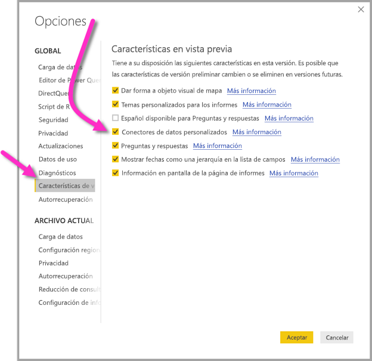

# Conectarse a datos creados por flujos de datos de Power BI en Power BI Desktop (versión preliminar)
En **Power BI Desktop**, puede conectarse a datos creados por **flujos de datos de Power BI** al igual que cualquier otro origen de datos en Power BI Desktop.

El conector **Flujos de datos de Power BI (versión preliminar)** permite conectarse a las entidades creadas por flujos de datos en el servicio Power BI. Puesto que los flujos de datos están en versión preliminar, debe realizar unos pocos pasos para que el conector de flujos de datos esté disponible en el sistema. 

## Descargar y habilitar el conector de flujos de datos de Power BI (versión preliminar)

Debe descargar una copia del conector **flujos de datos de Power BI** y, después, copiarlo en una ubicación específica en el equipo. En una próxima actualización mensual de Power BI Desktop, el conector se incluirá automáticamente en la lista de conectores de datos. A partir de entonces, ya no será necesario realizar estos pasos.

Puede descargar el **conector de flujos de datos de Power BI** en esta ubicación: [Conector de flujos de datos de Power BI](https://visuals.azureedge.net/cds-analytics/PublicPreview/CDSA.mez)

Siga estos pasos para que el **conector de flujos de datos de Power BI** (versión preliminar) esté disponible en el equipo:

1. Descargue una copia del archivo .MEZ (el archivo del conector de datos). Los clientes de la versión preliminar privada recibirán información de descarga para el archivo .MEZ directamente desde Microsoft.

2. Coloque el archivo del conector de datos descargado en esta carpeta en el equipo: **Documentos > Power BI Desktop > carpeta Conectores personalizados**

3. En Power BI Desktop, seleccione **Archivo > Opciones y configuración > Opciones** y elija **Características en vista previa** en el panel izquierdo.

    

4. Seleccione el cuadro **Conectores de datos personalizados**, si no está seleccionado. 

5. Reinicie **Power BI Desktop** para que aparezca el conector.

## Usar el conector de flujos de datos de Power BI (versión preliminar)
Después de reiniciarse **Power BI Desktop**, el conector se mostrará como un origen de datos disponibles. Para conectarse a un grupo de datos, seleccione **Obtener datos > Servicios en línea > Flujos de datos de Power BI (beta)** tal y como se muestra en esta imagen:

## Consideraciones y limitaciones

Para usar esta versión preliminar del **conector de flujos de datos de Power BI**, debe ejecutar la versión más reciente de **Power BI Desktop**. Siempre puede [descargar Power BI Desktop](desktop-get-the-desktop.md) e instalarlo en su equipo para asegurarse de que dispone de la versión más reciente.  

Nota: Cuando aparezca el conector de flujos de datos de Power BI en una próxima actualización mensual de **Power BI Desktop**, *debe* eliminar este archivo .MEZ descargado desde la carpeta **Documentos > Power BI Desktop > Conectores personalizados** para evitar conflictos. 

## Pasos siguientes
Hay todo tipo de cosas interesantes que puede hacer con las conexiones de datos de Power BI, además de artículos sobre **Power BI Desktop** que pueden resultarle útiles:

* [Orígenes de datos en Power BI Desktop](desktop-data-sources.md)
* [Combinar datos y darles forma con Power BI Desktop](desktop-shape-and-combine-data.md)
* [Especificar datos directamente en Power BI Desktop](desktop-enter-data-directly-into-desktop.md)   

