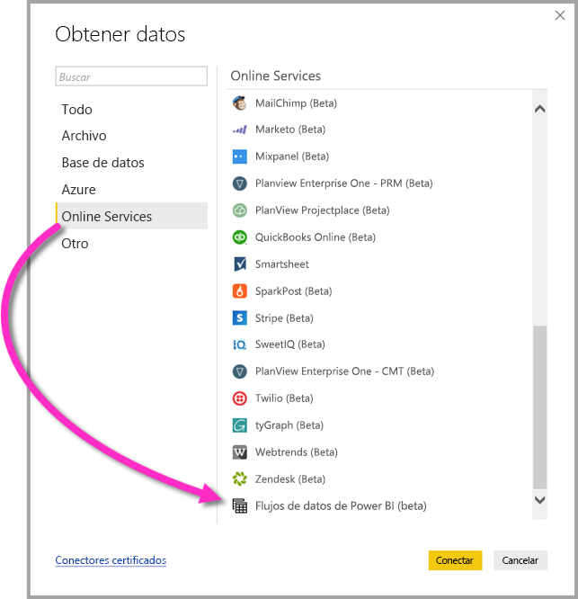

# Conexión a datos creados por flujos de datos de Power BI en Power BI Desktop (beta)
En **Power BI Desktop**, puede conectarse a datos creados por **flujos de datos de Power BI** al igual que cualquier otro origen de datos en Power BI Desktop.

El conector de **flujos de datos de Power BI (beta)** permite conectarse a las entidades creadas por flujos de datos en el servicio Power BI. 

## Consideraciones y limitaciones

Para usar esta versión beta del **conector de flujos de datos de Power BI**, debe ejecutar la versión más reciente de **Power BI Desktop**. Siempre puede [descargar Power BI Desktop](desktop-get-the-desktop.md) e instalarlo en su equipo para asegurarse de que dispone de la versión más reciente.  

> [!NOTE]
> La versión anterior del conector de flujos de datos de Power BI requiere que descargue un archivo .MEZ y que lo coloque en una carpeta. Las versiones actuales de **Power BI Desktop** incluyen el conector de flujos de datos de Power BI, de manera que ya no se requiere el archivo y puede causar conflictos con la versión incluida del conector. Si colocó manualmente el archivo .MEZ en la carpeta, *debe* eliminar ese archivo .MEZ descargado de la carpeta **Documentos > Power BI Desktop > Conectores personalizados** para evitar conflictos. 

## Rendimiento de Desktop
**Power BI Desktop** se ejecuta localmente en el equipo donde está instalado. El rendimiento de la ingesta de los flujos de datos se determina según una serie de factores. Dichos factores incluyen el tamaño de los datos, la CPU y la RAM del equipo, el ancho de banda de red, la distancia desde el centro de datos y otros factores.

Puede mejorar el rendimiento de la ingesta de datos para los flujos de datos. Por ejemplo, si el tamaño de los datos ingeridos es demasiado grande como para que **Power BI Desktop** los administre en el equipo, puede usar entidades vinculadas y calculadas en los flujos de datos para agregar los datos (dentro de los flujos de datos) e ingerir solo los datos agregados preparados previamente. De esa forma, el procesamiento de datos grandes se realiza en línea en los flujos de datos, en lugar de realizarse localmente en la instancia en ejecución de **Power BI Desktop**. Este enfoque permite que Power BI Desktop ingiera cantidades de datos más pequeñas y mantiene la experiencia con los flujos de datos rápida y con capacidad de respuesta.

## Consideraciones y limitaciones

La mayoría de los flujos de datos residen en el inquilino del servicio Power BI. Sin embargo, los usuarios de **Power BI Desktop** no pueden acceder a los flujos de datos almacenados en la cuenta de Azure Data Lake Storage Gen2, a menos que sean propietarios del flujo de datos o que tengan autorización explícita para la carpeta de CDS del flujo de datos. Considere la siguiente situación:

1.  Anna crea un área de trabajo de la aplicación y la configura para almacenar flujos de datos en la instancia de Data Lake de la organización.
2.  Ben, que también es miembro del área de trabajo que ha creado Anna, quiere usar Power BI Desktop y el conector de flujo de datos para obtener datos del flujo de datos que ha creado su compañera.
3.  Ben recibe un error porque no se le ha agregado como usuario autorizado a la carpeta de CDS del flujo de datos en la instancia de Data Lake.

    

Para resolver este problema, Ben debe tener permisos de lector para la carpeta de CDS y sus archivos. Puede aprender más sobre cómo acceder a la carpeta de CDS en [este artículo](https://go.microsoft.com/fwlink/?linkid=2029121).

## Pasos siguientes
Hay un montón de cosas interesantes que puede hacer con los flujos de datos de Power BI. Para más información, consulte los siguientes recursos:

* [Preparación de datos de autoservicio con flujos de datos](service-dataflows-overview.md)
* [Creación y uso de flujos de datos en Power BI](service-dataflows-create-use.md)
* [Uso de entidades calculadas en Power BI Premium (versión preliminar)](service-dataflows-computed-entities-premium.md)
* [Uso de flujos de datos con orígenes de datos locales (versión preliminar)](service-dataflows-on-premises-gateways.md)
* [Recursos de desarrollador para flujos de datos de Power BI](service-dataflows-developer-resources.md)

Para más información sobre la integración con Azure Data Lake Storage Gen2, consulte los artículos siguientes:

* [Integración de flujos de datos y Azure Data Lake (versión preliminar)](service-dataflows-azure-data-lake-integration.md)
* [Configuración de opciones de flujo de datos del área de trabajo (versión preliminar)](service-dataflows-configure-workspace-storage-settings.md)
* [Incorporación de una carpeta de CDS a Power BI como flujo de datos (versión preliminar)](service-dataflows-add-cdm-folder.md)
* [Conexión a Azure Data Lake Storage Gen2 para el almacenamiento del flujo de datos (versión preliminar)](service-dataflows-connect-azure-data-lake-storage-gen2.md)

También hay artículos sobre **Power BI Desktop** que pueden resultarle útiles:

* [Orígenes de datos en Power BI Desktop](desktop-data-sources.md)
* [Combinar datos y darles forma con Power BI Desktop](desktop-shape-and-combine-data.md)
* [Especificar datos directamente en Power BI Desktop](desktop-enter-data-directly-into-desktop.md)   

