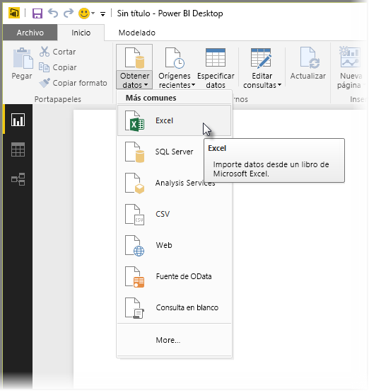
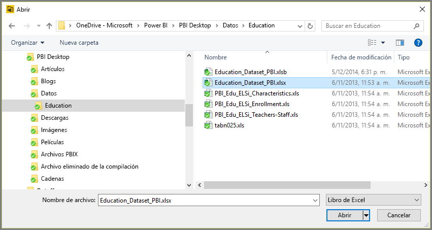
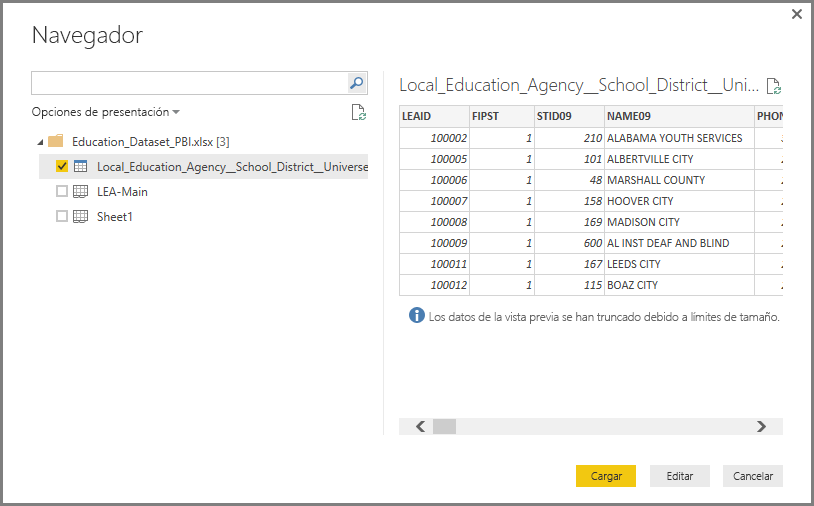
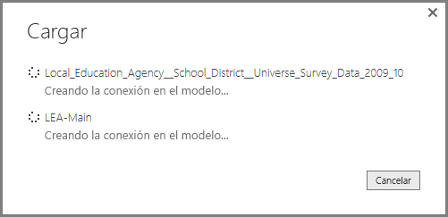
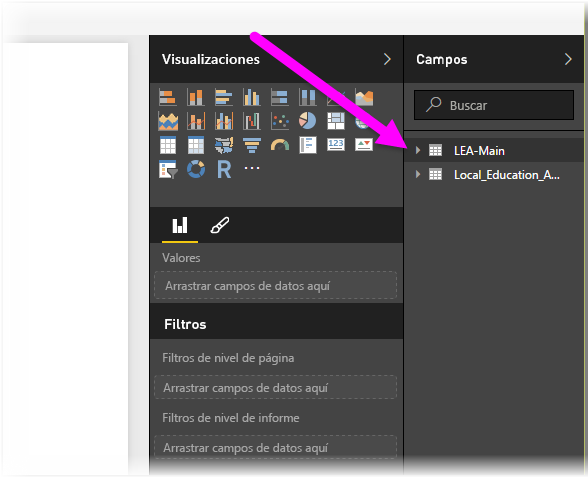

# Conectarse a Excel en Power BI Desktop
Conectarse a un libro de Excel desde Power BI Desktop es sencillo y en este artículo se le guiará a través de los pasos.

En Power BI Desktop, seleccione **Obtener datos > Excel** en la cinta **Inicio** .

Seleccione el libro en el cuadro de diálogo **Abrir** que aparece.

Power BI Desktop presenta las tablas en otros elementos de datos del libro en la ventana **Navegador**. Al seleccionar una tabla en el panel izquierdo, aparece una vista previa de los datos en el panel derecho.

Puede seleccionar el botón Cargar para importar los datos, o si quiere editar los datos mediante el **Editor de consultas** antes de ponerlos en Power BI Desktop, seleccione el botón **Editar**.

Al cargar los datos, Power BI Desktop muestra la ventana **Cargar** y muestra la actividad asociada a la carga de los datos.  

Cuando haya finalizado, Power BI Desktop muestra las tablas y campos que ha importado del libro de Excel en el panel **Campos**, en el lado derecho del escritorio.

¡Eso es todo!

Ahora está preparado para usar los datos importados del libro de Excel en Power BI Desktop para crear objetos visuales, informes, o para interactuar con cualquier otro dato con el que quiera conectarse e importar, como otros libros de Excel, bases de datos o cualquier otro origen de datos.

## Pasos siguientes
Hay todo tipo de datos a los que puede conectarse con Power BI Desktop. Para obtener más información sobre orígenes de datos, consulte los siguientes recursos:

* [¿Qué es Power BI Desktop?](desktop-what-is-desktop.md)
* [Orígenes de datos en Power BI Desktop](desktop-data-sources.md)
* [Combinar datos y darles forma con Power BI Desktop](desktop-shape-and-combine-data.md)
* [Conectarse a archivos CSV en Power BI Desktop](desktop-connect-csv.md)   
* [Especificar datos directamente en Power BI Desktop](desktop-enter-data-directly-into-desktop.md)   

