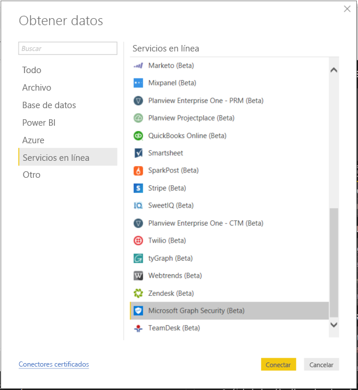
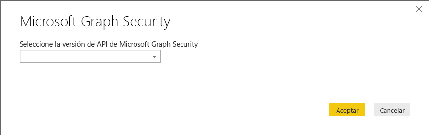
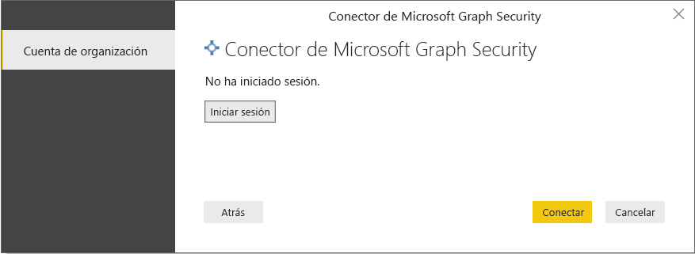
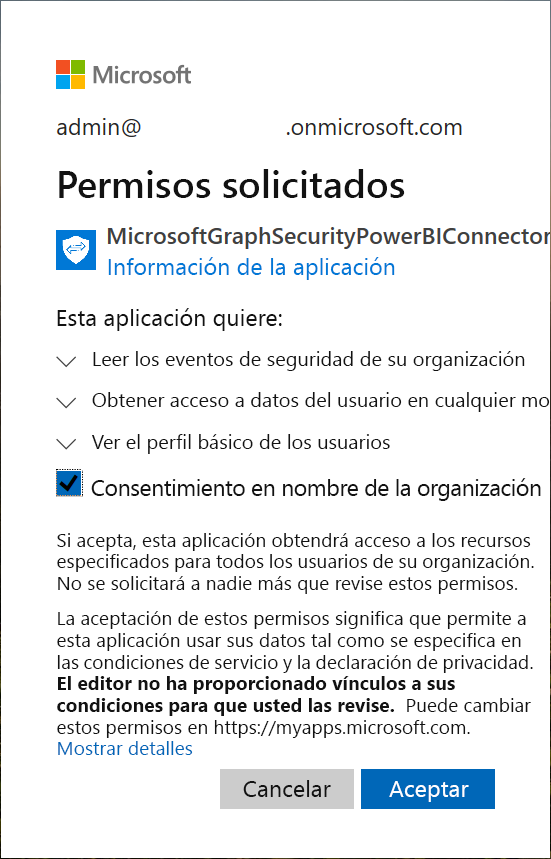
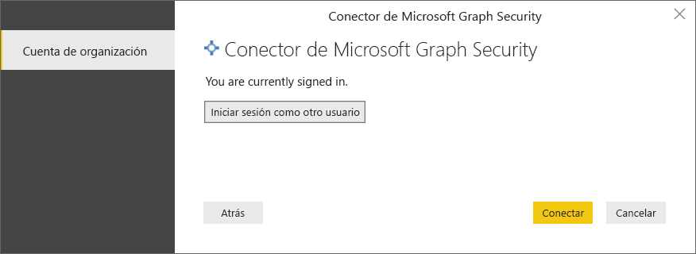
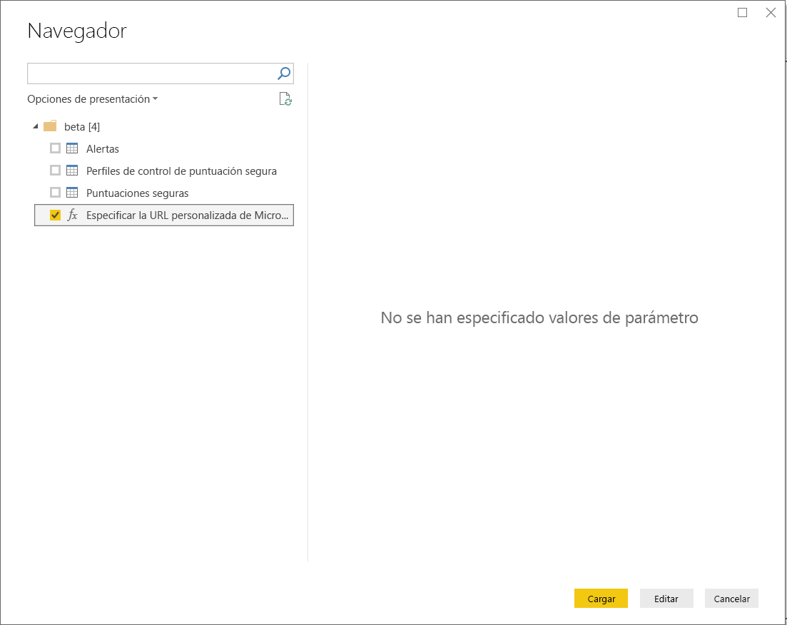
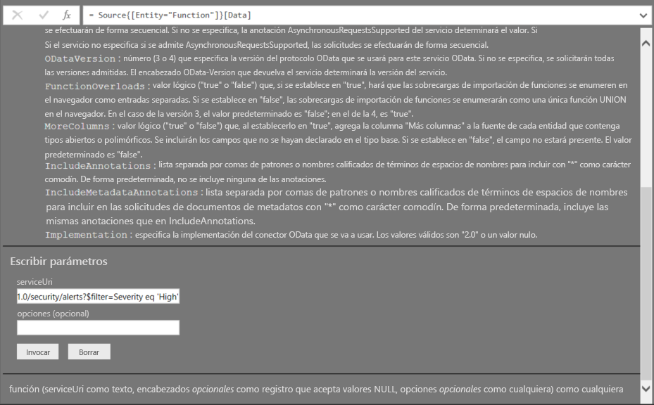
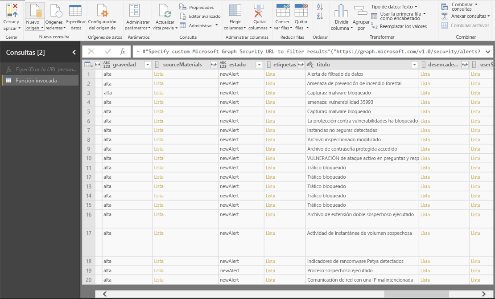

# Conexión a la Microsoft Graph Security API en Power BI Desktop

Puede usar el conector Microsoft Graph Security de Power BI Desktop para conectarse a la [Microsoft Graph Security API](https://aka.ms/graphsecuritydocs). Luego, puede compilar paneles e informes para obtener conclusiones de las [alertas](https://docs.microsoft.com/graph/api/resources/alert?view=graph-rest-1.0) relacionadas con la seguridad y las [puntuaciones de seguridad](https://docs.microsoft.com/graph/api/resources/securescores?view=graph-rest-beta).

La Microsoft Graph Security API se conecta a [varias soluciones de seguridad](https://aka.ms/graphsecurityalerts) de Microsoft y sus socios de ecosistema para facilitar la correlación de alertas. Esta combinación proporciona acceso a completa información contextual y simplifica la automatización. Permite a las organizaciones obtener conclusiones rápidamente y actuar en varios productos de seguridad, al tiempo que reduce los costos y la complejidad.

## Requisitos previos para usar el conector Microsoft Graph Security

Para usar el conector Microsoft Graph Security, debe obtener el consentimiento *explícito* del administrador de inquilinos de Azure Active Directory (Azure AD). Vea los [requisitos de autenticación de Microsoft Graph Security](https://aka.ms/graphsecurityauth).
Para el consentimiento se necesitan el identificador y el nombre de aplicación del conector, que se mencionan aquí y están disponibles en [Azure Portal](https://portal.azure.com):

| Propiedad | Valor |
|----------|-------|
| **Nombre de la aplicación** | `MicrosoftGraphSecurityPowerBIConnector` |
| **Identificador de la aplicación** | `cab163b7-247d-4cb9-be32-39b6056d4189` |
|||

Para conceder el consentimiento para el conector, el administrador de inquilinos de Azure AD puede usar alguno de estos métodos:

* [Concesión de consentimiento para aplicaciones de Azure AD](https://docs.microsoft.com/azure/active-directory/develop/v2-permissions-and-consent)

* Respuesta a una solicitud que envía la aplicación lógica durante su primera ejecución mediante la [experiencia de consentimiento de la aplicación](https://docs.microsoft.com/azure/active-directory/develop/application-consent-experience)
   
La cuenta de usuario que inicia sesión en el conector Microsoft Graph Security tiene que ser miembro del rol de administrador limitado Lector de seguridad en Azure AD, ya sea como *Lector de seguridad* o *Administrador de seguridad*. Vea [Asignar roles de Azure AD a usuarios](https://docs.microsoft.com/graph/security-authorization#assign-azure-ad-roles-to-users).

## Uso del conector Microsoft Graph Security

Siga estos pasos para usar el conector:

1. Seleccione **Obtener datos** > **Más** en la cinta **Inicio** de Power BI Desktop.
2. Seleccione **Servicios en línea** en la lista de categorías del lado izquierdo de la ventana.
3. Seleccione **Microsoft Graph Security (Beta)**.

    
    
4. En la ventana **Microsoft Graph Security**, seleccione la versión de la Microsoft Graph API que va a consultar: **v1.0** o **beta**.

    
    
5. Cuando se le pida, inicie sesión en la cuenta de Azure Active Directory. Esta cuenta debe tener el rol *Lector de seguridad* o *Administrador de seguridad*, como se ha mencionado en la sección anterior.

     
    
6. Si es el administrador de inquilinos *y* aún no tiene el consentimiento para el conector (aplicación) Microsoft Graph Security de Power BI, aparece el siguiente cuadro de diálogo. Seleccione **Consentimiento en nombre de la organización**.

    
    
7. Una vez iniciada la sesión, aparece el cuadro de diálogo siguiente, que indica que se ha autenticado. Seleccione **Conectar**.

    
    
8. Después de conectarse, la ventana **Navegador** muestra las alertas, las puntuaciones de seguridad y otras entidades que están disponibles en la [Microsoft Graph Security API](https://aka.ms/graphsecuritydocs) para la versión seleccionada en el paso 4. Seleccione una o varias entidades para importarlas y usarlas en Power BI Desktop. Luego, seleccione **Cargar** para obtener la vista de resultados que se muestra tras el paso 9.

    
    
9. Si quiere usar una consulta avanzada con la Microsoft Graph Security API, seleccione **Especificar URL de Microsoft Graph Security personalizada para filtrar resultados**. Use esta función para emitir una consulta [OData.Feed](https://docs.microsoft.com/power-bi/desktop-connect-odata) a la Microsoft Graph Security API con los permisos necesarios.

   En el ejemplo siguiente se usa el elemento *serviceUri* `https://graph.microsoft.com/v1.0/security/alerts?$filter=Severity eq 'High'`. Para ver cómo compilar consultas para filtrar, ordenar o recuperar los resultados más recientes, vea [Opciones de consulta de sistema de OData](https://docs.microsoft.com/graph/query-parameters).

   
    
   Al seleccionar **Invoke**, la función **OData.Feed** realiza una llamada a la API, que abre el Editor de consultas. Se filtra y se refina el conjunto de datos que se quiere usar. Luego, se cargan esos datos en Power BI Desktop.

Esta es la ventana de resultados de las entidades de Microsoft Graph Security que se han consultado:

   
    

Ahora está listo para usar los datos importados del conector Microsoft Graph Security en Power BI Desktop. Puede crear gráficos o informes. O bien, puede interactuar con otros datos que se importan de libros de Excel, bases de datos u otros orígenes de datos.

## Pasos siguientes
* Vea plantillas y ejemplos de Power BI que usan este conector en [Microsoft Graph Security GitHub Power BI samples](https://aka.ms/graphsecuritypowerbiconnectorsamples) (Ejemplos de GitHub de Microsoft Graph Security de Power BI).

* Para obtener escenarios de uso e información adicional, vea [esta entrada de blog del conector Microsoft Graph Security de Power BI](https://aka.ms/graphsecuritypowerbiconnectorblogpost).

* Puede conectarse a todo tipo de datos con Power BI Desktop. Para más información, consulte los siguientes recursos:

    * [¿Qué es Power BI Desktop?](desktop-what-is-desktop.md)
    * [Orígenes de datos en Power BI Desktop](desktop-data-sources.md)
    * [Combinar datos y darles forma con Power BI Desktop](desktop-shape-and-combine-data.md)
    * [Connect to Excel workbooks in Power BI Desktop (Conectarse a libros de Excel en Power BI Desktop)](desktop-connect-excel.md)
    * [Especificar datos directamente en Power BI Desktop](desktop-enter-data-directly-into-desktop.md)
