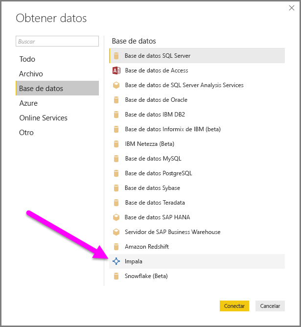
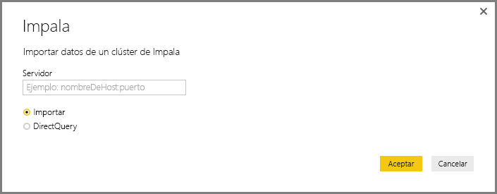
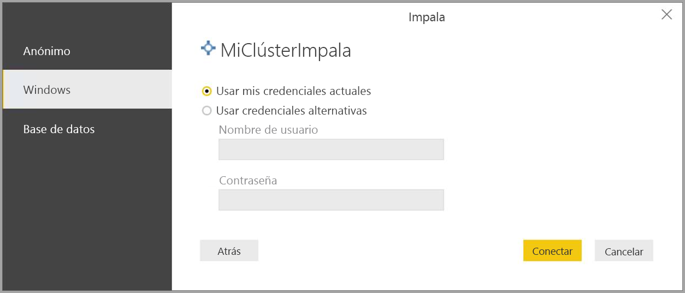
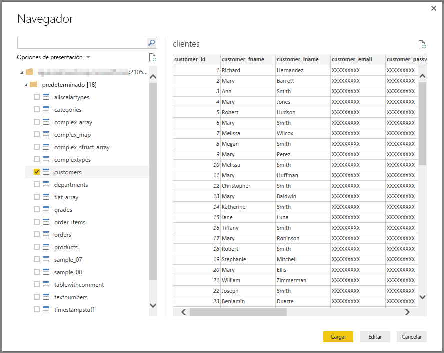

# Conectarse a una base de datos de Impala en Power BI Desktop
En Power BI Desktop, puede conectarse a una base de datos de **Impala** y usar los datos subyacentes como con cualquier otro origen de datos en Power BI Desktop.

## Conectarse a una base de datos de Impala
Para conectarse a una base de datos de **Impala**, siga estos pasos: 

1. Seleccione **Obtener datos** en la cinta **Inicio** de Power BI Desktop. 

2. Seleccione **Base de datos** en las categorías de la izquierda. Verá **Impala**.

    

3. En la ventana **Impala** que aparece, escriba o pegue en el cuadro el nombre de su servidor Impala. Después, seleccione **Aceptar**. Puede **importar** datos directamente a Power BI o puede usar **DirectQuery**. Obtenga más información sobre cómo [usar DirectQuery](desktop-use-directquery.md).

    

4. Cuando se le pida, escriba sus credenciales o conéctese de forma anónima. El conector de Impala admite Anonymous, Basic (nombre de usuario + contraseña) y la autenticación de Windows.

    

    > [!NOTE]
    > Una vez que haya escrito su nombre de usuario y contraseña para un servidor **Impala** determinado, Power BI Desktop usa esas mismas credenciales en los intentos de conexión posteriores. Si quiere modificar dichas credenciales, vaya a **Archivo > Opciones y configuración > Configuración de origen de datos**.

5. Después de conectarse, se abre una ventana del **navegador** y muestra los datos que están disponibles en el servidor. Seleccione los elementos de estos datos para importarlos y usarlos en **Power BI Desktop**.

    

## Consideraciones y limitaciones
Hay algunas limitaciones y consideraciones que se deben tener en cuenta con el conector de **Impala**:

* El conector de Impala se admite en la puerta de enlace de datos local, con cualquiera de los tres mecanismos de autenticación compatibles.

## Pasos siguientes
Hay muchos orígenes de datos distintos a los que puede conectarse con Power BI Desktop. Para obtener más información sobre los orígenes de datos, consulte los siguientes recursos:

* [¿Qué es Power BI Desktop?](desktop-what-is-desktop.md)
* [Orígenes de datos en Power BI Desktop](desktop-data-sources.md)
* [Combinar datos y darles forma con Power BI Desktop](desktop-shape-and-combine-data.md)
* [Connect to Excel workbooks in Power BI Desktop (Conectarse a libros de Excel en Power BI Desktop)](desktop-connect-excel.md)   
* [Especificar datos directamente en Power BI Desktop](desktop-enter-data-directly-into-desktop.md)   

