# Conexión con LinkedIn Sales Navigator en Power BI Desktop

En **Power BI Desktop**, puede conectarse a **LinkedIn Sales Navigator** para ayudar a buscar y desarrollar relaciones como cualquier otro origen de datos en Power BI Desktop y crear informes listos sobre su progreso.

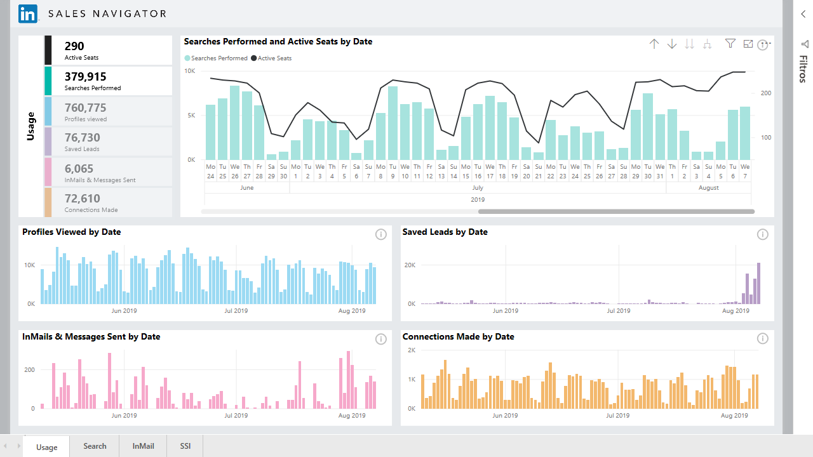

Para conectarse a los datos de LinkedIn con **LinkedIn Sales Navigator**, debe tener un plan Enterprise de LinkedIn Sales Navigator y debe ser Administrador o Usuario de informe en el contrato de Sales Navigator.

En el vídeo siguiente se ofrece un paseo introductorio y un tutorial para usar la aplicación de plantilla **LinkedIn Sales Navigator**, que se describe en detalle [más adelante en este artículo](#using-the-linkedin-sales-navigator-template-app). 

> [!VIDEO https://www.youtube.com/embed/ZqhmaiORLw0]

## Conexión con LinkedIn Sales Navigator

Para conectarse a datos de **LinkedIn Sales Navigator**, seleccione **Obtener datos** en la cinta de opciones **Inicio** de Power BI Desktop. Seleccione **Servicios en línea** en las categorías de la izquierda y desplácese hasta que vea **LinkedIn Sales Navigator (Beta)** .

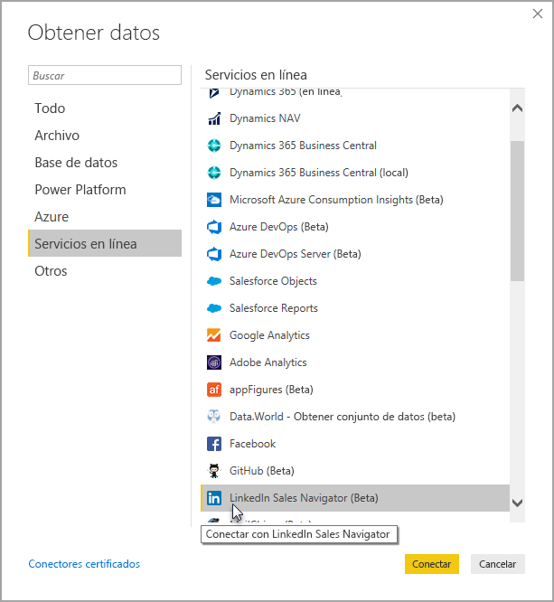

Se le notificará que se está conectando a un conector de terceros que todavía está en desarrollo. 

Cuando seleccione **Continuar**, se le pedirá especificar los datos que quiere.

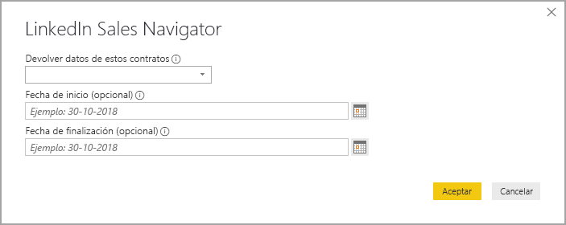

En la ventana **LinkedIn Sales Navigator** que aparece, seleccione los datos que quiere devolver, ya sean *Todos los contactos* o *Contactos seleccionados* en el primer selector desplegable. Luego puede especificar las fechas de inicio y finalización para restringir los datos que recibe en un período de tiempo determinado.

Una vez que haya proporcionado la información, Power BI Desktop se conectará a los datos asociados con el contrato de LinkedIn Sales Navigator. Use la misma dirección de correo electrónico que usa para iniciar sesión en LinkedIn Sales Navigator a través del sitio web. 

Cuando se conecte correctamente, se le pedirá que seleccione los datos del contrato de LinkedIn Sales Navigator en una ventana de **Navigator**.

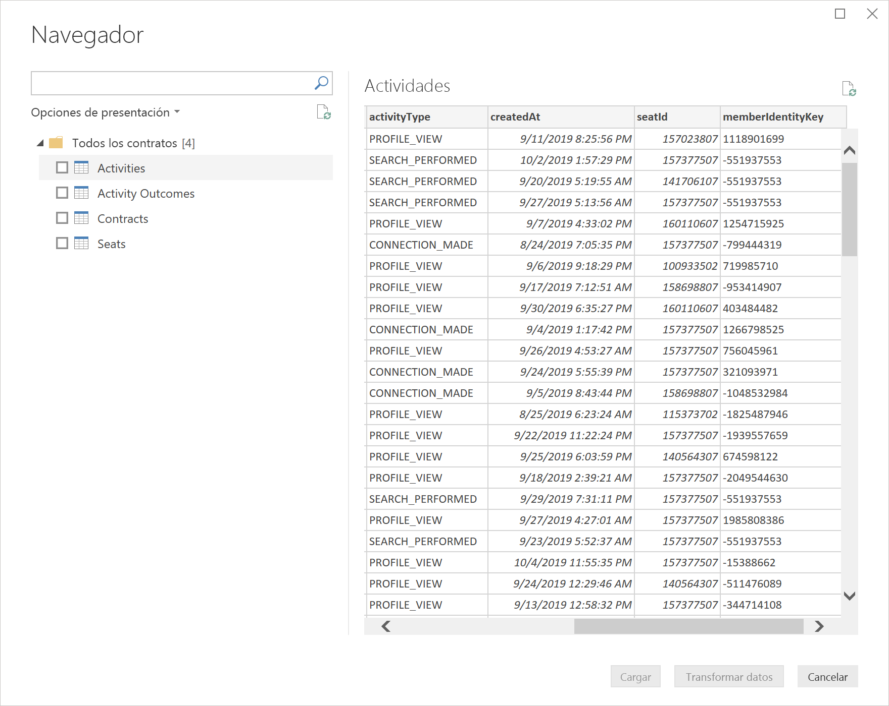

Puede crear los informes que quiera con los datos de LinkedIn Sales Navigator. Para facilitar las cosas, también hay un archivo .PBIX de LinkedIn Sales Navigator que puede descargar y que tiene datos de ejemplo ya proporcionados, para que pueda familiarizarse con los datos y los informes sin tener que empezar desde cero.

Puede descargar el archivo PBIX en la ubicación siguiente:
* [PBIX para LinkedIn Sales Navigator](service-template-apps-samples.md)

Además del archivo PBIX, LinkedIn Sales Navigator también tiene una aplicación de plantilla que puede descargar y usar. En la acción siguiente se describe detalladamente la aplicación de plantilla.

## Uso de la aplicación de plantilla de LinkedIn Sales Navigator

Para que el uso de **LinkedIn Sales Navigator** sea lo más sencillo posible, puede usar la [aplicación de plantilla](service-template-apps-overview.md) que crea automáticamente un informe listo a partir de los datos de LinkedIn Sales Navigator.

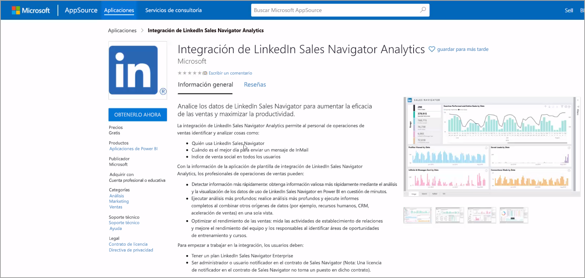

Al descargar la aplicación, puede seleccionar si quiere conectarse a los datos o explorar la aplicación con datos de ejemplo. Siempre puede volver y conectarse a sus propios datos de LinkedIn Sales Navigator después de explorar los datos de ejemplo. 

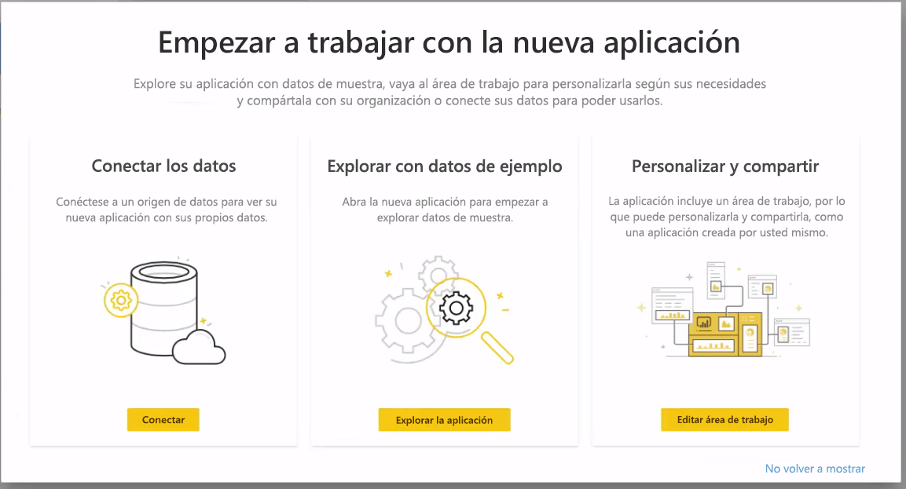

Puede obtener la aplicación de plantilla de **LinkedIn Sales Navigator** desde el vínculo siguiente:
* [Aplicación de plantilla de LinkedIn Sales Navigator](https://appsource.microsoft.com/product/power-bi/pbi-contentpacks.linkedin_navigator-preview?flightCodes=17ad4c68-fbc5-4925-a351-139fd384ec33)

La aplicación de plantilla proporciona cuatro pestañas que lo ayudarán a analizar y compartir la información:

* Usage (Uso)
* Buscar
* Correo electrónico
* SSI

La pestaña **Uso** muestra los datos generales de LinkedIn Sales Navigator.

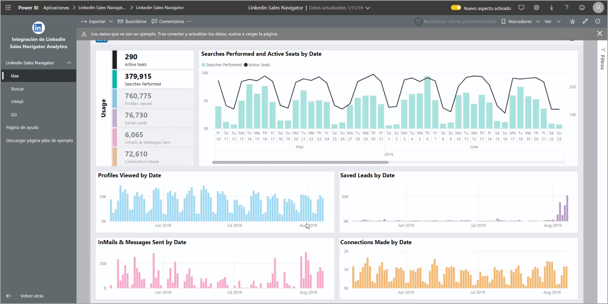

La pestaña **Búsqueda** le permite explorar en profundidad los resultados de la búsqueda:

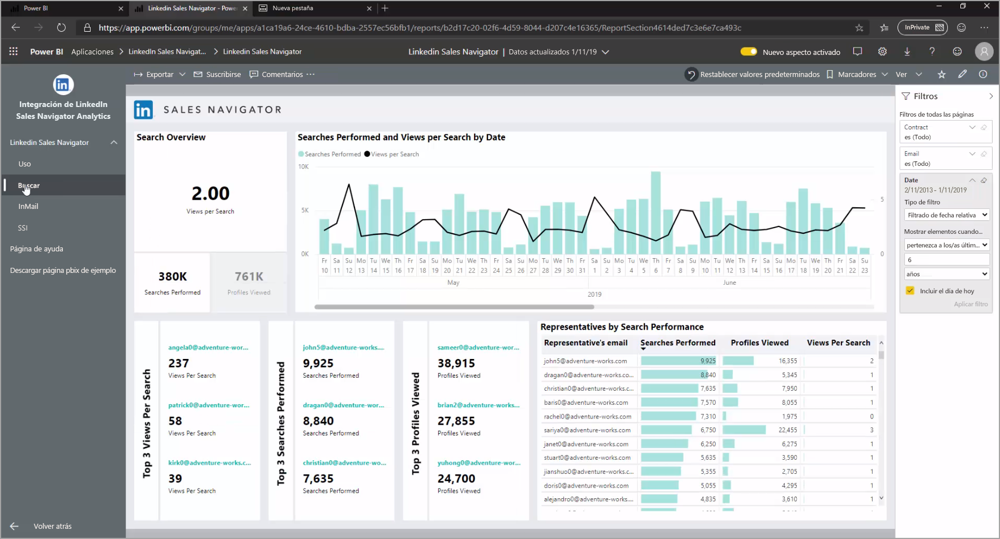

La pestaña **InMail** proporciona información sobre el uso de InMail, incluido el número de InMails enviados, las tasas de aceptación y otra información útil:

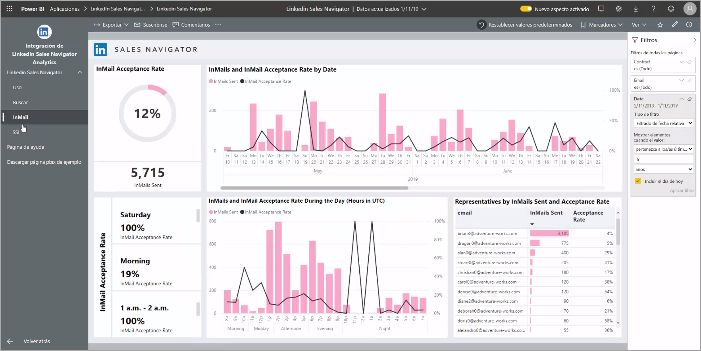

En la pestaña **SSI** se proporcionan detalles adicionales sobre el índice de venta social (SSI):

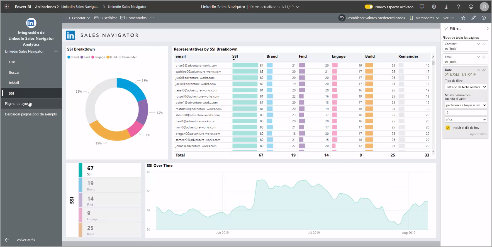

Para pasar de los datos de ejemplo a sus propios datos, seleccione **Editar aplicación** en la esquina superior derecha (el icono de lápiz) y, luego, seleccione **Conectar los datos** en la pantalla que aparece.

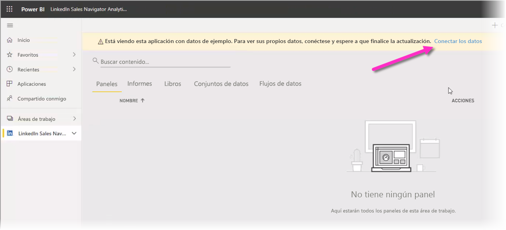

Desde ahí, puede conectar sus propios datos y seleccionar cuántos días de datos se van a cargar. Puede cargar hasta 365 días de datos. Deberá iniciar sesión nuevamente con la misma dirección de correo electrónico que usa para iniciar sesión en LinkedIn Sales Navigator a través del sitio web. 

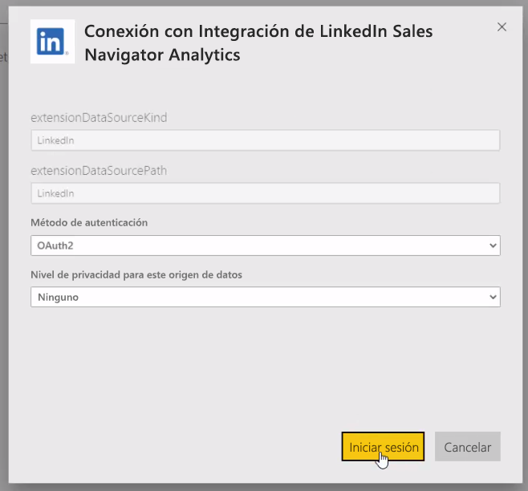

La aplicación de plantilla actualiza los datos de la aplicación con sus datos. También puede configurar una actualización programada, por lo que los datos de la aplicación son tan actuales como lo especifica la frecuencia de actualización. 

Una vez que se actualizan los datos, puede ver que la aplicación se ha rellenado con sus propios datos.

## Obtener ayuda

Si surgen problemas al conectarse a los datos, puede ponerse en contacto con el soporte técnico de LinkedIn Sales Navigator en https://www.linkedin.com/help/sales-navigator. 

## Pasos siguientes
Hay todo tipo de datos a los que puede conectarse con Power BI Desktop. Para obtener más información sobre orígenes de datos, consulte los siguientes recursos:

* [¿Qué es Power BI Desktop?](desktop-what-is-desktop.md)
* [Orígenes de datos en Power BI Desktop](desktop-data-sources.md)
* [Combinar datos y darles forma con Power BI Desktop](desktop-shape-and-combine-data.md)
* [Connect to Excel workbooks in Power BI Desktop (Conectarse a libros de Excel en Power BI Desktop)](desktop-connect-excel.md)   
* [Especificar datos directamente en Power BI Desktop](desktop-enter-data-directly-into-desktop.md)   

