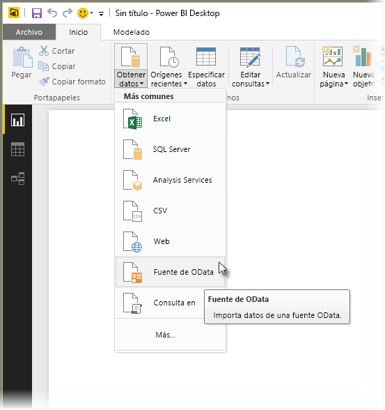
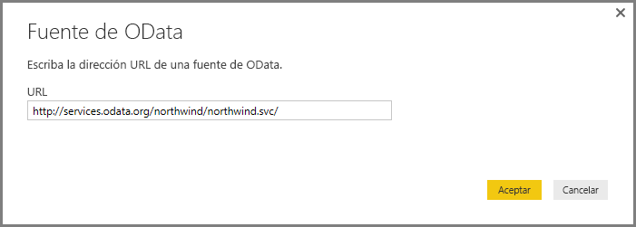
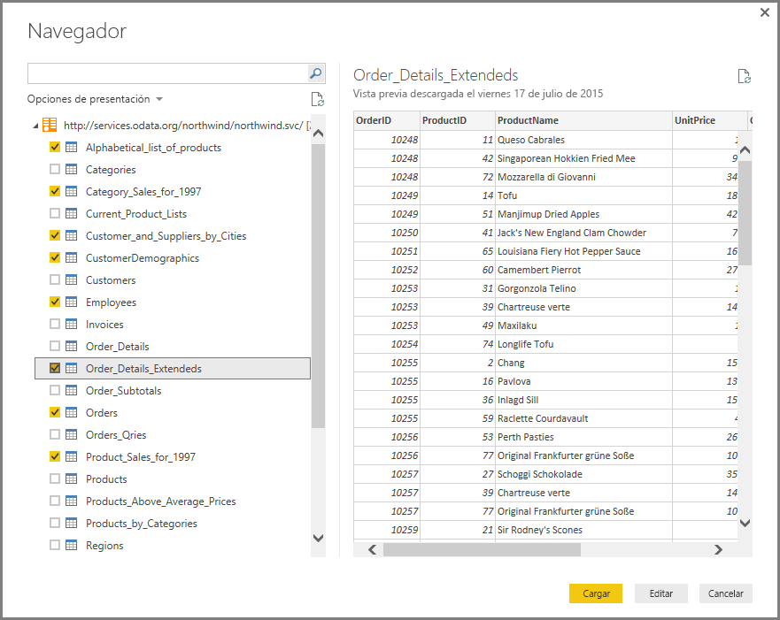
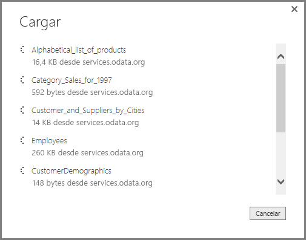
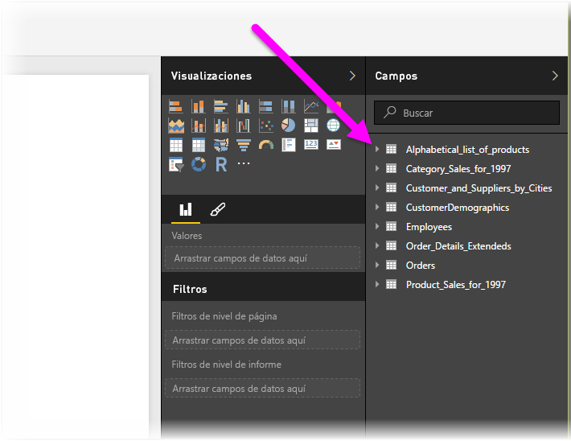

# Conectarse a fuentes OData en Power BI Desktop
En Power BI Desktop, puede conectarse a una **fuente OData** y usar los datos subyacentes igual que cualquier otro origen de datos en Power BI Desktop.

Para conectarse a una fuente OData, seleccione **Obtener datos > Fuente OData** en la cinta **Inicio** en Power BI Desktop.

En la ventana **Fuente OData** que aparece, escriba o pegue la URL de la fuente OData en el cuadro y seleccione **Aceptar**.

Power BI Desktop se conecta a la fuente OData y muestra las tablas disponibles y otros elementos de datos en la ventana **Navegador**. Al seleccionar un elemento, el panel derecho de la ventana **Navegador** muestra una vista previa de los datos. Puede seleccionar tantas tablas como quiera importar. La ventana **Navegador** muestra una vista previa de la tabla seleccionada actualmente.

Puede elegir el botón **Editar**, que inicia el **Editor de consultas**, donde puede dar forma y transformar los datos de la fuente OData antes de importarla en Power BI Desktop. O puede seleccionar el botón **Cargar** e importar todos los elementos de datos que ha seleccionado en el panel izquierdo.

Al seleccionar **Cargar**, Power BI Desktop importa los elementos seleccionados y muestra la ventana **Carga** del progreso de la importación.

Una vez que haya finalizado, Power BI Desktop hace que las tablas seleccionadas y otros elementos de datos estén disponibles en el panel **Campos**, que se encuentra en el lado derecho de la vista *Informes* en Power BI Desktop.

¡Eso es todo!

Ahora está preparado para usar los datos importados de la fuente OData en Power BI Desktop para crear objetos visuales, informes, o para interactuar con cualquier otro dato con el que quiera conectarse e importar, como otros libros de Excel, bases de datos o cualquier otro origen de datos.

## Pasos siguientes
Hay todo tipo de datos a los que puede conectarse con Power BI Desktop. Para obtener más información sobre orígenes de datos, consulte los siguientes recursos:

* [¿Qué es Power BI Desktop?](desktop-what-is-desktop.md)
* [Orígenes de datos en Power BI Desktop](desktop-data-sources.md)
* [Combinar datos y darles forma con Power BI Desktop](desktop-shape-and-combine-data.md)
* [Connect to Excel workbooks in Power BI Desktop (Conectarse a libros de Excel en Power BI Desktop)](desktop-connect-excel.md)   
* [Especificar datos directamente en Power BI Desktop](desktop-enter-data-directly-into-desktop.md)   

