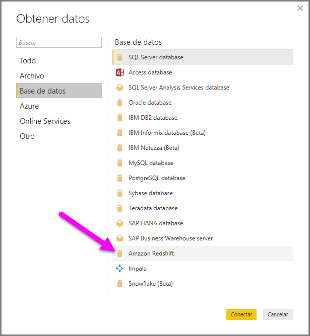
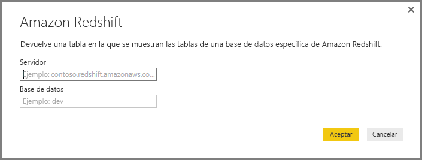
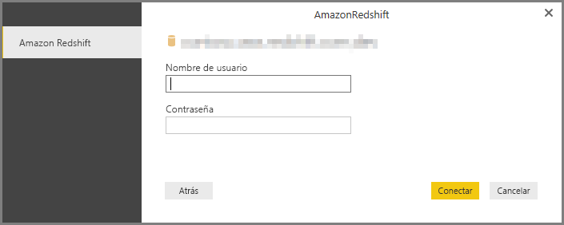
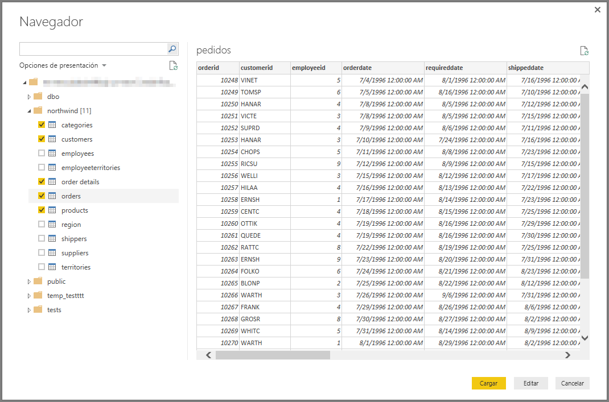

# Conectarse a Amazon Redshift en Power BI Desktop
En **Power BI Desktop**, puede conectarse a una base de datos de **Amazon Redshift** y usar los datos subyacentes como cualquier otro origen de datos en Power BI Desktop.

## Conectarse a una base de datos de Amazon Redshift
Para conectarse a una base de datos de **Amazon Redshift**, seleccione **Obtener datos** en la cinta **Inicio** de Power BI Desktop. Seleccione **Base de datos** en las categorías de la izquierda para que se muestre **Amazon Redshift**.

En la ventana **Amazon Redshift** que aparece, escriba o pegue en el cuadro el nombre de su servidor o de su base de datos de **Amazon Redshift**. Como parte del campo *Servidor*, los usuarios pueden especificar un puerto en el siguiente formato: *URLdelServidor:Puerto*

Cuando se le pida, escriba su nombre de usuario y contraseña. Debe usar el nombre del servidor que coincida exactamente con el certificado SSL para evitar errores. 

Una vez que se haya conectado correctamente, aparece la ventana **Navegador**, en la que se muestran los datos disponibles en el servidor, desde donde puede seleccionar uno o varios elementos para importar y usar en **Power BI Desktop**.

Cuando haya realizado las selecciones de la ventana **Navegador**, puede **Cargar** o **Editar** los datos.

* Si elige **Cargar** los datos, se le pedirá que use el modo *Importación* o el modo *DirectQuery* para cargarlos. Para obtener más información, consulte este [artículo en el que se explica el funcionamiento de DirectQuery](desktop-use-directquery.md).
* Si selecciona **Editar** los datos, aparece el **Editor de consultas**, en el que puede aplicar todo tipo de transformaciones y filtros a los datos, muchos de los cuales se aplican a la propia base de datos subyacente de **Amazon Redshift** (si es compatible).

## Pasos siguientes
Hay todo tipo de datos a los que puede conectarse con Power BI Desktop. Para obtener más información sobre orígenes de datos, consulte los siguientes recursos:

* [¿Qué es Power BI Desktop?](desktop-what-is-desktop.md)
* [Orígenes de datos en Power BI Desktop](desktop-data-sources.md)
* [Combinar datos y darles forma con Power BI Desktop](desktop-shape-and-combine-data.md)
* [Connect to Excel workbooks in Power BI Desktop (Conectarse a libros de Excel en Power BI Desktop)](desktop-connect-excel.md)   
* [Especificar datos directamente en Power BI Desktop](desktop-enter-data-directly-into-desktop.md)   

