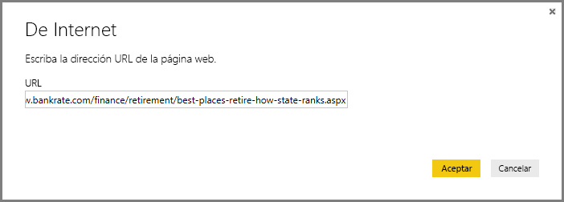
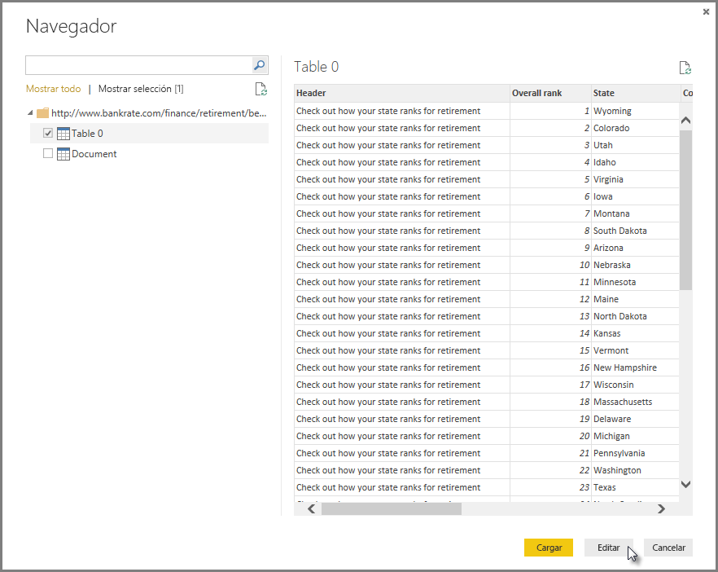
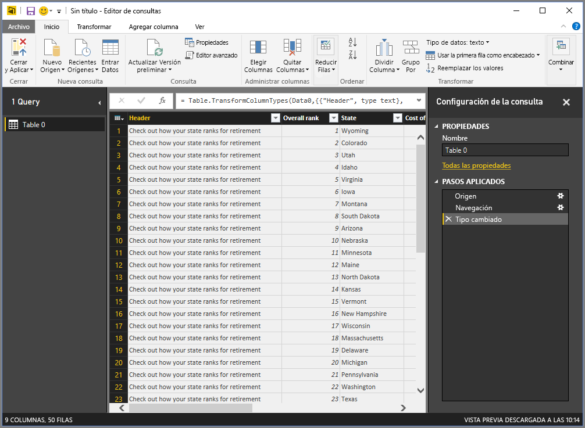
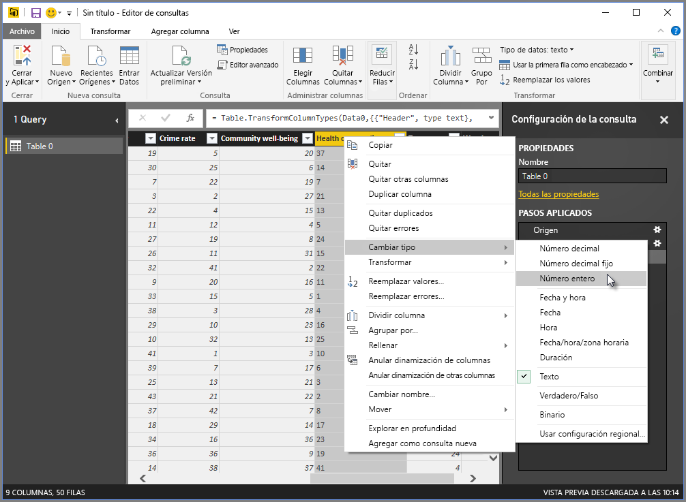
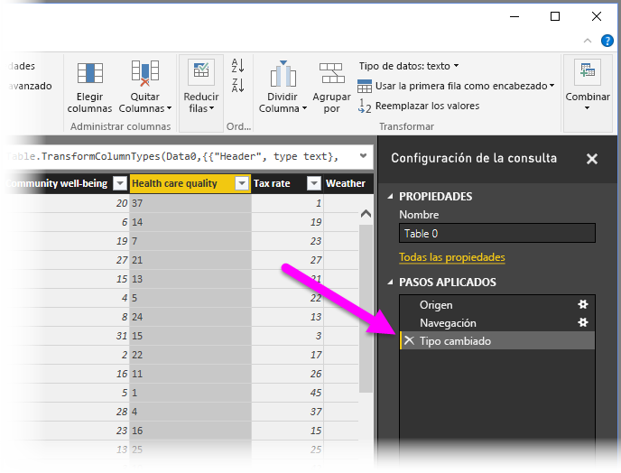
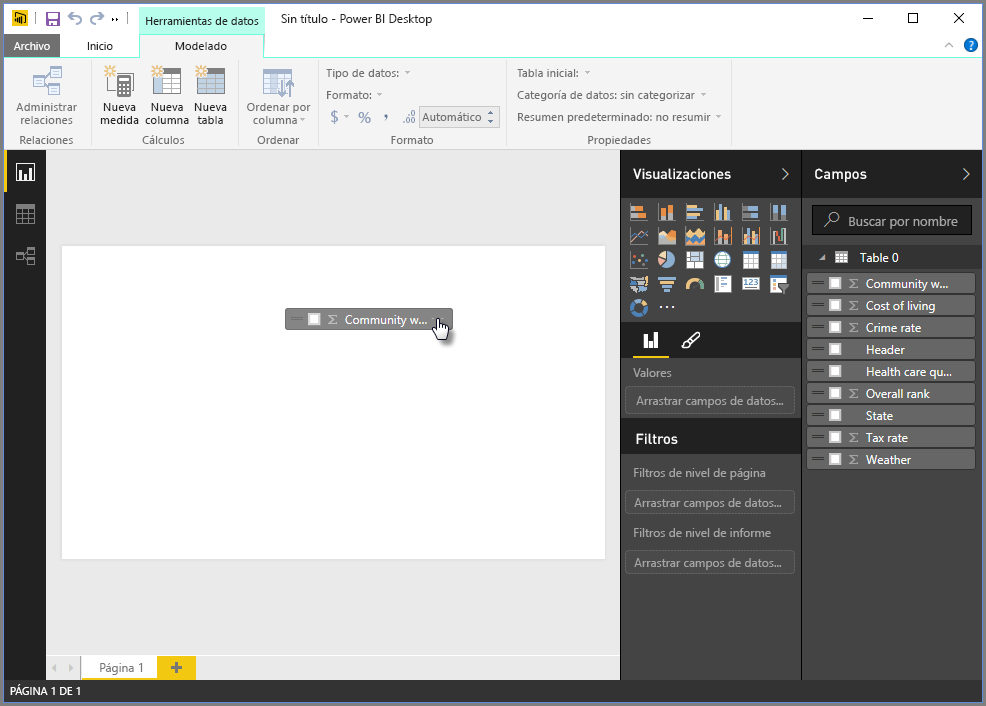
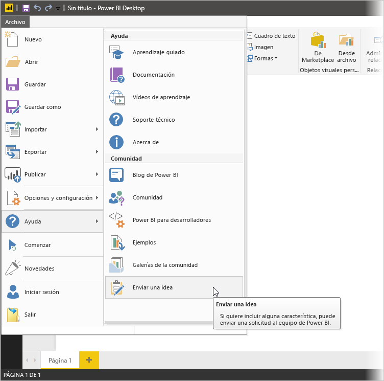

# Conexión a orígenes de datos en Power BI Desktop

Con Power BI Desktop puede conectarse fácilmente con el mundo de los datos en continua expansión. Si no dispone de Power BI Desktop, puede [descargarlo](https://go.microsoft.com/fwlink/?LinkID=521662) e instalarlo.

Existe *todo tipo* de orígenes de datos disponibles en Power BI Desktop. La siguiente imagen muestra cómo conectarse a los datos, seleccionando **Obtener datos** > **Otros** > **Web**.

## Ejemplo de conexión a los datos

En este ejemplo, se conectará a un origen de datos **web** .

Imagine que se va a jubilar. Quiere vivir en un lugar en el que haga mucho sol, los impuestos sean bajos y la asistencia sanitaria sea buena. O... quizás sea un analista de datos y quiera esa información para atender a sus clientes, por ejemplo, para ayudar un fabricante de impermeables a fijar sus objetivos de ventas en los lugares donde llueva *mucho*.

Cualquiera que sea el caso, encuentra un recurso web que tiene datos interesantes acerca de estos temas y mucho más:

[https://www.bankrate.com/finance/retirement/best-places-retire-how-state-ranks.aspx](https://www.bankrate.com/finance/retirement/best-places-retire-how-state-ranks.aspx)

Seleccione **Obtener datos** > **Otros** > **Web**. En **De la web**, escriba la dirección.

Al seleccionar **Aceptar**, la funcionalidad de *consulta* de Power BI Desktop entra en acción. Power BI Desktop conecta con el recurso web y la ventana **Navegador** devuelve los resultados de lo que encontró en la página web. En este caso, encuentra una tabla y el documento general. Nos interesa la tabla, así que la seleccionamos de la lista. La ventana **Navegador** muestra una vista previa.

En este punto, se puede editar la consulta antes de cargar la tabla, seleccionando **Transformar datos** desde la parte inferior de la ventana, o bien cargar directamente la tabla.

Seleccione **Transformar datos** para cargar la tabla e iniciar el Editor de Power Query. Se muestra el panel **Configuración de la consulta**. De no ser así, seleccione **Ver** en la cinta de opciones y, después, **Configuración de la consulta** para mostrar el panel **Configuración de la consulta**. Ofrece el siguiente aspecto.

Todos esos resultados son texto más que números y necesitamos que sean números. No hay problema. Simplemente haga clic con el botón derecho en el encabezado de la columna y seleccione **Cambiar tipo** > **Número entero** para cambiarlos. Para elegir más de una columna, primero seleccione una columna, mantenga presionada la tecla Mayúsculas, seleccione columnas adyacentes adicionales y, luego, haga clic con el botón derecho en un encabezado de columna para cambiar todas las seleccionadas. Use la tecla Ctrl para elegir columnas que no sean adyacentes.

En **Configuración de la consulta**, los **PASOS APLICADOS** reflejarán todos los cambios realizados. Cuando realice cambios adicionales en los datos, el Editor de Power Query registrará dichos cambios en la sección **PASOS APLICADOS**, que se puede ajustar, revisar, reorganizar o eliminar, según sea necesario.

Los cambios adicionales en la tabla todavía pueden realizarse después de cargarse, pero por ahora basta con esto. Al finalizar, seleccione **Cerrar y aplicar** de la cinta **Inicio** y Power BI Desktop aplicará los cambios y cerrará el Editor de Power Query.

Con el modelo de datos cargado, en la **Vista de informes** en Power BI Desktop, podremos crear visualizaciones arrastrando campos al lienzo.

Por supuesto, este modelo es sencillo, con una sola conexión de datos. La mayoría de los informes de Power BI Desktop tendrán conexiones a orígenes de datos diferentes, moldeados para satisfacer sus necesidades, con relaciones que generan un modelo de datos enriquecido.

## Pasos siguientes
Se puede hacer todo tipo de cosas con Power BI Desktop. Para obtener más información sobre sus capacidades, consulte los siguientes recursos:

* [¿Qué es Power BI Desktop?](desktop-what-is-desktop.md)
* [Acerca del uso del Editor de consultas en Power BI Desktop](desktop-query-overview.md)
* [Orígenes de datos en Power BI Desktop](desktop-data-sources.md)
* [Combinar datos y darles forma en Power BI Desktop](desktop-shape-and-combine-data.md)
* [Realización de tareas de consultas comunes en Power BI Desktop](desktop-common-query-tasks.md)   

¿Desea enviar comentarios? Magnífico. Utilice el elemento de menú **Enviar una idea** en Power BI Desktop o visite [Comentarios de la comunidad](https://community.powerbi.com/t5/Community-Feedback/bd-p/community-feedback). ¡Esperamos tener noticias suyas!

