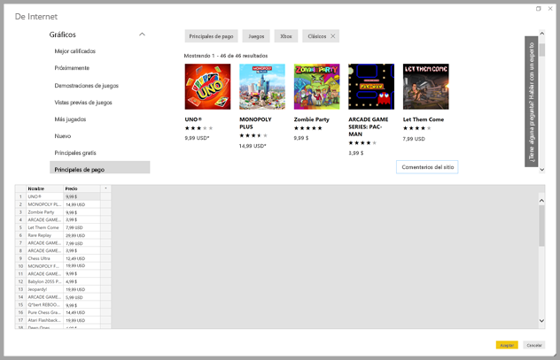
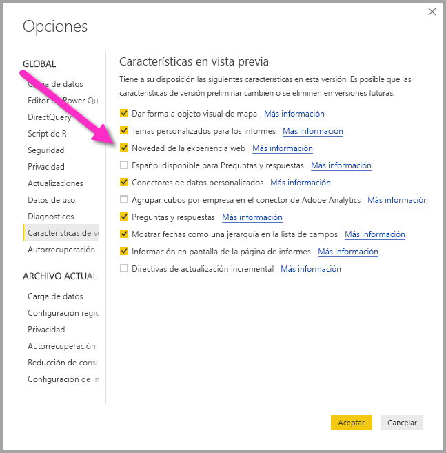
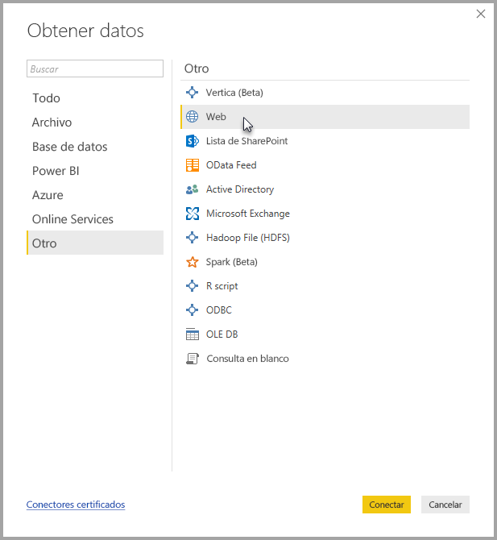
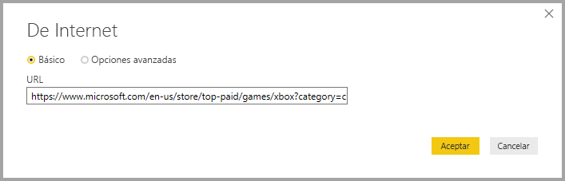
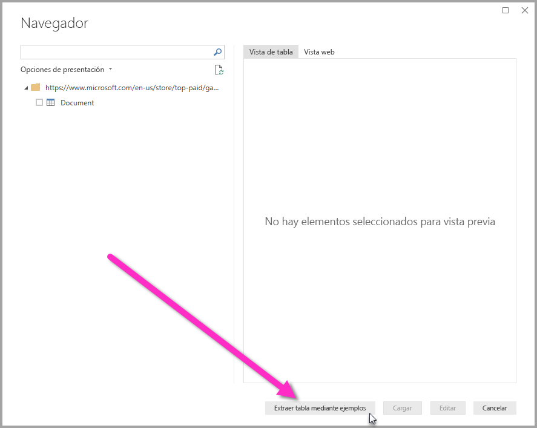
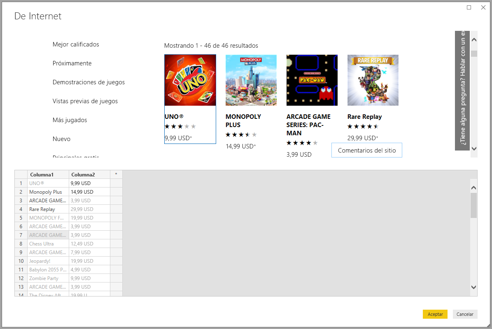
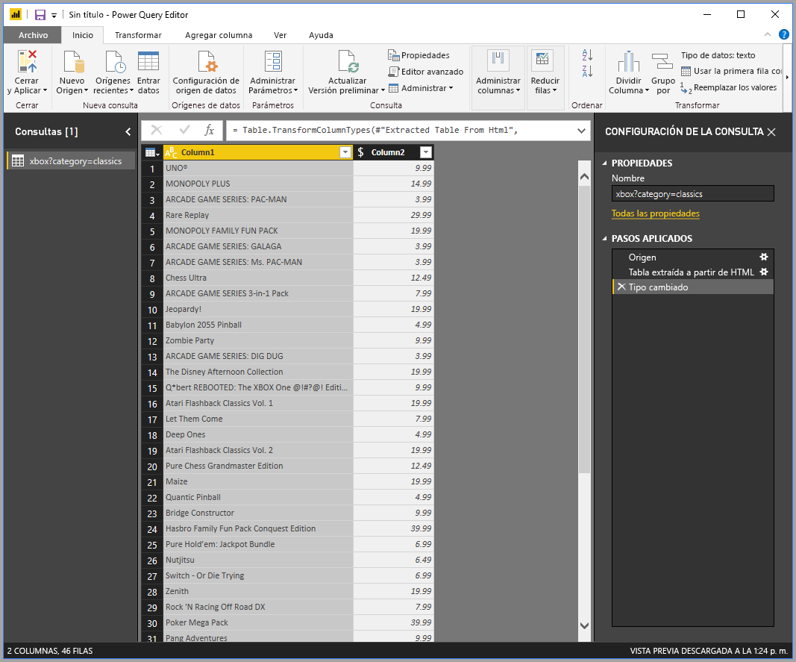

# Obtener datos de una página web con un ejemplo (versión preliminar)

Obtener datos de una página web permite a los usuarios extraer datos fácilmente de las páginas web e importarlos en **Power BI Desktop**. Sin embargo, a menudo, los datos de las páginas web no están en tablas ordenadas de las que resulta fácil extraerlos, por lo que obtener los datos de dichas páginas, aunque sean estructuradas y coherentes, puede ser complicado. 

Hay una solución. Con la característica **Obtener datos de páginas web con ejemplos**, básicamente puede indicar a **Power BI Desktop** qué datos desea extraer proporcionando uno o varios ejemplos en el cuadro de diálogo del conector, y la solución recopilará otros datos de la página que coincidan con sus ejemplos. Con esta solución, puede extraer todos los tipos de datos de las páginas web, incluidos los que están contenidos en tablas *y* otros que no lo están. 

## Habilitar la característica en versión preliminar Obtener datos de páginas web con ejemplos

La característica **Obtener datos de páginas web con ejemplos** está en versión preliminar y debe habilitarse en **Power BI Desktop**. Para habilitarla, seleccione **Archivo > Opciones y configuración > Opciones > Características de versión preliminar** y, después, active la casilla **Novedad de la experiencia web**. Deberá reiniciar Power BI Desktop después de realizar la selección.

Una vez habilitada la característica en versión preliminar, ya puede empezar a usarla. 

## Uso de Obtener datos de páginas web con ejemplos

Para usar **Obtener datos de páginas web con ejemplos**, seleccione **Obtener datos** en el menú de la cinta de opciones **Inicio**. En la ventana que aparece, seleccione **Otros** en las categorías en el panel izquierdo y después seleccione **Web**.

Ahí, escriba la dirección URL de la página web de la que le gustaría extraer los datos. En este artículo se usará la página web de Microsoft Store y se mostrará cómo funciona este conector. 

Si desea continuar, puede usar la [dirección URL de Microsoft Store](https://www.microsoft.com/en-us/store/top-paid/games/xbox?category=classics) que se usa en este artículo:

    https://www.microsoft.com/en-us/store/top-paid/games/xbox?category=classics

Si selecciona **Aceptar**, se le remitirá al cuadro de diálogo **Navegador** cuando se presenten las tablas detectadas automáticamente de la página web. En el caso que se muestra en la imagen siguiente, no se encontraron tablas, pero hay un botón en la parte inferior de la página llamado **Extraer tabla mediante ejemplos** que le permite proporcionar ejemplos.

Al seleccionar **Extraer tabla mediante ejemplos**, se abre una ventana interactiva en la que puede obtener una vista previa del contenido de la página web y escribir los valores de ejemplo de los datos que desea extraer. 

En este ejemplo, se podrá extraer el *nombre* y el *precio* de cada uno de los juegos de la página. Podemos hacer esto si se especifican un par de ejemplos de la página para cada columna, como se muestra en la siguiente imagen. Como esos ejemplos están escritos, **Power Query** (que es la tecnología subyacente que extrae los datos de la página web) puede extraer los datos que se ajustan al patrón de las entradas de ejemplo con el uso de algoritmos de extracción de datos inteligentes.

Cuando esté satisfecho con los datos extraídos de la página web, se selecciona **Aceptar** para ir a **Query Editor**, donde se pueden aplicar más transformaciones o dar forma a los datos, como combinarlos con otros datos de nuestros orígenes.

Desde ahí, puede crear objetos visuales o usar los datos de la página web para crear los informes de **Power BI Desktop**.

## Pasos siguientes
Hay todo tipo de datos a los que puede conectarse con **Power BI Desktop**. Para obtener más información sobre orígenes de datos, consulte los siguientes recursos:

* [Incorporación de una columna de un ejemplo](desktop-add-column-from-example.md)
* [Conectarse a una página web](desktop-connect-to-web.md)
* [Orígenes de datos en Power BI Desktop](desktop-data-sources.md)
* [Combinar datos y darles forma con Power BI Desktop](desktop-shape-and-combine-data.md)
* [Connect to Excel workbooks in Power BI Desktop (Conectarse a libros de Excel en Power BI Desktop)](desktop-connect-excel.md)   
* [Conectarse a archivos CSV en Power BI Desktop](desktop-connect-csv.md)   
* [Especificar datos directamente en Power BI Desktop](desktop-enter-data-directly-into-desktop.md)   

