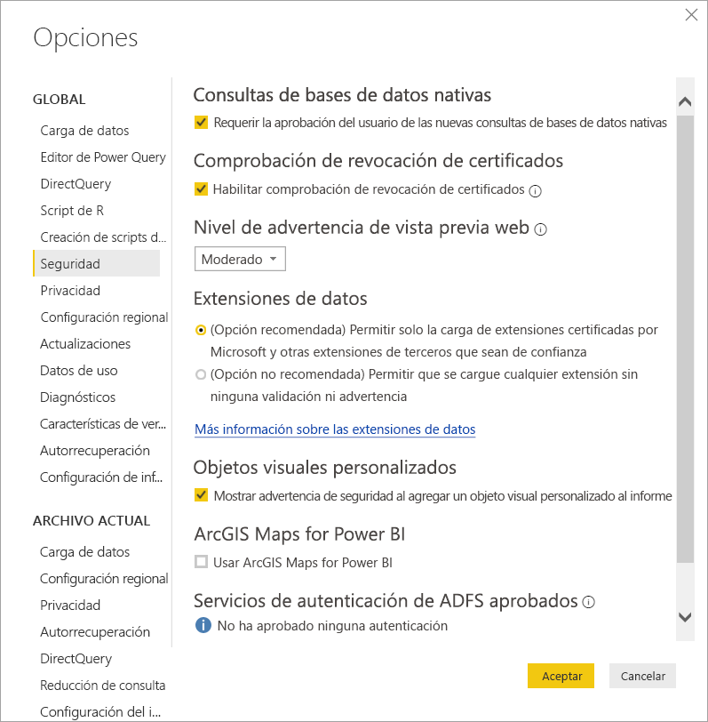
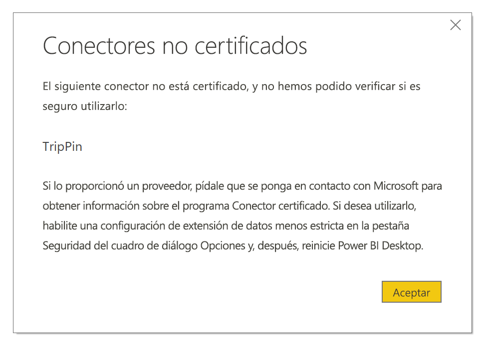

# Extensibilidad de los conectores en Power BI

En Power BI, los clientes y los desarrolladores pueden ampliar de varias maneras los orígenes de datos a los que se pueden conectar, por ejemplo, mediante el uso de conectores existentes y orígenes de datos genéricos (como ODBC, OData, Oledb, web, CSV, XML, JSON). Además de estos orígenes de datos, los desarrolladores pueden crear extensiones de datos, que se conocen como **conectores personalizados**, y certificar los conectores para que sean se conviertan en **conectores certificados**.

En versiones anteriores de Power BI, la capacidad de usar **conectores personalizados** se habilitaba mediante un conmutador de características. Ahora, hay un menú que permite controlar de forma segura el nivel de código personalizado que quiere permitir que se ejecute en el sistema: todos los conectores personalizados, o bien solo los conectores certificados y distribuidos por Microsoft en el cuadro de diálogo **Get Data** (Obtener datos).

## Conectores personalizados

Los **conectores personalizados** pueden incluir una amplia gama de posibilidades, desde pequeñas API fundamentales para su negocio, hasta servicios de gran tamaño específicos del sector que Microsoft no ha implementado. La mayoría de estos conectores los distribuirá el propio fabricante, y si necesita uno en concreto, deberá ponerse en contacto con un fabricante.

Para usar un **conector personalizado**, colóquelo en la carpeta *\[Documentos]\\Power BI Desktop\\Conectores personalizados* y ajuste la configuración de seguridad como se describe en la sección siguiente.

No es necesario ajustar la configuración de seguridad para usar **conectores certificados**.

## Seguridad de la extensión de datos

Para cambiar la configuración de seguridad de la extensión de datos, en **Power BI Desktop**, seleccione **Archivo > Options and Settings (Opciones y configuración) > Opciones > Seguridad**.

En **Extensiones de datos**, puede seleccionar dos niveles de seguridad:

* (Recomendado) Permitir que solo se carguen las extensiones certificadas
* (No recomendado) Permitir que se cargue cualquier extensión sin previo aviso

Si planea usar **conectores personalizados** o conectores que usted o un tercero ha desarrollado y distribuido, debe seleccionar **(Not Recommended) Allow any extension to load without warning** (No recomendado) Permitir que se cargue cualquier extensión sin previo aviso. No se recomienda esta configuración de seguridad a menos que piense ejecutar **conectores personalizados**.

Con la configuración de seguridad **recomendada**, si hay conectores personalizados en el sistema, se mostrará un error que describe los conectores que no se pueden cargar debido a la seguridad.

Para resolver el error y usar dichos conectores, debe cambiar la configuración de seguridad al ajuste **no recomendado**, tal como se describe anteriormente, y reiniciar **Power BI Desktop**.

## Conectores certificados

Un subconjunto limitado de extensiones de datos se considera **certificado**, y dichos conectores certificados están disponibles en el cuadro de diálogo **Get Data** (Obtener datos), pero el responsable del mantenimiento y el soporte técnico sigue siendo el desarrollador que creó el conector. Aunque Microsoft los distribuye, no es responsable de su rendimiento ni de su funcionalidad continuada.

Si quiere que un conector personalizado esté certificado, pídale a su proveedor que se ponga en contacto con Microsoft.
